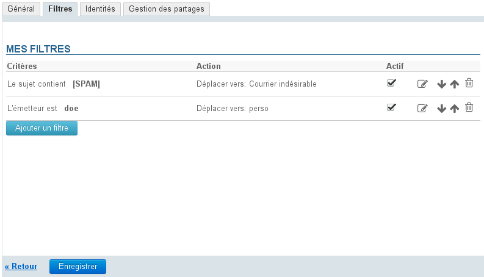
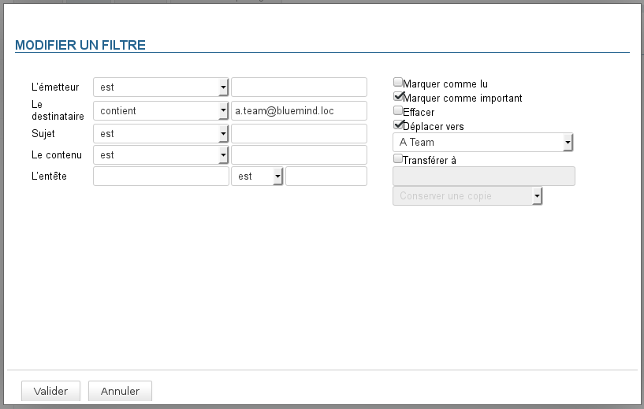
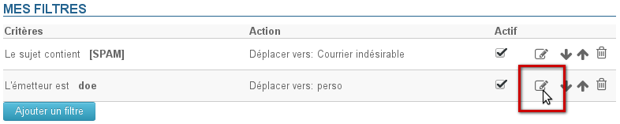
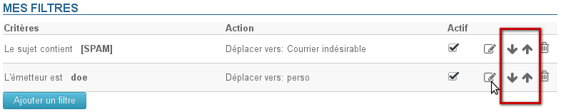

# Les filtres de messages

## Présentation

Les filtres permettent d'appliquer des règles de tri et actions à effectuer automatiquement aux nouveaux messages entrant.

Ils permettent ainsi par exemple le rangement dans un sous-dossier en fonction de l'expéditeur ou l'effacement en fonction de l'objet sans que l'utilisateur ait à effectuer lui-même cette action manuellement pour chaque message répondant au(x) critère(s).

Depuis la version 3 de BlueMind, les filtres peuvent être ordonnés et modifiés mais aussi activés et désactivés.

La gestion des filtres de messages se fait dans la gestion des paramètres utilisateur via le lien "Paramètres" en haut à droite du bandeau de navigation : 

Se rendre dans la section Messagerie > onglet Filtres :

:::info

Il est indiqué à chaque étape de cliquer sur le bouton «Enregistrer» en fin de page. Si plusieurs types d'actions (création, modification, ordre...) doivent être réalisés, il n'est pas nécessaire de cliquer sur ce bouton après chaque étape, l'enregistrement peut être fait une fois que toutes les modifications ont été réalisées.

:::

## Créer un filtre

Pour créer un nouveau filtre, cliquer sur le bouton «Ajouter le filtre» afin d'ouvrir la popup de création :

1. Déterminer le (ou les) critère(s) sur lequel s'applique le filtre. (Si la règle comprend plusieurs critères, ils doivent tous être remplis pour qu'une règle soit appliquée)
2. Indiquer le type de contrôle à appliquer :
    - est : la valeur doit être exactement la même qu'indiquée
    - n'est pas : la valeur est différente de la valeur indiquée
    - contient : la chaîne de caractère apparaît dans la valeur comparée

:::info

Par exemple, dans le filtre ci-dessus, les messages seront déplacés dans le dossier "a team" et marqués comme important si l'un au moins des destinataires a pour adresse "a.team@bluemind.loc", choisir "est" aurait conduit à ne déplacer que les mails ayant pour seul destinataire cette adresse.

:::

    - ne contient pas : la chaîne de caractère n'est pas incluse dans la valeur de l'élément comparé

3. Indiquer la ou les actions à appliquer :
    - marquer comme lu
    - marquer comme important
    - effacer
    - déplacer vers + choix du dossier
    - transférer à + adresse(s) mail(s) de destination : il est possible d'indiquer plusieurs adresses vers lesquelles transférer les messages
        - L'autocomplétion recherche les adresses dans tous les carnets de l’utilisateur (annuaire, carnets personnels, etc.) :
        - Il est possible de rajouter manuellement des adresses externes, qui ne seront pas ajoutées dans le carnet des adresses collectées lors des envois.
4. Cliquer sur le bouton «Valider»
5. **Lorsque tous les filtres souhaités sont créés, cliquer sur le bouton «Enregistrer» pour prendre en compte le ou les nouveaux filtres.**

## Modifier un filtre

À partir de BlueMind 3 les filtres déjà existant peuvent être modifiés ; pour cela :

1. Cliquer sur l'icône en forme de crayon  sur la ligne du filtre à modifier :
2. La popup de modification s'ouvre ; effectuer les modification souhaitées.
3. Cliquer sur le bouton «Valider»
4. **Lorsque tous les filtres souhaités sont à jour, cliquer sur le bouton «Enregistrer» pour prendre en compte les modifications.**

## Ordonner les filtres

Les filtres s'appliquent au courrier dans l'ordre dans lequel ils sont listés ; pour modifier cet ordre, utiliser les flèches en fin de ligne pour faire monter et descendre les filtres dans la liste :

**Lorsque les filtres sont dans l'ordre souhaité, cliquer sur le bouton «Enregistrer» pour prendre en compte les modifications.**

:::info

Un seul filtre peut être appliqué à un seul et même message : une fois un filtre appliqué, les suivants sont sans effets.

:::

## Supprimer un filtre

1. Cliquer sur l'icône corbeille en fin de ligne 
2. **Cliquer sur le bouton «Enregistrer» pour prendre en compte les changements.**

