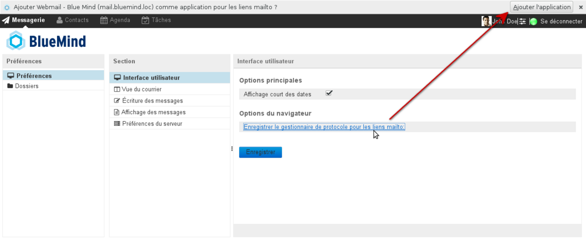
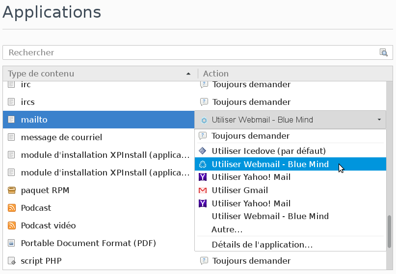
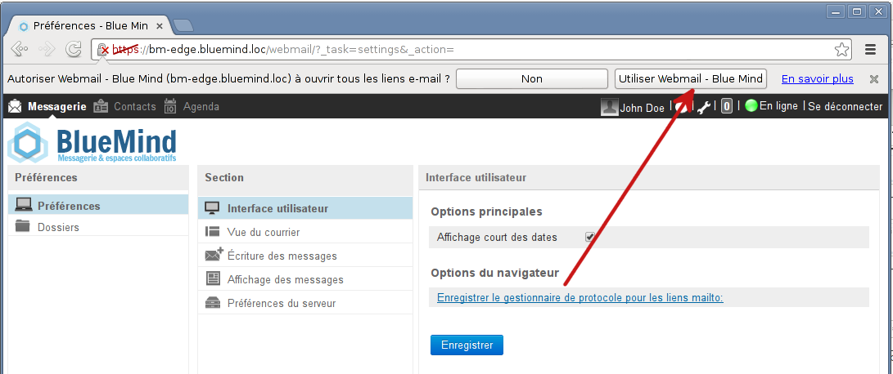
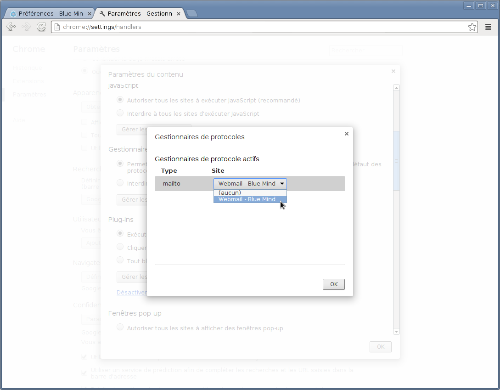
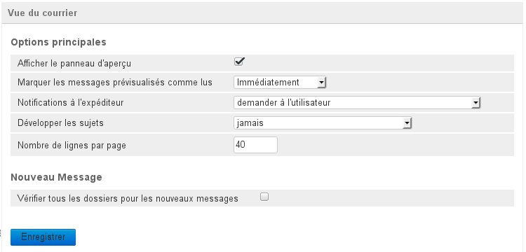
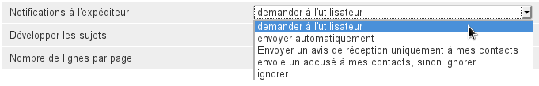
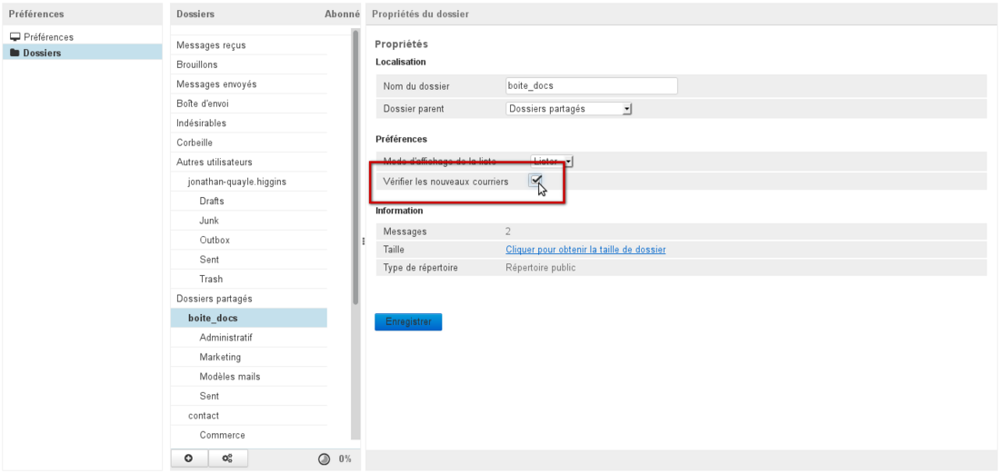
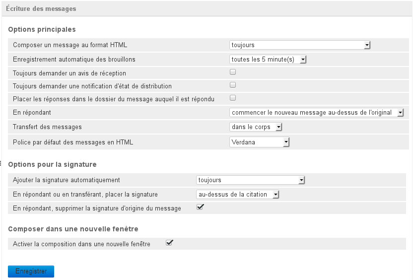
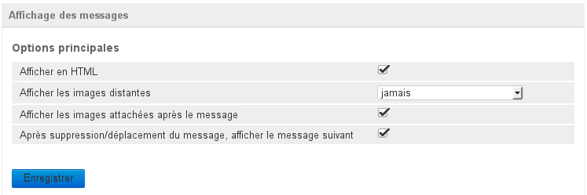
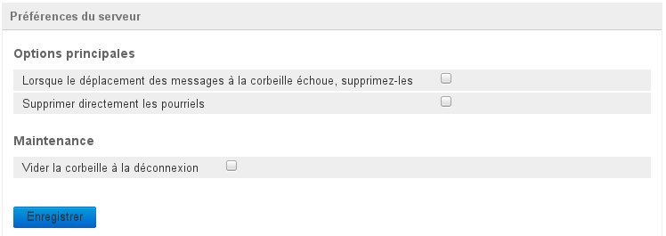

# Préférences avancées

## Présentation

Les préférences avancées de la messagerie permettent de personnaliser de façon plus précise les comportements et l'affichage de la messagerie BlueMind de l'utilisateur, notamment :

- affichage de la messagerie
- intégration dans l'environnement de l'utilisateur
- délais de vérification des nouveaux messages
- formats des dates
- formats des messages (HTML ou texte simple)
- gestion des notifications (demandes et réponses)
- personnalisation de l'écriture et de l'affichage des messages
- comportement du serveur lors des suppressions

L'accès à la gestion de ces préférences se fait via la gestion des préférences de BlueMind > section Messagerie > lien *Préférences avancées du client de messagerie * :

:::tip

Il est aussi possible d'accéder aux préférences avancées depuis la messagerie directement en utilisant le menu "engrenages" au bas de la liste des dossiers > Organiser les dossiers > «Préférences»

:::

## Interface utilisateur

- Par défaut, l'affichage court des dates est utilisé, les dates sont ainsi présentées au format "Aujourd'hui 13:37", "Mer. 11 Déc. 14:15" pour les 7 jours précédents ou encore "24/11/2013 10:03" pour les dates plus anciennes.Pour utiliser le format de dates complet décocher la case et cliquer sur «Enregistrer», les dates seront alors toutes présentées au format "JJ/MM/AAAA HH:MM", par exemple "31/12/2013 13:37".
- Le lien "*Enregistrer le gestionnaire de protocole pour les liens mailto:*" permet d'enregistrer BlueMind dans le navigateur afin que s'ouvre la fenêtre de création d'un nouveau message lorsque l'utilisateur clique sur un lien "mailto:" présent dans une page web ou un message.

:::info

Ne pas oublier d'accepter la demande de validation du navigateur après avoir cliqué sur le lien :

- Firefox :  Cette opération est réversible et personnalisable dans les Préférences > Applications > Type de contenus : mailto :

- Chrome :  Dans Chrome, ce comportement est réversible et personnalisable via la gestion des Paramètres > Afficher les paramètres avancés > Section Confidentialité > Paramètres de contenu > Section Gestionnaires > Gérer les gestionnaires : 

:::

## Vue du courrier

Cette section permet de personnaliser l'affichage de la vue principale de l'interface de messagerie : vue en panneaux, affichage des messages, réponses de notification, délai de recherche des nouveaux messages, etc.

- **Afficher le panneau d'aperçu** : permet d'activer ou non l'aperçu d'un message dans la vue principale de la messagerie. Cette option permet de basculer d'une vue en 3 panneaux (liste des dossiers à gauche, liste des messages en haut à droite, aperçu en bas à droite) à une vue en 2 panneaux (liste des dossiers à gauche, liste des messages à droite) dans laquelle un double-clic sur un message permet de le consulter.
- **Marquer les messages prévisualisés comme lus** : délai d'attente avant de marquer un message comme lu
- **Notifications à l'expéditeur** : il s'agit du comportement à adopter lorsque l'expéditeur a demandé un accusé de réception ou de lecture du message : 
- **Développer les sujets** : indique si les sujets doivent être présentés en arborescence dépliée lorsque la liste des messages est en vue par sujets (voir [La messagerie §4.5 Actions sur la liste des messages](https://forge.blue-mind.net/confluence/display/BM35/La+messagerie#Lamessagerie-Actionssurlalistedemessages))
- **Nombre de lignes par page** : indique le nombre de messages à présenter sur un écran de la liste des messages
- **Vérifier tous les dossiers pour les nouveaux messages** : cette option force BlueMind à vérifier tous les dossiers (dossiers par défaut, sous-dossiers, boîtes partagées...) auxquels l'utilisateur est abonné à chaque fois que le courrier est relevé. Par défaut, seule la boîte de réception est vérifiée à intervalle régulier.
Lorsque cette option est activée les dossiers sont vérifiés par groupes de ** **20 dossiers maximum** ** toutes les 3mn. Ainsi une boîte comportant moins de 20 dossiers (y compris les dossiers par défaut comme la boîte de réception, la corbeille, etc.) aura l'intégralité de ses dossiers vérifiés toutes les 3mn. Pour une boîte de 40 dossiers, chaque dossier sera relevé toutes les 6mn, etc.

:::tip

Il est possible de forcer la vérification d'un dossier à chaque relevé de courrier de la façon suivante :

- aller dans la gestion des dossiers : menu de gauche du même écran ou bouton  en bas de la liste des dossiers dans le webmail
- choisir le dossier concerné
- cocher l'option "Vérifier les nouveaux courriers" : 

 le nombre maximum de 20 dossiers s'applique là aussi mais **il n'est possible de forcer la vérification que de 16 dossiers**, 4 "places" étant réservées par le système afin de vérifier l'ensemble de l'arborescence à raison de 4 dossiers à chaque relevé.

:::

## Écriture des messages

Cette section permet de définir les options de composition des nouveaux messages : format d'écriture HTML ou non, enregistrement des brouillons, demandes de notifications, positions de la réponse et de la signature, etc.

C'est ici que sont positionnées les préférences de demandes de notifications ainsi que les options de signature notamment.

### Options principales

- **Composer un message au format HTML** : permet de choisir de rédiger en mode HTML toujours, jamais ou dans certains cas seulement
- **Enregistrement automatique des brouillons** : délai d'enregistrement automatique des messages en brouillon lors de la rédaction, les brouillons sont sauvegardé et peuvent être récupérés dans le dossier «Brouillons» de la messagerie
- **Toujours demander un avis de réception** : lorsque cette option est cochée, les destinataires de tous les messages recevront une demande d'envoi d'accusé de réception du message
- **Toujours demander une notification d'état de distribution** : lorsque cette option est cochée, l'émetteur recevra une notification lui indiquant que le serveur a bien réceptionné le message et l'a déposé dans la boite du destinataire

:::info

Attention, cela ne signifie pas que le destinataire a vu le message, seulement qu'il a été distribué dans sa boite.

:::

- **Placer les réponses dans le dossier du message auquel il est répondu** : lorsque cette option est cochée, la réponse à un message ne sera pas placée dans le dossier "Message envoyés" mais dans le dossier dans lequel se trouvait le message d'origine, celui auquel l'utilisateur a répondu
- **En répondant** : permet de choisir, lorsqu'on répond à un message, si l'on souhaite commencer à rédiger dans l'éditeur avant ou après la citation du message d'origine
- **Transfert des messages** : permet de choisir si l'on souhaite transférer un message en tant que pièce jointe au nouveau message ou en tant que citation intégrée à celui-ci
- **Police par défaut des messages en HTML** : choix de la police de rédaction

### Options pour la signature

- **Ajouter la signature automatique** : indique dans quels cas on souhaite intégrer sa signature automatiquement : tous les messages, aucun message, uniquement lorsqu'on rédige un nouveau message, uniquement lorsqu'on répond ou transfère un message
- **En répondant ou en transférant, placer la signature** : indique à quel endroit du message placer la signature lors des réponses et transferts de messages (au dessus ou au dessous de la citation)
- **En répondant, supprimer la signature d'origine du message** : lorsque cette option est cochée, la signature de l'expéditeur du message d'origine est supprimée du message de réponse, cela permet d'alléger les messages de conversations et d'en améliorer la lecture, notamment lorsque l'échange est long.

### Composer dans une nouvelle fenêtre

- **Activer la composition dans une nouvelle fenêtre** : lorsque cette option est cochée (comportement par défaut), le composeur de nouveau message s'ouvre dans une fenêtre séparée. Si cette option est décochée, il remplace la vue de la messagerie.

## Affichage des messages

Cette section permet de personnaliser les préférences générales d'affichage des messages reçus : format HTML ou non, affichage des images et comportement après suppression.

- **Afficher en HTML** : lorsque cette option est décochée, les éléments de mise en forme des messages sont retirés et ils sont affichés en texte brut
- **Afficher les images distantes** : permet de choisir dans quels cas afficher ou non les images distantes intégrées à un message (jamais, toujours ou seulement si l'expéditeur est connu)
- **Afficher les images attachées après le message** : lorsque cette option est cochée, les images jointes à un message sont affichées dans la zone de visualisation des messages
- **Après suppression/déplacement du message, afficher le message suivant** : lors de la suppression d'un message en cours de visualisation, si cette option est cochée le message suivant dans la liste est affiché à sa place en zone de prévisualisation, sinon l'affichage reste vide.

## Préférences du serveur

Cette section permet de paramétrer le comportement de BlueMind lors de la suppression des messages.

C'est notamment ici qu'est paramétré le comportement de la corbeille lorsque l'utilisateur se déconnecte.

### Options principales

- **Lorsque le déplacement des messages à la corbeille échoue, supprimez-les** : lorsque cette option est cochée, si un message ne peut être déplacé dans la corbeille il est alors directement et définitivement supprimé
- **Supprimer directement les pourriels** : lorsque cette option est cochée, les messages indésirables sont supprimés au lieu d'être placés dans un dossier spécifique

### Maintenance

- **Vider la corbeille à la déconnexion** : si cette option est cochée, la corbeille est vidée automatiquement lorsque l'utilisateur se déconnecte, sinon elle ne le sera que lorsqu'il effectuera lui-même l'action.

