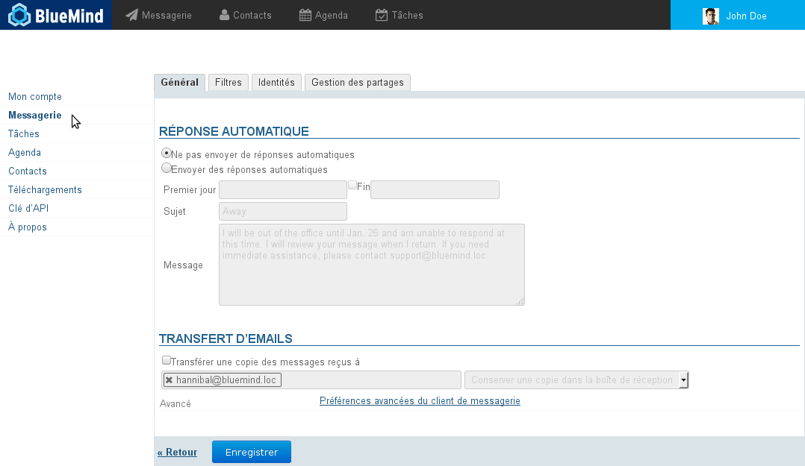
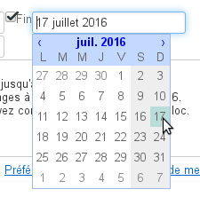
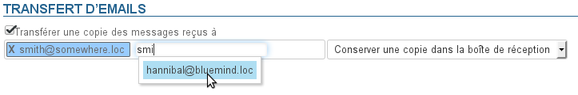
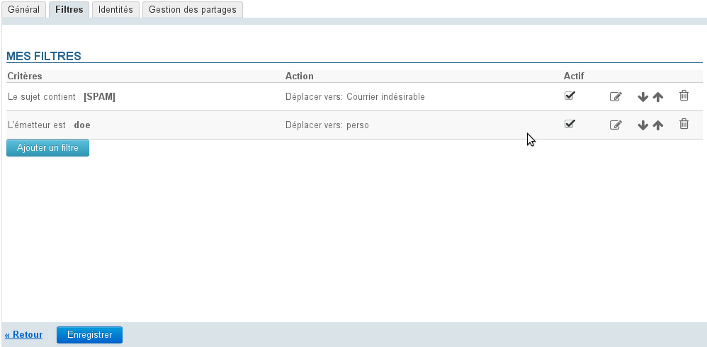
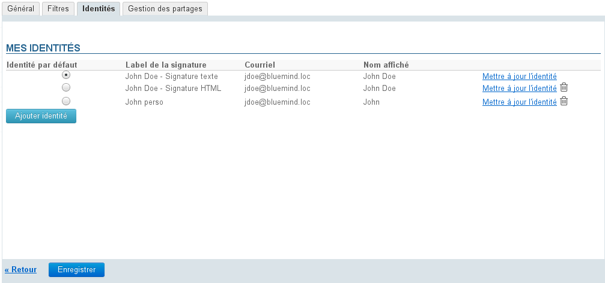
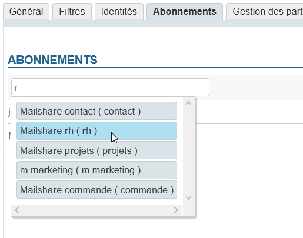

# Préférences de messagerie

## Présentation

Pour accéder aux préférences de la messagerie, se rendre dans "Mon compte" en cliquant sur le nom d'utilisateur à droite du bandeau de navigation :

Lorsque l'utilisateur clique depuis le webmail il est automatiquement dirigé vers la section correspondante, sinon il suffit de cliquer sur la rubrique "Messagerie" du menu de gauche :

## Préférences générales

Le premier onglet des préférences permet de paramétrer un répondeur automatique et un transfert de messagerie.

### Réponse automatique.

Pour la période déterminée, lorsque l'utilisateur recevra un message, un mail sera alors automatiquement envoyé à l'expéditeur.

Cela permet, par exemple, d'indiquer son absence du bureau lors de congés.

- Les dates de début et de fin ne sont pas obligatoires :
    - si aucune date de début n'est spécifiée, le répondeur s'active dès l'enregistrement des nouveaux paramètres
    - si aucune date de fin n'est spécifiée, le répondeur reste actif jusqu'à ce que l'utilisateur modifie ses paramètres et sélectionne "Ne pas envoyer de réponses automatiques"
Lorsque l'utilisateur clique sur la zone de saisie d'une date, un calendrier d'aide au choix de la date s'affiche :- Le sujet est optionnel : s'il n'est pas rempli, un message avec un objet vide sera envoyé
- Le contenu du message est obligatoire, il apparaitra dans le corps du message envoyé.

:::tip

Lorsque le répondeur est désactivé, les derniers paramètres sont enregistrés et ainsi retrouvés lorsque l'utilisateur souhaite le réactiver.

:::

:::info

Un seul message d'absence est envoyé en réponse à une même personne (adresse mail) pour une période de 3 jours.

Si l'utilisateur désactive puis réactive son répondeur pendant cette période **sans modifier l'objet ou le contenu de son message**, les personnes ayant déjà reçu une réponse automatique n'en recevront pas une nouvelle, le décompte pour la période reprenant là où il s'était arrêté.

Exemple :

- l'utilisateur A active son répondeur
- il reçoit un mail de l'utilisateur B le jour J, un message d'absence est émis, le décompte de 3 jours commence
- l'utilisateur désactive son répondeur à J+1
- il reçoit un nouveau mail de B, aucun message d'absence n'est émis
- l'utilisateur réactive son répondeur à l'identique à J+2
- il reçoit alors un mail de B : le répondeur considère être toujours à J+2, aucun message d'absence n'est émis.

:::

### Transfert de messagerie

Ce formulaire permet de transférer l'ensemble des messages entrant vers une ou plusieurs adresses, internes ou externes, en conservant ou non une copie dans la boîte de réception de l'utilisateur.

Pour activer le transfert, cocher la case et indiquer les adresses des destinataires souhaités :

:::tip

L'autocomplétion recherche et propose les adresses dans tous les carnets de l'utilisateur (annuaire, carnets personnels, etc.)

:::

:::info

Il est nécessaire de cliquer sur l'adresse proposée par l'autocomplétion, un simple appui sur la touche "entrée" après saisie de l'adresse ne suffit pas à la valider.

Une adresse bien prise en compte par le système apparaît en bleu avec une croix permettant de la supprimer.

:::

## Filtres

Les filtres permettent d'appliquer des règles de tri et actions à effectuer automatiquement aux nouveaux messages entrant.

Ils permettent ainsi par exemple le rangement dans un sous-dossier en fonction de l'expéditeur ou l'effacement en fonction de l'objet sans que l'utilisateur ait à effectuer lui-même cette action manuellement.

Pour en savoir plus sur la gestion des filtres de messages, consultez la page dédiée [Les filtres de messages](/Guide_de_l_utilisateur/La_messagerie/Les_filtres_de_messages/)

## Identités

Cet onglet permet à l'utilisateur de gérer ses identités et les signatures qui s'y rattachent.

Pour plus d'informations, consulter la page [Les identités](/Guide_de_l_utilisateur/La_messagerie/Les_identités/).

## Abonnements

Cette nouvelle section, présente à partir de la version 4.3, permet de gérer les abonnements aux boites aux lettres partagées afin que celles-ci apparaissent (ou non) dans le client tiers [Outlook connecté en mapi](/Guide_de_l_utilisateur/Configuration_des_clients_lourds/Synchronisation_avec_Outlook/) ou sur les [appareils mobiles connectés en EAS](/Guide_de_l_utilisateur/Configuration_des_périphériques_mobiles/).

:::info

Les abonnements ne concernent que les outils tiers, ils n'ont pas d'incidence sur l'affichage de la boîte dans le webmail propre à BlueMind ou sur les logiciels tiers synchronisés via IMAP/POP.

:::

L'abonnement avec ou sans synchronisation permet une visibilité différenciée pour chaque boîte, la synchronisation activée permettant de faire apparaître la boîte concernée sur les appareils connectés en EAS.
Ainsi :

|  | Synchronisation active | Synchronisation inactive |
| --- | --- | --- |
| Outlook mapi | 

 | 

 |
| EAS | 

 | 

 |
| webmail | 
- pas d'abonnement nécessaire
- toujours affiché

 |
| IMAP | 
- pas d'abonnement nécessaire
- affichage selon [paramétrage du logiciel client](/Guide_de_l_utilisateur/Configuration_des_clients_lourds/)

 |

Pour ajouter un abonnement à une boîte :

- S'assurer d'avoir un droit de partage en lecture minimum (voir [Les boites aux lettres partagées](/Guide_de_l_utilisateur/La_messagerie/Les_boites_aux_lettres_partagées/)) auprès d'un administrateur (administrateur général ou de la boîte)
- Commencer à taper le nom de la boîte souhaitée dans le champ de saisie en haut de l'onglet, l'autocomplétion propose les boîtes correspondantes à la frappe et sur lesquelles l'utilisateur a un droit de partage  :
- Sélectionner la boîte voulue.
La boîte est ajoutée à la liste avec la synchronisation active par défaut :

-  **Cliquer sur Enregistrer pour prendre en compte les abonnements** 

## Gestion des partages

Cet onglet permet à l'utilisateur de gérer les droits de partages et délégations de sa messagerie ou d'un autre élément dont il est gestionnaire (boite partagée, ressource).

:::info

Par défaut un partage apparait, qui est celui de l'utilisateur lui-même ayant les droits de modification et gestion : ce partage ne peut être ni supprimé ni réduit.

:::

Les types de partages possibles sont :

- **Peut envoyer de ma part** : l'utilisateur désigné peut se créer une identité afin d'envoyer des messages au nom de l'utilisateur donnant le droit.Grâce à ce droit, il pourra aussi envoyer des emails en son nom depuis Outlook.
- **Peut lire ma messagerie** : l'utilisateur désigné peut consulter les messages de l'utilisateur
- **Peut modifier ma messagerie** : en plus des droits précédents, l'utilisateur désigné peut consulter les messages et les modifier (suppression, déplacement d'un dossier à l'autre, organisation et noms des dossiers, etc.).
- **Peut modifier ma messagerie et gérer mes partages** : en plus des droits précédents, l'utilisateur désigné peut, en plus des droits précédents de lecture et modification, modifier les partages de la messagerie de l'utilisateur

Voir [Gestion des partages](/Guide_de_l_utilisateur/Gestion_des_partages/).

