# La messagerie instantanée

## Présentation

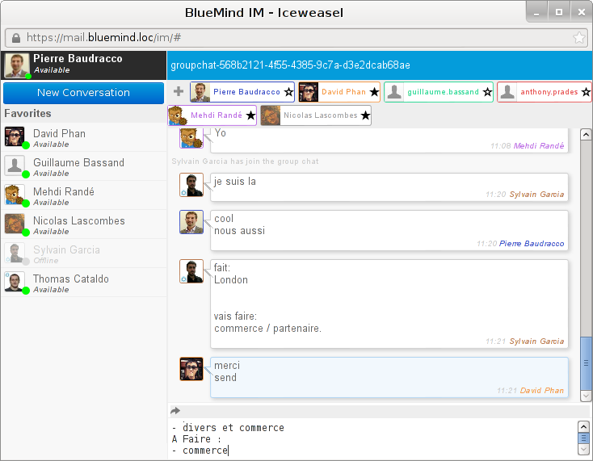

## Accès

La messagerie instantanée est accessible à tout moment, depuis toutes les pages des applications, grâce à l'icône présente dans le bandeau de navigation de BlueMind :

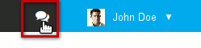

:::tip

Lorsqu'une nouvelle discussion est demandée ou qu'un nouveau message arrive dans une fenêtre de discussion qui n'a pas le focus, l'icône du bandeau clignote.

:::

Un clic sur l'icône du bandeau ouvre l'interface :

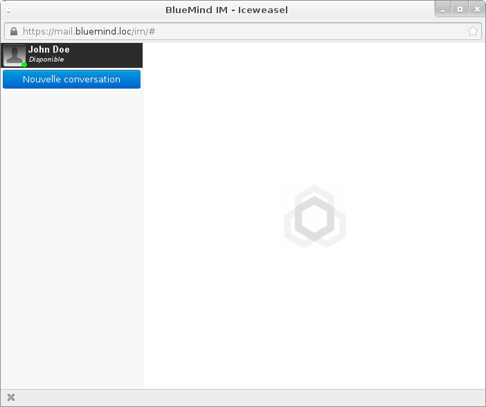

## Discussion à deux

Pour discuter avec un utilisateur, cliquer sur «Nouvelle conversation» et rechercher l'utilisateur grâce à l'autocomplétion :

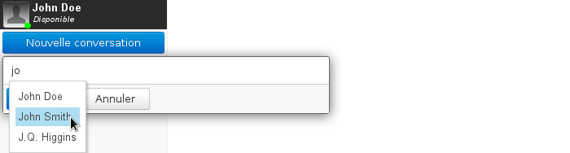

L'utilisateur est alors ajouté à la liste des interlocuteurs :

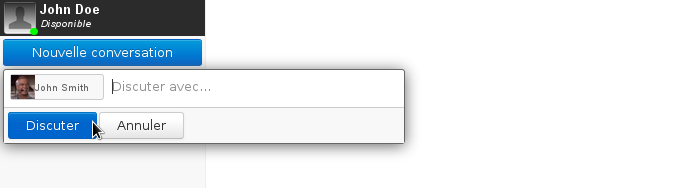

Valider avec le bouton «Discuter».

La fenêtre de discussion s'ouvre et l'utilisateur est ajouté à la barre latérale («***Roster***») de l'interface. S'il n'a pas encore autorisé l'ajout en favori, il apparaît hors ligne et est classé dans la catégorie "Pas dans la liste" :

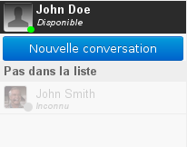

 Voir [Ajouter un utilisateur aux favoris](#Lamessagerieinstantanee-favoris)

Les utilisateurs n'ont alors plus qu'à taper leur texte dans la zone du bas («*Envoyer un message*») et valider avec la touche &lt;Entrée> pour l'envoyer :

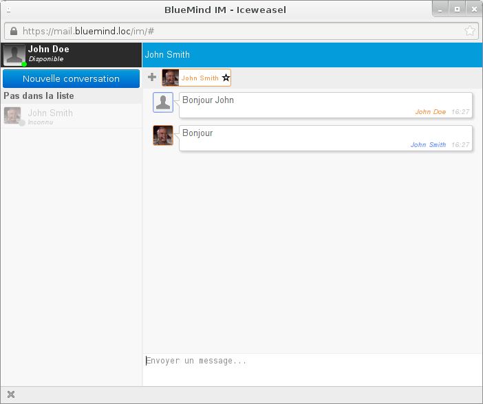

:::tip

La combinaison de touches &lt;shift+Entrée> permet d'insérer des retours à la ligne dans un texte :

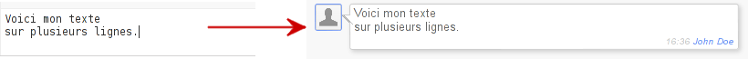

:::

## Discussion à plusieurs

### Lancer la discussion

La création d'une discussion de groupe se fait de la même façon qu'une discussion à deux ; il suffit d'ajouter les utilisateurs de la même manière que pour une discussion à 2 :

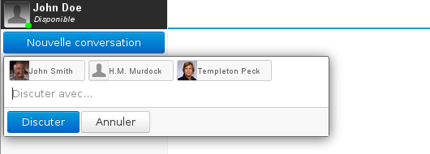

Pour retirer un utilisateur, une croix de suppression apparaît au survol de la souris :

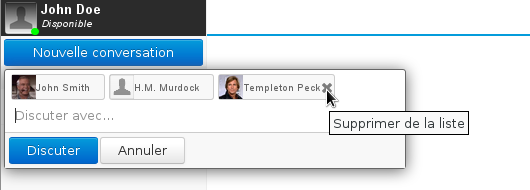

Puis cliquer sur le bouton «Discuter», la salle de discussion est alors automatiquement créée et ouverte :

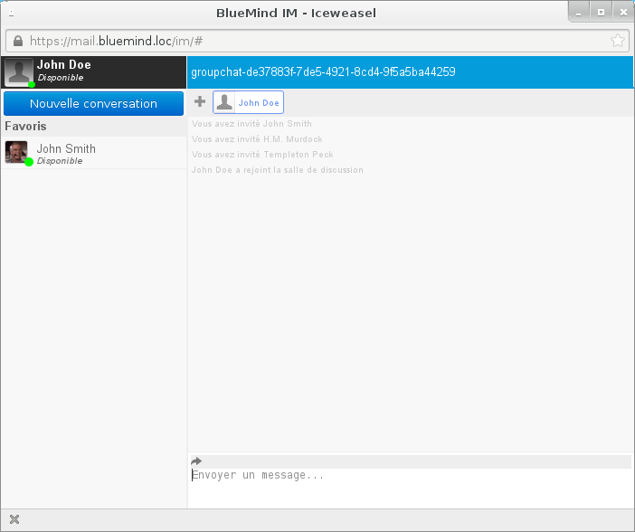

:::tip

Pour ajouter un interlocuteur en cours de discussion, utiliser le bouton + situé à côté de la liste des personnes présentes dans la salle de discussion :

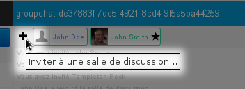

Tous les participants à la discussion peuvent inviter d'autres participants.

:::

### Rejoindre une discussion

:::info

Une discussion de groupe ne peut être rejointe que sur invitation d'un des interlocuteurs de la discussion.

:::

Lorsque la discussion est lancée ou qu'un utilisateur est ajouté, les utilisateurs concernés reçoivent une invitation :

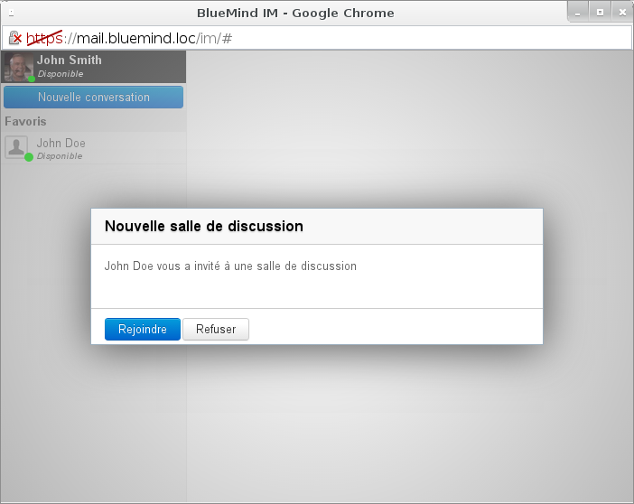

En cliquant sur «Rejoindre» ils entrent alors dans la salle de discussion, leur nom apparaît dans la liste des participants en haut de la fenêtre et les autres utilisateurs sont avertis de leur arrivée :

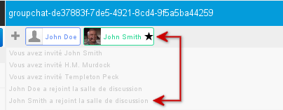

:::info

Un nouvel arrivé ne voit pas la discussion qui a eu lieu avant son arrivée, seuls les nouveaux messages lui seront transmis.

:::

### Historique de la discussion

Il est possible de récupérer et conserver l'historique d'une discussion de groupe.

Pour cela, cliquer sur la flèche «*Send history*» au dessus de la zone d'écriture :

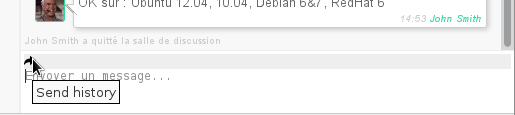

Saisir l'adresse mail ou rechercher avec l'autocomplétion l'utilisateur, le groupe ou la boîte partagée à qui envoyer l'historique :

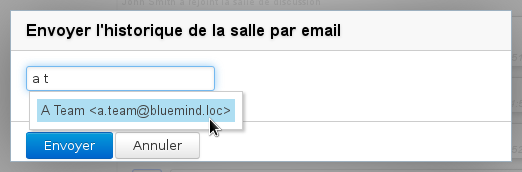

Le contenu de la discussion, mis en forme textuellement, est alors envoyé à l'adresse mail renseignée et un message est affiché dans la fenêtre de discussion afin d'informer les utilisateurs.

:::tip

Tous les participants de la discussion peuvent réaliser l'envoi de l'historique, cette fonctionnalité n'est pas réservée au créateur de la discussion.

:::

## Quitter une discussion

Pour quitter une discussion, utiliser la croix qui apparaît en haut à droite au survol de l'onglet souhaité :

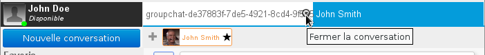

:::info

Fermer la fenêtre de la messagerie instantanée ne ferme pas les discussions, celles-ci seront toujours présentes, avec leur historique, lorsque l'utilisateur rouvrira sa messagerie instantanée.

:::

## Arrivée de nouveaux messages

Si la fenêtre n'a pas le focus lors de l'arrivée d'un nouveau message alors la mention "Unread messages" clignote dans la barre de fenêtre, étant ainsi visible dans la barre des tâches du bureau de l'utilisateur, et le(s) nouveau(x) message(s) apparaît sur fond bleu :

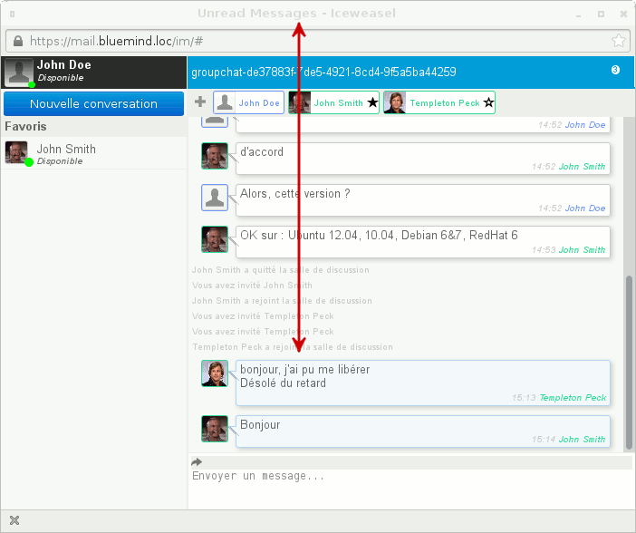

- La mention «Unread message» arrête de clignoter lorsque la fenêtre reprend le focus
- le fond des messages redevient blanc lorsque l'utilisateur positionne le focus dans la zone de rédaction de message de sa fenêtre

:::tip

Le nombre de messages non lus est indiqué dans le bandeau du haut de la discussion :

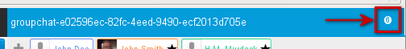

:::

Lorsqu'un ou plusieurs nouveaux messages arrivent alors que l'utilisateur a fait défiler sa fenêtre vers le haut, la barre de défilement reste là où il l'a positionnée et il est informé de l'arrivée de nouveaux messages en bas de la fenêtre de discussion par un bandeau présentant l'auteur et les premiers mots du dernier message arrivé :

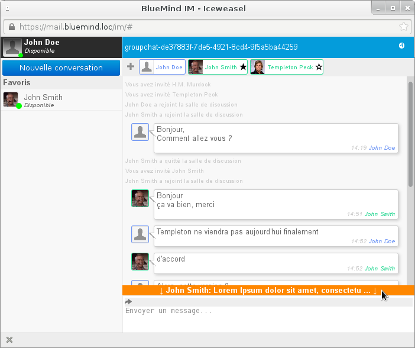

Cliquer sur le bandeau pour faire automatiquement défiler la zone de discussion vers le dernier message reçu.

## Les favoris

### Ajouter un utilisateur

Pour ajouter l'utilisateur à ses favoris et ainsi voir son statut, l'ajouter à ses favoris en cliquant sur l'étoile qui apparaît à côté de son nom lors du survol de la souris :

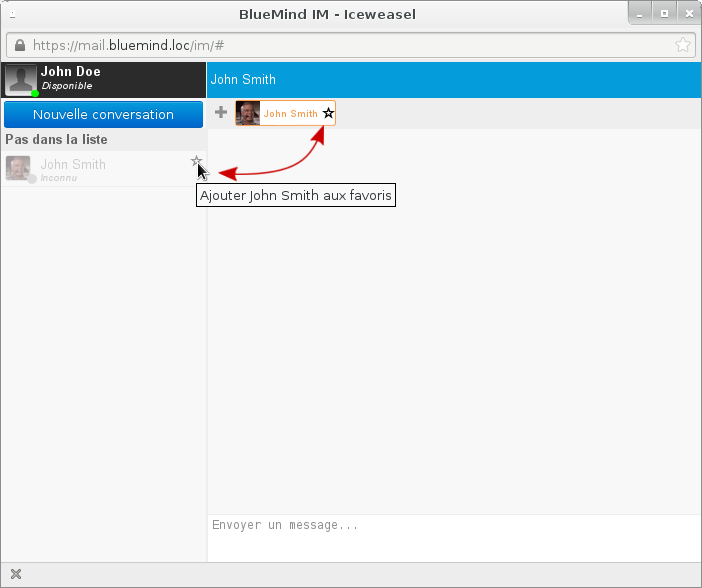

Une demande d'ajout est notifiée à l'utilisateur :

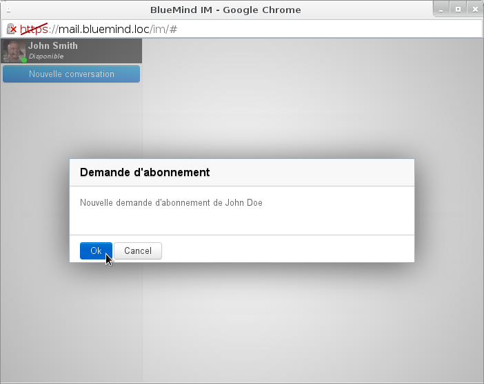

Dès que cette demande est acceptée, son statut apparaît dans le *roster* et l'utilisateur sera visible à chaque reconnexion à l'interface :

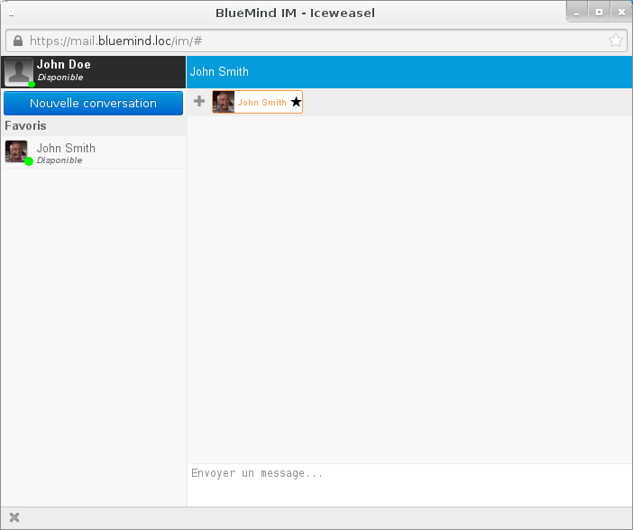

### Retirer un utilisateur

De la même façon que pour l'ajout, il suffit pour retirer un utilisateur des favoris de cliquer sur l'étoile de son badge dans le *roster* ou en haut d'une fenêtre de discussion :

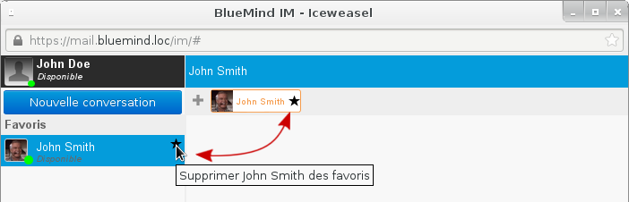

Une fois le retrait confirmé, l'utilisateur est supprimé du *roster*.

## Plusieurs discussions simultanées

La messagerie instantanée permet de mener plusieurs discussions, à deux ou à plusieurs, simultanément.

Pour cela il suffit d'ouvrir les discussions normalement (voir ci-dessus), elles s'ouvrent alors automatiquement dans des onglets séparés de la même fenêtre :

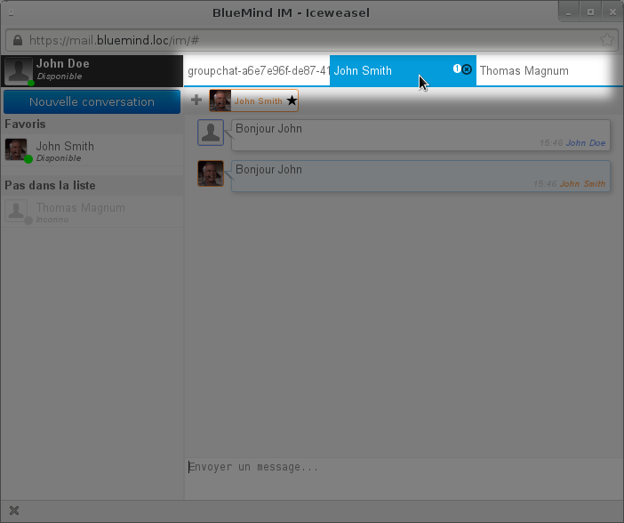

 L'utilisateur John Doe mène ici une discussion de groupe et 2 discussions privées, l'une avec John Smith et l'autre avec Thomas Magnum (qu'il n'a pas encore ajouté en favori).

## Statut de disponibilité

Les utilisateurs peuvent être connectés mais présenter plusieurs statuts afin d'informer leurs éventuels interlocuteurs de leur disponibilité :

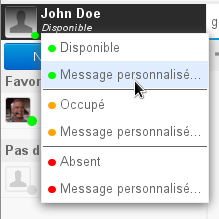

Le menu de personnalisation du statut est accessible en cliquant sur le statut actuel («*Disponible*» par défaut) en dessous du nom d'utilisateur dans la fenêtre de messagerie instantanée.

Les statuts indiquent :

- Disponible : l'utilisateur est présent et disponible pour discuter, les messages lui sont remis
- Occupé : l'utilisateur est présent devant son ordinateur mais occupé, les messages lui sont remis mais il préfère ne pas être dérangé et risque de ne pas répondre
- Absent : l'utilisateur n'est pas présent devant son ordinateur, les messages lui sont remis mais il ne peut les lire

Pour chaque statut, une option «Personnalisé» permet de personnaliser le message. La puce de couleur apparaîtra alors avec le statut personnalisé :

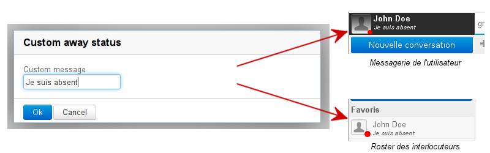

### Intégration de la téléphonie

Lorsqu'un système de [téléphonie](/Guide_de_l_utilisateur/La_téléphonie/) est connecté avec BlueMind, l'indicateur de présence est divisé en 2 parties, donnant des indications sur la présence en ligne ainsi que sur la disponibilité téléphonique :

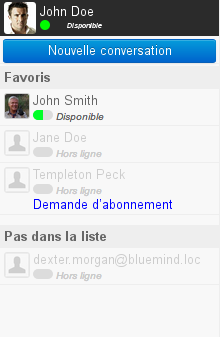*Pour en savoir plus, consulter la page dédiée à [La téléphonie](/Guide_de_l_utilisateur/La_téléphonie/)**.*

