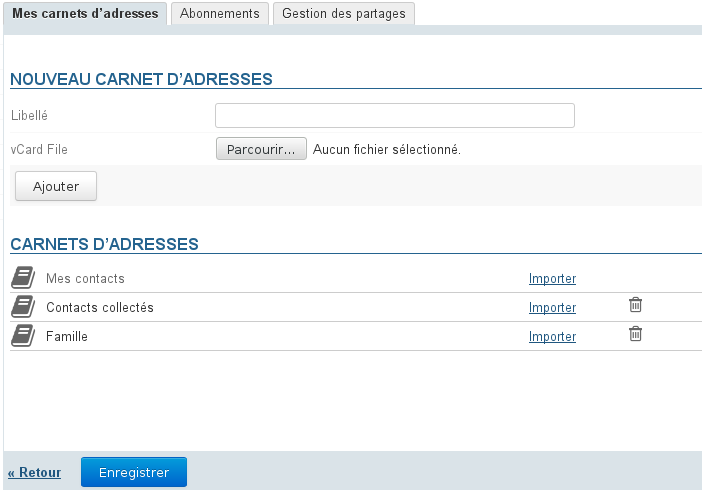
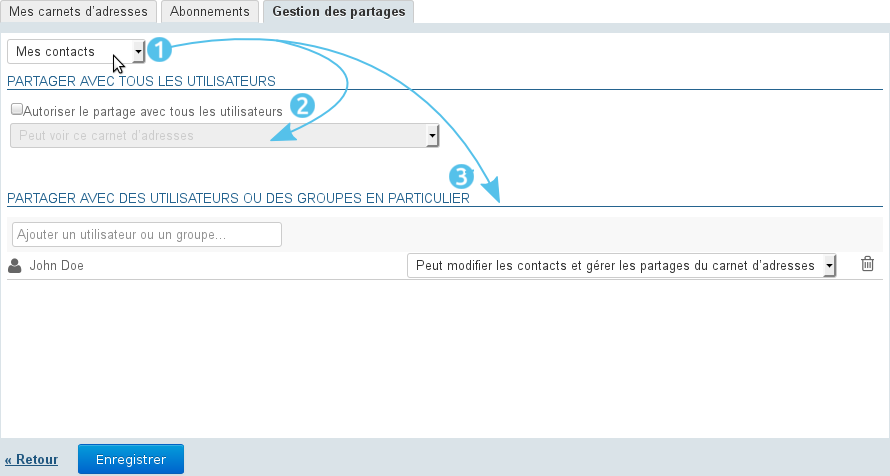
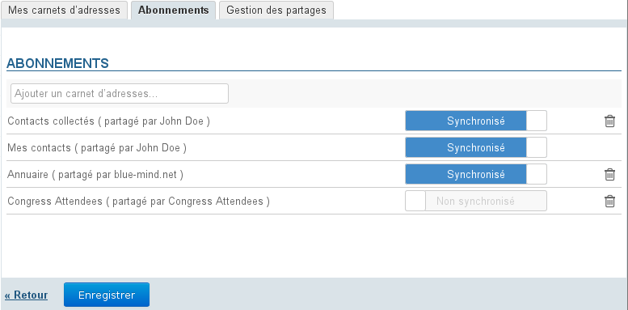
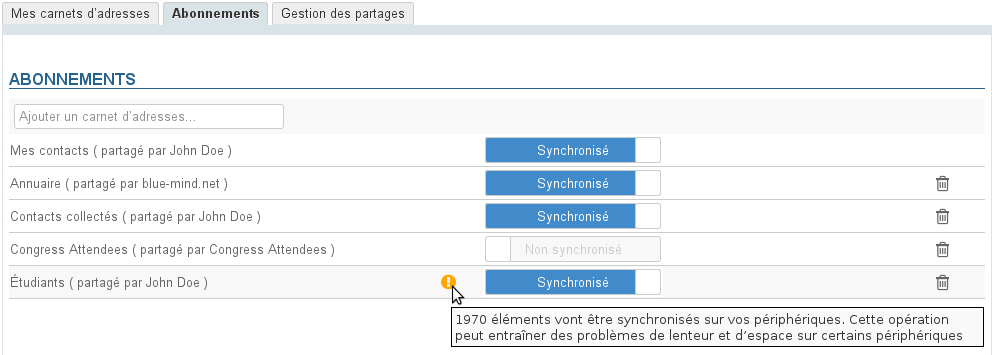
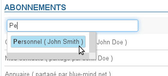
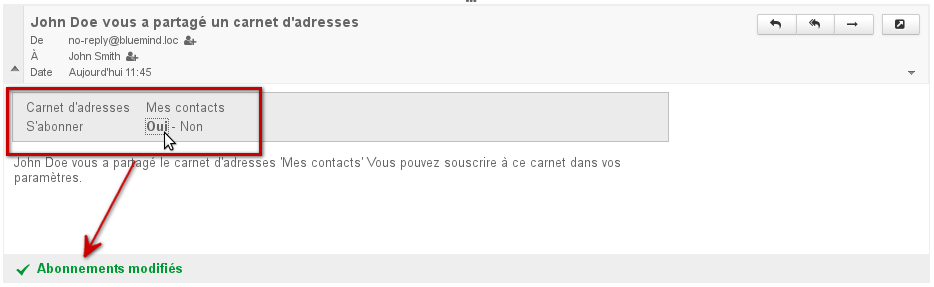

# Gestion des carnets d'adresses

## Présentation

L'interface de gestion des préférences des contacts permet à l'utilisateur de gérer ses carnets d'adresses propres ainsi que ses abonnements aux carnets d'adresses externes (domaine, autres utilisateurs...).

L'interface est  accessible depuis la gestion des préférences utilisateur, section Contacts (l'accès y est automatique lorsqu'on accède depuis l'application "Contacts") :

## Carnets d'adresses de l'utilisateur

Par défaut l'utilisateur possède 2 carnets d'adresses :

- "Mes contacts" (ou "Contacts") : carnet d'adresses personnel
- "Contacts collectés" : réunit automatiquement les destinataires des messages de l'utilisateur non présents dans l'annuaire ;

:::info

Le 3ème carnet par défaut, l'annuaire des utilisateurs, n'étant pas géré par l'utilisateur, il n’apparaît pas dans les carnets d'adresse : il s'agit d'un abonnement au carnet d'adresses du domaine.

:::

Ces carnets ne sont pas modifiables ni supprimables, mais l'utilisateur peut en faire une libre utilisation en gérant les contacts qui le composent.

### Création et modification

Pour **créer** un nouveau carnet d'adresses :

- Saisir son libellé
- Optionnel : choisir un fichier Vcard si l'on souhaite créer le carnet en y important des contacts
- Cliquer sur le bouton «Ajouter»

Pour **modifier** un carnet d'adresses :

- Cliquer sur le libellé du carnet afin de faire apparaître le champs de saisie :
- Saisir le nouveau nom et valider avec la touche &lt;Entrée> ou en cliquant sur le symbole  Pour annuler en cours de saisie, appuyer sur la touche &lt;Échap> ou cliquer sur le symbole 

Pour **supprimer** un carnet d'adresses :

- Cliquer sur l'icône  en fin de ligne
- Confirmer la suppression

:::info

L'utilisation du bouton «Enregistrer», présent ici comme sur tous les écrans de l'application, n'est pas nécessaire : les modifications sont faites et prises en compte au fur et à mesure des actions de l'utilisateur, ainsi toute suppression une fois confirmée sera définitive.

:::

### Import de contacts

Pour importer des contacts dans un carnet d'adresses depuis l'interface de gestion des préférences, vous devez posséder les contacts à importer sous forme de fichier au format [vCard](http://fr.wikipedia.org/wiki/VCard)

### Exporter un carnet

L'export des contacts d'un carnet d'adresses se fait directement depuis l'application Contacts.
Pour en savoir plus : [Les contacts - Importer et exporter](https://forge.blue-mind.net/confluence/display/LATEST/Les+contacts#Lescontacts-Importeretexporter)

### Partager un carnet d'adresses

BlueMind offre la possibilité de partager ses carnets d'adresses personnels avec les autres utilisateurs.

Pour **partager** un carnet d'adresses :

Se rendre dans l'interface de gestion des préférences de l'utilisateur > section Contacts > onglet « Gestion des partages » :

1. Choisir le carnet d'adresse à partager.Un utilisateur peut partager :
    - ses carnets d'adresses personnels : Contacts (ou «Mes Contacts»), Contacts Collectés et les carnets qu'il a créé
    - les carnets pour lesquels il a délégation : on lui a attribué le droit "Peut modifier les contacts de ce carnet et gérer ses partages"
2. Si l'on souhaite partager le carnet avec tous les utilisateurs du domaine, cocher la case "Autoriser le partage public" et choisir le type de droits à attribuer aux utilisateurs
3. ** **Choix recommandé :** ** Si l'on préfère attribuer des droits individuellement à certains utilisateurs ou groupe, rechercher la personne grâce au champs de saisie puis sélectionner le droit à lui attribuer
4. Une fois tous les droits attribués comme souhaité, valider en cliquant sur «Enregistrer»

## Abonnements

### Depuis la gestion des paramètres

L'affichage des carnets d'adresses de l'utilisateur ainsi que des carnets d'adresses qui ont été partagés avec lui se fait via l'onglet *Abonnements* des préférences.

:::info

Seuls les carnets apparaissant ici seront accessibles dans l'application Contacts de BlueMind, que la synchronisation soit active ou non.

:::

Le bouton "Synchronisation" permet de paramétrer une synchronisation différenciée pour chaque carnet avec les logiciels clients (application web, clients lourds ou appareils mobiles).

Lorsque la synchronisation est activée, les données sont téléchargées sur le logiciel client. De ce fait :

|  | Synchronisation activée | Synchronisation désactivée | Application web | EAS iOS | EAS (autres) | DAV | Outlook (connecteur) | Thunderbird |
| --- | --- | --- | --- | --- | --- | --- | --- | --- |
| les fiches sont consultables et disponibles hors connexion | les fiches sont consultables en mode connecté mais indisponibles hors connexion |
| 
- le carnet est visible
- les fiches sont consultables et disponibles hors connexion
 | - le carnet n'est pas visible | 

 | - les fiches sont accessibles en recherche et autocomplétion |
| 
- le carnet n'est pas visible
- les fiches sont accessibles en recherche et autocomplétion
 |
| 
"Mes Contacts" uniquement :
 | 
- le carnet est visible
- les fiches sont consultables et disponibles hors connexion
 | 
Autres carnets : pas de visibilité ni de recherche
 |
| 
- le carnet est visible
- les fiches sont consultables et disponibles hors connexion
 | le carnet n'est pas visible |
| 
- le carnet est visible
- les fiches sont consultables et disponibles hors connexion
 | 
- le carnet est visible, avec une icône différente
- les fiches sont accessibles en recherche (carnet d'adresses) et autocomplétion (composition de messages)
 |

:::info

Avertissement de volumétrie

Lorsque le volume des données contenues dans un carnet est important (plus de 1 000 contacts), un message avertit de possibles problèmes de synchronisation :

:::

:::tip
Les carnets d'adresses créés par l'utilisateur dans l'application Contacts de BlueMind, de même que ceux créés depuis les clients lourds (Outlook ou Thunderbird), sont automatiquement ajouté aux abonnements avec la synchronisation activée.
:::

Pour ajouter un carnet d'adresses :

- Commencer à taper le nom du carnet d'adresses dans le champs de saisie :
- L'autocomplétion propose alors les carnets auxquels l'utilisateur n'est pas encore abonné : ses carnets propres et les carnets que d'autres utilisateurs ont partagé avec lui (voir ci-dessus)
- Choisir dans la liste proposée par l'autocomplétion le carnet à ajouter et appuyer sur la touche &lt;Entrée> ou cliquer dessus
- Désactiver la synchronisation si désiré
- **Cliquer sur le bouton «Enregistrer» pour prendre en compte les modifications**

:::info

Il est nécessaire de cliquer sur « Enregistrer » pour prendre en compte un changement d'état de synchronisation puis **relancer la synchronisation (ou attendre la synchronisation automatique) sur le logiciel client** pour que les modifications soient prises en compte (téléchargement et visualisation des données en cas d'activation, suppression des données en cas de désactivation).

:::

### Depuis le message d'information reçu

Lorsqu'un utilisateur partage un de ses carnets avec un autre utilisateur, ce dernier est informé par un message automatique. Ce message électronique lui permet de s'abonner directement au carnet d'adresses depuis l'interface de messagerie :

