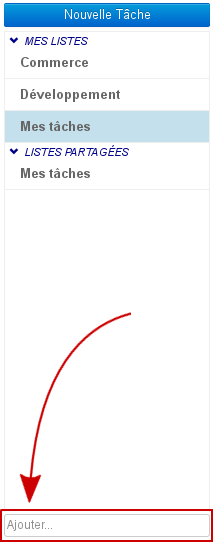
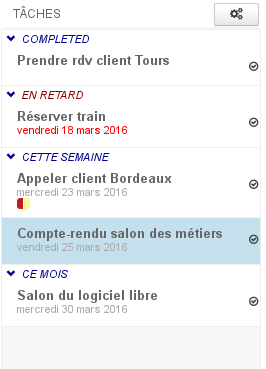
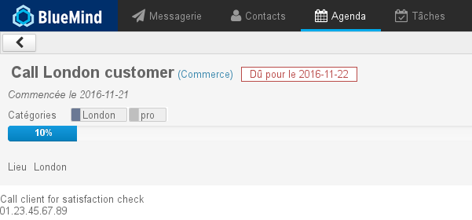

# Les tâches

## Présentation

BlueMind propose la gestion des tâches dans une interface dédiée et synchronisée avec l'agenda.

Organisez vos tâches par listes et utilisez les tags partagés avec les autres applications BlueMind (contacts et agenda).

Partagez vos listes de tâches avec vos collaborateurs en leur déléguant une visualisation simple ou la gestion complète.

## L'interface

La gestion des tâches se présente sous la forme d'une application en 3 colonnes :

-    : dans la 1ère colonne se trouve, sous le bouton «Nouvelle tâche», les listes de tâches auxquelles l'utilisateur est abonné : sa liste par défaut "Mes tâches", et d'autres listes qu'il a créées ou auxquelles il s'est abonné (via sa gestion des paramètres)
-  : dans la 2ème colonne se trouve les tâches contenues dans la liste sélectionnée, le bouton d'action en haut de colonne permet l'export des tâches de la liste ou l'import de tâches dans celle-ci
-  : la 3ème colonne, zone d'affichage principale, présente la fiche de la tâche sélectionnée ou en cours de création

## Les listes de tâches

L'utilisateur possède par défaut une liste "Mes tâches" et peut créer autant de listes supplémentaires qu'il le souhaite. Il peut aussi, via sa gestion de paramètres, s'abonner aux listes que d'autres utilisateurs partagent avec lui.

Pour ajouter une nouvelle liste, saisir son nom dans le champs "Ajouter..." au bas de la  et appuyer sur &lt;Entrée> pour valider :

Dans une liste, les tâches apparaissent triées suivant leur état dans des sous-listes dépliables :

- COMPLETED : liste les tâches terminées
- EN RETARD : met en évidence les tâches non terminées dont la date d'échéance est passée
- CETTE SEMAINE : les tâches dont la date d'échéance se situe dans la semaine en cours
- CE MOIS : les tâches dont la date d'échéance se situe dans le mois à venir à partir de la semaine suivante

## Les tâches

### Création

Le bouton  permet d'accéder au formulaire de création d'une tâche, qui sera alors créée dans la liste courante :

- **Titre : nom ou résumé de la tâche**
- Date de début : date à laquelle la tâche doit commencer
- Échéance le : date de fin attendue
- Priorité : basse, moyenne (par défaut), haute
- État : statut actuel d'exécution : non démarrée, terminée, en cours, annulée
- Avancement : permet de renseigner au fur et à mesure de l'exécution de la tâche, son niveau d'avancement en pourcentage
- Terminée le : date de fin effective
- Lieu
- Étiquette : les étiquettes (tags) sont partagées avec les applications contacts et agenda, les étiquettes accessibles sont celles de domaine ou de l'utilisateur.
- Description : description plus complète de la tâche, informations utiles ou complémentaires
- Alarme : rappel pour le début d'exécution de la tâche

Une fois le formulaire rempli et enregistré, la tâche apparaît dans la liste et le bouton  est alors disponible en haut du formulaire.

### Modification

Pour modifier une tâche :

- cliquer sur celle-ci dans la liste
- effectuer les modifications souhaitées dans le formulaire
- cliquer sur  en haut à gauche du formulaire d'édition pour valider

Pour copier ou déplacer une tâche vers une autre liste :

- cliquer sur  ou 
- choisir la liste souhaitée dans le menu déroulant
- cliquer sur  en haut à gauche du formulaire d'édition pour valider

### Terminer une tâche

BlueMind offre plusieurs possibilités pour terminer une tâche accomplie :

- cliquer sur le bouton  du formulaire d'édition de la tâche
- utiliser la liste déroulante "État" du formulaire d'édition de la tâche : 
- cliquer sur la coche  dans le [panneau des tâches de l'Agenda](#Lestaches-actions-taches)

:::tip

Dans le formulaire d'édition de la tâche, le champs "Terminée le" permet de saisir la date effective de fin de la tâche

:::

### Suppression

Pour supprimer une tâche :

- cliquer sur le bouton  en haut à droite du formulaire d'édition

:::info

Attention

 Aucune confirmation de suppression n'est demandée, la tâche sera directement et définitivement supprimée.

:::

## Intégration avec l'agenda

Dans l'agenda, les tâches sont présentées comme des calendriers. Les listes sont regroupées dans le sous-menu "Todolists" et les tâches sont présentées dans la partie haute de la vue, comme les événements sur journée complète, à leur date d'échéance. De plus, l'utilisateur peut afficher un panneau en partie droite de la page afin d'afficher les tâches sous forme de liste et d'accéder aux fonctionnalités principales :

### Visualisation d'une tâche

Un clic sur l'événement permet de faire apparaître un résumé de la tâche :

Cliquer sur le lien "Détail »" pour plus d'informations :

### Actions sur les tâches

En haut à droite de l'agenda, le bouton  permet de faire apparaître ou masquer le panneau des tâches :

Les tâches non terminées y sont présentées suivant le même tri que dans l'application de gestion des tâches :

- Late (en retard) : tâches dont la date d'échéance est passée
- Today (aujourd'hui) : tâches dont la date d'échéance est ce jour
- This week (cette semaine) : tâches dont la date d'échéance se situe dans la semaine en cours
- This month (ce mois) : tâches dont la date d'échéance se situe dans le mois à venir à partir de la semaine suivante

Chaque tâche est présentée avec :

- le code couleur de la liste à laquelle elle appartient
- son titre
- une coche  permettant de marquer la tâche comme terminée, elle disparaît alors automatiquement de la vue de l'agenda et de la liste
- une icône poubelle  permettant de supprimer la tâche

:::info

La suppression est immédiate et définitive, aucune confirmation n'est demandée

:::

