# Préférences du webmail

## Présentation

Encore en développement, la gestion des préférences du webmail propose des options de personnalisation de l'interface en constante évolution.

:::info

Documentation en cours

Certaines sections sont en cours de rédaction.

:::

## Accès

Les préférences sont accessibles depuis le menu en haut à droite de la page :

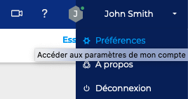

## Gérer le compte

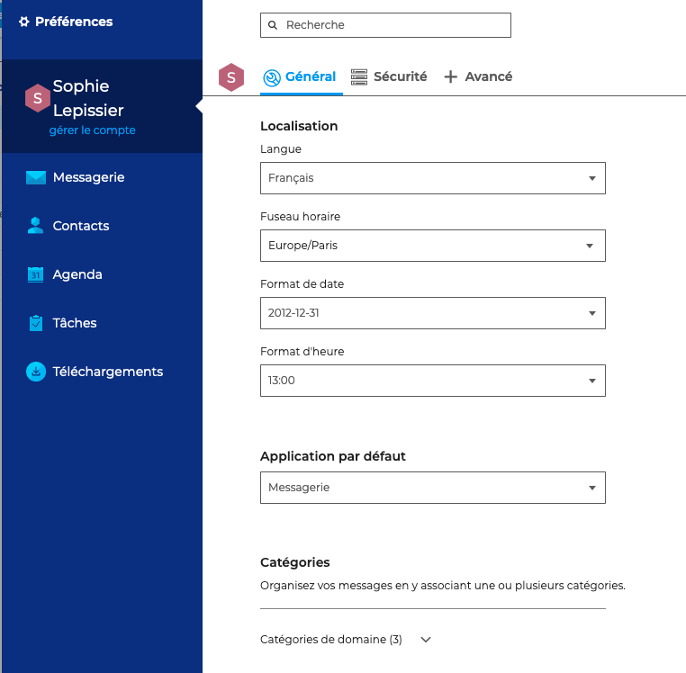

## Préférences de la messagerie

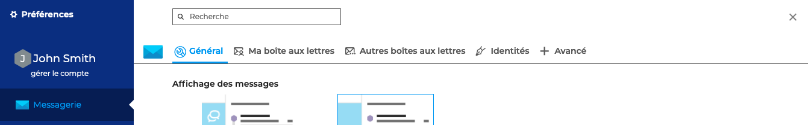

### Général

#### Affichage des messages

L'affichage des messages permet d’organiser les messages par conversation.

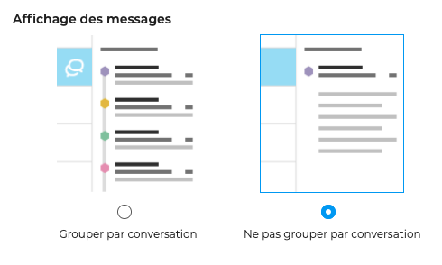

#### Densité de l'affichage

La densité d'affichage permet de paramétrer la liste des messages afin d'afficher plus ou moins d'informations et ainsi avoir un affichage plus complet ou diminuer les informations mais afficher plus de messages dans le même espace :

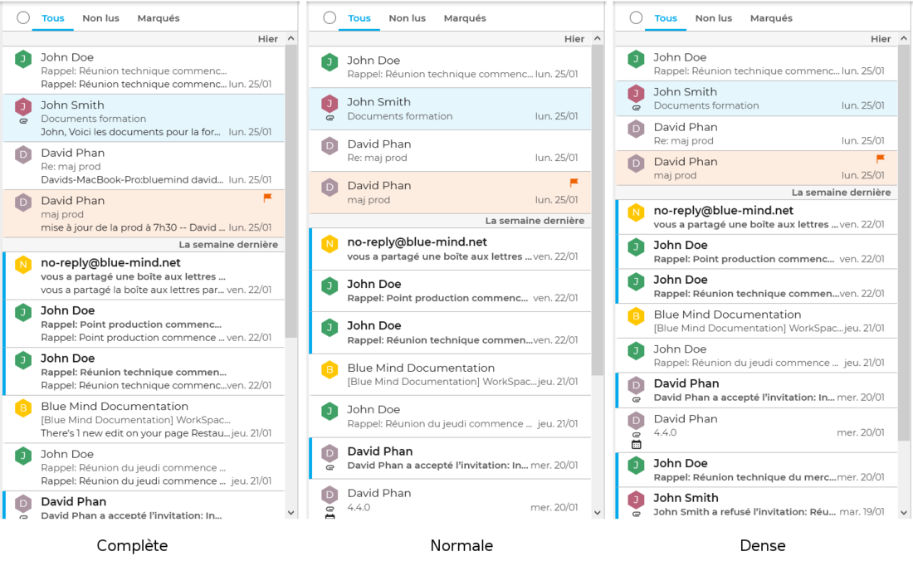

#### Signature

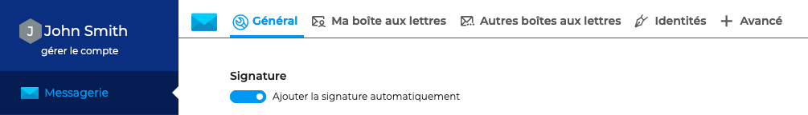

L'option "Ajouter la signature automatiquement" permet d'activer ou désactiver les signatures paramétrées dans les [identités](/Guide_de_l_utilisateur/La_messagerie/Les_identités/) du compte.

#### Lors de la déconnexion

#### Images distantes

Les contenus distants sont des images ou des pixels invisibles qui ne sont pas inclus directement dans le corps du message mais insérés via des liens vers des serveurs distants. Les images sont téléchargées quand le message s'affiche. Cette technique, appelée Pixel tracking, permet à l'émetteur de savoir, non seulement si le message a été lu, mais également combien de fois, à quelle heure et de quel endroit (situation géographique approximative liée à l'adresse IP).

Afin de préserver votre vie privée, BlueMind ne télécharge par défaut que les contenus provenant d'émetteurs connus. Bien de que fortement déconseillé, il est possible d'activer le téléchargement de tous les contenus.

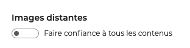

Lorsque l'option "Faire confiance à tous les contenus" est désactivée, une alerte apparaît proposant 2 options :

- afficher le contenu distant tant que le message est ouvert

- toujours faire confiance à cet expéditeur - dans ce cas, l’émetteur s'ajoutera dans les "[contacts collectés](/Guide_de_l_utilisateur/Les_contacts/)" et sera alors considéré comme "connu"

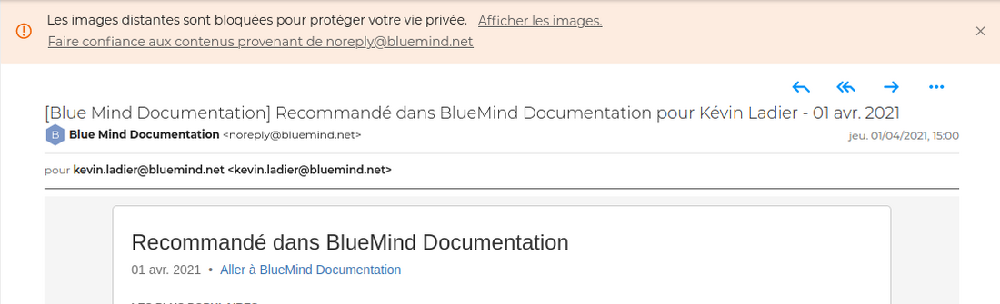

#### Capacité de stockage

#### Message d'absence

#### Transfert d'emails

#### Filtres de messagerie

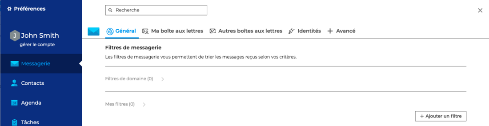

Les filtres permettent d'appliquer des règles de tri et actions à effectuer automatiquement aux nouveaux messages entrants.

Ils permettent par exemple le rangement dans un sous-dossier en fonction de l'expéditeur ou l'effacement en fonction de l'objet sans que l'utilisateur ait à effectuer lui-même cette action manuellement pour chaque message reçu répondant au(x) critère(s).

Les filtres peuvent être également être activés ou désactivés, modifiés et ordonnés.

Afin de créer un nouveau filtre, cliquez sur "+Ajouter un filtre" pour ouvrir la fenêtre popup de création

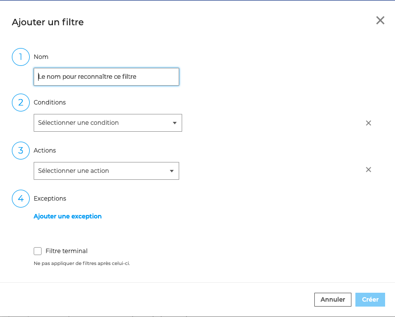

- Donner un nom au filtre afin de pouvoir le reconnaître facilement

- Choisir une condition parmi la liste (par exemple "L'objet contient" : documentation BlueMind)

- Choisir une action parmi la liste (par exemple "Déplacer vers" puis choisir un dossier existant - pour créer un dossier voir [La liste des dossiers](/Guide_de_l_utilisateur/Messagerie_BlueMind/))

- Indiquer une exception si besoin (par exemple "L'expéditeur est" John Smith)

- Cocher l'option "Filtre terminal" pour que ce filtre soit le dernier de la liste des filtres créés à s'appliquer

 Dans ce cas, tous les e-mails contenant "documentation BlueMind" dans leur objet, iront directement dans le dossier sélectionné, sauf s'ils sont envoyés par John Smith

Il est possible de créer autant de filtres que nécessaire et de les ordonner. L'ordre est important.
Les filtres seront en effet appliqués selon l'ordre défini.Pour modifier l'ordre des filtres, il suffit d'utiliser les flèches .
Lorsqu'un filtre est un "Filtre terminal", tous les filtres situés en-dessous ne seront pas appliqués.

 Dans ce cas, le filtre "Urgent" est un "filtre terminal". Lors de la réception d'un e-mail ayant pour "Urgent - Documentation BlueMind", celui-ci sera "marqué comme important" mais ne sera classé dans le dossier "Documentation BlueMind"
À noter qu'il est également possible de modifier ou supprimer  les filtres.
### Ma boite aux lettres

### Autres boites aux lettres

### Identités

BlueMind permet de créer plusieurs "identités" pour un même compte, avec un libellé, une adresse mail et une signature différente pour chacune d'entre elles.

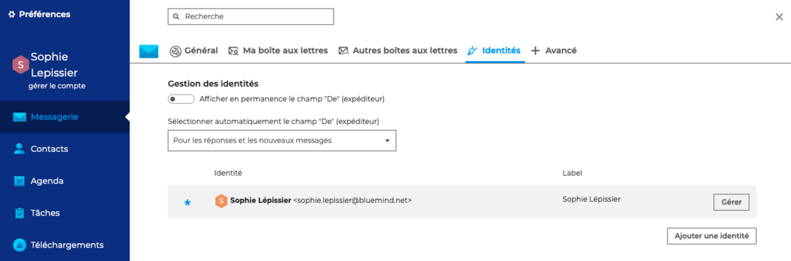

Une identité est créée par défaut par BlueMind. Pour la modifier, aller sur "Gérer" puis renseigner les champs : 

- **Nom affiché** est le nom qui apparaîtra dans les messages envoyés

- **Label** sert à distinguer l'identité parmi la liste, une même adresse et un même nom d'affichage pouvant être utilisés dans plusieurs identités

- **Adresse email** : il est possible de choisir l'une des adresses de messagerie qui sont affectées ou partagées au compte utilisateur : alias de domaines, boites partagées, etc.

- **Signature** : rédaction de la signature au format HTML, avec possibilité d'insérer les images, logos, etc.****

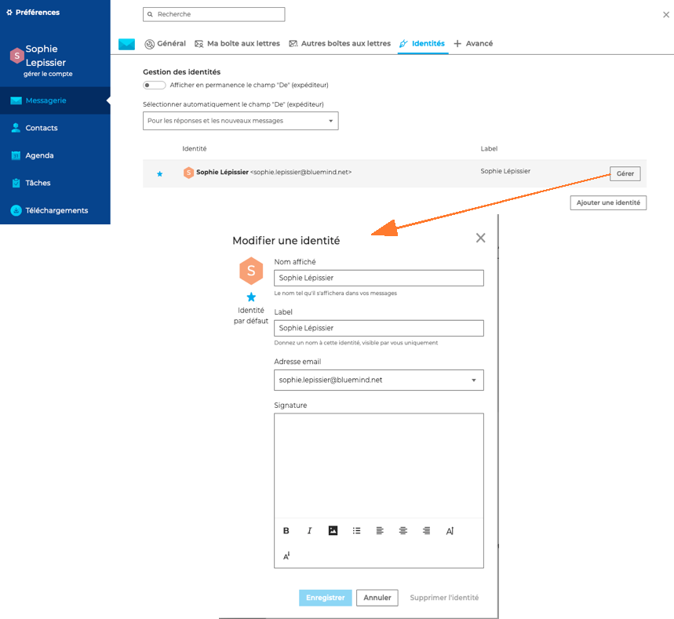

:::tip

Il est possible de créer une identité pour une adresse hors BlueMind.

Pour que cette option soit disponible, l'administrateur doit accorder le rôle "Messagerie > Identité externe" à l'utilisateur.
Pour en savoir plus sur l'affectation des droits, consultez la page du [Guide de l'administrateur](/Guide_de_l_administrateur/) > [Utilisateurs](/Guide_de_l_administrateur/Gestion_des_entites/Utilisateurs/)

:::

**"Ajouter une identité"** permet de créer d'autres identités avec, par exemple, une signature différente. Il est également possible de choisir l'identité par défaut, c'est-à-dire l'identité qui sera sélectionnée par défaut lors de la création d'un nouveau message.

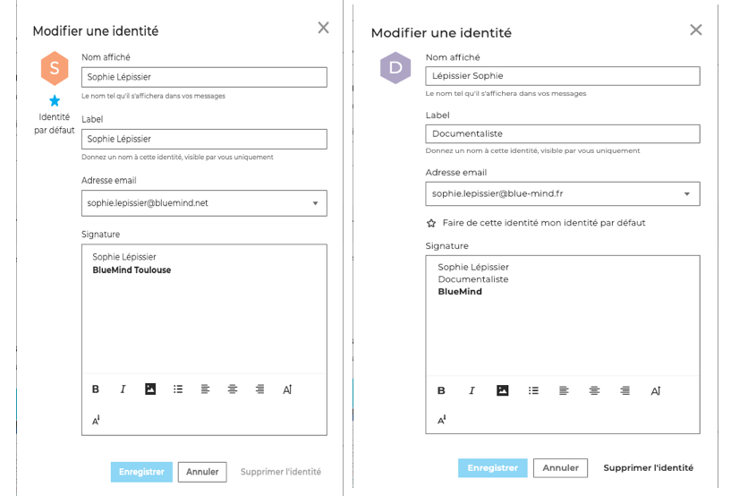

Pour voir et sélectionner l'expéditeur (identité) lors de l'envoi de messages, cocher l'option **"Afficher en permanence le champs "De" (expéditeur)"**.

**"Sélectionner automatiquement le champ "DE" (expéditeur)"** permet de préciser dans quel contexte l'application pourra choisir automatiquement l'identité la plus adaptée : jamais, uniquement pour les réponses ou pour les réponses et les nouveaux messages.

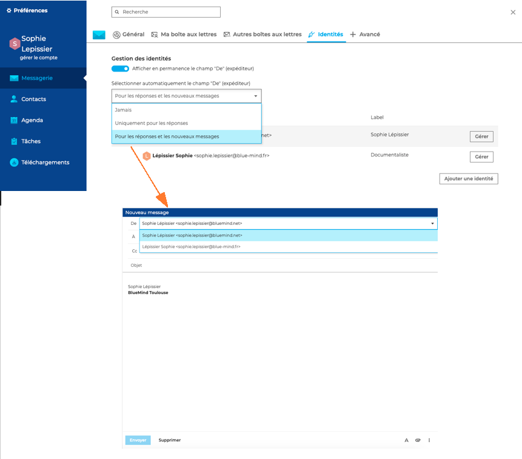

:::tip

Il est également possible d'afficher l'expéditeur (champs "De") de façon occasionnelle en sélectionnant l'option "Afficher le champ "De"" dans la barre d'outils du [composeur](/Guide_de_l_utilisateur/Messagerie_BlueMind/Le_composeur_BlueMind/).

:::

### + Avancé

## Préférences générales BlueMind

Un lien en colonne de droite, sous le nom d'utilisateur, permet de basculer vers les [Paramètres utilisateur BlueMind](/Guide_de_l_utilisateur/Paramètres_utilisateur/) :
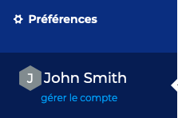

