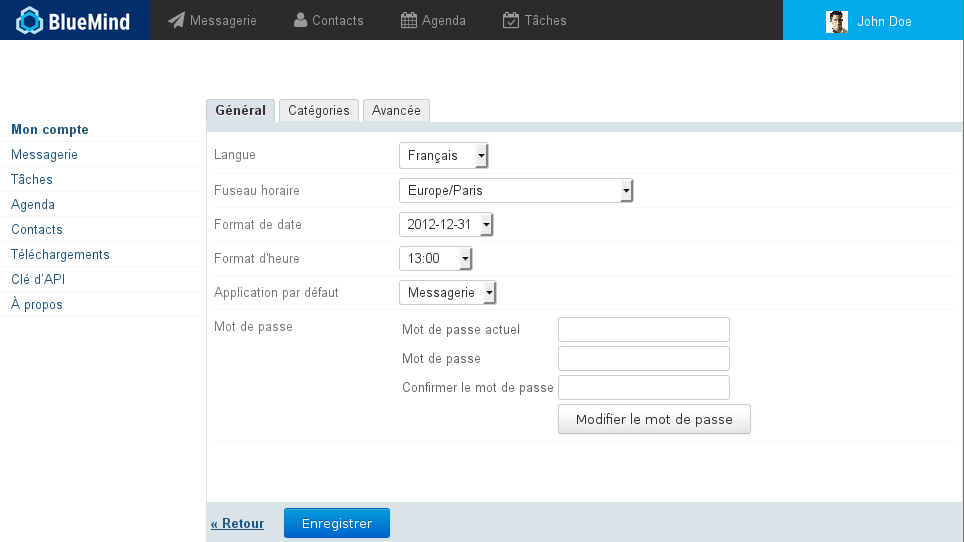
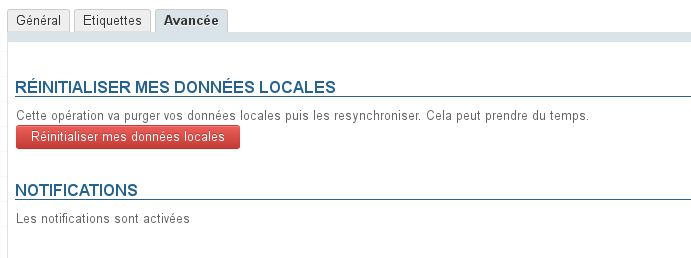
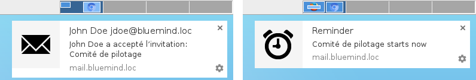
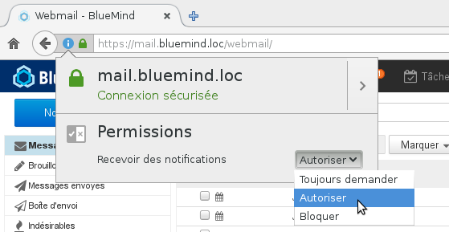
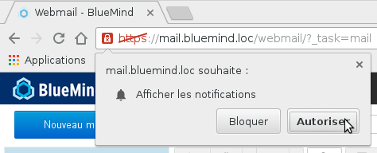
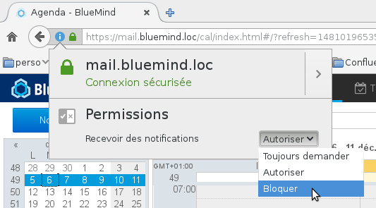
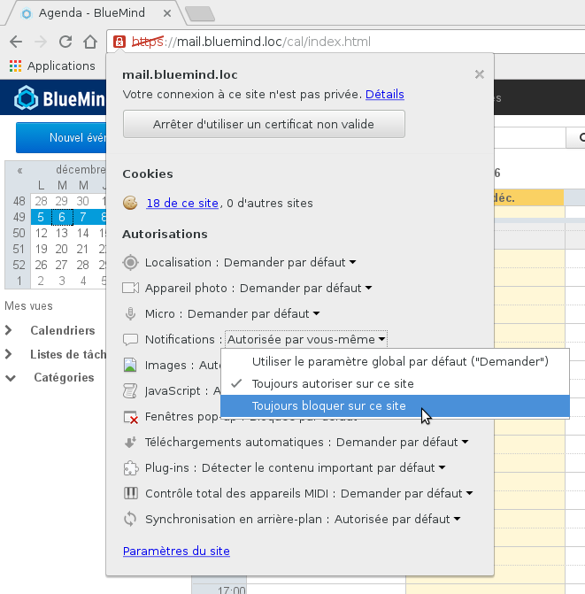
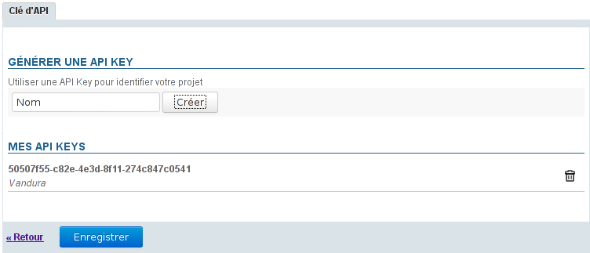
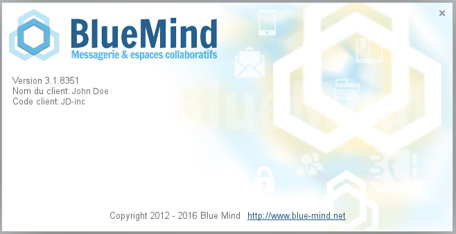

# Paramètres utilisateur

## Présentation

L'interface de gestion des paramètres permet à l'utilisateur de personnaliser son environnement BlueMind.

Cette interface est accessible depuis le bandeau de navigation présent en haut de toutes les pages de BlueMind : 

## Mon compte

Le premier onglet de la page "Mon compte" permet de régler les paramètres généraux de localisation et d'affichage de l'application :

- La langue d'affichage
- Le fuseau horaire sur lequel il se trouve, cela permet à l'application de régler automatiquement son horloge
- Le format d'affichage des dates : jour/mois/année ou mois/jour/année ou année-mois-jour
- Le format d'affichage des heures : sur 24 heures ("13:00") ou au format anglo-saxon ("1:00 pm")
- L'application par défaut qui s'ouvre lorsque l'utilisateur se connecte à BlueMind
- Le changement du mot de passe

:::tip

À propos des langues

BlueMind est actuellement traduit et en cours de traduction dans plusieurs langues. Vous pouvez consulter les langues disponibles ainsi que leur évolution sur le site dédié à la traduction de l'application : [https://forge.blue-mind.net/translate/](https://forge.blue-mind.net/translate/)

:::

## Expiration du mot de passe

Les administrateurs de BlueMind ont à partir de la version 4.3 de BlueMind la possibilité de mettre en place une politique d'expiration des mots de passe :

- de façon régulière : tous les mots de passes de tous les utilisateurs doivent être changés au bout d'un certain nombre de jours
- ponctuelle : parce que le compte a été corrompu, ils peuvent forcer le mot de passe d'un utilisateur à expirer et ainsi forcer l'utilisateur à le changer

Dans l'un ou l'autre des cas, lorsqu'il essaie de se connecter avec son ancien mot de passe, l'utilisateur voit apparaître le formulaire suivant :

Une fois le mot de passe modifié, l'utilisateur est dirigé de nouveau vers le formulaire de connexion et peut se connecter à BlueMind avec son nouveau mot de passe.

## Réinitialisation des données

L'onglet "Avancée" de la page "Mon compte" donne accès aux fonctions avancées de gestion des préférences, à savoir la réinitialisation des données locales de l'application :

## Notifications

Des notifications permettent de recevoir une alerte à l'écran lors de l'arrivée d'un nouveau message ainsi que pour les rappels d'événements.

Les navigateurs supportant cette fonctionnalité sont :

- Chrome
- Firefox
- Safari

Les navigateurs non supportés sont :

- Internet Explorer
- Opera

Notifications d'événement et de nouveau message avec Chrome sous Debian

Deux notifications simultanées avec Chrome sous Debian

Cliquer sur la notification entraîne pour un message l'ouverture de celui-ci dans la messagerie et pour un événement l'ouverture de l'agenda.

Une notification disparaît seule au bout de quelques secondes. Pour forcer sa fermeture sans ouvrir BlueMind, cliquer sur la croix en haut à droite de celle-ci.

### Activation

- se rendre dans l'onglet "Avancée"
- cliquer sur le bouton "Activer les notifications" :
- Confirmer l'activation dans votre navigateur
    - Sous Firefox cliquer sur l'icône de la barre d'adresse du navigateur  :
    - Sous Chrome, en choisissant de les autoriser lorsque la requête apparaît :

### Désactivation

#### Firefox

- De même que pour l'activation, cliquer sur l'icône de la barre d'adresse du navigateur
- Modifier votre choix dans le menu déroulant des permissions :

:::info

Choisir «Bloquer» aura pour effet d'empêcher la réactivation future des notifications pour BlueMind. Lorsque vous vous rendrez sur la page d'activation dans les préférences de votre compte, le bouton sera présent mais sans effet, il faudra de nouveau les autoriser dans Firefox.

:::

#### Chrome

- Cliquer sur l'icône de la barre d'adresse du navigateur
- Rechercher la ligne "Notifications" et modifier le choix du menu déroulant correspondant :

## Téléchargements

La section téléchargements des paramètres permet aux utilisateurs de télécharger le connecteur Thunderbird mis à disposition par leur administrateur afin de synchroniser leur logiciel.

## Clés d'API

Cette section permet à l'utilisateur de générer des clés d'accès à l'API BlueMind afin de pouvoir identifier son ou ses projets de développement.

### Générer une clé d'API

Pour générer une clé d'API pour un projet :

1. Taper le nom du projet dans le champs «Nom»
2. Cliquer sur le bouton «Créer» la clé est automatiquement et immédiatement créée et ajoutée à la liste des clés d'API avec le nom du projet correspondant, elle peut dès à présent être copiée et utilisée

### Supprimer une clé d'API

Pour révoquer une clé d'API :

1. Cliquer sur l'icône de corbeille  en fin de ligne correspondante
2. Valider la suppression

:::info

ATTENTION

La suppression est effective immédiatement, sans cliquer sur le bouton «Enregistrer» de bas de page : dès que l'utilisateur valide la suppression dans la popup d'avertissement, la clé est supprimée.

:::

## À propos

Ce lien affiche l'écran d'information sur la version de BlueMind installée et ses informations de souscription le cas échéant :

