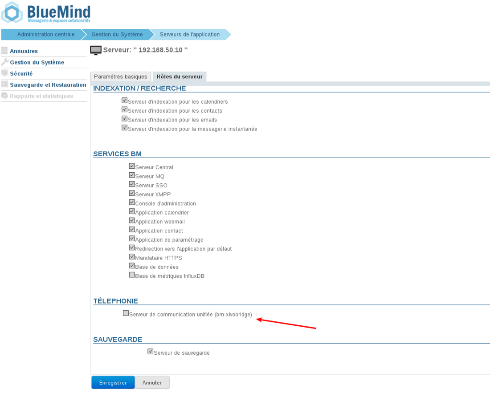
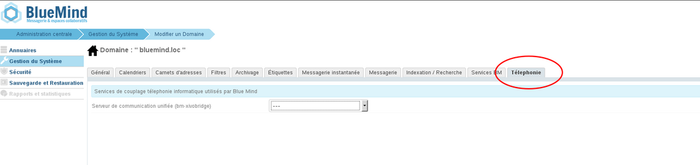

# Konfiguration des Xivo/Avencall-Plugins


## Präsentation

In diesem Dokument werden die Installation und Konfiguration der BlueMind-Plugins erläutert, die eine Verbindung mit dem XiVO-Produkt von Avencall ermöglichen.


## Xivo konfigurieren

- einen *Xuc*-Benutzer unter *Dienste -> IPBX -> Users* anlegen
- Für den Benutzer den Xivo-Client aktivieren und ihn informieren:
    - Login: *xuc*
    - Passwort: *0000*
- Legen Sie unter *Konfiguration > Web Services Access* einen *Web Services-Benutzer* mit den folgenden Einstellungen an:

    - Login: *xivows*
    - Passwort: *xivows*
    - Host: *leer*
- Stellen Sie sicher, dass *Multiqueues call stats sharing *in *Services > Ipbx > Advanced configuration* > *Queues* aktiviert ist


## Installieren des Xivo-Plugins für BlueMind

### Voraussetzung

Der XUC-Dienst muss auf der Avencall-Seite installiert und auf Port 8090 erreichbar sein.

Erstellen Sie die Datei `/etc/xuc/xuc.conf` :


```
XivoWs {
    enabled=true
}
 
api {
    eventUrl = "http://<bluemind.srv.ip:9091/xivo/1.0/event/domain.tld/dropbox/"
}
 
xucami {
    enabled = false
}
```


### Verfahren

1. Installieren Sie die notwendigen Pakete:
**Debian/Ubuntu**

```
 aptitude install bm-plugin-core-cti-xivo bm-xivobridge bm-plugin-core-cti bm-plugin-webserver-cti
```

**RedHat/CentOS**

```
yum install bm-plugin-core-cti-xivo bm-xivobridge bm-plugin-core-cti bm-plugin-webserver-cti
```


:::info

Bei einer verteilten Installation auf mehreren Servern muss das Paket `bm-plugin-webserver-cti` auf dem Server installiert werden, der den Dienst `bm-webserver` hostet

:::

2. Starten Sie BlueMind nach der Installation neu:


```
# bmctl restart
```


3. Erstellen Sie die Datei `/etc/bm/xivo.ini` und geben Sie die folgenden Informationen an:


```
xuc.host=<xuc\_host>:8090
```

*Hinweis: Der Standard-XUC-Port ist 8090, aber ältere Versionen des XUC-Servers hören möglicherweise auf Port 9000 *


## Konfiguration in BlueMind

### CTI-Server-Rolle hinzugefügt

- Anmeldung bei BlueMind als globaler Administrator admin0
- Gehen Sie zu Systemadministration > Application Servers
- Wählen Sie den BlueMind-Server aus, der als CTI-Relay konfiguriert werden soll.
- Aktivieren Sie auf der Registerkarte "Server-Rollen" unter "Telefonie" das Kontrollkästchen "Einheitlicher Kommunikationsserver":

- Speichern Sie die neue Konfiguration.


### Domain-Konfiguration

Weiterhin als globaler Administrator admin0 eingeloggt:

- Gehen Sie zu Systemadministration > Überwachte Domains
- Wählen Sie die für die Verwendung von Xivo zu konfigurierende Domain
- Wählen Sie in der Registerkarte "Telefonie" den Relay-Server aus:

- Speichern Sie die Konfiguration.


## Funktionsprüfung

Die korrekte Funktion kann getestet werden, indem ein XIVO-Termin über CURL simuliert wird:


```
curl -X POST -H 'Content-Type: application/json' http://#BLUEMIND:9091/xivo/1.0/event/#DOMAIN/dropbox/ -d '{"username":"#LOGIN","status":#STATUS}'
```


mit:

- #BLUEMIND: url BlueMind
- #DOMAIN: die betreffende Domain (z. B. blue-mind.net)
- #LOGIN: Benutzeranmeldung (ohne Domain)
- #STATUS: Telefonstatus


Die unterstützten Zustände sind:

- 0: verfügbar (grün)
- 2: am Telefon (rot)
- 8: das Telefon klingelt (blinkt rot)


## Verwendung und Integration

Weitere Informationen über die Nutzung und Integration von Telefonie in BlueMind erhalten Sie in den entsprechenden Seiten des Benutzerhandbuchs:

- [Telefonie](/Guide_de_l_utilisateur/La_téléphonie/)
- [Instant Messaging](/Guide_de_l_utilisateur/La_messagerie_instantanée/)


