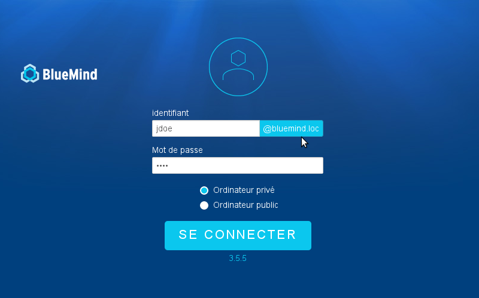

# Vereinfachte Anmelde-ID


## Präsentation

Damit Benutzer beim Verbinden mit BlueMind einfach ihren Benutzernamen ohne den Domänen-Teil eingeben können (z.B. "jdoe" statt "jdoe@bluemind.loc"), genügt es, eine Standarddomain auf dem Server zu konfigurieren.


:::info

Andere Domains

Mit dieser Konfiguration ist es immer möglich, eine Verbindung zu einer anderen Domain herzustellen. In diesem Fall muss die komplette Domain angegeben werden (Beispiel: jdoe@yellowmind.loc).

:::

## Implementierung

- Bearbeiten Sie die Datei `/etc/bm/bm.ini` und fügen Sie am Ende die folgende Zeile ein:


```
default-domain=bluemind.loc
```

Hinweis: *bluemind.loc **durch den Namen der betreffenden Domain ersetzen*

- Den bm-hps-Dienst neu starten:


```
service bm-hps restart
```


Die Anmeldeseite sieht dann wie folgt aus:

Speichern

Speichern

Speichern

