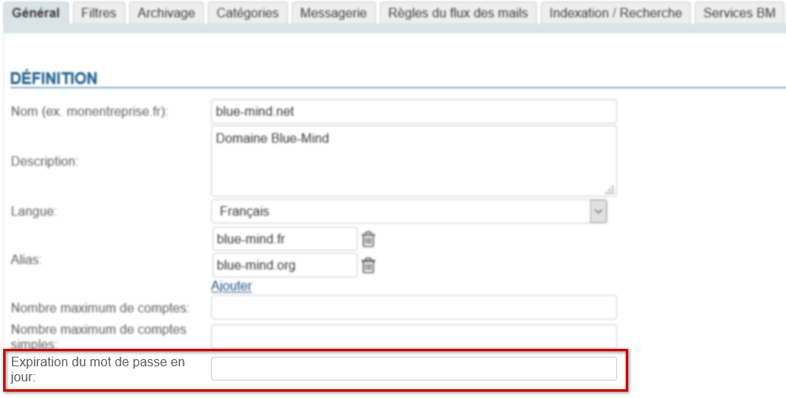
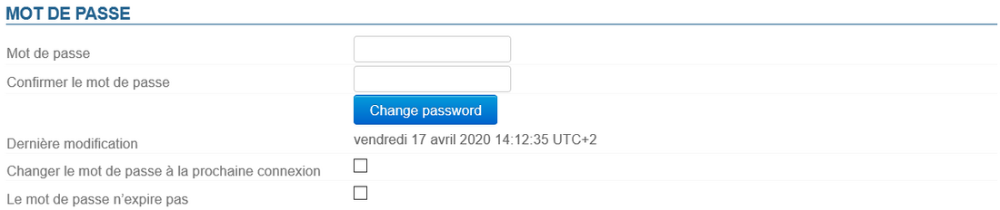

# Implementieren Sie eine Richtlinie in Bezug auf den Verfall von Passwörtern

:::info

Verbinden mit AD oder LDAP

Die Ablaufrichtlinie wird nicht auf Benutzer angewendet, die aus einem AD- oder LDAP-Verzeichnis importiert wurden.

:::

## Globale Richtlinie

Der Administrator kann eine Richtlinie zur automatischen Verwaltung des Ablaufs von Passwörtern für eine Domain einrichten: Alle Benutzer müssen ihre Passwörter in einer bestimmten Häufigkeit ändern.

Diese Richtlinie wird von der Verwaltungskonsole auf der Seite : Systemverwaltung > Überwachte Domains > Ihre Domain wählen > Registerkarte Allgemein

- Geben Sie die gewünschte Anzahl von Tagen ein und klicken Sie auf die Schaltfläche "Speichern" am unteren Rand der Seite.

Die Benutzer werden dann gezwungen, ihr Passwort zu ändern:

- ** **Nach der angegebenen Zeitspanne entsprechend dem Datum der letzten Änderung, falls bekannt.****Wenn der Administrator z. B. 100 Tage eingibt und der Benutzer sein Passwort vor 75 Tagen geändert hat, muss er es in 25 Tagen ändern.
- ** **Bei der nächsten Anmeldung, wenn kein Datum der letzten Änderung bekannt ist.****Dies kann der Fall sein, wenn der Benutzer vor der Umstellung auf 3.5.14 angelegt wurde und er sein Passwort nie geändert hat.

## Einzelverwaltung

Unabhängig davon, ob eine globale Richtlinie erstellt wurde, haben Administratoren die Möglichkeit, den Ablauf des Passworts eines Benutzers zu erzwingen, z. B. wenn der Verdacht besteht, dass das Passwort des Benutzers nicht mehr sicher ist.

Der Administrator kann den Benutzer auch von der globalen Richtlinie ausschließen.

In beiden Fällen muss der Administrator zum [Benutzerstamm des Benutzers](/Guide_de_l_administrateur/Gestion_des_entités/Utilisateurs/) in der Administrationskonsole gehen: Verzeichnisse > Verzeichniseinträge > Benutzer auswählen > Registerkarte Wartung :

- Aktivieren Sie das Kontrollkästchen "**Passwort bei nächster Anmeldung ändern**" und klicken Sie unten auf der Seite auf "Speichern", um das Passwort ablaufen zu lassen und den Benutzer zu zwingen, es zu ändern.
- Aktivieren Sie das Kontrollkästchen "**Passwort läuft nicht ab**", um den Benutzer von der globalen Domain-Ablaufrichtlinie auszuschließen.

## Wirkung für Anwender

Unabhängig davon, ob das Passwort aufgrund der globalen Richtlinie oder durch Erzwingen seitens eines Administrators abgelaufen ist, erfolgt die Änderungsaufforderung für Benutzer auf die gleiche Weise: Wenn der Benutzer versucht, sich mit seinem alten Passwort anzumelden, wird ihm folgendes Formular angezeigt:

Sobald dieses Formular ausgefüllt und validiert wurde, wird der Benutzer zur BlueMind-Anmeldeseite weitergeleitet und kann sich dann mit dem neuen Passwort anmelden.

