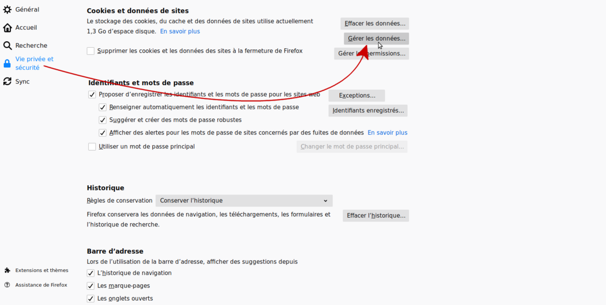
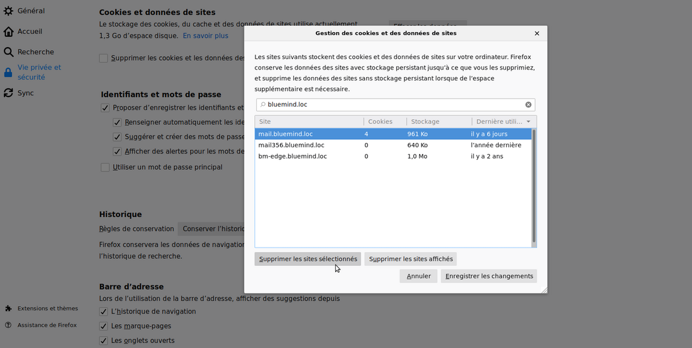
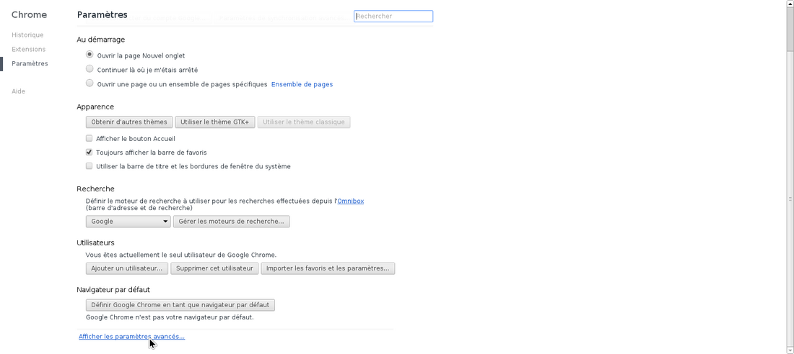
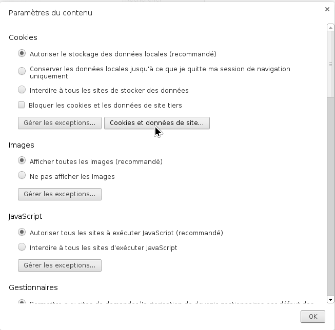
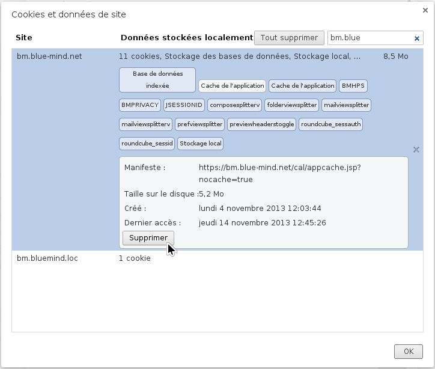
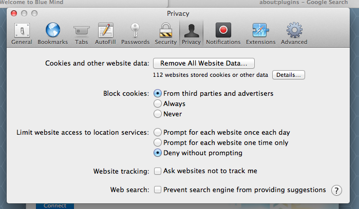
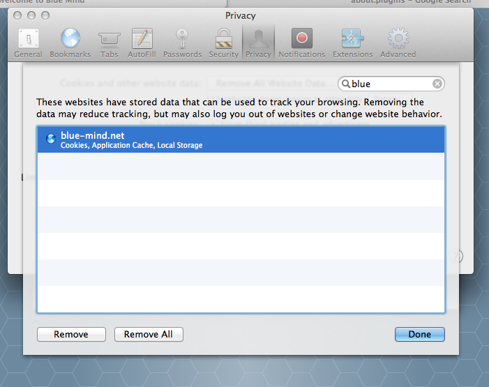
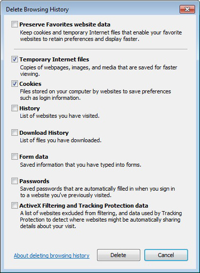

# Bereinigung des Client-Browser-Caches

:::info

Dieser Vorgang ist im Browser des Benutzers auszuführen.

Sie kann daher vom Anwender selbst durchgeführt werden.

:::

## Präsentation

BlueMind-Client-Anwendungen, wie z. B. die Kalenderanwendung und die Kontaktanwendung, werden im Cache des Client-Browsers gespeichert, um das Starten der Anwendung im *Offline-Modus* zu ermöglichen.

Dies geschieht durch die Funktionalität *appcache HTML*, falls im Webbrowser vorhanden. Dieser Cache wird automatisch aktualisiert, kann aber mit der Zeit vom Browser beschädigt werden, und es kann wichtig sein, diesen Cache zu bereinigen, um den Browser zu zwingen, eine aktuelle Version der Anwendungen herunterzuladen.

## Mozilla Firefox

- Gehen Sie zu den Firefox-Einstellungen:
    - unter Windows: Werkzeuge > Optionen
    - unter Linux: Bearbeiten > Einstellungen
    - unter Mac OS: Firefox > Einstellungen
- Gehen Sie zum Abschnitt "Datenschutz und Sicherheit" und scrollen Sie nach unten zu "Cookies und Website-Daten"
- Klicken Sie auf die Schaltfläche "Daten verwalten": 
- Suchen und wählen Sie die gewünschte Website und klicken Sie auf die Schaltfläche "Ausgewählte Websites löschen": 

## Google Chrome

- Gehen Sie zu den Google Chrome-Einstellungen
- Klicken Sie auf *Erweiterte Einstellungen anzeigen*

*  

 *

- Klicken Sie im Bereich *Datenschutz* auf die Schaltfläche *Inhaltseinstellungen.... *
- Klicken Sie auf die Schaltfläche *Cookies und Websitedaten. * *  * *  *
- Wählen Sie die URL des BlueMind-Servers in der Spalte *Website*
- Klicken Sie auf jedes *Cache-Tag in der Anwendung* und dann auf die Schaltfläche* *Löschen * **  *

## Apple Safari

- Rufen Sie die Safari-Einstellungen über das Menü *Safari >*Einstellungen auf
- Klicken Sie auf den Bereich* *Datenschutz * *

- Klicken Sie auf die Schaltfläche *Details*
- Wählen Sie die BlueMind-Domain des betreffenden Servers in der Liste aus und klicken Sie auf die Schaltfläche* *Löschen * **  *

## Microsoft Internet Explorer

Nur verfügbar ab Microsoft IE 10.

- Gehen Sie zu *Extras > Sicherheit > Browserverlauf löschen (oder Tastenkombination * *Strg + Shift + Entf*)

- Aktivieren Sie die Kontrollkästchen *Temporäre Dateien* und *Cookies*
- Klicken Sie auf die Schaltfläche *Löschen*

