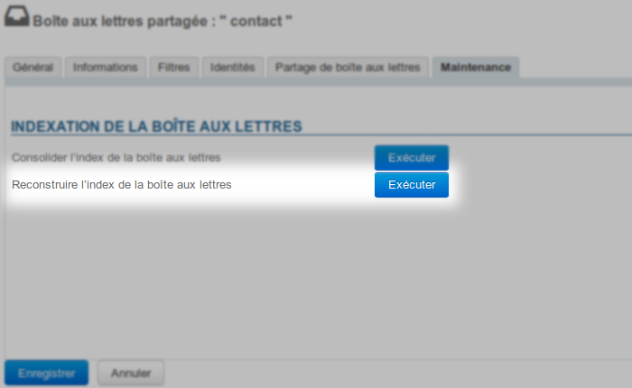

# Freigabe des Lesestatus von geteilten Posteingängen


## Präsentation

Der [Standardbetrieb ](/Guide_de_l_utilisateur/La_messagerie/Les_boites_aux_lettres_partagées/)von geteilten Posteingängen entspricht einem individuellen Lesestatus der Nachrichten im Posteingang: Jeder Benutzer hat seinen eigenen Status und sieht somit die Nachrichten, die er ggf. persönlich gelesen hat, unabhängig davon, ob andere Benutzer die Nachrichten geöffnet haben.

In einigen Fällen ist der Prozess der Nachrichtenverwaltung so gestaltet, dass Personen, den Lesestatus freigeben können, so dass sie eine E-Mail, die von einem Mitarbeiter gelesen wurde, als gelesen oder eine Nachricht, die niemand angesehen hat, als ungelesen sehen können.

## Implementierung

Die Freigabe kann direkt über Cyrus erzwungen werden. Dazu müssen Sie sich auf dem Server, der BlueMind hostet, per cyradm mit Cyrus verbinden:


```
cyradm --user admin0 localhost --port 1143
```


Geben Sie dann **für jeden gewünschten Posteingang** den folgenden Befehl ein:


```
mboxcfg "user/nom-de-la-boite\*@mydomain.tld" sharedseen true
```


Der **Posteingang** muss anschließend **neu indiziert** werden:

- Gehen Sie in der BlueMind-Administrationskonsole in den Stammsatz der Posteingang-Administration" > Registerkarte "Wartung" > und führen Sie "Posteingang-Index neu erstellen" aus:




