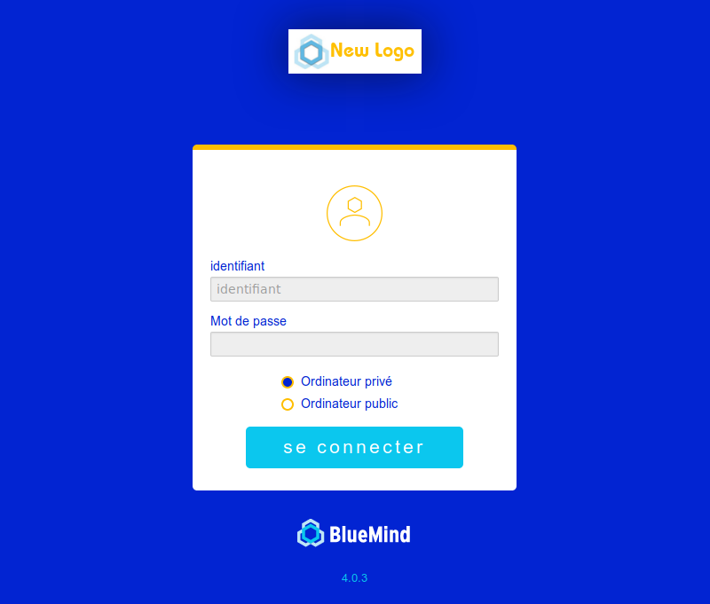

# Anpassen des Anwendungslogos


Das standardmäßige BlueMind-Logo, das auf dem Anmeldebildschirm und im BlueMind-Navigationsbanner sichtbar ist, kann jetzt angepasst und durch ein Bild Ihrer Wahl ersetzt werden.

## Ergebnis der Anpassung

Nachdem das Logo angepasst wurde, erscheint es wie folgt in den verschiedenen Bereichen von BlueMind:

- Auf der Startseite erscheint anstelle des BlueMind-Logos weiß gerandet das neue Logo. Das BlueMind-Logo ist danach weiterhin unter dem Anmeldeformular sichtbar:
- Im Banner erscheint nach dem Einloggen links oben das benutzerdefinierte Logo.Das BlueMind-Logo wird teilweise links davon angezeigt, wenn der Benutzer mit der Maus darüber fährt, rollt sich das Logo aus und informiert über die aktuelle Version von BlueMind:


## Bildvorbereitung

Das neue Logo muss die folgenden Voraussetzungen erfüllen:

- Format: [PNG](https://fr.wikipedia.org/wiki/Portable_Network_Graphics)
- Abmessungen (B,H): 140x40 PixelWenn die Abmessungen nicht beachtet werden, wird das Bild automatisch in der Größe angepasst, damit es in den definierten Bereich passt. Es wird daher empfohlen, besonders auf die Proportionen des Bildes zu achten.


Die Hintergrundfarbe ist dunkelblau, so dass alle transparenten Bereiche des Bildes für den Benutzer dunkelblau erscheinen. Um eine andere Hintergrundfarbe zu erhalten, ersetzen Sie die transparenten Bereiche Ihres Bildes durch die gewünschte Farbe.

## Implementierung

### Einrichten eines neuen Logos

Geben Sie den folgenden Befehl ein:


```
curl -X PUT --header 'X-BM-ApiKey: TOKEN\_ADMIN0' -H "Content-Type: application/octet-stream" --data-binary "@/path/to/logo.png" 'https://mail.bluemind.loc/api/system/installation/logo'
```


Ersetzen Sie:

- `TOKEN_ADMIN0`: das *Token* des admin0, nur er kann das Bild ändern.


:::tip

das Token befindet sich in der Datei `/etc/bm/bm-core.tok`

:::

- `@/path/to/logo.png`: der Pfad zur Bilddatei.
Dies kann ein lokaler Pfad sein (die Datei befindet sich auf dem Rechner, auf dem die Aktion durchgeführt wird) oder ein Remote-Pfad.


:::info

Lassen Sie immer das @-Symbol vor dem Pfad stehen, wenn Sie einen lokalen Pfad verwenden.

:::

- `mail.bluemind.loc`: die Url des betreffenden BlueMind


### Zum ursprünglichen Logo zurückkehren

Um zum Standard BlueMind-Logo zurückzukehren, löschen Sie einfach das benutzerdefinierte Logo:


```
curl -X DELETE --header 'X-BM-ApiKey: TOKEN\_ADMIN0' 'https://mail.bluemind.loc/api/system/installation/logo'
```


Ersetzen Sie:

- `TOKEN_ADMIN0`: das *Token* des admin0, nur er kann das Bild ändern.
Hinweis: Wenn das *Token* nicht korrekt ist, wird ein "*PERMISSION DENIED*"-Fehler zurückgegeben

- `mail.bluemind.loc`: die Url des betreffenden BlueMind


Speichern

Speichern

Speichern

