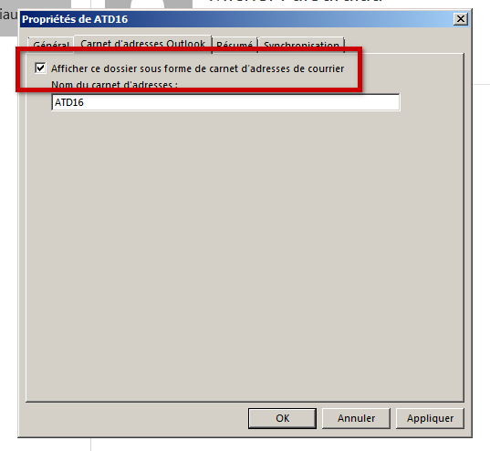
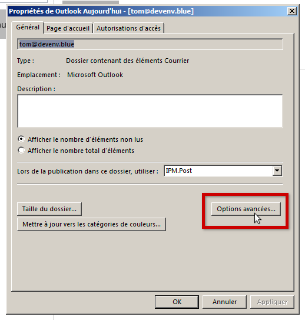
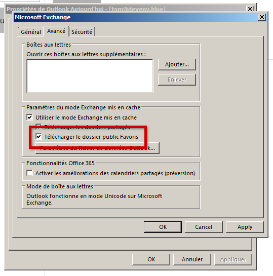
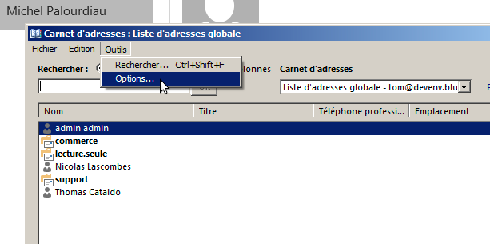
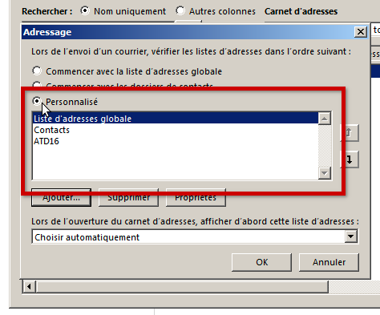

# Abrufen von Domain-Protokollen in Outlook

## Präsentation

Domain-Protokolle erscheinen nicht standardmäßig in dem in mapi verbundenen Outlook. Auf dem PC ist eine spezielle Konfiguration erforderlich, um sie in der Oberfläche erscheinen zu sehen und sie beim Schreiben von Nachrichten verwenden zu können.

## Verfahren

##### Teil 1: Domain-Verzeichnisse als Adressverzeichnisse anhängen

Klappen Sie die Baumstruktur *Öffentliche Ordner* > *Alle Ordner* auf: Hier erscheinen die Verzeichnisse

:::tip

Öffentliche Verzeichnisse sind nur in der Ordneransicht sichtbar, die Sie über die Schaltfläche "..." am unteren Rand des Outlook-Fensters aufrufen können:

:::

Klicken Sie mit der rechten Maustaste auf das Verzeichnis und wählen Sie „**Zu Favoriten hinzufügen...**" :

Klicken Sie dann mit der rechten Maustaste **auf den als Favoriten gespeicherten Ordner** und wählen Sie "**Eigenschaften...**". :

Gehen Sie in dem sich öffnenden Fenster auf die Registerkarte "*Outlook-Adressbuch*" und aktivieren Sie das Kontrollkästchen "**Diesen Ordner als Mail-Adressbuch anzeigen**":

 **Nun werden die Kontakte von Outlook als Kontakte berücksichtigt.**

Klicken Sie auf **OK**, um die Einstellungen zu übernehmen und den Vorgang zu beenden.

###### **Wiederholen Sie den Vorgang für jedes Verzeichnis**

##### Teil 2: Domain-Verzeichnisse bei der Fertigstellung verwenden

Gehen Sie zurück zur Hauptansicht und klicken Sie mit der rechten Maustaste auf den Kontonamen und wählen Sie "**Datendatei-Eigenschaften...**" :

Klicken Sie in dem sich öffnenden Fenster auf die Schaltfläche "**Erweiterte Einstellungen...**" :

Aktivieren Sie im neuen Fenster das Kontrollkästchen "**Favoriten des öffentlichen Ordners herunterladen**", wodurch der Inhalt des Ordners, der nun als Kontakte gilt, auf dem PC synchronisiert werden kann:

Klicken Sie auf **OK**, um jedes Fenster zu bestätigen und zu beenden.

Wechseln Sie in der Hauptansicht die Adressbuchverwaltung über die folgende Schaltfläche rechts oben im Hauptbanner:

*Hinweis: Je nachdem, wo Sie sich in der Ansicht befinden (Home, Nachricht, Unterordner...), kann sie von anderen Menüpunkten umgeben sein.*

Öffnen Sie in der Verwaltung das Menü *Tools* und klicken Sie auf "**Optionen...**"

Aktivieren Sie im Optionsfenster das Optionsfeld "Benutzerdefiniert" 

Klicken Sie auf **OK**, um die Einstellungen zu übernehmen und den Vorgang zu beenden.

Zur Vervollständigung der Adressen werden fortan die im Feld aufgeführten Verzeichnisse berücksichtigt. Standardmäßig enthält die Liste alle Domain-Verzeichnisse, die danach erstellten Verzeichnisse werden von Outlook automatisch hinzugefügt; unter Befolgung des Verfahrens für den 1. Teil ist es daher nicht nötig, den Vorgang für jedes hinzugefügte Domain-Verzeichnis erneut durchzuführen.

###### Die Einstellung ist abgeschlossen: Die Kontakte müssen erscheinen, wenn Sie beim Schreiben einer Nachricht die Namensvervollständigung starten.

