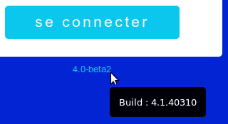
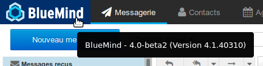
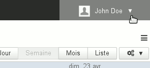
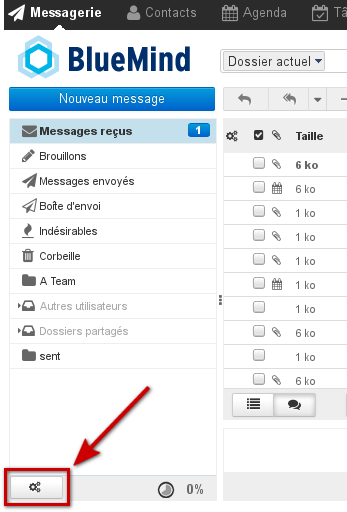
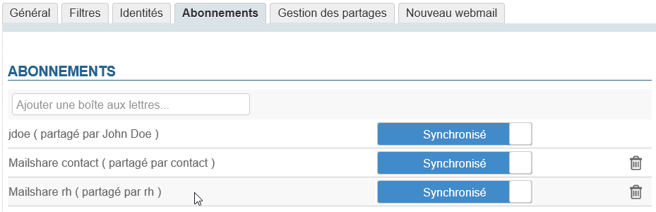
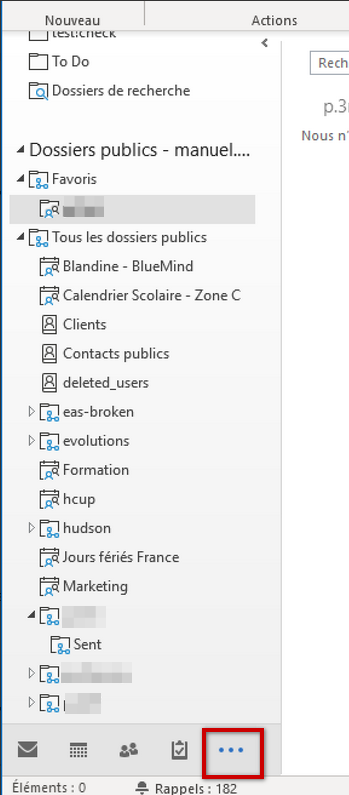

# FAQ (Häufig gestellte Fragen)


- [Allgemein](#FAQ-Allgemein)

    - [Wie erfahre ich, welche BlueMind-Version ich verwende?](#FAQ-Wieerfahreich,welcheBlueMind-Versionichverwende?)
    - [Welche Browser und welche Browserversionen werden von BlueMind unterstützt?](#FAQ-WelcheBrowserundwelcheBrowserversionenwerdenvonBlueMindunterstützt?)
    - [Welche Zeichen sind in Passwörtern erlaubt?](#FAQ-WelcheZeichensindinPasswörternerlaubt?)
    - [Wie funktioniert der Offline-Modus?](#FAQ-WiefunktioniertderOffline-Modus?)

- [E-Mail-System](#FAQ-E-Mail-System)

    - [Wie kann ich BlueMind zum Standardmanager für "mailto:"-Links machen?](#FAQ-WiekannichBlueMindzumStandardmanagerfür"mailto:"-Linksmachen?)
    - [Ungelesene Nachrichten in meinen Unterordnern werden nur angezeigt, wenn ich den Unterordner aufrufe.](#FAQ-UngeleseneNachrichteninmeinenUnterordnernwerdennurangezeigt,wennichdenUnterordneraufrufe.)
    - [Ich würde es vorziehen, UNTER der Nachricht, die ich beantworte, zu antworten.](#FAQ-Ichwürdeesvorziehen,UNTERderNachricht,dieichbeantworte,zuantworten.)
    - [Als neue Nachricht öffnen](#FAQ-AlsneueNachrichtöffnen)
    - [Ich möchte verschiedene Unterschriften verwenden, je nachdem, an wen ich schreibe.](#FAQ-IchmöchteverschiedeneUnterschriftenverwenden,jenachdem,anwenichschreibe.)
    - [Ich habe mein E-Mail-Kontingent erschöpft, aber ich kann keine E-Mails löschen, um die Auslastung zu verringern.](#FAQ-IchhabemeinE-Mail-Kontingenterschöpft,aberichkannkeineE-Mailslöschen,umdieAuslastungzuverringern.)
    - [Ich kann die Priorität der E-Mail-Nachrichten, die ich bekomme, nicht sehen.](#FAQ-IchkanndiePrioritätderE-Mail-Nachrichten,dieichbekomme,nichtsehen.)
    - [Meine freigegebenen Mailboxen erscheinen nicht in der Ordnerliste.](#FAQ-MeinefreigegebenenMailboxenerscheinennichtinderOrdnerliste.)
    - [Was ist der Remote-Inhalt einer Nachricht und warum lädt BlueMind ihn nicht?](#FAQ-WasistderRemote-InhalteinerNachrichtundwarumlädtBlueMindihnnicht?)

- [Instant Messaging](#FAQ-InstantMessaging)

    - [Ich sehe das Symbol für den Zugriff auf Instant Messaging nicht in BlueMind.](#FAQ-IchsehedasSymbolfürdenZugriffaufInstantMessagingnichtinBlueMind.)
    - [Ich kann nicht herausfinden, wie ich meinen Gesprächsverlauf löschen kann.](#FAQ-Ichkannnichtherausfinden,wieichmeinenGesprächsverlauflöschenkann.)
    - [Ich erhalte einen SSL-Fehler, wenn ich versuche, eine Verbindung zum XMPP-Server mit Thunderbird herzustellen.](#FAQ-IcherhalteeinenSSL-Fehler,wennichversuche,eineVerbindungzumXMPP-ServermitThunderbirdherzustellen.)

- [Mobilität](#FAQ-Mobilität)

    - [Beim Anlegen eines Kontos erhalte ich die Fehlermeldung "Nom d'utilisateur ou mot de passe incorrect" (Falscher Benutzername oder falsches Passwort).](#FAQ-BeimAnlegeneinesKontoserhalteichdieFehlermeldung"Nomd'utilisateuroumotdepasseincorrect"(FalscherBenutzernameoderfalschesPasswort).)
    - [Ich kann die Kontakte des globalen Adressbuchs/Verzeichnis nicht sehen.](#FAQ-IchkanndieKontaktedesglobalenAdressbuchs/Verzeichnisnichtsehen.)
    - [Ich kann einen meiner sekundären Kalender oder einen freigegebenen Kalender auf meinem Android-Smartphone nicht sehen.](#FAQ-IchkanneinenmeinersekundärenKalenderodereinenfreigegebenenKalenderaufmeinemAndroid-Smartphonenichtsehen.)
    - [Ich sehe auf meinem Handy einen Ordner nicht, der für mich freigegeben ist](#FAQ-IchseheaufmeinemHandyeinenOrdnernicht,derfürmichfreigegebenist)

- [Kalender](#FAQ-Kalender)

    - [Ich kann einen Kalender, der für mich freigegeben wurde, nicht sehen.](#FAQ-IchkanneinenKalender,derfürmichfreigegebenwurde,nichtsehen.)
    - [Ich sehe nur zwei Farben in der Zusammenfassung, obwohl mein Termin mehrere Markierungen hat.](#FAQ-IchsehenurzweiFarbeninderZusammenfassung,obwohlmeinTerminmehrereMarkierungenhat.)

- [Kontakte](#FAQ-Kontakte)

    - [Ich sehe nur zwei Farben in der Zusammenfassung, obwohl mein Kontakt mehrere Kategorien hat.](#FAQ-IchsehenurzweiFarbeninderZusammenfassung,obwohlmeinKontaktmehrereKategorienhat.)

- [Verwaltung](#FAQ-Verwaltung)

    - [Ich habe das Passwort für den Installationsassistenten verloren](#FAQ-swpasswordIchhabedasPasswortfürdenInstallationsassistentenverloren)
    - [Ich kann das Passwort für den Superadministrator admin0 nicht mehr finden.](#FAQ-IchkanndasPasswortfürdenSuperadministratoradmin0nichtmehrfinden.)
    - [Die geplanten Aufgaben werden nicht ausgeführt.](#FAQ-DiegeplantenAufgabenwerdennichtausgeführt.)
    - [Der eingegebene Benutzername für meinen neuen Benutzer ist ungültig.](#FAQ-DereingegebeneBenutzernamefürmeinenneuenBenutzeristungültig.)

- [Thunderbird](#FAQ-Thunderbird)

    - [Ich möchte den Browser-Cache von Thunderbird leeren.](#FAQ-IchmöchtedenBrowser-CachevonThunderbirdleeren.)

- [Outlook](#FAQ-outlookOutlook)

    - [Ich muss die Outlook-Protokolle abrufen.](#FAQ-outlook-logsIchmussdieOutlook-Protokolleabrufen.)
    - [Ich sehe meine freigegebenen Mailboxen nicht in Outlook, muss ich sie abonnieren?](#FAQ-IchsehemeinefreigegebenenMailboxennichtinOutlook,mussichsieabonnieren?)


## Allgemein

### Wie erfahre ich, welche BlueMind-Version ich verwende?

Die BlueMind-Version wird auf der Startseite der Anwendung angegeben, wenn Sie die Maus über die Versionsnummer ziehen, sehen Sie die Nummer der technischen Version:



Sobald Sie mit BlueMind verbunden sind, sehen Sie die beiden Nummern (öffentliche Version und technische Version), wenn Sie die Maus auf das Logo (BlueMind-Logo oder das Logo Ihrer Organisation) oben links in der Anwendung ziehen:



### Welche Browser und welche Browserversionen werden von BlueMind unterstützt?

Auf der Seite [Kompatibilität](/FAQ_Foire_aux_questions_/Compatibilité/) der Dokumentation werden die Versionen der Browser, aber auch der Fat Clients, der mobilen Geräten usw. sowie bekannte Einschränkungen angegeben.

### Welche Zeichen sind in Passwörtern erlaubt?

Passwörter können aus Groß- und Kleinbuchstaben, Ziffern und bestimmten Sonderzeichen bestehen. Ausgeschlossen sind insbesondere Akzentzeichen.

Zugelassen sind die [Zeichen der ASCII-Tabelle](https://fr.wikipedia.org/wiki/American_Standard_Code_for_Information_Interchange#Table_des_128_caract.C3.A8res_ASCII) mit Ausnahme von Steuerzeichen.

### Wie funktioniert der Offline-Modus?

#### Was ist der Offline-Modus?

Der Offline-Modus gestattet Ihnen, mit BlueMind weiterzuarbeiten, wenn die Internetverbindung willentlich (menügesteuert in Browsern, die dies erlauben, oder durch Abmelden des Computers) oder unfreiwillig (Netzwerkunterbrechung, abgezogenes Kabel usw.) unterbrochen wurde. Alle Eingaben (neuer Kontakt, Termin, Zustimmung zu einer Besprechung usw.) werden im Browser gespeichert. Sobald die Verbindung wiederhergestellt ist, werden die Daten mit dem Server synchronisiert und in BlueMind gespeichert.

#### Welche Anwendungen unterstützen den Offline-Modus?

Dieser Modus steht derzeit für die Anwendungen "Kontakte", "Kalender" und "Aufgaben" verfügbar.

#### Wie wird der Offline-Modus aktiviert?

Der Offline-Modus wird automatisch aktiviert, wenn der Browser die Verbindung mit dem Internet (willentlich oder unfreiwillig) trennt.

Wenn Sie offline sind, ist das persönliche Menü Ihrer Navigationsleiste ausgegraut, beim Ausklappen sehen Sie die Information *"Offline"* und die Links sind inaktiv:



#### Welche Browser sind kompatibel?

Der Offline-Modus ist für die Browser Firefox, Chrome und Safari verfügbar.

Da der Offline-Modus jedoch erfordert, dass Informationen direkt im Browser gespeichert werden können, ist er bei Browsern oder Browserversionen, die diese Technologie nicht unterstützen, nicht möglich (Firefox im privaten Modus, Internet Explorer, Edge).

## E-Mail-System

### Wie kann ich BlueMind zum Standardmanager für "mailto:"-Links machen?

"mailto:"-Links sind Links, die gestatten, die Oberfläche der Nachrichtenerstellung im Standard-Mailprogramm direkt zu öffnen.

So stellen Sie sicher, dass ein Klick auf diese Links, z. B. auf einer Webseite oder in einer E-Mail, die Nachrichtenerstellung von BlueMind öffnet:

- Rufen Sie die **erweiterten Einstellungen von BlueMind** auf: in der Verwaltung der Benutzereinstellungen > Abschnitt Email > Link "*Erweiterte Email-Einstellungen*".
- Klicken Sie im ersten Bereich "**Benutzeroberfläche**" auf den Link "*Als Empfänger für mailto: Links einrichten*".
- Bestätigen Sie die vom Browser angeforderte Autorisierung.


Für weitere Informationen siehe "[Erweiterte Einstellungen](/Guide_de_l_utilisateur/La_messagerie/Préférences_de_messagerie/Préférences_avancées/)".

### Ungelesene Nachrichten in meinen Unterordnern werden nur angezeigt, wenn ich den Unterordner aufrufe.

Um dieses Verhalten zu ändern und BlueMind zu zwingen, bei jeder Serverabfrage Nachrichten aus allen Ordnern und Unterordnern abzurufen, gehen Sie wie folgt vor:

- Rufen Sie die **erweiterten Einstellungen von BlueMind** auf: in der Verwaltung der Benutzereinstellungen > Abschnitt Email > Link "*Erweiterte Email-Einstellungen*".
- Aktivieren Sie im Bereich "**Mailbox-Ansicht**" das Kontrollkästchen "*Alle Ordner auf neue Nachrichten prüfen*".


Für weitere Informationen siehe "[Erweiterte Einstellungen](/Guide_de_l_utilisateur/La_messagerie/Préférences_de_messagerie/Préférences_avancées/)".

### Ich würde es vorziehen, UNTER der Nachricht, die ich beantworte, zu antworten.

Wenn Sie eine Antwort schreiben, wird das Zitat der ursprünglichen Nachricht standardmäßig unter Ihrer Antwort platziert. Um dieses Verhalten zu ändern und die ursprüngliche Nachricht an den Anfang der Mail zu stellen und die aktuelle Antwort danach zu platzieren, gehen Sie wie folgt vor:

- Rufen Sie die **erweiterten Einstellungen von BlueMind** auf: in der Verwaltung der Benutzereinstellungen > Abschnitt Email > Link "*Erweiterte Email-Einstellungen*".
- Wählen Sie im Abschnitt "**Nachrichtenerstellung**" unter "Allgemein" das gewünschte Verhalten aus der Liste unter "Beantworten einer Antwort" aus:
    - Antwort über der Originalnachricht
    - Antwort unter der Originalnachricht


Für weitere Informationen siehe "[Erweiterte Einstellungen](/Guide_de_l_utilisateur/La_messagerie/Préférences_de_messagerie/Préférences_avancées/)".

### Als neue Nachricht öffnen

Mit dieser Option können Sie eine Nachricht in der Nachrichtenerstellung so öffnen, dass sie als neue Nachricht (und nicht als Antwort oder Weiterleitung) angezeigt wird.

Um eine Nachricht auf diese Weise zu bearbeiten, gibt es mehrere Möglichkeiten:

1. Rechtsklick auf die Nachricht in der Liste > "Mehr..." > "Als neue Nachricht öffnen"
2. Nachricht in der Liste auswählen, auf das Menü "Mehr..." oberhalb der Nachrichtenliste klicken und "Als neue Nachricht öffnen“ auswählen


### Ich möchte verschiedene Unterschriften verwenden, je nachdem, an wen ich schreibe.

Hierfür müssen Sie mehrere "Identitäten" anlegen und für jede die gewünschte Unterschrift konfigurieren. Beim Senden einer Nachricht müssen Sie dann nur noch die gewünschte Identität als Empfänger auswählen und die entsprechende Unterschrift wird hinzugefügt.

Identitäten gestatten darüber hinaus die Anpassung des angezeigten Namens und des verwendeten E-Mail-Alias.

Weitere Informationen finden Sie auf der Seite "[Identitäten](/Guide_de_l_utilisateur/La_messagerie/Les_identités/)".

### Ich habe mein E-Mail-Kontingent erschöpft, aber ich kann keine E-Mails löschen, um die Auslastung zu verringern.

Beim Löschen einer E-Mail mit der Schaltfläche "Löschen“ oder der Taste "Entf“ der Tastatur wird die E-Mail in den Papierkorb verschoben und muss dafür in ein temporäres Verzeichnis kopiert werden. Wenn der Speicherplatz bereits erschöpft ist, ist das nicht mehr möglich.

Sie müssen in diesem Fall den kompletten Löschvorgang direkt durchführen: Wählen Sie die zu löschende(n) Nachricht(en) aus und verwenden Sie die Tastenkombination "Umschalt+Entf". Es erscheint eine Meldung, die Sie auffordert, das Löschen zu bestätigen.

Für weitere Informationen siehe [E-Mail-System](/Guide_de_l_utilisateur/La_messagerie/)

### Ich kann die Priorität der E-Mail-Nachrichten, die ich bekomme, nicht sehen.

Für die Anzeige der Priorität ist in der Nachrichtenliste eine Spalte vorgesehen, die nicht standardmäßig angezeigt wird. Diese Spalte wird wie folgt angezeigt:

- Klicken Sie auf die Schaltfläche "Listenoptionen" in Zahnradform oben links in der Nachrichtenliste.
- Aktivieren Sie das Kontrollkästchen "Priorität" in der Liste der Spalten.
- Klicken Sie zur Bestätigung auf „Speichern.


Hinweis: Die Spalte wird an letzter Stelle eingefügt.

Für weitere Informationen zur Organisation der Spalten siehe [E-Mail-System](/Guide_de_l_utilisateur/La_messagerie/) > Kapitel 4.1 - Spalten und Sortierung.

### Meine freigegebenen Mailboxen erscheinen nicht in der Ordnerliste.

Nach der Zuweisung der Berechtigungen eines Benutzers für eine freigegebene Mailbox kann es vorkommen, dass die Mailbox nicht in der Liste der Ordner dieses Benutzers erscheint. Das ist auf einen Anzeigefehler in der Webmailer-Engine Roundcube zurückzuführen.

Damit die Ordner angezeigt werden, müssen Sie nur das Menü der Ordneraktionen in der Ordnerliste anzeigen:



In der Regel reicht es aus, dieses Menü auf dem Bildschirm anzuzeigen, damit die gemeinsame Mailbox in der Liste erscheint; es ist keine Aktion mit diesem Menü erforderlich.

### Was ist der Remote-Inhalt einer Nachricht und warum lädt BlueMind ihn nicht?

Der Remote-Inhalt einer Nachricht ist ein Inhalt, der nicht in die Nachricht eingebettet ist, sondern über eine Internetverbindung geladen wird. Diese Inhalte können unterschiedlicher Art sein: Bilder, aber auch Videos, Stylesheets oder Skripte.

Diese Inhalte von unbekannten Absendern werden BlueMind standardmäßig nicht geladen, um Ihre Privatsphäre zu schützen. Denn durch diese Inhalte können ihre Ersteller auf verschiedene Informationen zuzugreifen, **die direkt mit Ihrer E-Mail-Adresse verbunden sind**: über das Lesen der Nachricht selbst (z.B. Datum und Uhrzeit des Lesens sowie die Anzahl der Aufrufe), über Ihre Umgebung (Betriebssystem, E-Mail-Software usw.) oder durch eine Lokalisierung anhand Ihrer IP. Das bloße Laden des Bildes zeigt an, dass die Nachricht erhalten wurde und liefert auf diesem Weg den einfachen aber wertvollen Hinweis, dass Ihre E-Mail-Adresse existiert und aktiv ist.

Standardmäßig vertraut BlueMind jedoch den Absendern in Ihrem Adressbuch: Der Remote-Inhalt von Nachrichten von diesen Adressen wird automatisch geladen, wenn die Nachricht angezeigt wird.

Eine Schaltfläche am oberen Rand einer Nachricht, deren Inhalt blockiert wurde, ermöglicht das Herunterladen nur für diese Nachricht. Um unabhängig vom Absender das Herunterladen der Remote-Inhalte für alle Nachrichten aktivieren möchten, gehen Sie zu den [erweiterten E-Mail-Voreinstellungen](/Guide_de_l_utilisateur/La_messagerie/Préférences_de_messagerie/Préférences_avancées/).

## Instant Messaging

### Ich sehe das Symbol für den Zugriff auf Instant Messaging nicht in BlueMind.

Wahrscheinlich wurde Instant Messaging in Ihrer Domain nicht aktiviert oder der Administrator hat den Zugriff auf bestimmte Benutzer beschränkt.

Wenden Sie sich an Ihren Administrator oder, wenn Sie selbst der Administrator sind, schlagen Sie in der [Dokumentation zur Domain-Verwaltung](/Guide_de_l_administrateur/Présentation_du_produit/Messagerie_multi_domaines/) nach, um Instant Messaging zu aktivieren.

### Ich kann nicht herausfinden, wie ich meinen Gesprächsverlauf löschen kann.

Das ist normal: Diese Funktion ist in Instant Messaging in BlueMind noch nicht verfügbar.

### Ich erhalte einen SSL-Fehler, wenn ich versuche, eine Verbindung zum XMPP-Server mit Thunderbird herzustellen.

Dies liegt an den DHE-Einstellungen, die von Thunderbird ab Version 38.0 verwendet werden.

#### Manuelle Lösung des Problems

Wählen Sie in Einstellungen > Erweitert > Konfiguration bearbeiten für die folgenden Parameter "wahr":


```
security.ssl3.dhe\_rsa\_aes\_128\_sha
security.ssl3.dhe\_rsa\_aes\_256\_sha
```


Wenn dann beim Verbindungsaufbau gemeldet wird, dass der Zertifikat-Aussteller der Gegenstelle nicht erkannt wurde, ist dies darauf zurückzuführen, dass das SSL-Zertifikat von BlueMind selbstsigniert ist. Validieren Sie die Verwendung des Zertifikats trotzdem.

#### Lösung des Problems per Plugin

Installieren Sie das folgende Add-on, das die Verwendung von DHE-Schlüsseln deaktiviert: [https://addons.mozilla.org/en-US/firefox/addon/disable-dhe/](https://addons.mozilla.org/en-US/firefox/addon/disable-dhe/).

## Mobilität

### Beim Anlegen eines Kontos erhalte ich die Fehlermeldung "Nom d'utilisateur ou mot de passe incorrect" (Falscher Benutzername oder falsches Passwort).

Wenn diese Meldung erscheint, obwohl die eingegebenen Server- und Benutzerinformationen korrekt sind, bedeutet das, dass Ihr Administrator keine Verbindungen von externen Geräten zugelassen hat.

Hierfür gibt es 2 Lösungen:

1. Der globale Administrator gestattet Synchronisierungen für die gesamte Domain über die Verwaltungskonsole > Gestion du système (Systemverwaltung) > Configuration système (Systemkonfiguration) > Registerkarte "Serveur EAS" (EAS-Server).
2. Der Administrator der Domain gestattet Synchronisierungen individuell über die Verwaltungskonsole > Entrées d'annuaire (Verzeichniseinträge) > Auswahl des Benutzers > Registerkarte "Périphérique" (Gerät).


Um sich anmelden zu können, müssen Sie sich also mit einem Ihrer Administratoren in Verbindung setzen.

Für weitere Informationen siehe den Leitfaden für Administratoren > [Benutzer](/Guide_de_l_administrateur/Gestion_des_entités/Utilisateurs/) oder [EAS-Server-Konfiguration](/Guide_de_l_administrateur/BlueMind_et_mobilité/Configuration_du_serveur_EAS/).

### Ich kann die Kontakte des globalen Adressbuchs/Verzeichnis nicht sehen.

In der Tat werden bei der Synchronisierung mit dem Exchange ActiveSync-Protokoll nur persönliche Adressbücher mit den Kontakten des Smartphones synchronisiert. Jedoch werden die Adressen in den anderen Adressbüchern (Globales Adressbuch/Verzeichnis, Gesammelte Kontakte usw.) mit den Suchfunktionen des Smartphones (Kontakte, E-Mails usw.) gefunden.

Weitere Informationen finden Sie auf der Seite für Ihr Gerät im Abschnitt [Synchronisierung externer Geräte](/Guide_de_l_utilisateur/Configuration_des_périphériques_mobiles/).

### Ich kann einen meiner sekundären Kalender oder einen freigegebenen Kalender auf meinem Android-Smartphone nicht sehen.

Da Android nicht gestattet, die verschiedenen Kalender mit unterschiedlichen Farben darzustellen, ist die Anzeige von anderen Kalendern als dem Standardkalender nicht möglich. Nur der Kalender des Benutzers erscheint und ist funktional.

Es ist jedoch möglich, die Funktion zu aktivieren, um sie mit einer Drittanwendung zu koppeln: [Mehrere Kalender auf Smartphones](/Base_de_connaissance/Multi_calendrier_sur_les_smartphones/) (siehe die bekannten Einschränkungen auf dieser Seite). Wenn diese Funktion von den Administratoren aktiviert wurde, können Benutzer ihre sekundären Kalender anzeigen. (Durch Benutzer oder die Domain) freigegebene Kalender bleiben unsichtbar.

### Ich sehe auf meinem Handy einen Ordner nicht, der für mich freigegeben ist

Um von einem Telefon aus auf freigegebene Ordner zuzugreifen, müssen Sie die Ordner zunächst [abonnieren](/Guide_de_l_utilisateur/La_messagerie/Préférences_de_messagerie/#Preferencesdemessagerie-abonnements). Unter Android werden sie jedoch möglicherweise nicht sofort angezeigt.

Um sie anzuzeigen, können Sie die Synchronisierung von Ordnern folgendermaßen erzwingen:

1. Gehen Sie zu den **Telefoneinstellungen** (nicht zu den Einstellungen der Mail-Anwendung)
2. Gehen Sie zur Kontoverwaltung. Hinweis: Der Name dieses Abschnitts ist von Gerät zu Gerät unterschiedlich: „Konten“, „Konten & Benutzer“, usw.
3. Wählen Sie das Konto, das der BlueMind-Synchronisierung entspricht
4. Gehen Sie zu den Synchronisationseinstellungen
5. Drücken Sie *„Jetzt synchronisieren“* Hinweis: Je nach Modell ist diese Aktion per Direktzugriff oder in einem *Sandwich-Menü* verfügbar (drei Punkte oder drei Striche am oberen Bildschirmrand)


Warten Sie das Ende der Synchronisationen ab. Ihre abonnierten geteilten Ordner sollten nun in der Mail-Anwendung unter *Öffentlicher Ordner* erscheinen.

## Kalender

### Ich kann einen Kalender, der für mich freigegeben wurde, nicht sehen.

Standardmäßig werden in der Kalenderansicht des Benutzers nur folgende Kalender angezeigt:

- seine Kalender
- Domain-Kalender


Um einen anderen Kalender anzuzeigen, müssen Sie ihn wie folgt abonnieren:

- Rufen Sie die Verwaltung der Benutzereinstellungen > Kalender > Registerkarte "Abonnements" auf.
- Suchen Sie den gewünschten Kalender über das Eingabefeld "Kalender hinzufügen".
- Wählen Sie den von der automatischen Vervollständigung vorgeschlagenen Kalender aus.
- Bestätigen Sie mit der Schaltfläche "Speichern".


Für weitere Einzelheiten siehe [Einstellungen für den Kalender](/Guide_de_l_utilisateur/L_agenda/Préférences_de_l_agenda/).

### Ich sehe nur zwei Farben in der Zusammenfassung, obwohl mein Termin mehrere Markierungen hat.

Aus Gründen der Lesbarkeit der Anzeige wird der Termin im Kalender nur mit maximal zwei Farben dargestellt.
Wenn Sie die Maus über die farbige Miniaturansicht ziehen, werden jedoch alle Kategorien im Tooltip aufgelistet.

Für weitere Details siehe "[Kategorien (Tags)](/Guide_de_l_utilisateur/Les_catégories_tags_/)".

## Kontakte

### Ich sehe nur zwei Farben in der Zusammenfassung, obwohl mein Kontakt mehrere Kategorien hat.

Aus Gründen der Lesbarkeit der Anzeige wird die Zusammenfassung der Kontaktkarte nur mit maximal zwei Farben dargestellt.
Wenn Sie die Maus über die farbige Miniaturansicht ziehen, werden jedoch alle Kategorien im Tooltip aufgelistet.

Für weitere Details siehe "[Kategorien (Tags)](/Guide_de_l_utilisateur/Les_catégories_tags_/)".

## Verwaltung

### Ich habe das Passwort für den Installationsassistenten verloren

Dieses Passwort wird unter anderem benötigt, um BlueMind mit dem Installationsassistenten (url http://&lt;Ihr.[server.com>/setup )](http://votre.serveur.com) zu aktualisieren, für den das Passwort bei der [Installation von BlueMind](/Guide_d_installation/Configuration_post_installation/) bereitgestellt wurde.

Im Falle eines Verlusts kann das Passwort für den Installationsassistenten über die Verwaltungskonsole oder die Befehlszeile geändert werden:

1. Wenn Sie noch Zugriff auf die Konsole haben, melden Sie sich als globaler Administrator admin0 an und rufen Sie Gestion du système (Systemverwaltung) > Configuration système (Systemkonfiguration) > Registerkarte "Serveur Mandataire" (Proxy-Server) auf:Geben Sie das neue Passwort ein und speichern Sie.
2. Wenn Sie nicht mehr auf die Konsole zugreifen können, verwenden Sie die Befehlszeile:
    - Melden Sie sich als root auf dem Hauptserver an und geben Sie folgende Zeile ein:


```
rm -f /etc/nginx/sw.htpasswd; htpasswd -b -c /etc/nginx/sw.htpasswd admin admin
```


    - Verbinden Sie sich mit der URL */setup* und verwenden Sie das Login und Passwort admin/admin.** **Dieser Schritt ist zwingend erforderlich, auch wenn Sie sich noch dabei sind, BlueMind zu aktualisieren.** **


### Ich kann das Passwort für den Superadministrator admin0 nicht mehr finden.

Ab BlueMind 3.5.11 können Sie [mit dem Administrationstool für die Befehlszeile (CLI)](/Guide_de_l_administrateur/Administration_avancée/Client_CLI_pour_l_administration/) ein Passwort konfigurieren, ohne dass Sie das Passwort für admin0 kennen müssen.

Geben Sie dazu nach der Installation des Tools den folgenden Befehl ein:


```
bm-cli user update admin0@global.virt --password "NewPassword"
```


### Die geplanten Aufgaben werden nicht ausgeführt.

Dieses Problem ist symptomatisch für eine Aktualisierung, bei der das Paket bm-setup-wizard deinstalliert wurde.

Um dies festzustellen, darf der folgende Befehl nichts zurückgeben:


```
dpkg -l | grep bm-setup
```


Wenn das Paket nicht angezeigt wird, installieren Sie es.

Wenn das Paket vorhanden ist, wenden Sie sich an den BlueMind-Support oder bitten Sie über das Forum um Hilfe.

### Der eingegebene Benutzername für meinen neuen Benutzer ist ungültig.

Bei der Erstellung des Benutzernamens eines neuen Benutzers sind folgende Regeln zu beachten:

- Die maximale Länge beträgt 64 Zeichen.
- Zugelassen sind folgende Zeichen:
    - Kleinbuchstaben von a bis z
    - Ziffern von 0 bis 9
    - Folgende Sonderzeichen: . (Punkt), - (Bindestrich), _ (Unterstrich)
- Der Benutzername darf nicht mit einem Sonderzeichen beginnen.


## Thunderbird

### Ich möchte den Browser-Cache von Thunderbird leeren.

Wenn das Zurücksetzen des Connectors nicht ausreicht, um Anzeigeprobleme zu lösen oder sogar mit einem in den Protokollen sichtbaren Fehler scheitert, ist es möglich, den Cache wie folgt manuell zurückzusetzen:

- öffnen Sie die Kalender-Registerkarte von Thunderbird
- gehen Sie zu Tools > Aktuellen Verlauf löschen
- wählen Sie „Alle“ im Dropdown-Menü und aktivieren Sie alle Kästchen
- klicken Sie auf „Jetzt löschen“
- schließen Sie die Kalender-Registerkarte von Thunderbird und öffnen Sie sie erneut


## Outlook


:::tip

Für eine eingehendere Untersuchung und Lösung von Problemen mit Outlook verweisen wir Sie auf unseren speziellen Leitfaden. [Behebung von Fehlern mit Outlook](/Guide_de_l_administrateur/Résolution_de_problèmes/Résolution_des_problèmes_avec_Outlook/)

:::

### Ich muss die Outlook-Protokolle abrufen.

**Auf der Seite der Client-Software** sind eventuelle Meldungen direkt in der Outlook-Oberfläche im Ordner "Synchronisationsprobleme“ zu finden.

**Serverseitig** sind 2 Dateien aufzurufen:

1. das allgemeine Log `/var/log/bm-mapi/mapi.log`
2. das Aktivitätslog `/var/log/bm-mapi/activities.log`


### Ich sehe meine freigegebenen Mailboxen nicht in Outlook, muss ich sie abonnieren?

Die Version 4.3 von BlueMind ermöglicht, dank einer Abonnementfunktion, die mit der für Kalender und Adressbücher identisch ist, die Anzeige von freigegebenen Mailboxen in Outlook-Clients, die mit MAPI angebunden sind.

Um eine freigegebene Mailbox in Outlook anzuzeigen, müssen Sie daher zunächst:

- eine Online-Verbindung mit BlueMind herstellen,
- Mein Konto > Email > Registerkarte "Abonnements" aufrufen,
- die freigegebene Mailbox über das Eingabefeld suchen und sie Ihren Abonnements hinzufügen:


*Weitere Details finden Sie im entsprechenden Abschnitt auf der Seite [Geteilte Posteingänge 5. Abonnements und Software von Drittanbietern](/Guide_de_l_utilisateur/La_messagerie/Les_boites_aux_lettres_partagées/#Lesboitesauxlettrespartagees-abonnements)*

Öffentliche Ordner finden Sie, indem Sie auf die Auslassungspunkte am unteren Ende der Baumstruktur klicken:



Speichern

Speichern

Speichern

Speichern

Speichern

Speichern

