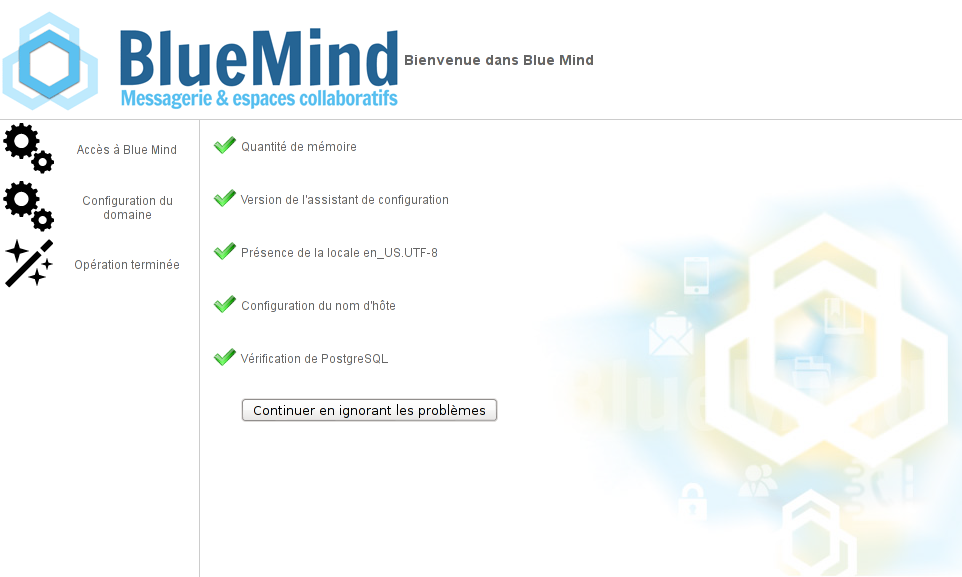
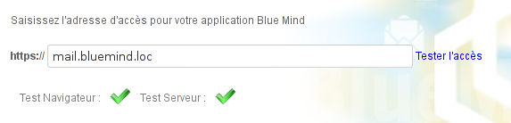
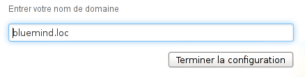
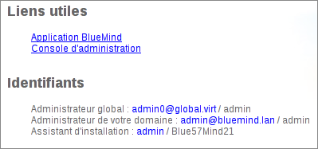
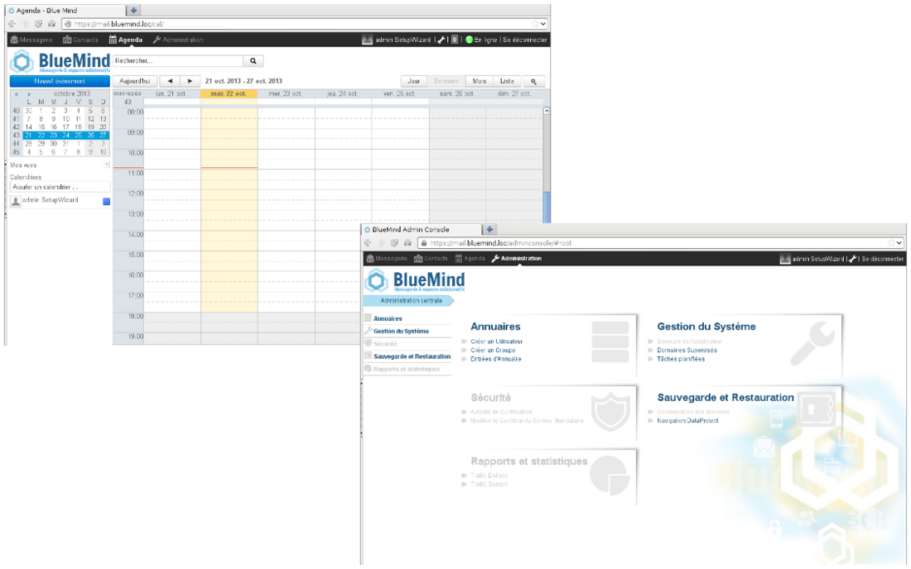

# Konfiguration nach der Installation


## Präsentation


## Verfahren

Nachdem[BlueMind auf der Linux-Distribution installiert](/Guide_d_installation/Installation/) wurde, den Webbrowser zum Abrufen der ursprünglichen BlueMind-Konfigurationsseite verwenden: ** https://votre.serveur.mail/setup ** (unbedingt https und nicht http eingeben)

Lassen Sie sich nun vom Installationsassistenten führen:

**  **


1. ** **Überprüfung der Voraussetzungen:** ** ** ** **  ** ** **


:::info

Eine Warnmeldung kann angezeigt werden, wenn dem Server der minimal benötigte Speicher zugewiesen wurde. Diese Meldung ist nicht blockierend und die Installation kann fortgesetzt werden.

Wenn ein Problem die Installation blockiert, wird eine Fehlermeldung in roter Farbe angezeigt und die Schaltfläche „Weiter“ ist nicht verfügbar.

:::
** ** ** **

2. ** **Zugangs-URL zu Ihrem BlueMind:** ** geben Sie die öffentliche Zugriffs-Url auf BlueMind ein und klicken Sie auf „Zugriff testen“, um zu bestätigen, die Schaltfläche „weiter“ wird aktiviert, wenn alle Tests erfolgreich sind**:** **  **
3. ** **E-Mail-Domänenname** ** **:** **  **
4. **Die Installation wird abgeschlossen** und zeigt die Verbindungsinformationen der Anwendung an:

5. Starten Sie den BlueMind-Dienst über die Befehlszeile neu:


```
bmctl restart
```


:::info

Passwörter sichern!

Achtung, die Passwörter für den admin (hier [admin@bluemind.lan](mailto:admin@bluemind.lan)) und admin0 ([admin0@global.virt](mailto:admin0@global.virt)) ) müssen bei einer Installation in Produktion unbedingt geändert werden.

Über ungesicherte Passwörter könnte auf **alle Daten auf Ihrem Server zugegriffen** oder über den SMTP-Dienst könnten **SPAM** von Ihrem Server aus gesendet werden.


:::



## Abonnement

Wenn Sie über ein [BlueMind-Abonnement](/Guide_de_l_administrateur/La_souscription_BlueMind/) verfügen, müssen Sie es jetzt [installieren,](/Guide_d_installation/Mise_en_œuvre_de_la_souscription/) um die damit verbundenen Tools und die [Outlook-Anbindung nutzen zu können](/Guide_de_l_administrateur/La_souscription_BlueMind/Mise_en_œuvre_de_MAPI_pour_Outlook/).


:::tip

Damit bestimmte Personen Informationen über die Benutzer sehen können, die das Fälligkeitsdatum des Abonnements überschreiten oder sich diesem nähern, vergessen Sie nicht, [ihnen die entsprechende Verwaltungsrolle zuzuweisen](/Guide_d_installation/Mise_en_œuvre_de_la_souscription/#Miseenoeuvredelasouscription-attr-role).

:::

## Zusätzliche Komponenten

Einige zusätzliche Komponenten sind nicht standardmäßig in der BlueMind-Installation enthalten und erfordern die Installation von zusätzlichen Paketen.

### Abtrennen von Anlagen

BlueMind bietet die Möglichkeit, [Anlagen von Nachrichten abzutrennen,](/Guide_de_l_utilisateur/La_messagerie/Fichiers_volumineux_et_détachement_des_pièces_jointes/) um sie den Empfängern als Download-Link zu präsentieren.

Weitere Informationen zur Installation und Konfiguration finden Sie unter [Verwaltung des Abtrennens von Anlagen](/Guide_de_l_administrateur/Configuration/Detachement_des_pieces_jointes/).

### TRP Import

Um den Import von Benutzern und Gruppen aus einem LDAP-Verzeichnis zu implementieren, siehe die Seite [LDAP-Synchronisation](/Guide_de_l_administrateur/Gestion_des_entites/Synchronisation_LDAP/)

### Komponenten, die mit einem Abonnement verfügbar sind

Das BlueMind-Abonnement bietet Zugriff auf zusätzliche Tools und Funktionen:

- das ActiveDirectory-Importtool


Weitere Informationen finden Sie auf der Seite [Implementierung des Abonnements](/Guide_d_installation/Mise_en_œuvre_de_la_souscription/)

## Dimensionierung

Nach Abschluss der Installation sollten zur Optimierung der Funktionsfähigkeit von BlueMind einige Parameter entsprechend Ihrer Hardware und der Anzahl der Benutzer angepasst werden, insbesondere:

- die Anzahl der IMAP-Prozesse: wird in der Administrationskonsole eingestellt, siehe die Seite über [Systemkonfiguration](/Guide_de_l_administrateur/Configuration/Configuration_système/) - Kapitel 1.2: Cyrus
- die Anzahl der *nginx-Workers*: wird in der Verwaltungskonsole eingestellt, siehe die Seite über [Systemkonfiguration](/Guide_de_l_administrateur/Configuration/Configuration_système/) - Kapitel 2: Proxy-Server


## Datenübernahme

Um eine vollständige und erfolgreiche Datenübernahme zu gewährleisten, muss die Datenübertragung von Server zu Server mit Exporten / Importen und Datenübertragungstools durchgeführt werden.

Jegliche Datenübertragung durch Benutzer oder von Fat-Clients (Outlook, Thunderbird) kann aufgrund des Datenvolumens dieser Fat-Clients problematisch sein und zu Inkonsistenzen in den Benutzerdaten auf der neuen BlueMind-Instanz führen.

Wir empfehlen daher:

- Kontakte: Exporte und Importe VCard
- Termine: Exporte / Importe ICS
- E-Mails: je nach Quellserver, imapSync, Exchange oder Domino Recovery Tool.


Bitte wenden Sie sich an BlueMind oder Ihren BlueMind-Partner, um Unterstützung bei diesen Datenübertragungen zu erhalten.


:::info

TRP Import

Zur Erinnerung: in 4.0, wie auch in 3.5, ist die Datenübertragung durch PST-Import aus Outlook zu vermeiden.

:::


