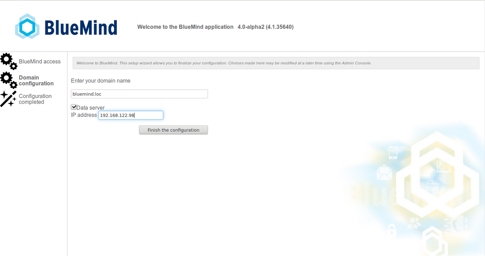
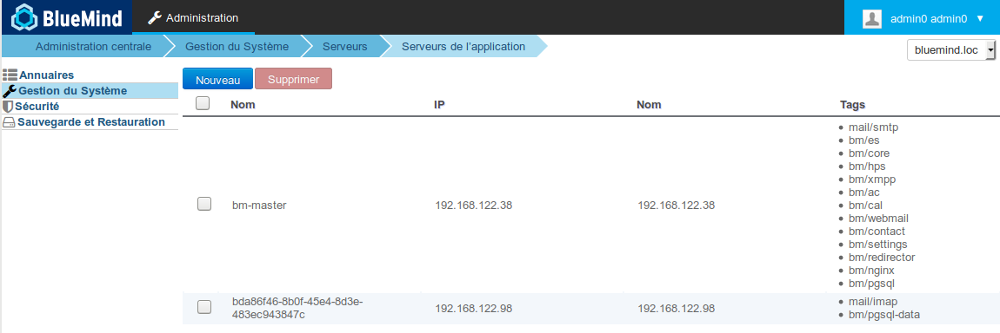
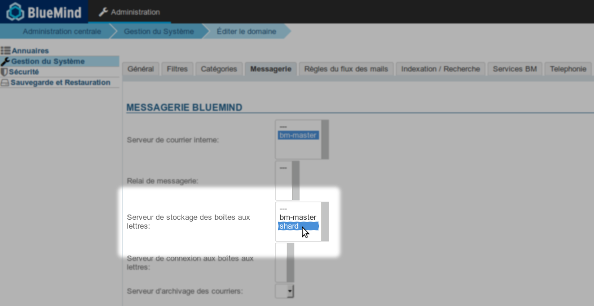

# Installation mit Datenverteilung auf mehrere Server


## Präsentation

BlueMind 4.0 ermöglicht neben der Verteilung der Benutzer-E-Mails auch die Verteilung aller Benutzerdaten auf mehrere Server, die nun neben Cyrus auch eine Datenbank enthalten.

Wenn der Administrator beschließt, die Daten eines Benutzers auf einem Server abzulegen, werden nicht nur seine Nachrichten auf diesem Server abgelegt, sondern auch alle Daten dieses Benutzers in der Datenbank dieses Servers (Kontakte, Termine, Einstellungen usw.).


## Installation

### Voraussetzungen

Sie haben 2 Rechner mit einem unterstützten Betriebssystem [und auf dem neuesten Stand installiert](/Guide_d_installation/Prérequis_à_l_installation/):

- Hauptrechner auf dem BlueMind installiert wird
- sekundärer Rechner, der als Speicherserver für Benutzerdaten dienen soll


:::tip

Die Daten können auf mehrere Speicherserver verteilt werden und die Vorbereitung des Speicherservers ist auf jedem von ihnen zu wiederholen.

Dies kann vor oder nach der Installation des Hauptservers erfolgen, die Reihenfolge spielt keine Rolle.

:::

### Verfahren

#### Vorbereitung des Speicherservers

Auf dem sekundären Server, der für den Datenempfang bereit ist:

1. Ablegen des Abonnements in `/etc/apt/sources.list.d/bm.list`
2. Installation des Pakets `bm-mailbox-role`:


```
aptitude install bm-mailbox-role
```

Entsprechend den in Ihrem System bereits installierten Paketen kann die folgende Meldung erscheinen:


****
 Expand source


```
root@shard:~# aptitude install bm-mailbox-role
The following NEW packages will be installed: 
  bm-conf{a} bm-cyrus{a} bm-cyrus-imapd{a} bm-jdk{a} bm-lmtpd{a} bm-mailbox-role bm-maintenance-snzip{a} bm-maintenance-tools{a} bm-milter{a} bm-node{a} bm-pimp{a} bm-postfix{ab} 
  bm-postgresql{a} bm-tika{a} bm-ysnp{a} db-util{a} db5.3-util{a} emacs25-bin-common{a} emacs25-common{a} emacs25-el{a} emacs25-nox{a} emacsen-common{a} iftop{a} keyutils{a} 
  libasound2{a} libasound2-data{a} libgnutls-openssl27{a} libgpgme11{a} libjansson4{a} liblockfile-bin{a} liblockfile1{a} libnfsidmap2{a} libpq5{a} libsensors4{a} libtirpc1{a} 
  libtokyocabinet9{a} libxi6{a} libxrender1{a} libxtst6{a} mutt{a} nfs-common{a} pgdg-keyring{a} postfix{ab} postgresql-9.6{a} postgresql-client-9.6{a} postgresql-client-common{a} 
  postgresql-common{a} postgresql-contrib-9.6{a} rpcbind{a} sasl2-bin{a} ssl-cert{a} ssmtp{ab} sysstat{a} x11-common{a} 
0 packages upgraded, 54 newly installed, 0 to remove and 0 not upgraded.
Need to get 356 MB of archives. After unpacking 706 MB will be used.
The following packages have unmet dependencies:
 ssmtp : Est en conflit avec: mail-transport-agent which is a virtual package, provided by:
                              - postfix (3.3.0-1ubuntu0.2), but 3.3.0-1ubuntu0.2 is to be installed
                              - exim4-daemon-light (4.90.1-1ubuntu1.1), but it is not going to be installed
                              - exim4-daemon-heavy (4.90.1-1ubuntu1.1), but it is not going to be installed
                              - ssmtp (2.64-8ubuntu2), but 2.64-8ubuntu2 is to be installed
                              - sendmail-bin (8.15.2-10), but it is not going to be installed
                              - qmail-run (2.0.2+nmu1), but it is not going to be installed
                              - opensmtpd (6.0.3p1-1build1), but it is not going to be installed
                              - nullmailer (1:2.1-5), but it is not going to be installed
                              - msmtp-mta (1.6.6-1), but it is not going to be installed
                              - masqmail (0.3.4-1build1), but it is not going to be installed
                              - lsb-invalid-mta (9.20170808ubuntu1), but it is not going to be installed
                              - esmtp-run (1.2-15), but it is not going to be installed
                              - dma (0.11-1build1), but it is not going to be installed
                              - courier-mta (0.78.0-2ubuntu2), but it is not going to be installed
                              - citadel-server (917-2), but it is not going to be installed
                              - postfix (3.3.0-1), but 3.3.0-1ubuntu0.2 is to be installed
                              - exim4-daemon-light (4.90.1-1ubuntu1), but it is not going to be installed
                              - exim4-daemon-heavy (4.90.1-1ubuntu1), but it is not going to be installed

 postfix : Est en conflit avec: mail-transport-agent which is a virtual package, provided by:
                                - postfix (3.3.0-1ubuntu0.2), but 3.3.0-1ubuntu0.2 is to be installed
                                - exim4-daemon-light (4.90.1-1ubuntu1.1), but it is not going to be installed
                                - exim4-daemon-heavy (4.90.1-1ubuntu1.1), but it is not going to be installed
                                - ssmtp (2.64-8ubuntu2), but 2.64-8ubuntu2 is to be installed
                                - sendmail-bin (8.15.2-10), but it is not going to be installed
                                - qmail-run (2.0.2+nmu1), but it is not going to be installed
                                - opensmtpd (6.0.3p1-1build1), but it is not going to be installed
                                - nullmailer (1:2.1-5), but it is not going to be installed
                                - msmtp-mta (1.6.6-1), but it is not going to be installed
                                - masqmail (0.3.4-1build1), but it is not going to be installed
                                - lsb-invalid-mta (9.20170808ubuntu1), but it is not going to be installed
                                - esmtp-run (1.2-15), but it is not going to be installed
                                - dma (0.11-1build1), but it is not going to be installed
                                - courier-mta (0.78.0-2ubuntu2), but it is not going to be installed
                                - citadel-server (917-2), but it is not going to be installed
                                - postfix (3.3.0-1), but 3.3.0-1ubuntu0.2 is to be installed
                                - exim4-daemon-light (4.90.1-1ubuntu1), but it is not going to be installed
                                - exim4-daemon-heavy (4.90.1-1ubuntu1), but it is not going to be installed

 bm-postfix : Est en conflit avec: ssmtp but 2.64-8ubuntu2 is to be installed
The following actions will resolve these dependencies:

     Keep the following packages at their current version:
1)     ssmtp [Not Installed]                              


Accept this solution? [Y/n/q/?] Y
```


 „Y“ eingeben und Eingabetaste drücken, um die Lösung zu akzeptieren, die darin besteht, ssmtp nicht zu installieren, um das von BlueMind benötigte Postfix installieren zu können


#### Installation und Konfiguration von BlueMind

Auf dem Hauptrechner:

1. [BlueMind installieren](/Guide_d_installation/Installation/)
2. aktivieren Sie während der [Arbeit des Einrichtungsassistenten](/Guide_d_installation/Configuration_post_installation/) beim Schritt „Domänenkonfiguration“ das Kontrollkästchen „Datenserver“ und geben Sie die IP des Speicherservers ein: 
3. Installation fortsetzen
4. Anmeldung bei BlueMind als Superadministrator admin0
5. Gehen Sie zu Systemverwaltung > Anwendungsserver: Der sekundäre Server muss angezeigt werden und die Tags mail/imap und bm/pgsql-data haben:
 


:::tip

In diesem Stadium ist der Name des Servers ein generierter Name, Sie können ihn in seinem Verwaltungsdatensatz ändern, der durch Klicken auf die entsprechende Zeile zugänglich ist:


:::
Im Verwaltungsdatensatz ist auf der Registerkarte „Rollen“ die Rolle „Benutzerdaten“ aktiviert.

6. Gehen Sie zu Systemverwaltung > Überwachte Domänen > wählen Sie die Domäne aus > Registerkarte Mailbox: der Server ist als Speicherserver ausgewählt: 


Der Server ist bereit, die Daten zu empfangen.


