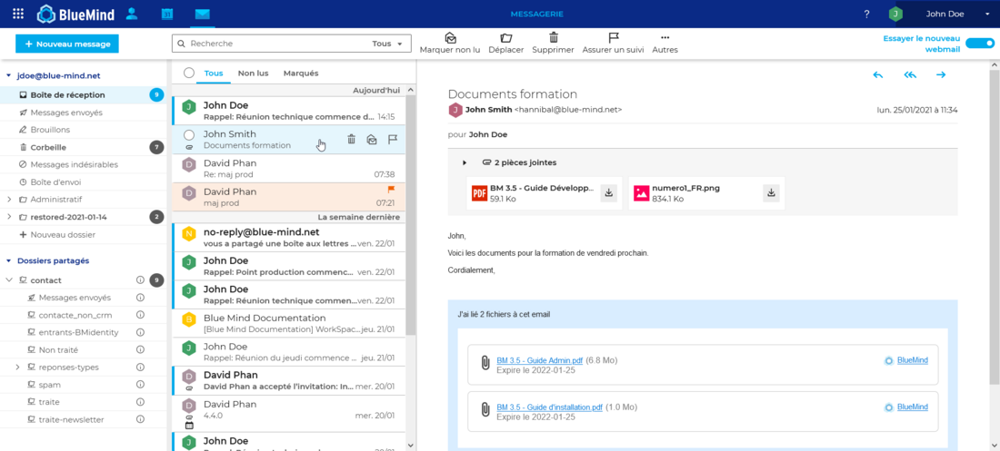
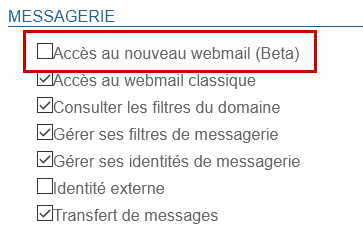

# Den neuen E-Mail-Client installieren


## Präsentation

Ab BlueMind Version 4.4 kann das neue BlueMind-Webmail installiert werden, um Ihren Benutzern einen Test anzubieten.




## Installation

Da der BlueMind-Mail-Client nicht standardmäßig installiert ist, müssen die 2 speziellen Pakete installiert werden:


**
Debian/Ubuntu


**
RedHat/CentOS


```
apt install bm-plugin-core-mailapp bm-mail-app
```


```
yum install bm-plugin-core-mailapp bm-mail-app
```


Der *Core*-Dienst muss neu gestartet werden:


```
service bm-core restart
```


:::info

Achtung, dieser Vorgang unterbricht kurzzeitig den Zugriff auf BlueMind und kann dazu führen, dass Benutzer ihre laufende Arbeit verlieren. Der Dienst muss daher zu einem Zeitpunkt neu gestartet werden, der keine Störung bei den Benutzern verursacht.

:::

## Bereitstellung

Der Zugriff auf den Webmail-Test ist [rollenbasiert](/Guide_de_l_administrateur/Gestion_des_entites/Utilisateurs/Les_rôles_droits_d_accès_et_d_administration/), d.h. er kann über die Verwaltung der Benutzer- oder Gruppenrollen allen Benutzern oder nur einigen davon ermöglicht werden.

Sobald die entsprechenden Pakete installiert sind, ist eine neue Rolle im Bereich „Messaging“ verfügbar:



Dank dieser Rolle und der folgenden Rolle „Zugriff auf klassisches Webmail“ kann der Administrator die Verwendung eines der beiden E-Mail-Clients erzwingen oder aber den Benutzer wählen lassen, indem er beide aktiviert.

Im letzteren Fall hat der Benutzer eine Schaltfläche in seiner Oberfläche, mit der er zwischen den Clients wechseln kann:


Der Benutzer kann den Wechsel auch über die Verwaltung seiner Parameter, Rubrik Messaging, vornehmen:


:::tip

Bei Problemen mit dem Wechsel zum klassischen E-Mail-Client kann der Administrator ihn deaktivieren, indem er die Rolle deaktiviert: bei seiner nächsten Anmeldung wird der Benutzer automatisch zum klassischen Webmail geleitet.

:::


