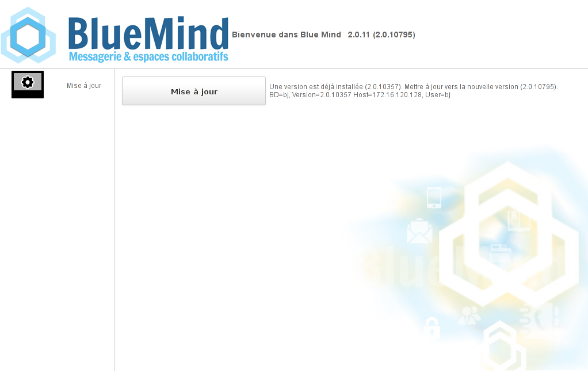
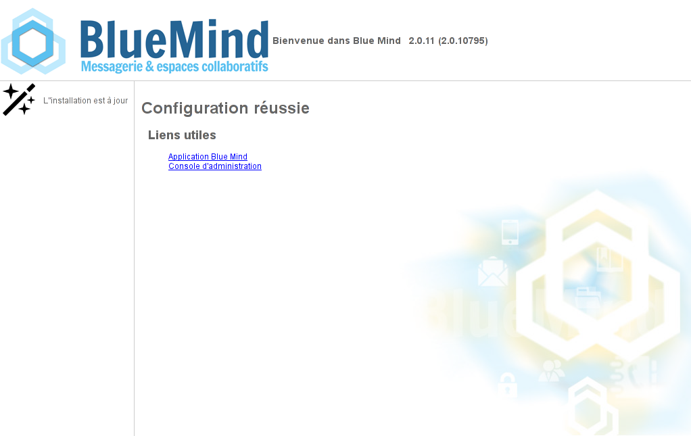

# BlueMind-Aktualisierung


:::info

Sicherung des gesamten Systems

BlueMind bemüht sich, die Zuverlässigkeit der Aktualisierungen zu gewährleisten. Niemand ist jedoch vor ungeprüften Sonderfällen oder externen Faktoren gefeit, die zu Datenverlusten führen können. BlueMind übernimmt keine Haftung, wenn ein Update fehlschlägt und ein installiertes System beschädigt.

Es liegt in Ihrer Verantwortung, sich gegen dieses Risiko zu versichern, indem Sie ein vollständiges Backup Ihres Systems erstellen.

:::


:::info

Aktualisierung der Linux-Distribution

**Das Upgrade Ihrer Linux-Distribution auf eine höhere Hauptversion (Debian 7 auf Debian 8 usw.) darf nicht mit den automatischen Mechanismen zur Aktualisierung von Distributionen (Wechsel der Paketquellen und Verwendung des Befehls aptitude dist-upgrade) durchgeführt werden. In der Tat können BlueMind-Abhängigkeiten geändert und die ordnungsgemäße Funktion von BlueMind-Diensten kann beeinträchtigt werden.**

**Für eine Hauptversion-Aktualisierung wenden Sie sich bitte an Ihren Integrator oder kontaktieren Sie uns über unsere Ticket-Plattform.**

:::


:::info

Neu 4.1: Vorbereitung der Aktualisierung

Ab BlueMind 4.1 ist die Aktualisierung über die Administrationskonsole (Systemverwaltung > BlueMind-Aktualiserung) vorzubereiten, bevor Pakete mit aptitude aktualisiert werden. Dieser zusätzliche Schritt ermöglicht es dem Administrator, sein System einfach zu aktualisieren, ohne notwendigerweise BlueMind zu aktualisieren.

Für weitere Details werden die Administratoren gebeten, besonders auf den nachstehenden Abschnitt [3.1 Vorbereitung der Aktualisierung](#MiseajourdeBlueMind-prepare-install) zu achten.

:::

## Präsentation

Das BlueMind-Abonnement bringt ein vereinfachtes und getestetes Aktualiserungssystem mit sich.

Das Upgrade von BlueMind auf eine höhere korrigierende oder evolutionäre Version ist dann dank des grafischen Administrationstools einfacher, sicherer und schneller.


:::info

Änderung der Hauptversion: Migration 3.5 auf 4.0

Die Aktualisierung von BlueMind bei Änderung der Hauptversion (z. B. von **v2.x auf v3.x oder von v3.0.x auf v3.5**.x) erfordert eine Änderung der Software-Depot-Adressen. Die Abonnementdatei muss daher aktualisiert werden, um den Versionswechsel durchzuführen.

:::

## Voraussetzung

### Abonnement

Um auf die BlueMind-Aktualisierungstools zuzugreifen, ist es erforderlich, ein [gültiges Abonnement](/Guide_de_l_administrateur/La_souscription_BlueMind/)zu besitzen und zu installieren.

### Zugriff auf den Installationsassistenten

Um die Aktualisierung durchzuführen, ist es notwendig, den Installationsassistenten (url&lt;votre.serveur.com>http:///setup )&lt;/votre.serveur.com> aufzurufen&lt;votre.serveur.com>, für den das Passwort bei der [Installation von BlueMind](/Guide_d_installation/Configuration_post_installation/)&lt;/votre.serveur.com> angegeben wurde.

Bei Verlust kann dieses Passwort auf 2 Arten zurückgesetzt werden:

1. Rufen Sie vor der Installation die Administrationskonsole als globaler Administrator admin0 > Systemverwaltung > Systemkonfiguration > Registerkarte „Proxy-Server“ auf:geben Sie das neue Passwort ein und registrieren Sie sich.
2. Die Änderung kann auch auf der Befehlszeile vorgenommen werden:
    - verbinden Sie sich als root mit dem BlueMind-Server und geben Sie die folgende Zeile ein:


```
rm -f /etc/nginx/sw.htpasswd; htpasswd -b -c /etc/nginx/sw.htpasswd admin admin
```


    - verbinden Sie sich mit der URL */setup* und verwenden Sie das Login und Passwort admin/admin** **Dieser Schritt ist zwingend erforderlich, auch wenn Sie sich noch nicht in der BlueMind-Aktualisierungsphase befinden.** **


### Unterschrift der Depots

Depots sind nun für alle unterstützten Ubuntu/Debian-Verteilungen signiert.

Diese Unterschrift ist erforderlich für von BlueMind 3.5.9 unterstützte Ubuntu 18.04 und Debian 9.

Falls notwendig oder erwünscht, kann der Schlüssel auf allen von uns unterstützten Verteilungen manuell über den folgenden Befehl importiert werden:


```
curl https://pkg.bluemind.net/bluemind-deb.asc | apt-key add -
```


Andernfalls kann bei der Aktualisierung bestimmter Vorgängerversionen eine Warnung auftreten, ohne dass die Aktualisierung behindert wird.

### Schwachstellen

Wie vor der Installation von BlueMind 4 empfehlen wir Ihnen, vor einem größeren Versionsupdate die Seite [BlueMind 4 Einsatz: Schwachstellen](/Guide_d_installation/Déploiement_BlueMind_4_points_de_vigilance/) sorgfältig zu lesen.

#### Aktualisierung von 4.0 auf 4.1

##### Ordner unter dem Posteingang

In BlueMind-Versionen 4.0.x sind die von Outlook unter dem Posteingang angelegten Ordner keine E-Mail-Ordner, sondern virtuelle Ordner.** BlueMind 4.1 bietet Unterstützung für Posteingangs-Unterordner**.

 **Im Rahmen eines Upgrades von BlueMind 4.0.x auf 4.1 werden alle von Benutzern erstellten virtuellen Ordner nicht migriert und gelöscht.**  Daher wird empfohlen, diese virtuellen Ordner vor der Aktualisierung aus dem Posteingang zu verschieben, damit sie erhalten bleiben, und dann wieder einzuführen und als E-Mail-Ordner neu anzulegen.

## Verfahren

Da Software-Depots vom System berücksichtigt werden, sobald das [Abonnement installiert ist](/Guide_d_installation/Mise_en_œuvre_de_la_souscription/), wird BlueMind automatisch aktualisiert, wenn das System aktualisiert wird.


:::info

Wenn Sie die Konfigurationsdateien manuell geändert haben, stellen Sie sicher, dass Sie eine Sicherungskopie davon erstellen.
Weitere Informationen finden Sie in den Anhängen: [Hinweis zu Konfigurationsdateien](#MiseajourdeBlueMind-note-conf)

:::

### Vorbereitung der Aktualisierung

 Für die Aktualisierung von ** **BlueMind ab Version 4.1 oder höher** **, muss der Aktualisierungsprozess eingeleitet werden. Hierdurch wird Versionskontrolle verbessert und das Fehlerrisiko verringert: Die Zielversion kann geöffnet werden, um stets auf die neueste veröffentlichte Version zu aktualisieren oder im Gegenteil eingefroren zu werden, um unbeabsichtigte Aktualisierungen zu verhindern. Zudem wird die Beachtung der Hauptversion des Servers sowie die Installation zusätzlicher Pakete ermöglicht: Sie werden in der Serverversion installiert.

Diese Vorbereitung kann über die Administrationskonsole ODER die Befehlszeile erfolgen:

- gehen Sie zu Systemverwaltung > BlueMind-Aktualisierung
- Klicken Sie auf die Schaltfläche „Konfigurieren“: **Die neueste verfügbare Version wird installiert**.


### Aktualisieren

Der BlueMind-Aktualisierungsprozess beginnt mit der Aktualisierung der Pakete auf allen Servern der Installation, wobei die bereits während der Installation verwendeten Befehle verwendet werden. Die **Schritte 1 und 2** sind auf **allen betroffenen Rechnern**anzuwenden. Die eigentliche Aktualisierungsphase wird nur einmal durchlaufen, indem eine Verbindung zur /setup-Adresse hergestellt wird:


:::info

Erweiterte Verwaltung

Die Aktualisierungsvorgänge können von fortgeschrittenen Administratoren mit dem Tool bm-cli komplett über die Befehlszeile durchgeführt werden.

Weitere Informationen finden Sie auf der Seite [CLI-Client für die Administration](/Guide_de_l_administrateur/Administration_avancee/Client_CLI_pour_l_administration/#ClientCLIpourl'administration-installation).

:::

1. **Melden Sie sich auf allen Plattform-Servern als root** an
2. **Aktualisieren Sie die Pakete auf allen:**


:::info

Wenn Sie die Ausfallzeit begrenzen möchten, können Sie den Update-Befehl mit der Option "nur-download" erteilen, um das gesamte Paket zunächst nur  herunterzuladen.

Da diese Aktion keine Unterbrechung oder Verlangsamung der Dienste verursacht, kann sie zu jeder Tages- und Nachtzeit durchgeführt werden.

Der Befehl "Aktualisierung " zur tatsächlichen Aktualisierung der Pakete kann später zum günstigsten Zeitpunkt ausgeführt werden, was zu einer kürzeren Dienstunterbrechung führt.

:::


**
Debian/Ubuntu


**
Redhat/CentOS


**Debian/Ubuntu**

```
## Opérations réalisables serveur en production
aptitude update
aptitude --download-only upgrade

## Opération passant le service en maintenance
aptitude upgrade

```


**RedHat**

```
## Opérations réalisables serveur en production
yum makecache
yum --downloadonly upgrade

## Opération passant le service en maintenance
yum upgrade
```


****Wiederholen Sie diese Befehle auf allen Plattformservern.****


:::info

Beim Aktualisieren einiger früherer Versionen kann eine Warnmeldung bezüglich der Unterschrift von Depots auftreten. Als einfache Warnmeldung behindert sie die Aktualisierung nicht und sie können Sie beheben: siehe obiger Abschnitt [2.3.c: Unterschrift der Depots](#MiseajourdeBlueMind-signature-depot).

:::

3. **Gehen Sie mit einem Browser zur Update-Verwaltungsschnittstelle** http://&lt;votre.serveur.com>/setup:



:::tip

Hinweis: Dieser Schritt erfordert das Passwort für den Zugriff auf den Installationsassistenten - siehe obiges[Kapitel 2.2](#MiseajourdeBlueMind-setup-passwd)

:::

4. **Starten Sie den automatischen BlueMind-Konfigurationsvorgang**, indem Sie auf die Schaltfläche „Aktualisieren“ klicken

5. Wurde dieser Vorgang erfolgreich abgeschlossen, werden Sie durch eine Meldung darüber informiert:

 Der Zugriff auf BlueMind ist dann unter der üblichen Url möglich


:::info

Bei Problemen werden Fehler in die Protokolle von *bm-core* und *bm-webserver* geschrieben.

:::

## Anhänge

### Hinweis zu Konfigurationsdateien

**Die Postfix-Konfiguration** wird nur während der Installationsphase überschrieben. Anschließend wird diese Konfiguration über den Befehl `postconf`aktualisiert.
Es ist möglich, die Konfigurationsdateien nach Belieben anzupassen, mit Ausnahme von:

- **BlueMind-Karten entfernen**: Stattdessen können Karten **hinzugefügt**werden.
- **Änderung von *mynetwork* **: ist auf der Administrationskonsole zu ändern.
- **Änderung von *relayhost* **: ist auf der Administrationskonsole zu ändern.


**Bei NGinx** wird der virtuelle Host bei jedem Update überschrieben.
Bei einer Aktualisierung werden alle VHosts deaktiviert und nur die von BlueMind* (bm-client-access-accessibility* und *bm-webmail*) werden wieder aktiviert. Andere können wie folgt wieder aktiviert werden, aber dies muss Teil der Aktualisierungsprozedur sein, welche die von BlueMind bereitgestellte ergänzt.
Es ist auch möglich, den virtuellen BlueMind-Host über die Dateien `/etc/nginx/bm-local.d/*.conf` zu erweitern


