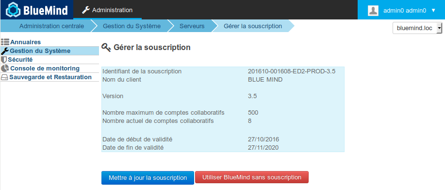

# Implementierung des Abonnements


## Präsentation

### Abonnement

Die BlueMind-Software ist Open Source. Das BlueMind-Abonnement soll den Einsatz in der Produktion vereinfachen und gewährleisten und eine bessere Konnektivität mit Outlook und ActiveDirectory erzielen.

### Die Abonnementdatei

[Das BlueMind-Abonnement](/Guide_de_l_administrateur/La_souscription_BlueMind/) liegt in Form einer lesbaren Textdatei vor, die als Schlüssel die Merkmale des Kunden enthält, für den er ausgestellt wird, insbesondere:

- die Anzahl der Benutzer (bei SAAS-Angeboten wird auch das Konzept des Benutzerprofils berücksichtigt)
- den Typ des Hostsystems (siehe [Installationsvoraussetzungen](/Guide_d_installation/Prérequis_à_l_installation/) für unterstützte Systeme)
- Abonnementtyp:
    - Produktion (Prod oder Host)
    - Auswertung (Eval)
    - Privatkunden und OpenSource-Vereinigungen (kostenlos)
- das Ablaufdatum.


**Diese Datei ist lesbar und signiert.**

Die Abonnementinformationen sind sichtbar.

Die Datei wird auf der Header-/Kundeninformationsebene signiert, sie darf also nicht verändert werden, sonst wird sie ungültig.

Bei einem Bewertungsabonnement kann die Depotzugangs-URLs geändert werden, um die Verteilung zu ändern.  

Für Prod-, Pre-Prod- und Free-Abonnements müssen Sie die Abonnementdatei nicht ändern. Sie müssen vorher bei uns anfragen, wenn Sie z.B. Ihre Serververteilung ändern. Sie erhalten von uns ein neues Abonnement, das für Ihre neue Umgebung gültig ist.

**Sie dürfen diese Datei nicht verbreiten oder an Dritte weitergeben.** Der Zugriff auf das Depot ist namenbezogen und wird verfolgt.

## BlueMind-System-Aktualisierung und -Migration

Die Abonnementdatei enthält die Adressen der BlueMind-Depots und ermöglicht den Systemzugriff entsprechend der Version. Diese Datei muss daher bei einer Änderung der System- und/oder BlueMind-Version aktualisiert werden, um die entsprechenden Versionen der BlueMind-Pakete sowie die neuen Pakete der neuen Version zu installieren.

** **Die Vorgehensweise ist daher die gleiche wie bei einer Installation und nicht wie bei einem einfachen Update.** **

## Installation des Abonnements


:::info

BlueMind muss zuvor mit dem auf der BlueMind-Website[zum Download verfügbaren Installationsprogramm](http://pkg.blue-mind.net/bm-download/) installiert worden sein.

:::

Zum Aktivieren des Abonnements und der Zusatzmodule wird hier die Vorgehensweise (weiter unten detailliert) kurz umrissen:

1. Installation der Abonnement-Datei
2. Aktualisierung der Pakete, um die neuen Komponenten zu erhalten
3. Konfiguration von BlueMind über das neue Update-Tool


:::info

Sicherung des gesamten Systems

BlueMind bemüht sich, die Zuverlässigkeit der Aktualisierungen zu gewährleisten. Niemand ist jedoch vor ungeprüften Sonderfällen oder externen Faktoren gefeit, die zu Datenverlusten führen können. BlueMind übernimmt keine Haftung, wenn ein Update fehlschlägt und ein installiertes System beschädigt.

Es liegt in Ihrer Verantwortung, sich gegen dieses Risiko zu versichern, indem Sie ein vollständiges Backup Ihres Systems erstellen.

:::

### Installation der Abonnement-Datei

#### Automatisierte Installation

- Melden Sie sich auf der BlueMind-Administrationskonsole als admin0 an (Login: * [admin0@global.virt](mailto:admin0@global.virt) *)
- Gehen Sie zu Systemverwaltung > Abonnementverwaltung
- Suchen Sie über die Schaltfläche „Abonnement aktualisieren“, das von BlueMind bereitgestellte Archiv und bestätigen Sie.
BlueMind installiert das Abonnement.
**Das Abonnement wird sofort berücksichtigt und erfordert keinen Neustart von BlueMind**.


:::tip

Das Formular bleibt für eine Aktualisierung des Abonnements, z. B. zum Ablaufdatum, zugänglich.

:::


#### Manuelle Installation

- Extrahieren Sie aus dem bereitgestellten Archiv die Datei, die der verwendeten Verteilung entspricht
- Benennen Sie die Datei in `bm.list`um
- Legen Sie die Datei als root auf dem Server im Ordner `/etc/apt/sources.list.d/`ab
- Wenn Sie Sekundärserver verwenden (Edge, Archivierung usw.), legen Sie die Datei auch auf diesen Servern im gleichen Ordner ab
- Starten Sie BlueMind neu, damit das neue Abonnement berücksichtigt wird


### Aktualisieren von Softwarepaketen

Die Abonnementdatei, welche die Adressen der BlueMind-Depots enthält und deren Zugriff durch das System erlaubt, muss anschließend aktualisiert werden, um die neuesten Versionen der Pakete sowie zusätzliche Pakete zu installieren.

Melden Sie sich als root auf dem betreffenden Rechner an und geben Sie die folgenden Befehle ein:


:::info

Dieser Vorgang muss auf jedem BlueMind-Server durchgeführt werden, der von diesem Abonnement betroffen ist (Produktion, Test oder Bewertung).

:::


**
Debian/Ubuntu


**
Redhat/CentOS


```
sudo aptitude update
sudo aptitude upgrade

```


```
yum makecache
yum upgrade
```


### Installation neuer Pakete

Die folgenden Pakete sind jetzt verfügbar:

- **bm-setup-wizard**: spezielle Version des Installations- und Aktualisierungsassistenten
- bm-mapi*: Anbindung von Outlook-Arbeitsplätzen
- bm-plugin-core-ad-import*: ActiveDirectory-Importtool


** optionale Pakete, die je nach Bedarf zu installieren sind*

Installieren Sie auf dem Hauptrechner (auf dem die BlueMind-Installation erfolgt ist) die neuen Pakete und starten Sie den BlueMind-Dienst neu:


**
Debian/Ubuntu


**
Redhat/CentOS


```
sudo aptitude install bm-setup-wizard bm-mapi bm-plugin-admin-console-ad-import bm-plugin-core-ad-import
sudo bmctl restart
```


```
rpm -e --nodeps bm-installation-wizard
yum install bm-setup-wizard bm-mapi bm-plugin-admin-console-ad-import bm-plugin-core-ad-import
bmctl restart
```


### Konfiguration nach Update

Das Update-Verwaltungstool, der Einrichtungsassistent, ist jetzt verfügbar.

Stellen Sie eine Verbindung mit einem Browser her, indem Sie zur Adresse **  [https://[ip_ihres_servers]/setup](#) gehen  **

Der Bildschirm des Einrichtungsassistenten erscheint nach dem Laden und zeigt den Status der Vorraussetzungsprüfungen an

- Wenn der Einrichtungsassistent die Installation blockiert, korrigieren Sie die Voraussetzungen und starten Sie die Installation erneut
- Wenn der Einrichtungsassistent Warnmeldungen auslöst:
    - Bereinigen Sie die Warnmeldungen und laden Sie dann die Seite / das Setup in Ihrem Browser neu (erneuter Zugriff auf **  [https://[ip_ihres_servers]/setup](#)  **)
    - oder klicken Sie auf  *„Probleme weiter ignorieren“* . (Diese Wahl wird nicht empfohlen, es sei denn, Sie beherrschen perfekt alle Vorgänge).


Wenn die Pakete bereits auf dem neuesten Stand waren, wird eine Meldung angezeigt, dass das System einsatzbereit ist. Ansonsten fahren Sie mit dem folgenden Schritt fort:

Klicken Sie auf  *„Aktualisieren“* .
Neben dieser Schaltfläche wird die aktuelle Version der Daten und die neue Version angezeigt, auf die das Update erfolgen soll.


:::info

Während der Aktualisierung ist es nicht mehr möglich, auf die BlueMind-Anwendung zuzugreifen, und eine Warnseite informiert den Benutzer, der dies versucht.

:::

Nach dem Abschluss der Aktualisierung zeigt der Einrichtungsassistent die Seite  *„Erfolgreiche Installation“*  mit Links zu BlueMind an.

### Prüfen Sie die korrekte Installation

Kehren Sie zur Administrationsschnittstelle zurück, um zu prüfen, ob die Abonnementinformationen korrekt angezeigt werden:




:::tip

Über Updates benachrichtigt werden

Das Abonnement ermögicht das Update von BlueMind, vergessen Sie daher nicht, den speziellen Newsletter zu abonnieren, um Informationen über neue Versionen, Upgrades und Patches zu erhalten: [https://lists.bluemind.net/mailman/listinfo/bluemind](https://lists.bluemind.net/mailman/listinfo/bluemind)

:::

### Zuweisen der Verwaltungsrolle

Werden die Schwellenwerte für die Anzahl der Benutzer überschritten (oder fast) oder wenn sich das Ablaufdatum des Abonnements nähert, erscheinen Informationsbanner in der Administrationskonsole sowie in der BlueMind-Anwendung und es werden E-Mail-Benachrichtigungen verschickt.

Um diese Banner anzeigen zu können, muss ein Benutzer über die Rolle für die Abonnementverwaltung sowie über die Rolle für den Zugriff auf die Administrationskonsole verfügen. Gehen Sie dazu in den Administrationsdatensatz des gewünschten Benutzers und klicken Sie auf [Rollen zuweisen](/Guide_de_l_administrateur/Gestion_des_entites/Utilisateurs/#Administrationdesutilisateurs-user-roles) **„Abonnement verwalten“** und** „Administrationskonsole“**.

Dem Benutzer bieten sich 2 Szenarien:

1. wenn der Benutzer **keinen Zugriff auf** die Administrationskonsole hat, erhält er eine E-Mail zur Information
2. Wenn der Benutzer **Zugriff** auf die Administrationskonsole hat, sieht er auf ihr die Informationsbanner, erhält die Benachrichtigungs-E-Mails und hat Zugriff auf die Verwaltungsseite zur Installation und Aktualisierung des Abonnements


Um E-Mail-Benachrichtigungen zu erhalten, müssen die Adressen in der Abonnementverwaltung angegeben werden.

Weitere Details zu den angezeigten Informationen finden Sie auf der entsprechenden Seite: [Das BlueMind-Abonnement](/Guide_de_l_administrateur/La_souscription_BlueMind/)

## Verbinden von Outlook-Arbeitsplätzen

Sobald das Abonnement und die Pakete installiert sind, können Sie [MAPI für Outlook implementieren](/Guide_de_l_administrateur/La_souscription_BlueMind/Mise_en_œuvre_de_MAPI_pour_Outlook/), damit die Benutzer ihre Software mit ihrem BlueMind-Konto verwenden können.

## ActiveDirectory importieren

Wenn Sie das Paket installiert haben, können Sie nun auch vom AD-Import profitieren. Weitere Informationen finden Sie in der entsprechenden Dokumentation des Administratorhandbuchs: [Active Directory-Synchronisierung](/Guide_de_l_administrateur/Gestion_des_entites/Synchronisation_Active_Directory/)

## Aktualisierung des Abonnements

Wenn ein Abonnement bereits installiert und wirksam ist, müssen - außer bei einem Wechsel der System- oder BlueMind-Version - keine neuen Pakete installiert werden, sondern nur die neue Abonnementdatei.

### Aktualisieren Sie die neue Abonnementdatei

#### Automatisierte Aktualisierung

- Melden Sie sich auf der BlueMind-Administrationskonsole als admin0 an (Login: * [admin0@global.virt](mailto:admin0@global.virt) * * *)
- Gehen Sie zu Systemverwaltung > Abonnementverwaltung
- Suchen Sie über die Schaltfläche „Abonnement aktualisieren“, das von BlueMind bereitgestellte Archiv und bestätigen Sie.
BlueMind installiert das Abonnement.
**Das Abonnement wird sofort berücksichtigt und erfordert keinen Neustart von BlueMind**.


#### Manuelle Aktualisierung

- Extrahieren Sie aus dem bereitgestellten Archiv die Datei, die der verwendeten Verteilung entspricht
- Benennen Sie die Datei in `bm.list`um
- Legen Sie als root die Datei auf dem Server im Ordner `/etc/apt.sources.list.d/` anstelle der alten Abonnementdatei ab
- Wenn Sie Sekundärserver verwenden (Edge, Archivierung usw.), legen Sie die Datei auch auf diesen Servern im gleichen Ordner ab
- Starten Sie BlueMind neu, damit das neue Abonnement berücksichtigt wird


## Löschen eines Abonnements

Aufgrund des Ablaufs des Abonnements oder aus anderen Gründen ist es jederzeit möglich, ein Abonnement zu kündigen und zu einer einfachen Nutzung von BlueMind zurückzukehren:

- Melden Sie sich auf der BlueMind-Administrationskonsole als admin0 an (Login: * [admin0@global.virt](mailto:admin0@global.virt) * * *)
- Gehen Sie zu Systemverwaltung > Abonnementverwaltung
- Klicken Sie auf „BlueMind ohne Abonnement nutzen“:
- Bestätigen Sie die Anforderung zur Bestätigung, nachdem Sie die Bedingungen gelesen haben
- BlueMind neu starten:


```
bmctl restart
```


