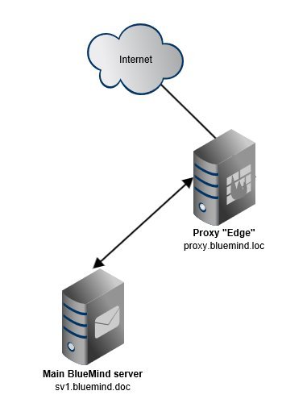
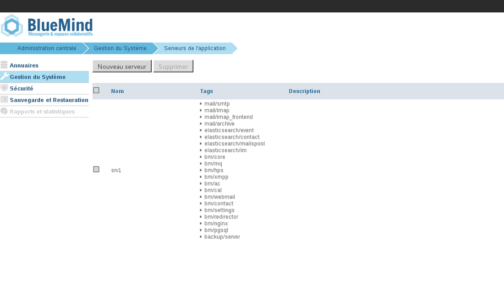
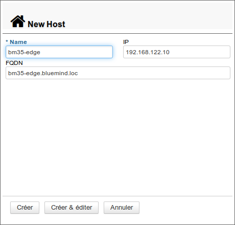
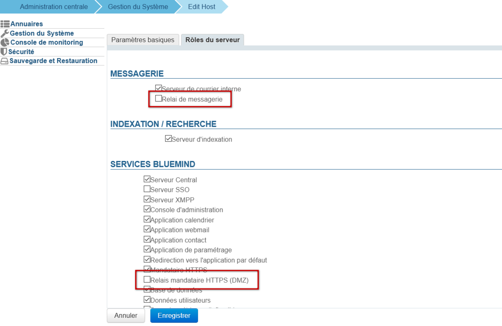
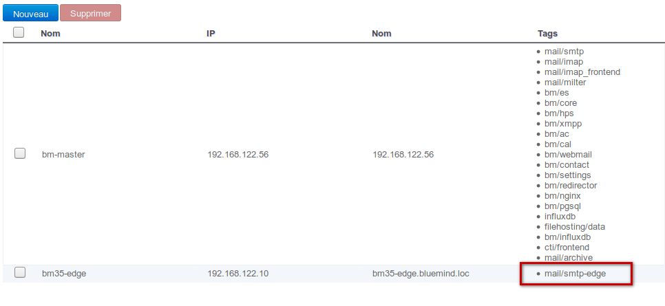
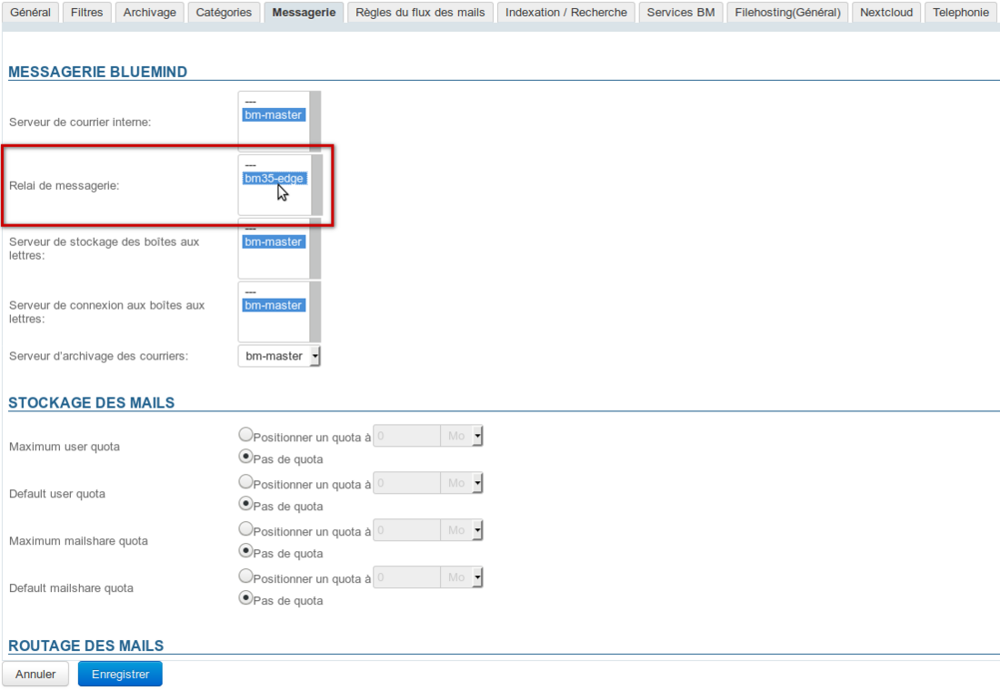
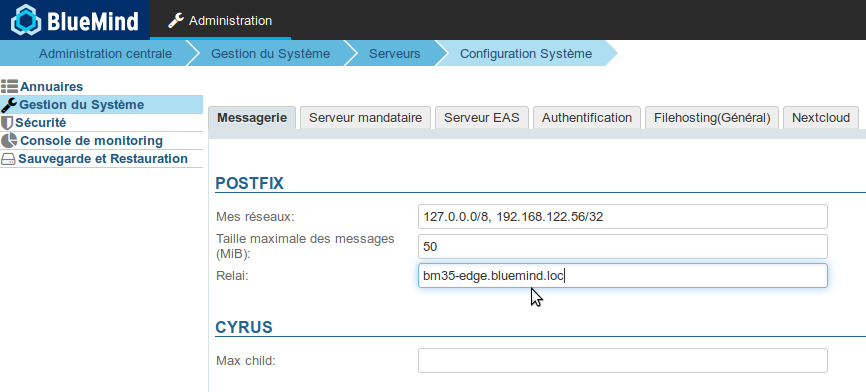

# Installieren eines Edge-Servers: Nginx und Postfix


## Präsentation

In diesem Dokument wird das Verfahren für die Bereitstellung eines BlueMind Edge-Servers als Postfix- und Proxy-Relay beschrieben.

## Prinzip

- BlueMind ist auf dem Hauptserver installiert
- die Rolle *bm-edge-role* ist auf dem sogenannten "*Edge*"-Server installiert
- der nginx-Webserver des Edge-Servers ist als Proxy-Relay konfiguriert, das den Hauptserver bedient


| 
 | 
| 
 |  | 
 |
 | 
 | 
 |  | 
 |
| 
 |  | 
 |


## Ablauf der Bereitstellung

1. Installieren Sie BlueMind auf dem Hauptserver [nach dem üblichen Verfahren](https://forge.bluemind.net/confluence/display/LATEST/Guide+d%27installation)


:::info

Der Speicherplatz für BlueMind-Backups muss auf diesem neuen Server unter */var/backups/bluemind* zugänglich sein

:::

2. Installieren Sie das Abonnement auf dem sekundären Server als Datei


:::info

Zur Erinnerung: Die Textdatei, die dem Abonnement entspricht, kann manuell auf einem Server installiert werden

- für Ubuntu / Debian als `/etc/apt/sources.list.d/bm.list`
- für RedHat / CentOS als `/etc/yum.repos.d/bm.repo`


:::

3. installieren Sie das Paket `bm-edge-role` auf dem Edge-Server:


**
Debian/Ubuntu


**
RedHat/CentOS


```
bm35-edge.bluemind.loc:~$ sudo aptitude update
bm35-edge.bluemind.loc:~$ sudo aptitude install bm-edge-role
```


```
bm35-edge.bluemind.loc:~$ sudo yum makecache
bm35-edge.bluemind.loc:~$ sudo yum install bm-edge-role
```


4. Dem Edge-Server im Administrationsbereich des Hauptservers die Rolle des smtp-Relays hinzufügen:
    - Auf dem Hauptserver mit dem Benutzer *admin0@global.virt die Verbindung zu BlueMind herstellen *
    - Navigieren Sie zu *Systemadministration  > Application Servers* 
    - Klicken Sie auf die Schaltfläche *Neu > Server*
    - Geben Sie die neuen Serverinformationen ein und klicken Sie auf *Erstellen* Klicken Sie auf "Erstellen & Editieren" oder auf "Erstellen" und in der Liste der Server auf die entsprechende Zeile
    - Gehen Sie auf die Registerkarte * Server-Rollen: * 
        - Aktivieren Sie die Rolle "Mail-Relay"
        - **Wenn Sie nginx von BlueMind** auf diesem Server**verwenden**, aktivieren Sie auch die Rolle „HTTPS-Proxy Relay (DMZ)"
        - Klicken Sie auf "**Speichern**"
    - In der Liste der Server erscheint der Edge-Server nun mit dem Tag, das mit dem *Mail/Smtp-Edge-Mail-Relay* verknüpft ist 
5. Die Domain für die Verwendung dieses Servers als  Mail-Relaykonfigurieren 
    - Bleiben Sie als Benutzer admin0@global.virt angemeldet und gehen Sie zu *Systemadministration > Überwachte Domains*
    - klicken Sie auf die Zeile, die der zu konfigurierenden Domain entspricht
    - Wählen Sie auf der Registerkarte  *Messaging* den Edge-Server als *Mail-Relay* aus und klicken Sie auf Speichern:
6. Konfiguration des Servers, um ausgehende E-Mails über das Relay zu schicken:
    - Bleiben Sie als Benutzer admin0@global.virt angemeldet und gehen Sie zu *Systemadministration > Systemkonfiguration*
    - Füllen Sie in der Registerkarte *Messaging* das Feld *Relay* mit der IP-Adresse oder dem Hostnamen des Edge-Servers aus und klicken Sie auf Speichern:




## Nginx

### Konfigurieren des Webzugriffs


:::info

Wenn Sie nginx von BlueMind verwenden und daher die „Proxy-Relay“-Rolle auf diesem Server aktiviert haben (siehe oben), betrifft dieser Abschnitt Sie nicht. Sie können zu Punkt 4.2 unten übergehen.

:::

1. Melden Sie sich als root auf dem Edge-Server an
2. Gehen Sie zum Ordner `/etc/nginx/sites-available`


```
bm35-edge.bluemind.loc:~# cd /etc/nginx/sites-available
```


3. Erstellen Sie eine `bm-proxy`-Konfigurationsdatei und bearbeiten Sie diese z.B. mit vim:


```
bm35-edge.bluemind.loc:/etc/nginx/sites-available# vim bm-proxy
```


4. Fügen Sie die folgenden Zeilen ein:


```
server {
  listen 80;
  # <url\_externe\_bluemind> désigne l'url externe à laquelle les utilisateurs se connectent
  server\_name <url\_externe\_bluemind>;

  location / {
	return 301 https://<url\_externe\_bluemind>$request\_uri;
  }
}

server {
  listen 443 ssl http2;
  server\_name <url\_externe\_bluemind>;

  ssl\_certificate /etc/ssl/certs/bm\_cert.pem;
  ssl\_certificate\_key /etc/ssl/certs/bm\_cert.pem;
  ssl\_session\_timeout 5m;
  ssl\_prefer\_server\_ciphers on;

  ssl\_protocols TLSv1.2;
  ssl\_ciphers 'EDH+CAMELLIA:EDH+aRSA:EECDH+aRSA+AESGCM:EECDH+aRSA+SHA384:EECDH+aRSA+SHA256:EECDH:+CAMELLIA256:+AES256:+CAMELLIA128:+AES128:+SSLv3:!aNULL:!eNULL:!LOW:!3DES:!MD5:!EXP:!PSK:!DSS:!RC4:!SEED:!ECDSA:CAMELLIA256-SHA:AES256-SHA:CAMELLIA128-SHA:AES128-SHA';
  add\_header Strict-Transport-Security max-age=15768000; # six months

 proxy\_set\_header X-Forwarded-For $proxy\_add\_x\_forwarded\_for;

 location / {
	# <srv\_interne> est le serveur BlueMind principal
    proxy\_pass https://<srv\_interne>;
  }

  location /webmail/ {
    client\_max\_body\_size 0m;
    proxy\_pass https://<srv\_interne>/webmail/;
  }

  location /Microsoft-Server-ActiveSync {
    proxy\_pass https://<srv\_interne>/Microsoft-Server-ActiveSync;
    proxy\_read\_timeout 1200s;
    proxy\_headers\_hash\_bucket\_size 128;
    proxy\_headers\_hash\_max\_size 2048;
    client\_max\_body\_size 0m;
    proxy\_pass\_header Server;
  } 

  location /eventbus {
    proxy\_pass https://<srv\_interne>;
    proxy\_http\_version 1.1;
    proxy\_set\_header Upgrade $http\_upgrade;
    proxy\_set\_header Connection "upgrade";
  }

  location /api/filehosting/ {
    client\_max\_body\_size 0m;
    proxy\_pass https://<srv\_interne>$request\_uri;
    proxy\_set\_header        X-Real-IP       $remote\_addr;
    proxy\_set\_header        X-Forwarded-For $proxy\_add\_x\_forwarded\_for;
    proxy\_http\_version 1.1;
    proxy\_buffering off;
  }

  location /api/attachment/ {
    client\_max\_body\_size 0m;
    proxy\_pass https://<srv\_interne>$request\_uri;
    proxy\_set\_header        X-Real-IP       $remote\_addr;
    proxy\_set\_header        X-Forwarded-For $proxy\_add\_x\_forwarded\_for;
    proxy\_http\_version 1.1;
    proxy\_buffering off;
  }

  location /fh/ {
    proxy\_pass https://<srv\_interne>/fh/;
    proxy\_http\_version 1.1;
    proxy\_buffering off;
  }
}

```


5. Speichern Sie die Datei und schließen Sie den Editor
6. Führen Sie die folgenden Befehle aus, um die Konfiguration einzurichten:


```
bm35-edge.bluemind.loc:/etc/nginx/sites-available# ln -s /etc/nginx/sites-available/bm-proxy /etc/nginx/sites-enabled/
bm35-edge.bluemind.loc:/etc/nginx/sites-available# rm /etc/nginx/sites-enabled/default
```


7. Laden Sie die nginx-Serverkonfiguration neu:


```
bm35-edge.bluemind.loc:/etc/nginx/sites-available# service bm-nginx reload
```


### Messaging-Konfiguration

1. Kopieren Sie auf dem Edge-Server die Hauptserver-Konfigurationsdatei, die sich unter `/etc/nginx/global.d/bm-proxy-mail.conf` befindet. Dies kann mit scp erfolgen:


```
bm35-edge.bluemind.loc:~# scp root@srv1.bluemind.loc:/etc/nginx/global.d/bm-mail-proxy.conf /etc/nginx/global.d/
```


2. Bearbeiten Sie die Datei `/etc/nginx/global.d/bm-mail-proxy.conf` auf dem Edge-Server und ersetzen Sie die IP-Adresse der Zeile `auth_http` durch die IP-Adresse des Hauptservers

3. Laden Sie die nginx-Konfiguration neu:


```
bm35-edge.bluemind.loc:~# service bm-nginx reload
```


### XMPP-Konfiguration

Um zu erreichen, dass der Server das XMPP-Stream-Management unterstützt:

1. erstellen Sie die Datei `/etc/nginx/global.d/bm-xmpp-proxy.conf` mit folgendem Inhalt:


```
stream {
    upstream backend\_xmpp {
        least\_conn;

                server 1.2.3.4:5222;
                server 1.2.3.5:5222 backup;
    }

    server {
        listen 5222;
        proxy\_pass backend\_xmpp ;
    }
}
```

Indem Sie 1.2.3.4 durch die IP-Adresse des Hauptservers oder ggf. des Servers mit der [XMPP-Rolle](/Guide_de_l_administrateur/Configuration/Gestion_des_domaines/#Gestiondesdomaines-ServicesBM) ersetzen

2. Laden Sie die nginx-Konfiguration neu:


```
bm35-edge.bluemind.loc:~# service bm-nginx reload
```


## Apache-Proxy


:::info

BlueMind rät jedoch davon ab, Apache als Reverse-Proxy zu verwenden

:::

Es ist auch möglich, Apache als Proxy anstelle von Nginx zu verwenden. Dazu müssen Sie eine Version >=2.4 von Apache verwenden und die folgenden Module aktivieren:

- mod_ssl
- mod_proxy und mod_proxy_wstunnel
- mod_rewrite


VirtualHost-Beispiel für Apache:


```
<VirtualHost \*:80>
        Redirect / https://<url\_externe\_bluemind>/
</VirtualHost>

<VirtualHost \*:443>
        SSLEngine On

        SSLCertificateFile     "/etc/ssl/certs/bm\_cert.pem"
        SSLCertificateKeyFile  "/etc/ssl/certs/bm\_cert.pem"

        SSLProxyEngine On
        SSLProxyCheckPeerCN Off
        SSLProxyCheckPeerName Off
        SSLProxyVerify none

        # Websocket proxy
        RewriteEngine on
        RewriteCond %{HTTP:UPGRADE} ^WebSocket$ [NC]
        RewriteCond %{HTTP:CONNECTION} Upgrade$ [NC]
        RewriteRule .\* wss://<srv\_interne>%{REQUEST\_URI} [P]

        ProxyPreserveHost On
        <Location />
                ProxyPass https://<srv\_interne>/
                ProxyPassReverse https://<srv\_interne>/
        </Location>
</VirtualHost>
```


Speichern

Speichern

Speichern

Speichern

Speichern


