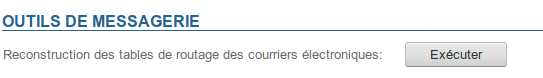

# Mail-Wartung

Auf der Seite Systemadministration > Wartung > Mail-Wartung der Administrationskonsole können Sie eine Regeneration aller Postfix-Maps auf allen Servern der BlueMind-Instanz erzwingen.

Klicken Sie auf die Schaltfläche "Ausführen", um die Rekonstruktion zu starten:

:::tip

Es ist nicht erforderlich, den Dienst neu zu starten, die Änderungen werden wirksam, sobald der Vorgang abgeschlossen ist.

:::

