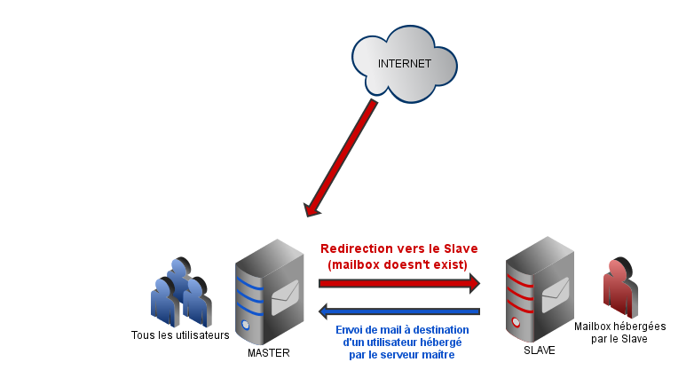
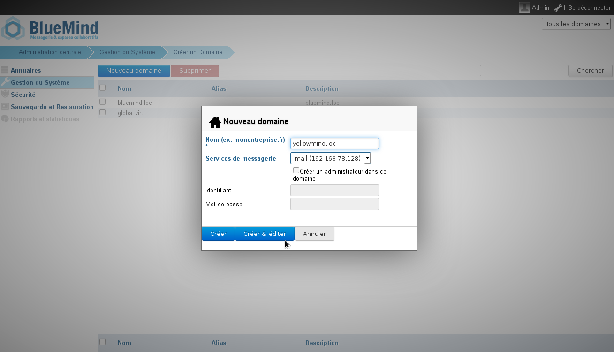
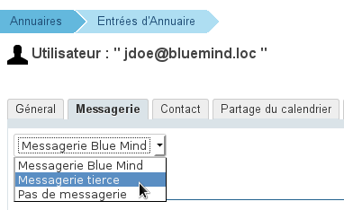
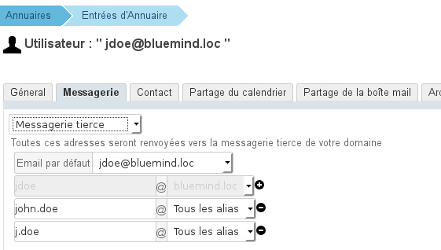
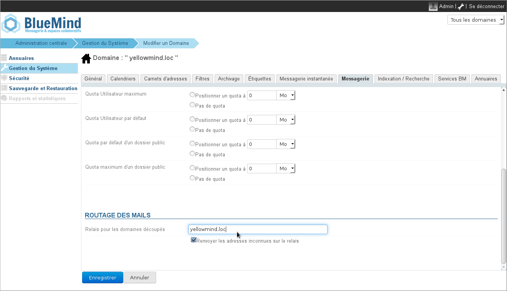

# Nachrichten direkt an eine andere Domain weiterleiten

## Einführung

Blue Mind muss in der Lage sein, nur einen Teil der Benutzer einer gleichen Domain  zu verwalten, um in eine Architektur integriert werden zu können, in der die Benutzer einer gleichen Domain von verschiedenen Systemen und damit Mailservern verwaltet werden.

Wir gehen davon aus, dass es in einer Split-Domain-Mail-Architektur ein Master-System und ein Slave-System gibt, BlueMind kann entweder das eine oder das andere sein:

## Beschreibung

### Master

Der Master ist der Server, der alle Benutzer kennt und die Mails aus dem Internet empfängt.

Wenn eine Mail an die Domain, aber an einen Benutzer adressiert ist, der nicht von ihr gehostet wird, leitet er sie an den Slave-Server weiter.

:::info
Sie sollten keine "Standard"-Weiterleitungsregel erstellen, da der Master-Server die Existenz des Posteingangs feststellen muss (“mailbox doesn’t exist”).
:::

****Funktionsweise****:**** wir leiten einen Benutzer explizit an einen anderen SMTP-Server weiter

### Slave

Er kennt nur die Benutzer, die er hostet.

Wenn er eine Mail für die Domain sendet, muss er sie an den Master weiterleiten können, da er nicht alle Benutzer für diese Domain kennt.

:::info
Es wird eine Standard-Umleitungsregel benötigt, da nur der Master-Server die Existenz des Posteingangs kennt ("Posteingang existiert nicht").
:::

****Wie es funktioniert:**** für alle Empfänger, die wir nicht kennen, muss eine Weiterleitung erfolgen, auch für den Teil der Domain, den wir verwalten.

## Implementierung

### BlueMind als Master-Server

:::info

Alle Benutzer müssen BlueMind bekannt sein.
Benutzer, die nicht von Blue Mind gehostet werden, dürfen keine Verbindung zu BlueMind herstellen oder BlueMind nutzen können.
:::

#### Konfiguration von BlueMind

Damit BlueMind eingehende Nachrichten direkt (ohne Umweg über den MX) an die Domain weiterleiten kann, die die Empfängeradressen verwaltet:

- **Wenn die Ziel-Domain noch nicht in BlueMind vorhanden ist**, legen Sie sie an:
    - Eingeloggt als Superadministrator admin0 gehen Sie zu Systemadministration > Überwachte Domain
    - klicken Sie auf "Neue Domain" und geben Sie den Namen der zu erstellenden Domain ein:
    - klicken Sie auf "Erstellen & Editieren", um direkt zur Domainverwaltung zu gelangen.
- **Wenn die Domain bereits existiert**, wechseln Sie in ihren Verwaltungsbereich:
    - Eingeloggt als Superadministrator admin0 gehen Sie zu Systemadministration > Überwachte Domain
    - klicken Sie auf den Domainnamen in der Liste
- Gehen Sie **abschließend in allen Fällen** in die Registerkarte "Posteingang" > Bereich "Mail-Routing" und:
    - geben Sie im Feld "Relay für geteilte Domains" den Namen oder die IP-Adresse der Ziel-Domain ein
    - für das Kästchen "Unbekannte Adressen erneut an das Relay senden" :
        - Wenn alle Benutzer auf dem BlueMind-Server vorhanden sind und diejenigen, die nicht migriert werden, als Dritt-Posteingang gekennzeichnet sind, aktivieren Sie dieses Kontrollkästchen nicht
        - Wenn nur die BlueMind-Benutzer bekannt sind, müssen Sie das Kontrollkästchen aktivieren, damit die Mails, die für nicht migrierte Benutzer bestimmt sind, an den alten Server umgeleitet werden
- Bestätigen, indem Sie auf "Speichern" klicken.

#### Benutzer-Konfiguration

Für jeden betroffenen Benutzer muss nach dem Anlegen des Benutzers in BlueMind die Art der Benachrichtigung angegeben werden. Vorgehensweise:

- Melden Sie sich im Admin-Bereich als Superadministrator admin0 oder als Benutzeradministrator an
- Gehen Sie zu Verzeichnisse > Verzeichnis-Entitäten
- Wählen Sie den zu konfigurierenden Benutzer aus und gehen Sie auf die Registerkarte "Messaging"
- Wählen Sie in der Dropdown-Liste oben auf der Seite "Messaging-Drittanwendung" aus:
- Es wird ein neues Formular angezeigt, das es erlaubt, alle oder einen Teil der für den Benutzer konfigurierten E-Mail-Adressen auszuwählen, mit dem Wissen, dass jede an diese Adressen eingehende E-Mail an die Messaging-Anwendung des Drittanbieters zurückgeschickt wird:
- Auf "Speichern“ klicken, um die Änderungen zu bestätigen

### BlueMind als Slave-Server

:::info

Es handelt sich um eine Umleitung nach Domain. In dieser Betriebsart werden unbekannte Domainadressen an einen Master-Relay-Server umgeleitet.

:::

Damit BlueMind eingehende Nachrichten direkt (ohne den Umweg über den MX) an den Master-Server weiterleiten kann, sind folgende Bedingungen zu erfüllen:

- **Wenn die Ziel-Domain noch nicht in BlueMind vorhanden ist**, legen Sie sie an:
    - Eingeloggt als Superadministrator admin0 gehen Sie zu Systemadministration > Überwachte Domain
    - klicken Sie auf "Neue Domain" und geben Sie den Namen der zu erstellenden Domain ein:
    - klicken Sie auf "Erstellen & Editieren", um direkt zur Domainverwaltung zu gelangen.
- **Wenn die Domain bereits existiert**, wechseln Sie in ihren Verwaltungsbereich:
    - Eingeloggt als Superadministrator admin0 gehen Sie zu Systemadministration > Überwachte Domain
    - klicken Sie auf den Domainnamen in der Liste
- Gehen Sie **abschließend in allen Fällen** in die Registerkarte "Posteingang" > Bereich "Mail-Routing" und:
    - geben Sie im Feld "Relay für geteilte Domains" den Namen oder die IP-Adresse der Ziel-Domain ein
    - **Markieren Sie das Kästchen** "Unbekannte Adressen an das Relais zurückgeben"
- Bestätigen, indem Sie auf "Speichern" klicken.

