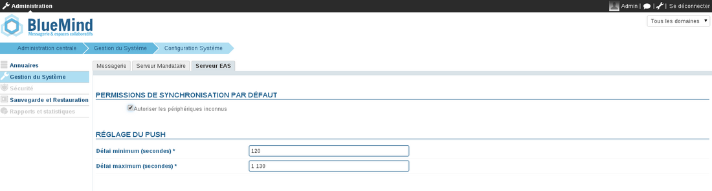
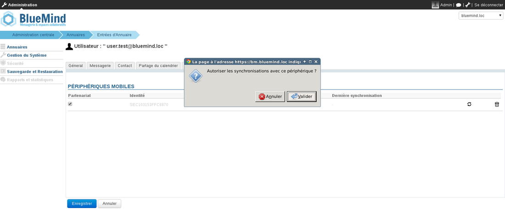
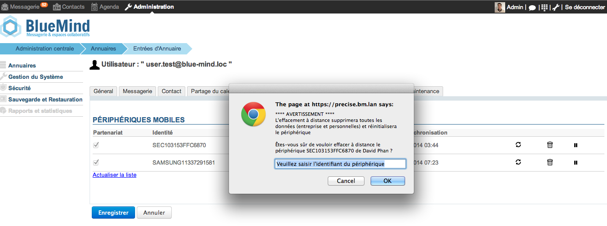
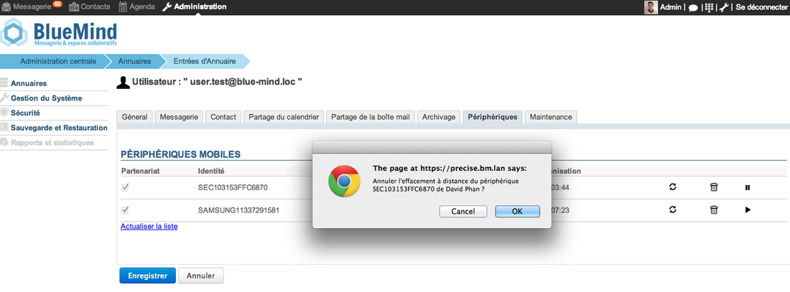

# EAS-Server-Konfiguration

## Präsentation

Der EAS-Server (Exchange ActiveSync) ermöglicht die Synchronisation der auf den BlueMind-Servern vorhandenen Daten mit einem mobilen Endgerät.

Verschiedene Konfigurationseinstellungen ermöglichen die Aktivierung dieser Funktion, die aus Sicherheitsgründen für unbekannte Endgeräte standardmäßig deaktiviert ist.

:::info

Frist der ersten Synchronisation

Ab der BlueMind-Version 3.5.10-3 wurde aus Gründen der Server-Performance ein Caching-System implementiert, das eine Verzögerung bei der ersten Gerätesynchronisation mit sich bringt.

Unabhängig vom gewählten Autorisierungsmodus (siehe unten) findet die erste Synchronisierung eines Geräts 10 Minuten nach seiner Autorisierung durch den Server statt (Anforderung durch das Gerät im Falle einer allgemeinen Autorisierung, Aktivierung durch den Administrator im Falle einer Einzelautorisierung).

Wenn einem Gerät die Autorisierung entzogen wird, wird die Synchronisierung auf dem Gerät 10 Minuten später eingestellt.

Diese Frist ist weder konfigurierbar noch änderbar.

:::

## Synchronisation aller Endgeräte zulassen

Um jedem Gerät die Verbindung zum EAS-Server zu ermöglichen und nicht jedes Gerät einzeln akzeptieren zu müssen, führen Sie die folgenden Schritte aus:

1. Melden Sie sich an der BlueMind-Server-Administrationskonsole als globaler Administrator an
2. Gehen Sie in das Menü *Systemadministration > Systemkonfiguration*
3. Wählen Sie die Registerkarte *EAS-Server*
4. Markieren Sie das Kästchen **Unbekannte Geräte zulassen**

5. Klicken Sie auf die Schaltfläche *Speichern*

## Ein bestimmtes Gerät zulassen

Wenn die Option zum Zulassen der Synchronisierung unbekannter Geräte nicht aktiviert ist, kann ein bestimmtes Gerät zugelassen werden, wenn es bereits einmal eine Synchronisierung versucht hat.

1. Melden Sie sich an der BlueMind-Administrationskonsole als globaler Administrator an
2. Gehen Sie in das Menü *Verzeichnisse > Verzeichniseinträge, um* die Benutzer zu verwalten
3. Klicken Sie auf den Benutzer, dessen Gerät autorisiert werden soll
4. Wählen Sie die Registerkarte *Geräte*
5. Markieren Sie die mobilen Geräte des Benutzers, die zugelassen werden sollen, oder deaktivieren Sie diejenigen, denen der Zugriff verweigert werden soll

6. Klicken Sie auf *Speichern*

:::tip

Löschen eines Geräts

Das Symbol  ermöglicht es, die einem Gerät erteilte Berechtigung zu entfernen.

:::

## Löschen eines entfernten Geräts

Im Falle eines Verlusts oder Diebstahls ist es möglich, den Inhalt eines Geräts aus der Ferne zu löschen.

:::info

ACHTUNG

Die Fernlöschung löscht alle auf dem Telefon vorhandenen Daten, egal ob sie mit dem BlueMind-Konto verbunden sind oder privater Art sind (Fotos, SMS, ....). **Dieser Vorgang ist nicht umkehrbar.**

:::

1. Melden Sie sich als Administrator an der BlueMind-Administrationskonsole an
2. Gehen Sie in das Menü *Verzeichnisse > Verzeichniseinträge*
3. Wählen Sie den Benutzer, dessen Gerät gelöscht werden soll
4. Wählen Sie die Registerkarte *Geräte*
5. Klicken Sie auf das Symbol   "Fernlöschen"
6. Es erscheint ein Bestätigungs-Popup. Validieren Sie den Vorgang, indem Sie die Geräte-ID eingeben und auf *Bestätigen klicken*
**
7. Das Telefon wird auf die Werkseinstellungen zurückgesetzt

:::info

ACHTUNG

Wenn das Telefon versucht, sich erneut mit BlueMind zu synchronisieren, wird es wieder gelöscht.

:::

Um ein Gerät erneut für die Synchronisierung mit BlueMind zu autorisieren:

1. Melden Sie sich als Administrator an der BlueMind-Administrationskonsole an
2. Gehen Sie in das Menü *Verzeichnisse > Verzeichniseinträge*
3. Wählen Sie den Benutzer, dessen Gerät neu autorisiert werden soll
4. Wählen Sie die Registerkarte *Geräte*
5. Klicken Sie auf das Symbol  "Gerätelöschung rückgängig machen"
6. Bestätigen Sie die Bestätigungsanforderung
7. Anschließend kann sich das Gerät wieder mit BlueMind synchronisieren.

