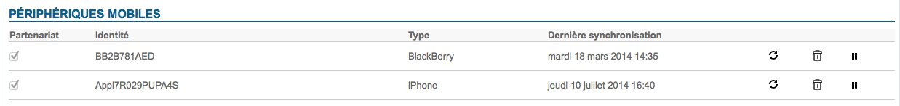

# MDM - Mobile Device Management

Die mobile Synchronisation erfolgt über das ActiveSync-Protokoll und ermöglicht eine native Synchronisation, ohne dass auf den Smartphones zusätzliche Komponenten für E-Mail, Kontakte oder Terminplaner installiert werden müssen.BlueMind integriert MDM-Dienste ("Mobile Device Management") zur Verwaltung der Flotte von Smartphones, die zur Verbindung mit BlueMind berechtigt sind.Standardmäßig ist es einem Smartphone nicht erlaubt, sich über ActiveSync zu verbinden.Über die Administrationskonsole kann der Plattformadministrator ein Smartphone für die Synchronisierung autorisieren. Die Berechtigung wird einem Smartphone nur auf Basis eines Benutzers zugewiesen, es ist eine Partnerschaft.Wenn das Smartphone für einen anderen Mitarbeiter wiederverwendet wird, muss die Partnerschaft erneut genehmigt werden.In der Administrationskonsole stehen mehrere Verwaltungsoptionen zur Verfügung:
- Zurücksetzen der Datensynchronisation, im Falle einer Wartung oder Störung des Smartphones.Es ist also nicht notwendig, das Smartphone physisch in die IT-Abteilung zurückzubringen, der Vorgang wird fernverwaltet.
- Partnerschaft löschen: Das Smartphone darf nicht mehr mit dem Benutzerkonto synchronisiert werden.
- Smartphone aus der Ferne zurücksetzen: Mit dieser Funktion können **alle Daten auf dem Smartphone** komplett gelöscht werden (Reset auf die Werkseinstellungen), um bei Diebstahl einen Informationsverlust zu verhindern.

Weitere Infos zur EAS-Server-Konfiguration und zur Geräteverwaltung finden Sie auf der Seite [EAS-Server-Konfiguration](/Guide_de_l_administrateur/BlueMind_et_mobilite/Configuration_du_serveur_EAS/)

