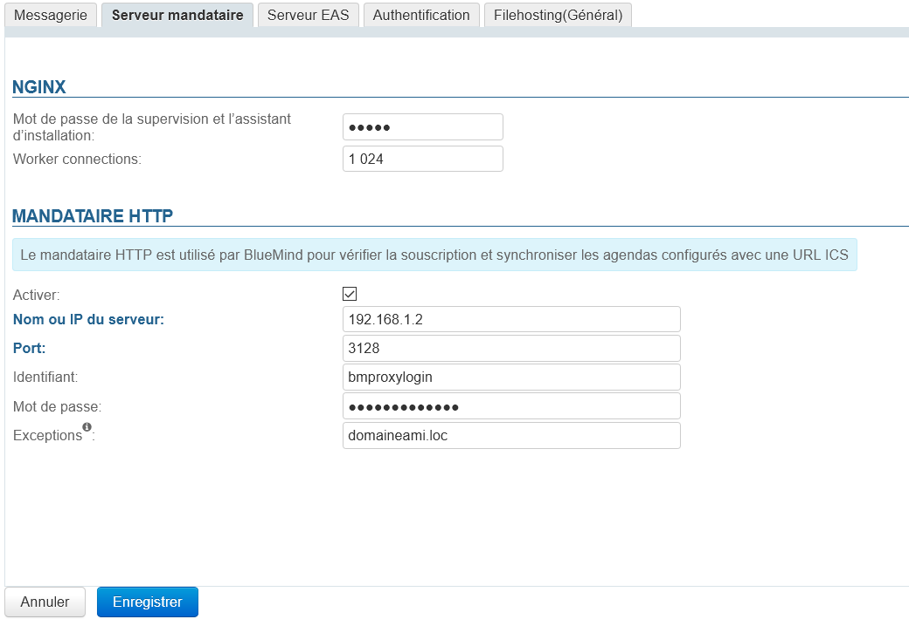
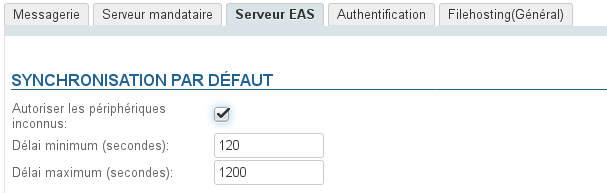
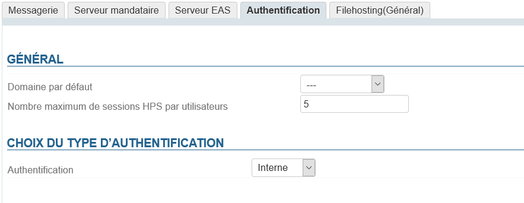
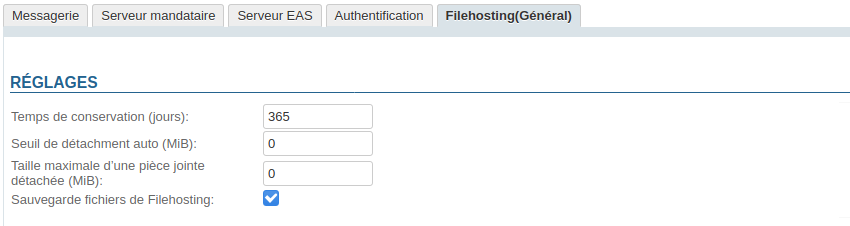

# Systemkonfiguration


## E-Mail-System

Auf dieser ersten Registerkarte der Systemkonfiguration können Sie die Postfix- und Cyrus-Parameter des Systems einstellen.


### Postfix

- **Meine Netzwerke** 
Liste der internen SMTP-Clients mit höheren Rechten als externe SMTP-Clients.
Geben Sie eine durch Komma und/oder Leerzeichen getrennte Liste von Netzwerk-/Maskenausdrücken an, z. B.:


```
127.0.0.0/8, 192.168.198.0/24
```

Für weitere Informationen siehe [http://postfix.traduc.org/index.php/postconf.5.html#mynetworks](http://postfix.traduc.org/index.php/postconf.5.html#mynetworks)

- **Maximale E-Mail-Größe**Maximale Größe in MiB von Nachrichten, die Benutzer senden dürfen.


:::info

Achtung, es handelt sich um die Größe der **E-Mails** und nicht um ihre Anlagen.

Nach der Konvertierung zur Aufnahme in eine E-Mail nimmt die Anlagengröße zu, daher sollten etwa 50 % mehr als erwünscht berücksichtigt werden.
Wenn Sie beispielsweise Anhänge bis zu 10 MB zulassen möchten, sollten Sie die maximale E-Mail-Größe auf 15 MB festlegen.

:::


:::info

Maximale Grenze

Die maximale von BlueMind unterstützte E-Mail-Größe darf 100 MB nicht überschreiten.

:::

- **Relais** 
Geben Sie hier die Adresse des Relais ein, an das ausgehende E-Mails weitergeleitet werden sollen.


:::info

Die Einheit MiB (MebiByte) ist ein Vielfaches des Bytes (Oktett), die von MB (Megabyte, oder Mo-Megaoktett) zu unterscheiden ist: Sie entspricht 1024 Kebibytes, die wiederum 1024 Bytes (Oktetts) entsprechen.

9 MiB entsprechen somit 9,43718 MB

:::

### Cyrus

- **Max child** Dieses Feld definiert die maximale Anzahl von IMAP-Prozessen, die Cyrus starten kann, standardmäßig sind es 200.Es kann sinnvoll oder sogar notwendig sein, diesen Wert zu erhöhen, insbesondere bei [Identifikationsproblemen](/Guide_de_l_administrateur/Resolution_de_problemes/Erreurs_d_identification_IMAP/).Normalerweise kommen auf 50 gleichzeitig gestartete Fat Clients etwa 100 Prozesse bzw. zu startende Prozesse.
- **Aufbewahrungszeit der zu bereinigenden E-Mails (Tage)** Anzahl der Tage, die Nachrichten nach dem Löschen durch den Benutzer (direktes vollständiges Löschen oder geleerter Papierkorb) auf dem Server verbleiben. Während dieser Zeit können vom Benutzer gelöschte E-Mails jederzeit wiederhergestellt werden.


### Archivierung

In einer Dropdown-Liste können Sie die Art der Archivierung auswählen:

- Keine
- Archiv nativer Cyrus
- Objektspeicher S3


## Proxy-Server

Auf der Registerkarte "Proxyserver" kann der Administrator Ngninx und einen Proxyserver einrichten.

### Nginx

- **das Passwort des Überwachungs- und Installationsassistenten einstellen, ** , das von BlueMind [während der Installation automatisch festgelegt wird](/Guide_d_installation/Configuration_post_installation/), es ist das Passwort für den Zugriff auf die [Aktualisierungsschnittstelle](/Guide_d_installation/Mise_à_jour_de_BlueMind/).


:::tip

Das alte Passwort wird vom angemeldeten Administrator nicht abgefragt, so dass er es hier ändern kann, wenn es verloren gegangen ist.

:::

- **worker_connections**: die maximale Anzahl von Verbindungen, die gleichzeitig durch einem Prozess geöffnet werden können
Ein *Worker* arbeitet für eine Verbindung, daher zählen wir worker_connections = Anzahl der aktiven (oder wahrscheinlich aktiven) Verbindungen zur gleichen Zeit. Meist sind worker_connections = Anzahl der Benutzer.


:::tip

Um den Wert dieses Parameters optimal anzupassen, kann der Befehl auf dem Server platziert werden, um die Anzahl der aktiven Verbindungen zu einem bestimmten Zeitpunkt T, z. B. während des Tages und der Woche, zu erfahren:


```
ss -p | grep nginx | grep -i estab | wc -l
```


:::


### HTTP-Proxy-Server

 In verschiedenen Szenarien, z.B. bei der Abfrage von externen Kalendern, erfordern einige Installationen die Verwendung eines HTTP-Proxys. Ab Version 4.4 ist es möglich, einen Proxy-Server zu konfigurieren, über den die externen Anfragen von BlueMind geleitet werden.

- **Aktivieren**: Der Server kann durch Abwählen dieses Kontrollkästchens deaktiviert werden, ohne dass das Formular gelöscht wird; so kann der Proxy nach Bedarf aktiviert/deaktiviert werden, ohne die Daten jedes Mal neu eingeben zu müssen.
- **Name oder IP des Servers**
- **Port**
- **Benutzeridentifizierung**
- **Passwort**
- **Ausnahmen**: Anfragen an diese Domains gehen nicht über den Proxy-Server, sondern werden direkt von BlueMind abgefragt.Das Feld als kommagetrennte Liste von Namen und/oder IPs ausfüllen.Hinweis: Das Zeichen " * " wird nur als Präfix unterstützt


## EAS-Server

Die Registerkarte „EAS Server“ bietet Zugriff auf die Konfigurationsoptionen des Exchange Active Sync-Servers, der die Synchronisation von mobilen Geräten ermöglicht.




:::tip

Wenn die Kommunikationsprobleme weiterhin bestehen, können Sie mit dem Online-Diagnosetool von Microsoft sicherstellen, dass der Server richtig konfiguriert und erreichbar ist: [https://testconnectivity.microsoft.com/](https://testconnectivity.microsoft.com/)

:::

## Authentifizierung



In dieser Registerkarte können Sie definieren:

- **Die Standard-Domäne**, bei einer Mehrdomänen-Installation
- Die **Maximale Anzahl von HPS-Sitzungen pro Benutzer**: die Anzahl der gleichzeitigen Verbindungen zum selben Konto von mehreren verschiedenen Arbeitsplätzen/Browsern (mobile Geräte, die sich über EAS verbinden, zählen nicht).Dieser Wert ist insbesondere bei Verwaltungskonten sinnvoll, die von mehreren Personen gemeinsam genutzt werden (z. B. Kontakt- oder Administrationsbenutzerkonto).
- **Die Art der Benutzerauthentifizierung**:
    - Intern
    - [SSO CAS-Authentifizierung](/Guide_de_l_administrateur/Configuration/Gestion_des_domaines/Les_methodes_d_authentification/Mise_en_place_du_SSO_CAS/)
    - [Kerberos SSO-Authentifizierung](/Guide_de_l_administrateur/Configuration/Gestion_des_domaines/Les_methodes_d_authentification/Mise_en_place_du_SSO_Kerberos/)


## Filehosting

Diese Registerkarte legt die Standardwerte für **neu erstellte Domänen** fest, **sie definiert oder überschreibt nicht die Werte für alle Domänen**.



- **Aufbewahrungszeit (Tage)**: die Anzahl der Tage, nach denen Dateien ab ersten dem Versanddatum auf dem Server gelöscht werden
- **Schwellenwert für automatische Abtrennung (MiB)**: die Größe, bei der eine zu einer Nachricht hinzugefügte Datei automatisch von ihr abgetrennt wird
- **Maximale Größe einer abgetrennten Anlage (MiB)**: maximal zulässige Dateigröße
Dies ist die zulässige Größe **pro Datei**, so dass mehrere Dateien, deren Gesamtgröße die Schwellen überschreiten, an die gleiche Nachricht angehängt und von ihr abgetrennt werden können, solange jede von ihnen den Schwellenwert einhält.

- **Filehosting-Dateisicherung**: Wenn dieses Kontrollkästchen aktiviert ist, wird der Speicherordner auf dem Server in die [BlueMind-Sicherungsaufgaben](https://forge.bluemind.net/confluence/display/BM4/Sauvegarde+et+restauration) integriert


:::info

Die Einheit MiB (MebiByte) ist ein Vielfaches des Bytes (Oktett), die von MB (Megabyte, oder Mo-Megaoktett) zu unterscheiden ist: Sie entspricht 1024 Kebibytes, die wiederum 1024 Bytes (Oktetts) entsprechen.

9 MiB entsprechen somit 9,43718 MB

:::


