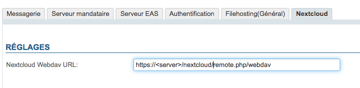
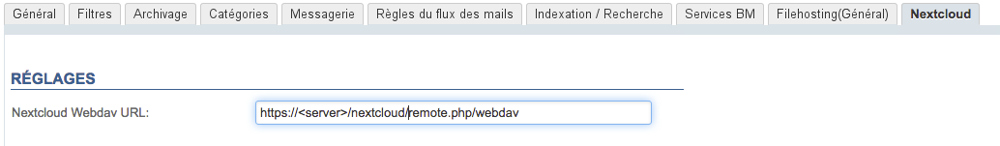
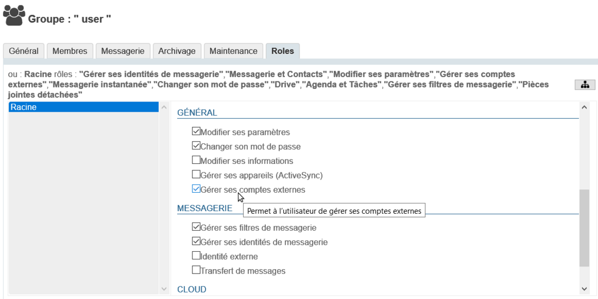

# Verbindung mit Nextcloud


## Präsentation

BlueMind bietet die Möglichkeit, ein externes Nextcloud-Dokumentendepot (oder *Drive*) anzuschließen.

Benutzer können ihren persönlichen Nextcloud-Speicherplatz nutzen, um die Dateien zu verwalten, die sie über ihre BlueMind-Mailbox versenden, und so die Vorteile nutzen, die Depot bietet: Dateibaumstruktur, Verschieben, Löschen, Sicherheit, Synchronisation mit ihren anderen Anwendungen usw.

Die Administratoren können das Tool besser beherrschen: genauere und einfachere Verwaltung des Speicherplatzes, Verwaltung nach Benutzern, Datenzentralisierung, Sicherheits- und Backup-Kontrolle.

##### Unterstützte Versionen

BlueMind unterstützt Nextcloud-Versionen 11 und höher.
Die in dieser Anleitung aufgeführten Dateien für Version 12 sind mit den folgenden Versionen kompatibel.


## Voraussetzung

### Nextcloud-Installation

Nextcloud muss installiert und funktionsfähig sein.


:::info

Nextcloud ist ein unabhängiges Produkt von BlueMind. Weitere Informationen über die Beschaffung, die Installation und den Betrieb finden Sie unter [https://Nextcloud.com/](https://nextcloud.com/)

:::


:::info

Wird Nextcloud in Apache + PHP-FPM ausgeführt, ist Nextcloud nicht in der Lage, den Inhalt der Datei abzurufen. Die hochgeladene Datei hat dann 0 Bytes, ohne dass der Fehler zu BlueMind zurückverfolgt werden kann oder in den Protokollen auftaucht.

Apache-Fehlerreferenz: [https://bz.apache.org/bugzilla/show_bug.cgi?id=57087](https://bz.apache.org/bugzilla/show_bug.cgi?id=57087)

**Das BlueMind Plugin für Nextcloud wird daher nicht funktionieren, wenn Nextcloud in einem PHP-FPM hinter Apache eingesetzt wird, verwenden Sie mod_php oder Nginx+PHP-FPM.**

:::

### Deinstallation des BlueMind-Dokumentendepots

Nextcloud kann verwendet werden:

1. ** **im Zusammenspiel mit dem BlueMind-internen Depot** **: Wenn der Benutzer keine Nextcloud-Verbindungskennung eingibt, wird BlueMind verwendet.Fahren Sie dazu mit der Installation fort, wie im folgenden Kapitel beschrieben.
2. ** **um das interne BlueMind-Depot zu ersetzen** **: Wenn der Benutzer keine BlueMind-Verbindungs-ID angibt, hat er keinen Zugriff auf die Funktion zum Abtrennen von Anhängen.
Deinstallieren Sie dazu das Paket, das für BlueMind Filehosting bestimmt ist:


```
aptitude remove bm-plugin-core-filehosting-filesystem
bmctl restart
```


:::tip

Der Neustart von BlueMind ist erforderlich, um die Deinstallation zu berücksichtigen, aber er kann verzögert werden; Sie können mit der nachstehenden Installation fortfahren und später neu starten.

:::
Fahren Sie dann mit der Installation fort, wie im nächsten Kapitel beschrieben.


## Installation

### Ab BlueMind 4.2

Installieren Sie die dedizierten Pakete:


**
Debian/Ubuntu


**
Redhat/CentOS


```
aptitude install bm-nextcloud-common bm-nextcloudXX
```


yum install bm-nextcloud-common bm-nextcloudXX


wobei XX Ihre Version von Nextcloud ist:


```
aptitude install bm-nextcloud-common bm-nextcloud12
```


- Bis Nextcloud 11 die genaue Nummer eingeben
- **Bei Version 12 oder höher verwenden Sie das Paket bm-nextcloud12**


### Versionen vor BlueMind 4.2

- Laden Sie das Archiv auf dem [BlueMind-Marktplatz](https://marketplace.bluemind.net/addons/80/) herunter und entpacken Sie es
- Rufen Sie die enthaltenen jar-Dateien ab:
    - im Ordner `net.bluemind.filehosting.nextcloud`
    - Im Ordner `net.bluemind.filehosting.nextcloud*`, der Ihrer Nextcloud-Version entspricht


:::tip

Für Nextcloud-Versionen höher als 12 nehmen Sie die Datei, die sich im Verzeichnis `net.bluemind.filehosting.nextcloud12`befindet

:::
- Legen Sie diese 2 Dateien auf dem Server im Verzeichnis `/usr/share/bm-core/extensions/`ab
- Löschen Sie das Verzeichnis `/var/lib/bm-core`
- Starten Sie den Kern neu:


```
service bm-core restart
```


- Legen Sie die Datei `net.bluemind.ui.adminconsole.nextcloud.settings-*.jar` auf dem Server im Verzeichnis `/usr/share/bm-webserver/extensions`ab
- Löschen Sie das Verzeichnis `/var/lib/bm-webserver`
- Starten Sie den Webserver neu:


```
service bm-webserver restart
```


## Konfiguration


:::tip

Finden Sie die Zugriffs-Url

Die Standard-URL für den WebDAV-Zugriff von Nextcloud kann, je nach Version, wie folgt sein:

- http(s)://&lt;server>/nextcloud/remote.php/dav/files
- http(s)://&lt;server>/remote.php/webdav/


Schauen Sie in den Verwaltungseinstellungen Ihres Nextcloud-Servers nach, um herauszufinden, wie die WebDAV-Zugriffs-Url lautet.

Für weitere Informationen siehe bitte auch [https://docs.nextcloud.com/server/12/user_manual/files/access_webdav.html](https://docs.nextcloud.com/server/12/user_manual/files/access_webdav.html)

:::

### Für alle Domänen

Die Verbindung von BlueMind mit Nextcloud kann für alle Domänen nur durch den Superadministrator erfolgen:

- melden Sie sich auf der Verwaltungskonsole als admin0 an
- gehen Sie zu Systemverwaltung > Systemkonfiguration > Registerkarte Nextcloud
- geben Sie die WebDav-URL des Nextcloud-Systems ein:


### Für einen bestimmten Bereich

Die Verbindung von BlueMind mit Nextcloud für eine bestimmte Domäne kann von jedem eingerichtet werden, dem die [Rolle „Domänenadministrator“](/Guide_de_l_administrateur/Gestion_des_entites/Utilisateurs/Les_rôles_droits_d_accès_et_d_administration/) für die gewünschte Domäne zugewiesen wurde.

- melden Sie sich als Domänenadministrator auf der Verwaltungskonsole an
- gehen Sie zu Systemverwaltung > Überwachte Domänen > wählen Sie die Domäne aus > Registerkarte Nextcloud
- geben Sie die WebDav-URL des Nextcloud-Systems ein:


## Zugriff auf Benutzer gewähren

### Aktivierung

Damit Benutzer auf diese Funktion zugreifen können, ist es notwendig, ihnen die entsprechende Rolle zu geben.

Dies kann gruppen- oder benutzerspezifisch erfolgen, indem Sie in der Administrationsdatei der Gruppe oder des Benutzers die Rolle**“Externe Konten verwalten“** aktivieren:



### Verbindung

Nachdem Nextcloud korrekt installiert und konfiguriert und die Rolle zugewiesen wurde, können Benutzer ihr Nextcloud-Konto mit ihrem BlueMind-Konto verbinden.

Weitere Informationen dazu und zur Verwendung finden Sie im Benutzerhandbuch auf der Seite [Große Dateien und Abtrennen von Anlagen](/Guide_de_l_utilisateur/La_messagerie/Fichiers_volumineux_et_détachement_des_pièces_jointes/)


