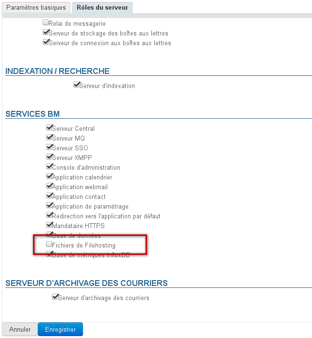
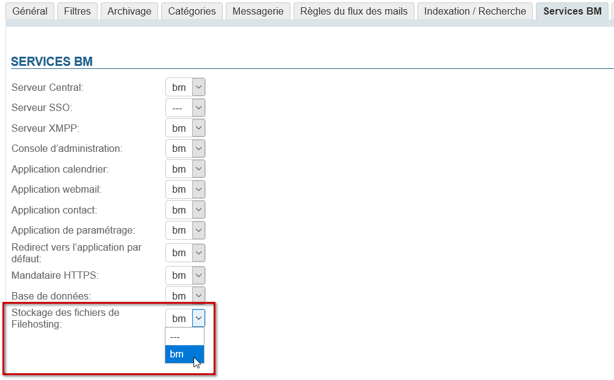
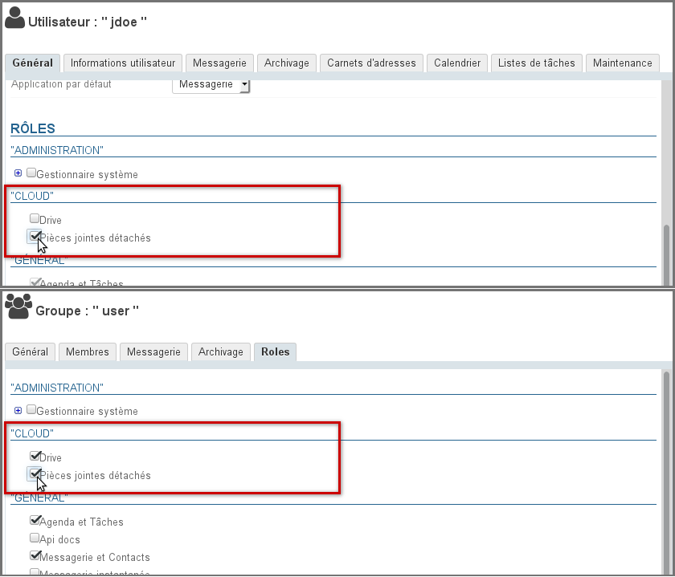
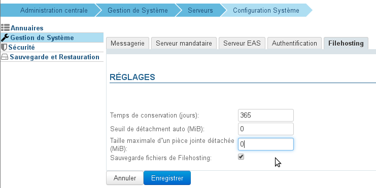

# Abtrennen von Anlagen


## Präsentation

BlueMind bietet die Möglichkeit, [Anlagen von Nachrichten abzutrennen,](/Guide_de_l_utilisateur/La_messagerie/Fichiers_volumineux_et_détachement_des_pièces_jointes/) um sie den Empfängern als Download-Link zu präsentieren. Hierdurch wird die gesendete Nachricht und damit die Kommunikationsserver und -netze entlastet: Die Datei wird nicht mehr mit der E-Mail übertragen, um auf dem Server gespeichert zu werden, der sie zusätzlich zum sendenden Server empfängt und eventuell durch Übertragungen und Antworten dupliziert und vervielfältigt wird.


## Speicherung der Dateien

Die Dateien werden auf dem BlueMind-Server im Verzeichnis `/var/spool/bm-filehosting/<domain>/` gespeichert.


:::tip

Ordnerbaum

Dateien werden in Unterordnern nach Benutzer-UID wie folgt gespeichert `/var/spool/bm-filehosting/<domain>/**<initiale de l'UID>/<UID>**/Attachments`

So haben aus BlueMind 3.0 migrierte Benutzer ein Ordnerformat `/u/user_entity_XXX` und Benutzer, die in 3.5 angelegt wurden, ein Ordnerformat `f/F149E21D-596B-49CF-AECC-AC354139A06B.`

:::

Die auf diese Weise gespeicherten Dateien werden nicht in den Benutzerkontingenten gezählt, die nur E-Mails betreffen, unabhängig davon, ob die *Drive-Funktion* (Möglichkeit, die Dateien nachträglich zu finden) aktiviert ist oder nicht.

Je nach Nutzung und Anzahl der Benutzer der Anlage kann dieser Platz also sehr groß sein. Um die Sättigung des Speicherplatzes auf dem Server zu verhindern, empfiehlt es sich, ein Setup zur Auslagerung des Speichers zu erstellen und eine Überwachung darauf einzurichten.

## Implementierung

### Installation von Paketen


:::info

Ab BlueMind 4.3 werden die Pakete standardmäßig installiert, eine manuelle Installation ist nicht erforderlich.

:::

Standardmäßig ist bei der Installation von BlueMind Versionen vor 4.3 das Trennen von Anlagen für Benutzer nicht verfügbar. Um ihnen den Zugriff auf diese Funktion zu ermöglichen, muss der Administrator die erforderlichen Pakete installieren und den Server neu starten:


**
Debian/Ubuntu


**
RedHat/CentOS


```
# sudo aptitude install bm-plugin-webserver-filehosting bm-plugin-core-filehosting-filesystem bm-plugin-admin-console-filehosting-settings
# bmctl restart
```


```
# yum install bm-plugin-webserver-filehosting bm-plugin-core-filehosting-filesystem bm-plugin-admin-console-filehosting-settings
# bmctl restart
```


:::info

Derzeit werden die Dateien auf dem BlueMind-Server gehostet. Eine [Verbindung mit dem Nextcloud-Dienst](/Guide_de_l_administrateur/Configuration/Détachement_des_pièces_jointes/Connecter_avec_Nextcloud/) ist ebenfalls möglich.

In Zukunft wird BlueMind die Verbindung mit anderen externen Filesharing-Diensten wie Dropbox, ownCloud, Pydio usw. ermöglichen.

:::

### Server-Definition

BlueMind muss mitgeteilt werden, auf welchem Server die abgetrennten Dateien gespeichert werden sollen, indem die Rolle „Filehosting-Datei“ dem gewünschten Server zugewiesen wird, auch bei Einzelserver-Architektur.

- eingeloggt als admin0
- gehen Sie zu Systemverwaltung > Anwendungsserver > [Server wählen] > Registerkarte „Server-Rollen“
- aktivieren Sie im Abschnitt „BM-Dienste“ das Kontrollkästchen "Filehosting-Dateien":


### Aktivierung für die Domäne

Nachdem der Server definiert wurde, muss der Dienst für die gewünschte(n) Domäne(n) aktiviert werden.

Gehen Sie dazu in die Systemverwaltung > Überwachte Domänen > wählen Sie eine Domäne > Registerkarte „BM-Dienste“ und geben Sie in der Dropdown-Liste den Server an, auf dem die Rolle zuvor aktiviert wurde:



### Aktivierung für Benutzer

Sobald die Pakete installiert und der Server definiert ist, muss die Funktion für die Benutzer aktiviert werden, indem ihnen die entsprechende Rolle zugewiesen wird; so kann die Funktion für alle Benutzer oder nur für einige von ihnen, entweder namentlich oder über Gruppen, aktiviert werden.

2 zusätzliche Rechte sind daher jetzt verfügbar:

- **Abgetrennte Anlagen**: Ermöglicht dem Benutzer das Abtrennen und Anhängen von Dateien
- **Laufwerk**: Ermöglicht den Zugriff auf die BlueMind-Dateiauswahl . Der Benutzer kann seine zuvor gesendeten Dateien durchsuchen und sie erneut an E-Mails anhängen.
Dies spart Speicherplatz, da die gleiche Datei nicht mehrmals auf dem Server gespeichert wird.


:::tip

Gekoppelt mit einer NextCloud-Installation gibt dieses Recht dem Nutzer Zugriff auf seinen persönlichen Speicherplatz auf ihr.

:::


Gehen Sie in der Administrationskonsole zu Entitätsverwaltung > Verzeichniseinträge:

- wählen Sie die gewünschte Gruppe oder den gewünschten Benutzer.
- Gehen Sie zur Rollenverwaltung:
    - Für eine Gruppe auf die Registerkarte „Rollen“ gehen
    - Für einen Benutzer auf der Registerkarte „Allgemeines“ bleiben und scrollen Sie nach unten zum Abschnitt „Rollen“
- Markieren Sie im Bereich „CLOUD“ die gewünschte(n) Funktion(en):


## Konfiguration

Die Konfiguration kann an mehreren Stellen in der Administrationskonsole vorgenommen werden:

- In Systemverwaltung >
[Systemkonfiguration](/Guide_de_l_administrateur/Configuration/Configuration_système/) > Registerkarte Filehosting: diese Registerkarte legt die Standardwerte für **neu erstellte Domänen fest**, **sie definiert oder überschreibt nicht die Werte für alle Domänen**
- in Systemverwaltung > Überwachte Domänen > Domäne wählen > > Registerkarte Filehosting: Diese Registerkarte definiert  die Werte für die betreffende Domäne.


Sobald die Pakete installiert und die Rollen zugewiesen sind, wird den Benutzern die Abtrennung der Anlagen angeboten, wobei standardmäßig zugelassene maximale Größe von 5MiB beträgt.

Um diesen Grenzwert zu ändern und auf weitere Konfigurationsoptionen zuzugreifen:

- melden Sie sich bei BlueMind als admin0 an
- gehen Sie zu Systemverwaltung > Überwachte Domänen > wählen Sie eine Domäne > Registerkarte Filehosting:  
    - **Aufbewahrungszeit (Tage)**: die Anzahl der Tage, nach denen Dateien ab ersten dem Versanddatum auf dem Server gelöscht werden
    - **Schwellenwert für automatische Abtrennung (MiB)**: die Größe, bei der eine zu einer Nachricht hinzugefügte Datei automatisch von ihr abgetrennt wird
    - **Maximale Größe einer abgetrennten Anlage (MiB)**: maximal zulässige Dateigröße
Dies ist die zulässige Größe **pro Datei**, so dass mehrere Dateien, deren Gesamtgröße die Schwellen überschreiten, an die gleiche Nachricht angehängt und von ihr abgetrennt werden können, solange jede von ihnen den Schwellenwert einhält.

    - **Filehosting-Dateisicherung**: Wenn dieses Kontrollkästchen aktiviert ist, wird der Speicherordner auf dem Server in die [BlueMind-Sicherungsaufgaben](/Guide_de_l_administrateur/Sauvegarde_et_restauration/) integriert


:::info

Die Einheit MiB (MebiByte) ist ein Vielfaches des Bytes (Oktett), die von MB (Megabyte, oder Mo-Megaoktett) zu unterscheiden ist: Sie entspricht 1024 Kebibytes, die wiederum 1024 Bytes (Oktetts) entsprechen.

9 MiB entsprechen somit 9,43718 MB

:::


