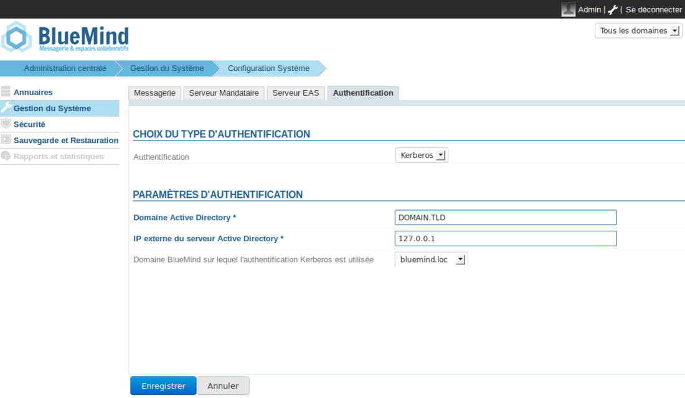
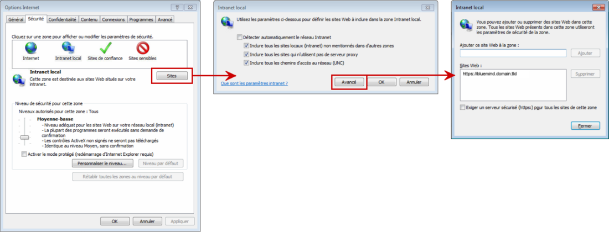

# Implementierung des SSO Kerberos


## Präsentation

Dieses Dokument beschreibt die Implementierung von BlueMinds Erkennung der Kerberos-Authentifizierung in einer Windows-Infrastruktur.

Diese Authentifizierung ist ab Version 3.0.12 von BlueMind möglich.


:::info

Im weiteren Verlauf dieses Dokuments betrachten wir die externe Url von BlueMind, auf welche die Benutzer der *bluemind.domain.tld* und der ActiveDirectory-Server *ad.domain.tld* zugreifen können.

Die Domäne, in der sich diese Rechner befinden, ist *DOMAIN.TLD*.

:::


## Installationsvoraussetzungen

Installieren Sie das dedizierte Paket auf dem Server:


**
Ubuntu/Debian


**
RedHat/CentOS


aptitude install bm-plugin-hps-kerberos


yum install bm-plugin-hps-kerberos


## Vorbereitung der Anmeldeinformationen

1. Erstellen Sie einen Dienstbenutzer für die Kerberos Authentifizierung in ActiveDirectory. Zum Beispiel *bmkrb* mit dem Passwort „krbpwd“
2. Starten Sie eine Konsole „cmd.exe“ und führen Sie den folgenden Befehl aus:


```
setspn -A HTTP/bluemind.domain.tld bmkrb
```


3. Der Befehl sollte ein Ergebnis liefern, das den folgenden Zeilen entspricht: 


```
Registering ServicePrincipalNames for CN=bmkrb,CN=Users,DC=domain,DC=tld
		HTTP/bluemind.domain.tld
Updated object
```


4. Führen Sie dann den folgenden Befehl aus:


```
ktpass /out C:\hps.keytab /mapuser bmkrb@DOMAIN.TLD /princ HTTP/bluemind.domain.tld@DOMAIN.TLD /pass krbpwd /kvno 0 /ptype KRB5\_NT\_PRINCIPAL
```


5. Das Ergebnis sollte wie die folgenden Zeilen aussehen:


```
Targeting domain controller: AD.domain.tld
Using legacy password setting method
Successfully mapped HTTP/bluemind.domain.tld to bmkrb.
Output keytab to C:\hps.keytab
```


## Von der Administrationsschnittstelle aus

1. Navigieren Sie **in admin0 **auf die Seite: Systemverwaltung -> Systemkonfiguration -> Registerkarte **Authentifizierung**.
2. Wählen Sie den **Kerberos** Authentifizierungsmodus im Dropdown-Menü und füllen Sie die zugehörigen Felder aus (die angeforderte keytab-Datei ist: C:\hps.keytab, die zuvor auf den Kerberos-Server exportiert wurde)
3. Speichern Sie die Änderungen. Sie müssen den bm-hps-Dienst neu starten.


:::info

Sobald die Kerberos-Authentifizierung aktiviert ist, werden Sie automatisch authentifiziert, wenn Ihr Browser richtig konfiguriert ist. Wenn Sie eine Verbindung in **admin0** oder auf einer anderen Domäne herstellen möchten, gehen Sie auf die Seite: bm.domain.tld**/native.**

:::

In den folgenden Kapiteln können Sie die Kerberos-Authentifizierung „von Hand“ konfigurieren. [Dieser Abschnitt](https://forge.bluemind.net/confluence/display/DA/.Mise+en+place+du+SSO+Kerberos+vBM-4#id-.MiseenplaceduSSOKerberosvBM4-Configurationclient) könnte jedoch für Sie von Interesse sein, wenn der Name Ihres Kerberos-Domäne nicht mit dem der BlueMind-Domäne übereinstimmt.

## BlueMind von Hand konfigurieren

1. Kopieren Sie die Datei `C:\hps.keytab` vom Kerberos-Server auf den BlueMind-Server in `/etc/bm-hps/`
2. Kopieren Sie die Datei `/etc/bm/default/bm-hps.ini` nach `/etc/bm/local/bm-hps.ini`
3. Rufen Sie die Webseite [https://github.com/bluemind-net/hps-kerberos-sample](https://github.com/bluemind-net/hps-kerberos-sample) auf, um die Beispieldateien `bm-hps.ini`, `jaas.conf` und `krb5.ini` herunterzuladen
4. 
    1. Kopieren Sie die Dateien `jaas.conf` und `krb5.ini` in das Verzeichnis `/etc/bm-hps` des BlueMind-Servers
    2. Kopieren Sie den Inhalt der Datei bm-hps.ini in die zuvor kopierte Datei `/etc/bm/local/bm-hps.ini`

5. Ändern Sie in der Datei jaas.conf die folgenden Informationen:
    1. `principal="HTTP/bluemind.domain.tld@DOMAIN.TLD"`
6. Ändern Sie in der Datei `krb5.inidie` folgenden Informationen:
    1. `default_realm = DOMAIN.TLD`
    2. In `[ realms ]`, `DOMAIN.TLD = { kdc = <ip_ad_server>:88 }`
    3. In `[ domain_realm ]`, `domain.tld = DOMAIN.TLD` und `.domain.tld = DOMAIN.TLD`


:::info

WICHTIG

Der ActiveDirectory-Domänenname muss **in der Konfiguration in GROSSBUCHSTABEN geschrieben** werden, sonst funktioniert sie nicht.

:::

## Die Kerberos-Domäne, die sich von der BlueMind-Domäne unterscheidet

Seit der Version 3.0.7 von BlueMind ist es möglich, die Identifikationserkennung mit einer anderen Kerberos-Domäne als der BlueMind-Domäne einzurichten.

Legen Sie dazu auf dem Server eine neue Konfigurationsdatei `/etc/bm-hps/mappings.ini` mit folgendem Inhalt an:


```
[bm\_mappings]
DOMAINEAD.LAN=domaineBM.vmw
```


Dabei ist `DOMAINEAD.LAN` meine AD-Domäne und `domainBM.vmw` meine BlueMind-Domäne.

Sobald die Datei erstellt ist, BlueMind neu starten:


```
# bmctl restart
```


## Client-Konfiguration

Der Client-Browser betrachtet möglicherweise die BlueMind-Domäne als nicht vertrauenswürdig. Sie müssen die URL für den Zugriff auf BlueMind als vertrauenswürdige Website im Browser hinzufügen.

### Firefox

Die Konfiguration der vertrauenswürdigen Website erfolgt in der Konfiguration der Browser-Einstellungen. Vorgehensweise:

- in der Adressleiste des Browsers eingeben:


```
about:config
```


- Bestätigen Sie die Warnung, indem Sie auf „Ich werde vorsichtig sein“ klicken
- Geben Sie in das Suchfeld ein:


```
trusted
```


- Doppelklicken Sie auf den Parameter „network.negotiate-auth.trusted-uris“ oder klicken Sie mit der rechten Maustaste auf > Ändern
- Geben Sie die Adresse der BlueMind-Domäne ein, hier *bluemind.domain.tld* und bestätigen Sie.Der Parameter erscheint dann fett, d.h. dass es sich um einen geänderten Parameter handelt, der nicht mehr seinen Standardwert hat:
- Firefox neu starten, um die Änderung zu berücksichtigen.


### Internet Explorer

Die Konfiguration der vertrauenswürdigen Website erfolgt in der Konfiguration der Internetoptionen:

- Gehen Sie in das Menü Tool > Internetoptionen
- Gehen Sie zum lokalen Intranet und klicken Sie auf die Schaltfläche „Sites“
- Klicken Sie im neuen Dialogfeld auf die Schaltfläche „Erweitert“
- Füllen Sie das Feld „Diese Website zur Zone hinzufügen“ aus und klicken Sie auf „Hinzufügen“. Die Website sollte in die untere Websiteliste aufgenommen werden.
- Klicken Sie zum Beenden auf „Schließen“, dann auf „OK“ im 2. Dialogfeld und zum Schluss auf „OK“ im ersten Dialogfeld.
- Den Browser neu starten, damit die Änderung wirksam wird.


### Chrome

Chrome basiert auf der Konfiguration des Internet Explorers, so dass Sie unter Windows den gleichen Vorgang durchführen müssen, damit die Seite berücksichtigt wird.

Zudem kann - und dies auch auf anderen Betriebssystemen - die Website mit der folgenden Befehlszeile berücksichtigt werden:


```
google-chrome --auth-server-whitelist="\*bluemind.domain.tld"

```


### Referenzen

Weitere Informationen finden Sie auf den folgenden Seiten:

[http://sammoffatt.com.au/jauthtools/Kerberos/Browser_Support](http://sammoffatt.com.au/jauthtools/Kerberos/Browser_Support)

[http://support.microsoft.com/kb/303650](http://support.microsoft.com/kb/303650)


