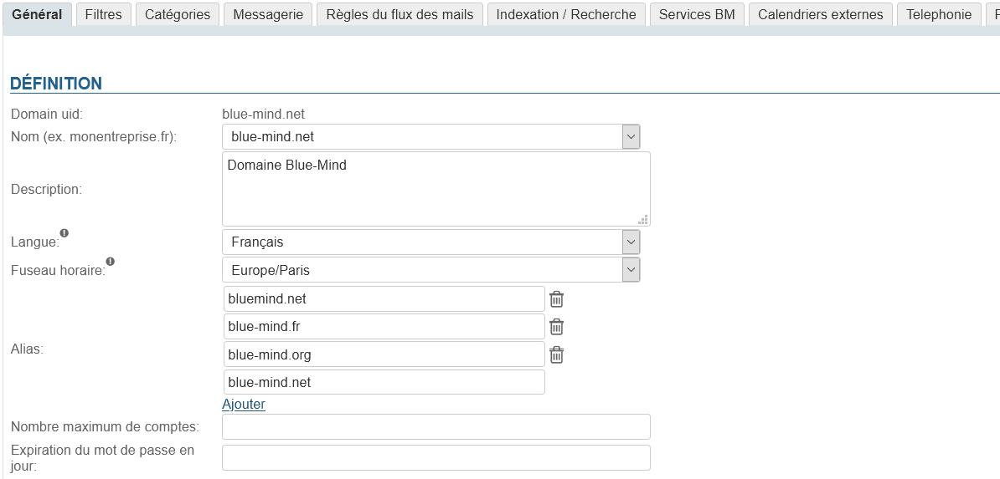
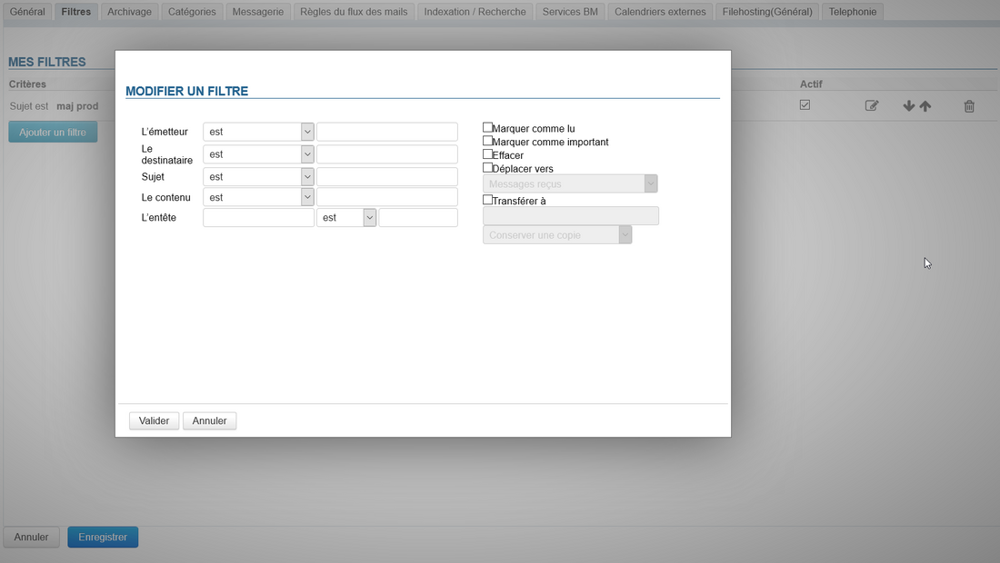
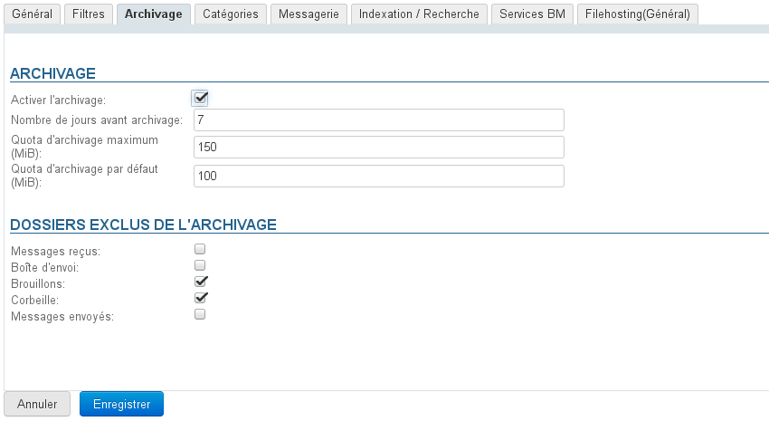
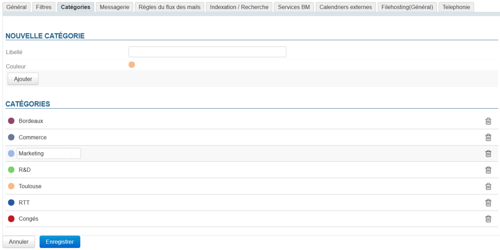
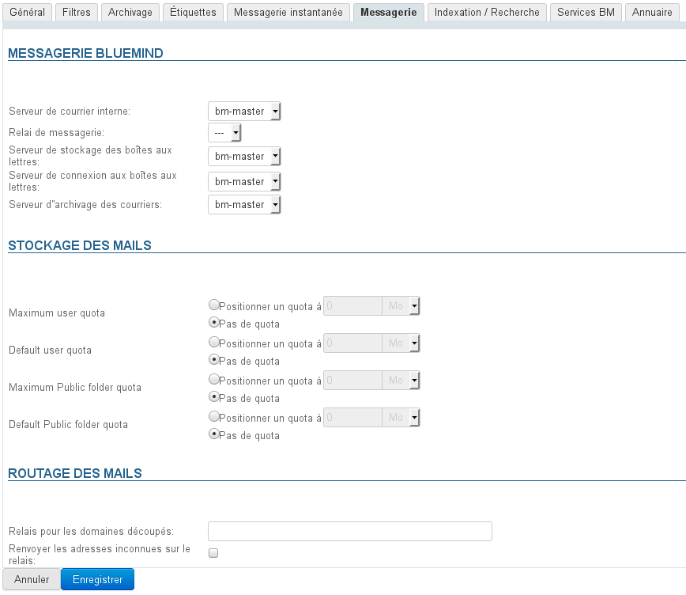
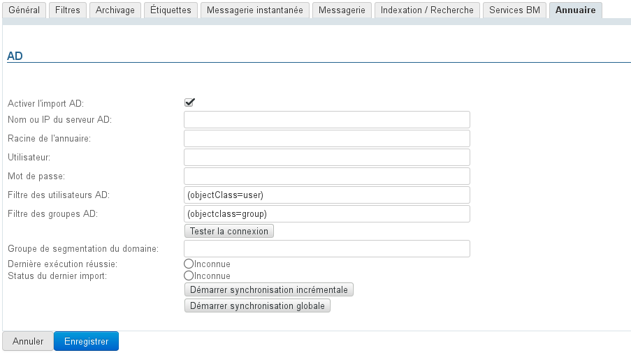

# Domänenverwaltung

## Präsentation

Der Bereich der Domänenverwaltung ermöglicht dem Administrator den Zugriff auf technische Domäneneinstellungen (Serveradressen, Domänen-Aliasse usw.) sowie auf allgemeine und Standard-Benutzereinstellungen (Adressbücher, Nachrichtenfilter, Speicherquoten, Archivierung usw.).

Speichern

## Registerkarte „Allgemeines“

Diese erste Registerkarte enthält allgemeine Informationen und Optionen für die ausgewählte Domäne:

Die UID der Domain wird als Bezeichner verwendet; sie ist in BlueMind eindeutig und nicht veränderbar, kann aber positioniert werden:

- **Name**: der übliche Name der Domain, der aus den Aliasen der Domain gewählt werden kann
- **Beschreibung**: eine Beschreibung der Domäne, ist vor allem dann sinnvoll, wenn die Installation aus mehreren Domänen besteht, insbesondere wenn diese sich ähneln.
- **Sprache**: Die Standardsprache für Benutzer der Domain
- **Zeitzone**: die Standardzeitzone für Domain-Benutzer (ab BlueMind 4.4)

:::info

Ändern der Sprache oder der Zeitzone

Hinweis: Wenn der Wert der Felder „Sprache“ oder „Zeitzone“ geändert wird, wird er auch für Benutzer geändert, die den alten Wert verwendet haben, und nur für diese.
Als Beispiel ersetzen wir den Wert „Europa/Paris“ durch "Amerika/Toronto":

- Benutzer, die "Europa/Paris" hatten, wechseln automatisch zu "Amerika/Toronto
- Benutzer, die den Ausgangswert auf einen anderen Wert geändert hatten, behalten diesen anderen Wert
- Benutzer, die nach dieser Änderung angelegt werden, erhalten "Amerika/Toronto"

:::

- **Aliasse:** Sie können so viele Aliasse hinzufügen, wie Sie möchten
    - klicken Sie auf „Hinzufügen“, um ein neues Feld aufzurufen und einen neuen Alias einzugeben
    - klicken Sie auf das Papierkorbsymbol vor einem Alias, um ihn zu löschen
- **Maximale Anzahl von Konten:** die maximale Anzahl von Benutzern, die auf dieser Domäne erstellt werden können.Diese Option wird verwendet, um die Domänen zu verteilen und die Anzahl der von einem Abonnement erlaubten Konten zu begrenzen.
- **Passwortablauf in Tagen:** Legt die Anzahl der Tage für die Gültigkeit des Benutzerpassworts fest, nachdem es vergeben oder geändert wurde.
Diese Option, die ab Version 4.3 verfügbar ist, gilt für alle Benutzer der Domäne. Dieser Wert kann geändert oder der Passwortablauf für einen Benutzer erzwungen werden, indem Sie zu seinem Verwaltungsdatensatz gehen, weitere Informationen finden Sie auf der Seite [Entitätsverwaltung](/Guide_de_l_administrateur/Gestion_des_entites/) > [Benutzer](/Guide_de_l_administrateur/Gestion_des_entites/Utilisateurs/)

:::info

Verbinden mit AD oder LDAP

Die Ablaufrichtlinie wird nicht auf Benutzer angewendet, die aus einem AD- oder LDAP-Verzeichnis importiert wurden.

:::

## Filter

Auf dieser Registerkarte können Sie gemeinsame Filter für die Domänenbenutzer festlegen: Die hier vorhandenen Filter gelten für die E-Mails aller Benutzer der Domäne.

Global definierte Filter ermöglichen z. B. das automatische Verschieben von als „SPAM“ markierten Nachrichten durch Analyse der Nachrichten-Kopfzeilen.

:::info

Domänenfilter werden vom Server VOR den Benutzerfiltern ausgeführt, so dass ihre Aktionen die Funktion eines Benutzerfilters verhindern können (Verschieben in einen Ordner, Markieren oder Weiterleiten)

:::

Die Verwaltung von Domänenfiltern ist identisch mit der von individuellen Benutzerfiltern:

Ausführliche Informationen zur Erstellung und zu den Optionen von Filtern finden Sie unter [Nachrichtenfilter](/Guide_de_l_utilisateur/La_messagerie/Les_filtres_de_messages/).

## Archivierung

Diese Registerkarte wird verwendet, um eine globale Archivierungsrichtlinie für den betreffenden Bereich zu implementieren.

Weitere Informationen finden Sie unter [Archivierung - 2.3 Aktivieren der Archivierung von Benutzer-E-Mails - a) Globale Archivierung](/Guide_de_l_administrateur/Configuration/Archivage/)

## Kategorien

Auf dieser Registerkarte können Sie Domänen-Kategorien verwalten, die von allen Benutzern gemeinsam genutzt werden:

Die Bedienung ist ähnlich wie bei der [Verwaltung von Benutzerkategorien](/Guide_de_l_utilisateur/Les_catégories_tags_/).

## E-Mail-System

Auf dieser Registerkarte können Sie die Server einrichten, die BlueMind Mail verwalten für die Domäne:

- Interner Mailbox-Server
- Mailbox-Relais
- Mailbox-Speicherserver
- Mailbox-Verbindungsserver
- E-Mail-Archivierungsserver
- Routing-Relais

Hier werden die Kontingente für alle Benutzer in der Domäne festgelegt.

:::info

Kontingente, die mit „öffentlichen Ordnern“ verbunden sind, werden bei freigegebene Boxen angewendet.

:::

## Indexierung/Suche

Auf dieser Registerkarte wird die Adresse des Indexservers festgelegt, der für alle BlueMind-Anwendungen (Mailbox, Kontakte, Kalender und Instant Messaging) gilt.

## BM Dienste

Auf dieser Registerkarte können Sie die Serveradresse für jeden BlueMind-Dienst der Domäne festlegen:

- Server:
    - Zentral
    - MQ
    - SSO
    - XMPP
- Administrationskonsole
- Anwendungen:
    - Kalender
    - Webmailer
    - Kontakt
    - Einstellung (Verwaltung der persönlichen Parameter)
- Umleitung zur Standardanwendung
- HTTPS-Proxy
- Datenbank
- Basis der InfluxDB Metriken

## Verzeichnis

Die Registerkarte „Verzeichnis“ dient zum Einrichten und Verwalten der Synchronisation mit AD*(ActiveDirectory*) oderLDAP-Verzeichnissen.

Weitere Informationen zur Implementierung der Synchronisierung mit externen Verzeichnissen finden Sie unter [Systemverwaltung > Active Directory-Synchronisierung](/Guide_de_l_administrateur/Gestion_des_entites/Synchronisation_Active_Directory/) und [Systemverwaltung > LDAP-Synchronisierung](/Guide_de_l_administrateur/Gestion_des_entites/Synchronisation_LDAP/)

