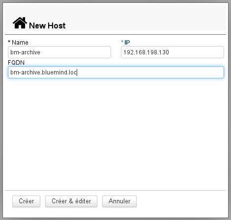
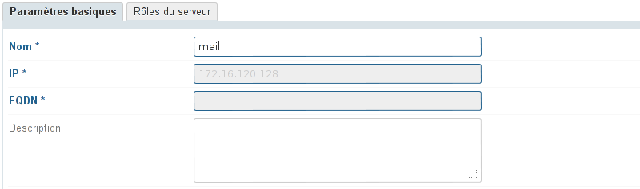
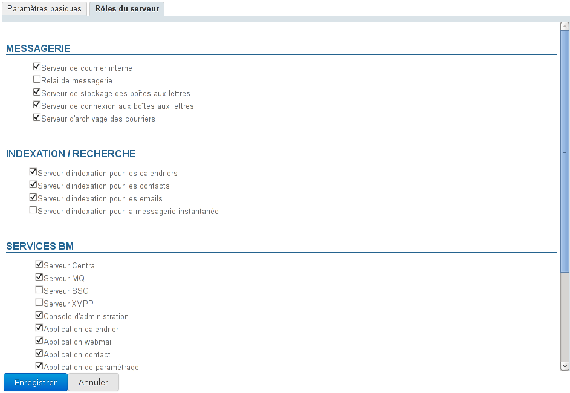

# Server-Verwaltung

## Präsentation

Auf der Seite „Server“ der BlueMind-Administrationskonsole können Sie die BlueMind-Installationsserver und die von ihnen gehosteten Dienste verwalten.

## Hinzufügen eines Servers

Um einen neuen Server hinzuzufügen, wählen Sie auf der Seite Systemverwaltung > Anwendungsserver:

1. ****Hinzufügen des Servers in BlueMind**** Klicken Sie auf die Schaltfläche „Neuer Server“ und geben Sie die Informationen des Servers ein, auf dem der oder die Dienste installiert wurden:
    - **Name**: Der Name, der dem Server gegeben wird, kann sich von dem Namen des Rechners im Netzwerk unterscheiden, er wird vom Administrator frei gewählt
    - **IP**: die IP-Adresse des Servers
    - **FQDN**: *„Fully Qualified Domain Name“* ist der vollständige Name des Rechners in der Domäne.
Die Schaltfläche „Erstellen“ (Eingabetaste) führt zur schnellen Erstellung des Servers, er wird in BlueMind hinzugefügt, aber ohne definierte Rolle. Die Schaltfläche „Erstellen & Bearbeiten“ (Tasten &lt;Strg-Eingabe>) legt den Server an und leitet zu seiner Verwaltung weiter, um ihm eine bzw. mehrere Rollen zuzuweisen.

:::info

Die Dienste müssen zum Zeitpunkt ihrer Konfiguration installiert und erreichbar sein, sonst erscheint eine Meldung wie „Can't connect to Node Server...“ und der Server kann nicht hinzugefügt werden.

:::
2. ****A********ktivierung der Server-Rolle(n)****: Gehen Sie in die Serververwaltung (Schaltfläche „Anlegen & Bearbeiten“ oben oder in der Liste der Server auswählen)
    - Gehen Sie auf die Registerkarte „Server-Rolle“, die alle zuweisbaren Rollen anzeigt.
    - Aktivieren Sie die Rollen, die dem/den installierten Dienst(en) entsprechen.
    - Bestätigen Sie mit der Schaltfläche „Speichern“ unten am Bildschirm, damit die Änderungen berücksichtigt werden. 

Der neue Server ist nun verfügbar und kann in der [Domänenverwaltung](/Guide_de_l_administrateur/Présentation_du_produit/Messagerie_multi_domaines/)den entsprechenden Diensten zugewiesen werden.

## Server-Verwaltung

Indem Sie in der Liste der Server auf die Zeile des gewünschten Servers klicken, gelangen Sie in die Verwaltung dieses Servers.

Die erste Registerkarte **„Grundeinstellungen“** zeigt die Einstellungen für den Serverstandort, nur der Name und die Beschreibung können geändert werden, aber nicht die IP-Adresse und der FQDN ([Fully qualified domain name](http://fr.wikipedia.org/wiki/Fully_qualified_domain_name)):

Auf der Registerkarte **„Server-Rollen“** können Sie die verschiedenen E-Mail-Rollen, Indizierungen und Dienste definieren, die der Server ausführen kann:

