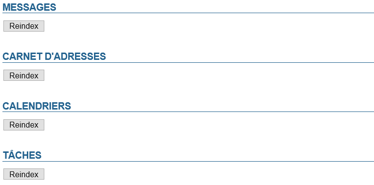

# Indizierung

## Präsentation

Ab BlueMind 4.2.4 wurden die Indizierungsaufgaben aus der Planung entfernt, um den Ressourcenverbrauch zu verringern. Diese Aktionen werden jetzt bei Bedarf automatisch vom System ausgeführt und können von einem Administrator über eine spezielle Seite in der Administrationskonsole manuell ausgelöst werden.

Im Leitfaden [Probleme bei Suche und Indizierung](/Guide_de_l_administrateur/Résolution_de_problèmes/Problèmes_de_recherche_et_indexation/) finden Sie Hilfestellungen zur Lösung von Indizierungsproblemen.

## Indizierungsaufgaben durchführen

Eine Indizierung ist vorzunehmen, wenn bei vielen Benutzern Probleme in der Suchmaschine einer Anwendung auftreten:

- Unvollständige Webmailer-Suchmaschine (nicht alle Suchoptionen sind verfügbar)
- Unvollständige Suchergebnisse
- Inkohärente Suchergebnisse (z. B. falscher Lesestatus)
- Serverfehler beim Abfragen einer E-Mail in einem Suchergebnis
- Nicht anklickbares Alphabet in Adressbüchern
- ...

Um die Daten neu zu indizieren, gehen Sie auf die entsprechende Seite der Administrationskonsole : Systemverwaltung > Indizierung

Klicken Sie einfach auf die Schaltfläche der gewünschten Anwendung, um die Neuindizierung für das gesamte System (alle Domains, alle Benutzer) zu starten: Nachrichten, Adressbuch, Kalender, Aufgaben.

