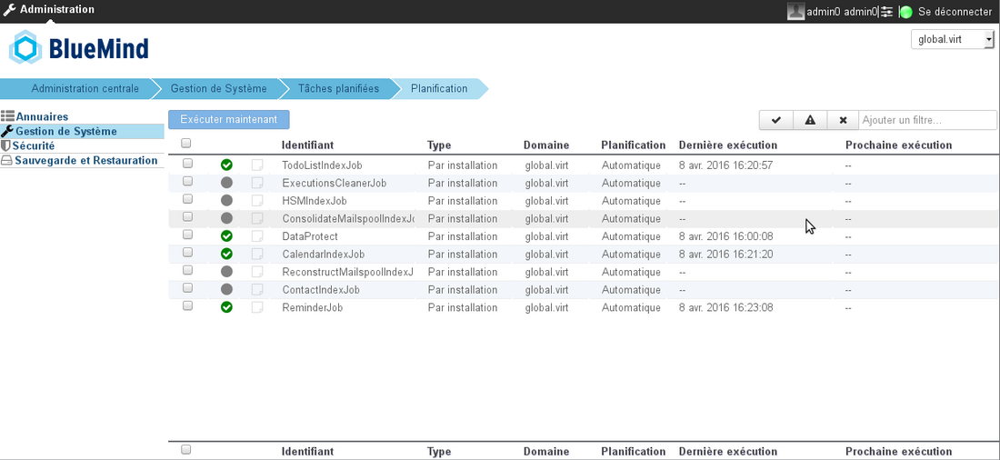
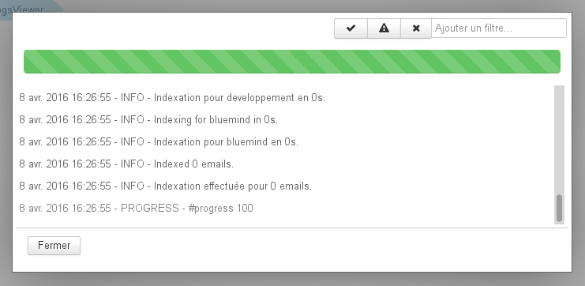
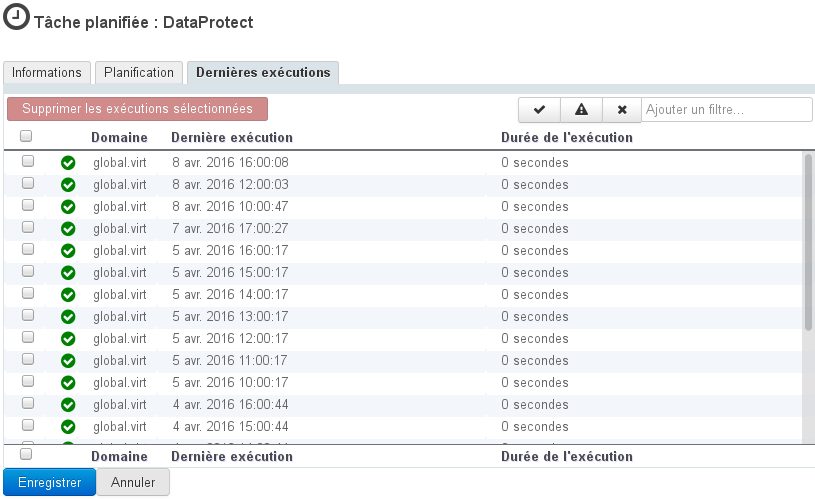
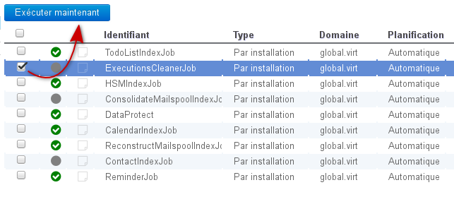

# Geplante Aufgaben

## Präsentation

Mit geplanten Aufgaben können Sie die automatische Ausführung von Aufgaben planen.

Nicht alle Administratoren haben Zugriff auf die gleichen Aufgaben: Der Systemadministrator sieht alle Aufgaben der überwachten Domänen, der Domänenadministrator hat Zugriff nur auf die für seine Domäne spezifischen Aufgaben.

## Verwaltung

Die Verwaltung der geplanten Aufgaben erfolgt im Bereich Systemverwaltung > Geplante Aufgaben.

Tâches planifiées de l'administrateur système.

Die Startseite präsentiert die Liste der überwachten Aufgaben mit den wichtigsten Informationen, um ihren Status zu identifizieren:

- Statussymbol der letzten Durchführung (Erfolg, Fehlschlag usw.) :
    - ein blinkender grauer Kreis, wenn die Aufgabe gerade ausgeführt wird
    - ein grünes Häkchen, wenn die letzte Ausführung erfolgreich war
    - das Zeichen „Achtung“ wenn sie erfolgreich war und zugleich Fehlermeldungen (Warnung) aufgetreten sind
    - ein Kreuz bei Fehlschlag.
- Protokollstatus-Symbol: Es ist schwarz, wenn ungelesene Protokolle vorhanden sind, entweder während oder nach einer Ausführung. Ein Klick auf das Symbol öffnet die Pop-up-Anzeige, Meldungen werden in Echtzeit angezeigt, wenn die Aufgabe ausgeführt wird:
- Aufgabenkennung
- Ausführungsart
- Anwendungsbereich
- Planungsart
- letztes Ausführungsdatum
- Datum der nächsten geplanten Ausführung

Oben rechts in der Liste stehen Filtertools zur Verfügung, um Aufgaben nach ihrem Status anzuzeigen (klicken Sie auf die Statussymbole, um ihre Anzeige zu aktivieren und zu deaktivieren) oder indem Sie mit dem Freitextfeld ein Wort oder einen Teil eines Wortes filtern.

### Verwalten einer Aufgabe

Ein Klick auf die Aufgabenzeile in der Liste ermöglicht den Zugriff auf ihre Verwaltung, die in 3 Registerkarten dargestellt wird:

#### Allgemeine Informationen

Zum Schutz können die Aufgaben-Kennung und -Beschreibung nicht geändert werden.

Der Administrator kann wählen, ob der Ausführungsbericht automatisch an eine oder mehrere personalisierte Adressen gesendet werden soll.
Dazu das entsprechende Kästchen aktivieren und die E-Mail-Adressen der gewünschten Empfänger eingeben.

#### Planung

Planung kann:

- ** automatisch** sein: nach ihren bei der Entwicklung festgelegten Kriterien ist dies das Standardverhalten einer geplanten Aufgabe.
- **programmiert** sein: Der Administrator legt die Periodizität der Ausführung fest. Durch Auswahl der Option „Täglich“ kann der Administrator die Tage und Stunden der Ausführung in der Woche festlegen.

#### Letzte Ausführungen

Auf der letzten Registerkarte können Sie die letzten Ausführungen der Aufgabe anzeigen. Durch Klicken auf eine Ausführung in der Liste wird das Popup-Fenster für die Protokollanzeige geöffnet.

Auch hier stehen Filtertools zur Verfügung, um nur bestimmte Aufgaben zu sehen. Im obigen Beispiel werden nur fehlgeschlagene Aufgaben angezeigt.

### Manuelle Ausführung

Von der To-Do-Liste:

- wählen Sie die gewünschten Aufgaben durch das Ankreuzen des entsprechende Kästchens am Zeilenanfang aus
- klicken Sie auf die Schaltfläche "Jetzt ausführen"

