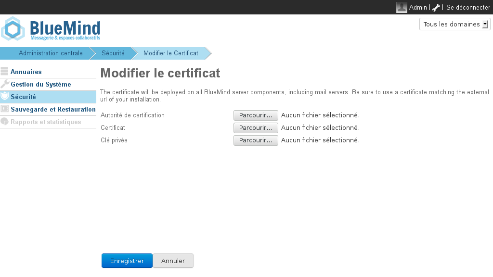

# SSL-Zertifikate


## Präsentation

BlueMind-Server verwenden sichere, zertifikatsbasierte Verbindungen. Bei der Installation von BlueMind erzeugte Zertifikate können bei einer Einzelserver-Installation durch benutzerdefinierte Zertifikate ersetzt werden.


## Voraussetzungen

Um ein SSL-Zertifikat einrichten zu können, müssen Sie über folgende 3 Dateien verfügen:

1. eine Datei, die das neue SSL-Zertifikat enthält
2. eine Datei, die den privaten Schlüssel des neuen Zertifikats enthält, sie darf nicht passwortgeschützt sein
3. eine Datei, die das Zertifikat von der Zertifizierungsstelle enthält, die das neue SSL-Zertifikat ausgestellt hat. Wenn es sich bei dieser Zertifizierungsstelle um eine Zwischenstelle handelt, muss das Stammzertifikat dieser Zertifizierungsstelle an die Datei angehängt werden.


Wenn Ihr Zertifikat im P12-Format vorliegt, müssen Sie das Zertifikat und den privaten Schlüssel im PEM-Format mit den Befehlen erzeugen:


```
openssl pkcs12  -nocerts -in cert.p12 -out privatekey.pem
openssl pkcs12 -clcerts  -nokeys -in cert.p12 -out cert.pem 
```


:::info

Achtung, Sie müssen prüfen, ob der CN oder ein alternativer Name des Zertifikats der externen Url des bluemind-Servers entspricht, Sie können den CN mit dem nachstehenden Befehl prüfen:


```
openssl x509 -noout -subject -in cert.pem
```


:::


## Installieren des Zertifikats

- Anmeldung bei BlueMind als Systemadministrator admin0
- Gehen Sie auf die Seite Sicherheit > Zertifikat ändern
- Mit den 3 „Durchsuchen“ Schaltflächen können Sie die entsprechenden Dateien suchen, um sie an den Server zu senden:
- Klicken Sie auf „Speichern“, um die Dateien hochzuladen und das neue Zertifikat zu berücksichtigen.


