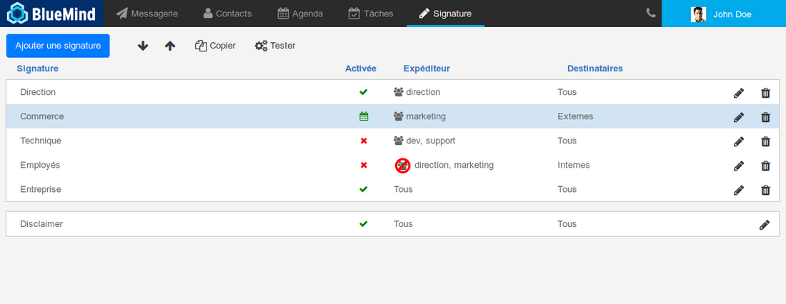
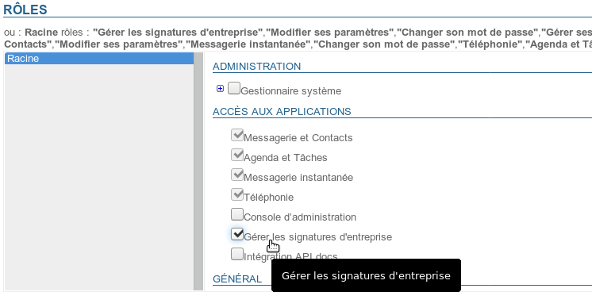
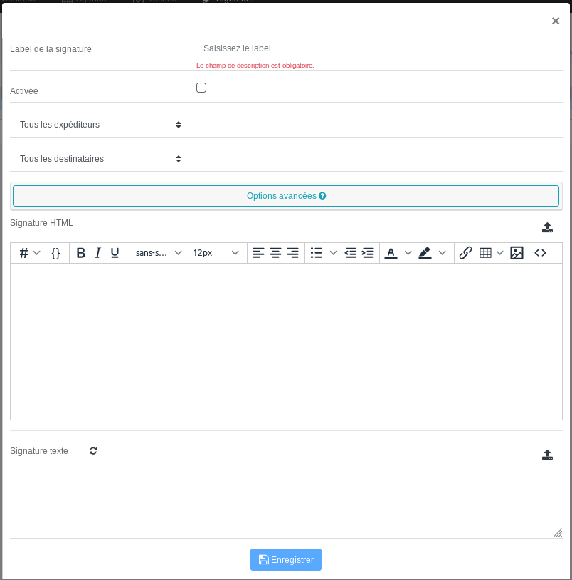
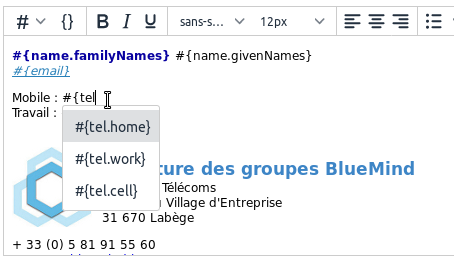
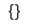
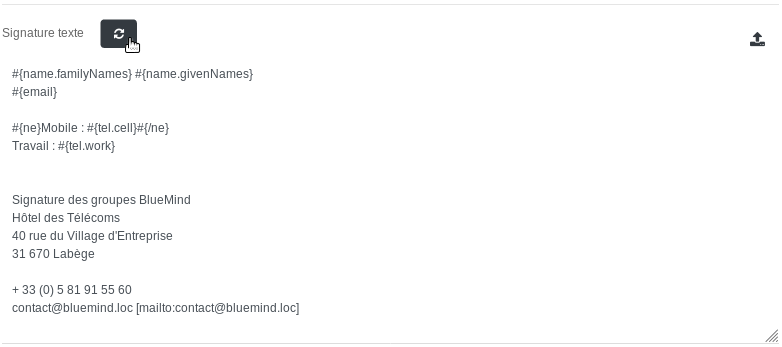
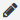
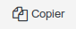
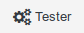
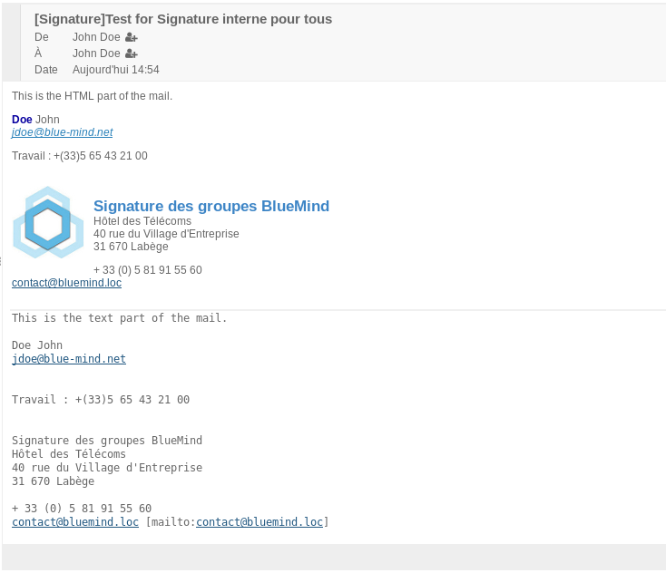

# E-Mail-Unterschriften von Unternehmen


## Präsentation

Mit der neuen Anwendung zur Verwaltung von Firmenunterschriften können automatische Unterschriften definiert werden, die nach verschiedenen Kriterien für alle oder einige Benutzer gelten.

Außerdem ist es möglich, eine Haftungsausschluss-Nachricht einzurichten, die im Englischen allgemein als *Disclaimer* bekannt ist: Diese Meldung, die zusätzlich zur Unterschrift allen Nachrichten ohne Bedingungen hinzugefügt wird, ermöglicht es, allen E-Mails, die von den Benutzern der Domain gesendet werden, verschiedene (kommerzielle, rechtliche, ökologische usw.) Informationen hinzuzufügen.


:::info

Firmenunterschriften sind nicht mit S/MIME kompatibel. Signierten oder verschlüsselten E-Mails wird keine Unterschrift und kein Disclaimer hinzugefügt.

:::




Die Hauptansicht der Anwendung ist in 3 Teile gegliedert:

1. die oben am Bildschirmrand befindlichen Schaltflächen für die wichtigsten Aktionen ermöglichen das Erstellen, Ordnen und Testen von Unterschriften
2. die Liste der Unterschriften mit ihren Hauptmerkmalen:
    - Bezeichnung
    - Status: aktiviert, deaktiviert, programmiert
    - Absender, für die sie gelten
    - Betroffene Empfänger
    - Schaltflächen zum Bearbeiten/Löschen
3. *Disclaimer*: Er hat die gleichen Eigenschaften wie Unterschriften, kann aber nicht entfernt werden.Ein *Disclaimer* ist bei der Installation des Moduls standardmäßig vorhanden, bleibt jedoch leer und inaktiv, bis er parametriert wird.


:::info

Wer wird die Unterschrift sehen?

Die Unterschrift wird in die Nachricht eingefügt und **alle Empfängern dieser Nachricht** erhalten sie.

Es genügt also, wenn nur eines der Absender- und Empfängerpaare die Anforderungen erfüllt, um die Unterschrift für alle Empfänger sichtbar zu machen.

Zum Beispiel wird eine Unterschrift mit den folgenden Kriterien erstellt:

- **Absender**: ist ein Mitglied von "Vertrieb"
- **Empfänger**: extern


Die kaufmännische Leiterin Christiane (christiane@bluemind.loc) schreibt eine E-Mail mit mehreren Empfängern:

- An:
    - Kunde: [client@domaine.swe](mailto:client@domaine.swe)
    - Mitarbeiter: [bernard@bluemind.loc](mailto:bernard@bluemind.loc)
- Kopie:
    - Buchhalter: [jean-claude@bluemind.loc](mailto:jean-claude@bluemind.loc)


 Die Absenderin ist Mitglied der Vertriebsgruppe und der Kunde hat eine externe Adresse  die Unterschrift wird der Nachricht hinzugefügt, alle Empfänger der Nachricht können sie sehen: der Kunde, Bernard und Jean-Claude.

:::

## Installation und Bereitstellung

### Installieren der Anwendung

Um die neue Anwendung zu installieren, installieren Sie die erforderlichen Pakete auf dem BlueMind-Server und starten Sie anschließend BlueMind neu:


**
Debian/Ubuntu


**
RedHat


```
aptitude install bm-plugin-core-signature bm-signature bm-plugin-hps-signature
bmctl restart
```


```
yum install bm-plugin-core-signature bm-signature bm-plugin-hps-signature
bmctl restart
```


### Zugriff auf die Anwendung

#### Zugriffsrechte

Die Verwaltung der Unterschriften erfolgt über eine spezielle BlueMind-Anwendung und nicht direkt über die Administrationskonsole. Daher muss der Superadministrator admin0 Benutzer oder Administratoren benennen, die auf die Anwendung zugreifen können (oder den Zugriff an sie delegieren), um Domainunterschriften zu verwalten.

Vergeben Sie dazu einfach die neue Rolle "Firmenunterschriften verwalten" an einen Benutzer oder eine Gruppe von Benutzern auf die übliche Weise (siehe   [Benutzer - Rollen](https://forge.bluemind.net/confluence/display/BM35/Administration+des+utilisateurs#Administrationdesutilisateurs-user-roles)  ) : 



#### Zugriff

Nach Zuweisung der Rolle und ggf. nach erneuter Anmeldung kann der Benutzer auf die Anwendung wie auf andere BlueMind-Anwendungen über deren Hauptbanner zugreifen:

  

## Verwaltung der Unterschriften

### Erstellen einer Unterschrift

Um eine Unterschrift hinzuzufügen, klicken Sie auf die Schaltfläche "Unterschrift hinzufügen" oben links auf der Seite: 

Das Erstellungs-/Bearbeitungsformular wird vorgeschlagen:



- ** **Unterschrift-Label****: Name, der der Unterschrift zugewiesen wird, damit sie in der Liste identifiziert werden kann. Dieses Feld ist ein Pflichtfeld.
- ** **Aktiviert**:** Kontrollkästchen zum Aktivieren oder Deaktivieren der Unterschrift
- ** **Absender** **: Die Unterschrift gilt für ausgehende Nachrichten, die von den angegebenen Personen erstellt wurden:
    - **Alle Absender**: alle Benutzer der BlueMind Domain
    - **Absender ist**: ein Eingabefeld wird hinzugefügt, in das mit Hilfe der Autovervollständigung eine oder mehrere Entitäten eingetragen werden können (Benutzer oder geteilte Posteingänge).** Diese Option ist ab BlueMind 4.1 verfügbar**
    - **Absender ist Mitglied von**: ein Eingabefeld wird hinzugefügt, in das mit Hilfe der Autovervollständigung eine oder mehrere Gruppen eingefügt werden kann/können. Die Unterschrift wird Benutzern hinzugefügt, die Mitglied** einer oder mehrerer dieser Gruppen sind**.Beispiel: eine spezifische Unterschrift für Mitglieder der Gruppe "Support" die Hilfeanfragen antworten, eine gemeinsame Unterschrift für Mitglieder der Gruppen "Vertrieb" und "Kommunikation" die auf Kundenanfragen antworten
    - **Der Absender ist kein Mitglied von**: Ein Eingabefeld wird hinzugefügt, in das mit Hilfe der Autovervollständigung eine oder mehrere Gruppen eingetragen werden können. Die Unterschrift wird für Benutzer hinzugefügt, **die keiner dieser Gruppen angehören**.Beispiel: eine Unterschrift für alle Benutzer, die nicht Teil der Geschäftsleitung sind, eine Unterschrift für alle nicht-technischen Benutzer, d.h. nicht Teil der Gruppen "Support" und "Entwicklung“ sind
- ** **Empfänger**: **Die Unterschrift gilt für Nachrichten an bestimmte Personen:
    - **Alle Empfänger**: wird auf alle Nachrichten angewendet
    - **Nur interne Empfänger**: wird nur zu Nachrichten hinzugefügt, die an Benutzer der Domain gesendet werden
    - **Mindestens ein externer Empfänger**: wird zu Nachrichten hinzugefügt, bei denen mindestens eine der Empfängeradressen (an oder cc) außerhalb der Domain liegt
- ****Erweiterte Optionen****: Durch Anklicken dieser Zone öffnet sich ein Feld, das den Zugriff auf weitere Optionen ermöglicht:** **
    - ****Gültigkeitsdauer der Unterschrift:**** Zeitraum, in dem die Unterschrift aktiviert wird; dies ermöglicht es, Unterschriften im Voraus zu programmieren und/oder sie temporär zu machen:
        - **Permanent**: Die Unterschrift gilt, solange sie aktiviert ist
        - **Ab**: Die Unterschrift gilt ab **einschließlich** dem angegebenen Datum bis zur Deaktivierung
        - **Bis**: Die Unterschrift gilt ab ihrer Aktivierung bis **einschließlich** des angegebenen Datums
        - **Zeitraum**: Die Unterschrift gilt ab dem ersten angegebenen Datum bis zum zweiten. **Diese Daten sind im Anwendungszeitraum enthalten**.
    - ****Dem Benutzer das Setzen der Unterschrift erlauben****: Ermöglicht es dem Benutzer, die Unterschrift an der gewünschten Stelle zu platzieren (vor oder nach der Nachricht, auf die er antwortet).
Dazu muss der Benutzer die Zeichenkette `--X-BM-SIGNATURE--` an die gewünschte Stelle setzen:

        - Im Webmailer erleichtert BlueMind diesen Vorgang, indem es die Zeichenkette anstelle der üblichen Unterschrift des Benutzers platziert, entsprechend der vom Benutzer in seinen [erweiterten Einstellungen](https://forge.bluemind.net/confluence/display/DA/.Preferences+avancees+vBM-3.5) definierten Option.
Der Benutzer kann diese Markierung dann an die gewünschte Stelle verschieben.

        - In der Client-Software von Drittanbietern (Thunderbird, Mobilgeräte, etc.) muss der Benutzer dieses Tag selbst manuell platzieren, z. B. anstelle seiner üblichen Unterschrift, wenn er sie ersetzt haben möchte.
Dies kann erleichtert werden, indem das Tag als Standardunterschrift in seiner Software definiert wird.

**Wenn der Tag nicht in der E-Mail gefunden wird, wird die Firmenunterschrift automatisch am Ende der Nachricht platziert.**    - ****Vorherige Vorkommen löschen**** löscht beim Beantworten eines Nachrichten-Threads die vorherigen Vorkommen der Unterschrift des Benutzers
- ** **HTML-Unterschrift****: Unterschrift, die den in diesem Format gesendeten Nachrichten hinzugefügt wird.
    - Mit dem [WYSIWYG-Editor](https://fr.wikipedia.org/wiki/What_you_see_is_what_you_get) kann eine Unterschrift erstellt oder per Kopieren/Einfügen aus einer anderen Quelle importiert werden (Webdesignsoftware, Kopie aus einer HTML-Seite oder einer E-Mail usw.)
        - Die Schaltfläche   ermöglicht das Umschalten in den HTML-Code-Bearbeitungsmodus
        - Das Dropdown-Menü  ermöglicht das Einfügen von Variablen (siehe Kasten unten)
    - Das Symbol  am Ende der Zeile ermöglicht den Import des in einer Datei (Textdatei, html-Seite...) enthaltenen HTML-Codes


:::tip

Beim Importieren einer HTML-Datei wird die Textunterschrift automatisch generiert**, wenn die Unterschrift leer ist**.

:::

- ** **Textunterschrift****: einfache Unterschrift, die den im Textformat gesendeten Nachrichten hinzugefügt wird
    - Das Symbol  erzeugt die Textunterschrift aus der HTML-Unterschrift

    - Das Symbol  am Ende der Zeile ermöglicht es, den in einer Datei enthaltenen Text zu importieren


Klicken Sie auf die Schaltfläche  um die Unterschrift zu speichern und das Formular zu verlassen.


:::tip

Wird das Popup ohne vorherige Speicherung geschlossen (Kreuz in der rechten oberen Ecke oder Klick außerhalb des Popups), erscheint ein Bestätigungsfenster, in dem Sie gefragt werden, ob Sie das Popup beenden und die Änderungen verlieren oder zum Bearbeitungs-Popup zurückkehren möchten.

:::

### Die Variablen

Es ist möglich, Variablen zu verwenden, um die Unterschrift je nach Absender anzupassen, damit die Unterschrift z.B. für jeden Benutzer gleich aussieht, aber der Name, die Telefonnummer und die Adresse der Person, die die E-Mail sendet, in der Nachricht erscheint.

#### Verwendung

Es gibt zwei Möglichkeiten, eine Variable hinzuzufügen:

1. den entsprechenden Code beginnend mit "#{„ schreiben, die Autovervollständigung schlägt Ihnen dann während des Schriebens die möglichen Variablen vor:
2. verwenden Sie die Dropdown-Liste  und wählen Sie die gewünschte Variable aus:


#### Bedingte Blöcke

Wenn eine Variable nicht im Benutzerstammsatz eingetragen ist, erscheint dort ein Leerzeichen.

Um dies zu vermeiden, kann ein bedingter Block platziert werden: Wenn die Variable im Benutzerdatensatz nicht ausgefüllt ist, wird der gesamte Block nicht in der Unterschrift erscheinen.
Einen bedingten Block hinzufügen: Markieren Sie den gewünschten Text und klicken Sie dann auf die Schaltfläche  :


Dans cet exemple, seule la ligne "Travail" apparaitra si l'utilisateur n'a pas de numéro de téléphone mobile.


:::tip

Bedingte Blöcke können ebenso wie Variablen auch in Textunterschriften verwendet werden.

Die aus der obigen HTML-Unterschrift generierte Textversion:



:::

#### Verfügbare Variablen

Die Variablen **entsprechen den Feldern im Benutzerstammsatz** (ausgefüllt durch den Administrator oder durch AD/LDAP-Synchronisation). Diese Informationen findet man in der Kontaktdatei, wenn das Domain-Verzeichnis aufgerufen wird:

- #{formattedName}: vollständiger Name, bestehend aus Präfix+Vorname+anderer Name+Nachname+Suffix
- #{gender}: Geschlecht
- #{Name.Präfixe}: Präfix
- #{Name.Suffix}: Suffix
- #{name.givenNames}: Vorname
- #{name.familyNames}: Nachname
- #{name.additionalNames}: weiterer Name
- #{email}: E-Mail Adresse
- #{impp}: Instant MessagingHinweis: Wenn mehrere Instant-Messaging-Felder im [Benutzerstammsatz](/Guide_de_l_administrateur/Gestion_des_entites/Utilisateurs/) ausgefüllt sind, wird das erste in der Liste verwendet.
- #{{tel.home}: Telefon privat
- #{tel.work}: Telefon geschäftlich
- #{{tel.cell}: Mobiltelefon
- #{streetAddress}: Straße
- #{region}: Region
- #{postOfficeBox}: Posteingang
- #{postalCode}: Postleitzahl
- #{locality}: Stadt
- #{extendedAddress}: Adresszusatz
- #{countryName}: Land
- #{url}: Website
- #{role}: Funktion/Posten
- #{title}: Titel
- #{division}: Abteilung (im Buchungskreis
- #{Abteilung} : Abteilung (in der Firma)
- #{company}: Firma
- #{Assistent}: Name des Assistenten
- #{manager}: Name der verantwortlichen Person
- #{fax.work} : Faxnummer geschäftlich
- #{fax.home}: Faxnummer privat


### Unterschriften ordnen

** **Unterschriften gelten in der Reihenfolge, in der sie aufgeführt sind****. Es kann daher wichtig sein, sie in eine genaue Reihenfolge zu bringen, denn sollte eine Nachricht mehreren Fällen entsprechen, **gilt die zuerst gefundene**.


:::info

Beispiel

In unserem obigen Screenshot haben wir als Beispiel:

- Geschäftsführung: aktiv
- Marketing: aktiv (und periodisch)
- Technik: inaktiv
- Mitarbeiter: inaktiv
- Firma: aktiv


Wenn der Geschäftsführer schreiben will, entspricht er den 2 Filtern "Geschäftsführung" (er ist Mitglied der Gruppe) und "Firma" (alle Absender): da "Geschäftsführung" vorangestellt ist, wird seine Unterschrift die der Geschäftsführung sein.

Wenn ein Supporttechniker schreiben möchte, entspricht dies den 3 Filtern "Technik", "Mitarbeiter" und "Firma": "Technik" ist der erste Treffer, aber deaktiviert, dann kommt das ebenfalls deaktivierte "Mitarbeiter", so dass seine E-Mails die globale Unterschrift "Firma" erhalten.

:::

Ordnen der Liste:

- Auf eine Unterschrift klicken
- Verwenden Sie die Pfeile  am oberen Rand der Seite, um sie nach oben oder unten zu verschieben


### Aktivierung

Eine Unterschrift gilt nur, wenn sie aktiviert ist.


:::tip

Standardmäßig ist die Erstellung einer neuen Unterschrift deaktiviert, sie wird erst wirksam, wenn sie ausdrücklich aktiviert wurde.

:::

Eine Unterschrift aktivieren:

- Öffnen Sie das Bearbeitungsformular
- Aktivieren Sie das Kontrollkästchen "Aktiviert": 
- Speichern


Die auf der Startseite der Anwendung sichtbaren Aktivierungsstatus sind:

-  inaktive Unterschrift
-  aktive Unterschrift
-  aktive Unterschrift mit definiertem Zeitraum und in Anwendung begriffen
-  aktive Unterschrift mit definierter, aber nicht aktuellem Zeitraum (vergangener oder zukünftiger Zeitraum)


### Bearbeiten

Klicken Sie auf der Hauptseite der Anwendung auf das Stiftsymbol  der Zeile der zu bearbeitenden Unterschrift, um das Bearbeitungsformular anzuzeigen. Dieses Formular ist identisch mit dem Erstellungsformular (siehe oben).

Nach Abschluss der Änderungen klicken Sie auf "Speichern".

### Löschung

Eine Unterschrift löschen:

- Klicken Sie auf das Mülleimer-Symbol  der Zeile, die der zu löschenden Unterschrift entspricht
- Die Bestätigungsanfrage validieren


### Kopieren

Eine Unterschrift kann kopiert werden, um als Vorlage für eine andere Unterschrift zu dienen.

Vorgehensweise:

- wählen Sie die gewünschte Unterschrift aus
- klicken Sie auf die Schaltfläche  oben auf der Seite


 Es wird sofort eine neue Unterschrift mit dem Namen "Kopie von...", gefolgt von dem Namen der ursprünglichen Unterschrift, erstellt.

### Testen Sie das Ergebnis

Es ist möglich, eine Unterschrift zu testen, um das tatsächliche Ergebnis der verschiedenen Versionen (HTML oder Text) innerhalb einer Nachricht zu sehen.

Gehen Sie dazu auf der Hauptseite der Anwendung Unterschrifte:

- Wählen Sie die gewünschte Unterschrift aus der Liste aus
- Klicken Sie auf die Schaltfläche  oben auf der Seite; es wird eine E-Mail an den Benutzer selbst gesendet, mit der Unterschrift in beiden Formaten (HTML und Text), gefolgt vom *Haftungsausschluss*, falls zutreffend.


Am Beispiel die oben erstellte Unterschrift der Firma sieht die erhaltene E-Mail wie folgt aus:



## Der Disclaimer

Diese Meldung wird, wenn sie aktiviert ist, unabhängig vom Absender zusätzlich zur persönlichen oder **Firmenunterschrift** in die Nachricht eingefügt.

Dabei kann es sich um eine rechtliche Information (über die Vertraulichkeit der Informationen), eine kommerzielle Nachricht (Kontaktdaten des Unternehmens oder aktuelle Werbeaktionen) oder einen Umweltschutz-Hinweis (eine Nachricht, die dazu auffordert, die E-Mail nicht auszudrucken) handeln.

Ein *Disclaimer* ist standardmäßig vorhanden, wenn das Modul installiert wird, er aber bleibt leer und inaktiv, bis er parametriert wird.

- Wie bei den Unterschriften wird auch hier das Bearbeitungsformular durch Klicken auf das entsprechende Stiftsymbol  aufgerufen:
Bis auf wenige Ausnahmen ist das Formular identisch mit dem Unterschriftformular:

    - Das Etikett und die Absender können nicht geändert werden, es heißt immer "Disclaimer" und gilt für alle Absender
    - Es gibt keine Gültigkeitsdauer und er wird so lange angewendet, wie er aktiv ist
- ****Empfänger******:** 3 Auswahlmöglichkeiten bestehen:
    - Alle Empfänger
    - Nur interne Empfänger
    - Mindestens ein externer Empfänger
- ** **HTML-Unterschrift****: HTML-Code der Unterschrift, die den im HTML-Format gesendeten Nachrichten hinzugefügt wird.
    - Es wird derselbe [WYSIWYG-Editor](https://fr.wikipedia.org/wiki/What_you_see_is_what_you_get) wie für Unterschriften vorgeschlagen und es ist möglich, einen *Disclaimer* in einem umfangreichen Format zu erstellen.
    - Das Symbol  am Ende der Zeile ermöglicht den Import des in einer Datei enthaltenen HTML-Codes.


:::tip

Beim Importieren einer HTML-Datei wird die Textunterschrift automatisch generiert**, wenn die Unterschrift leer ist**.

:::

- ** **Textunterschrift****: einfache Unterschrift, die den im Textformat gesendeten Nachrichten hinzugefügt wird.Das Symbol  am Ende der Zeile macht es möglich, den in einer Datei enthaltenen HTML-Code zu importieren.


## Verwendung

Benutzer sehen die Unterschrift im Fenster zum Verfassen von Nachrichten und können entscheiden, wie sie sie platzieren möchten:


Weitere Informationen über die benutzerseitige Bedienung können Sie der Benutzerdokumentation entnehmen:

- [Das Wählgerät - Firmenunterschrift](/Guide_de_l_utilisateur/La_messagerie/Le_composeur/#Lecomposeur-signature-corp)
- [Thunderbird - Firmenunterschrift](/Guide_de_l_utilisateur/Configuration_des_clients_lourds/Configuration_de_Thunderbird/#ConfigurationdeThunderbird-signature-corp)


