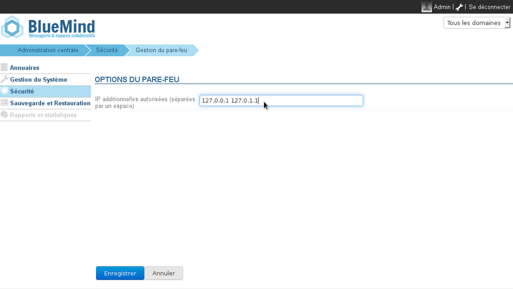

# Firewall

## Präsentation

BlueMind enthält eine Firewall, die standardmäßig den Zugriff interner Dienste auf die IP-Adressen der Server der Installation beschränkt, d. h. auf die Server, die im Abschnitt Domänenverwaltung >  Anwendungsserver definiert sind.

ElasticSearch z. B., das nur von anderen BlueMind-Komponenten verwendet wird, ist daher außerhalb der BlueMind-Dienste nicht zugänglich, es sei denn, die Firewall wird geändert.

## Anpassung

Der Zugriff auf die Dienste kann auf andere IP-Adressen erweitert werden, indem Sie zu Sicherheit > Firewall-Verwaltung gehen

Um eine oder mehrere IP-Adressen zuzulassen, fügen Sie diese in das vorgeschlagene Feld ein und klicken Sie auf „Speichern“.

:::tip

BlueMind muss nicht neu gestartet werden, die Änderungen werden sofort berücksichtigt.

:::

 

 

