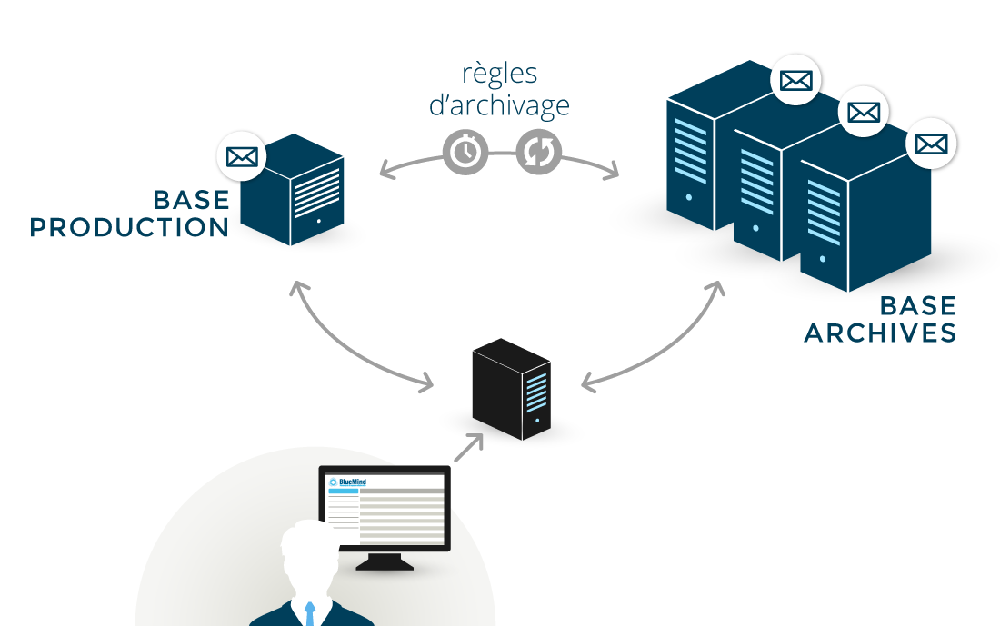

# Archivierung

In BlueMind ist ein zentrales Archivierungssystem integriert. Speicherserver können entlastet werden, indem ein Teil der E-Mails an einem anderen Installationspunkt mit geringeren Speicherkosten gespeichert wird.

Die BlueMind-Archivierung arbeitet serverseitig: Sie ermöglicht die Zentralisierung der Archive auf einem einzigen Server, im Gegensatz zu den mit Outlook erzeugten PST-Archiven, die auf den Arbeitsplätzen der Anwender verbleiben und daher gesichert werden müssen.

Hierarchische Speicherung ermöglicht die Definition eines differenzierten Speicherbereichs, in der Regel über mehr Speicherplatz, jedoch mit geringerer Leistung (und geringeren Kosten) zu verfügen. BlueMind integriert eine auf dieser Speicherung basierende Archivierung mit den folgenden Merkmalen:

- Archivierungsregeln (Alter der E-Mails älter als X Tage usw.) für den Server
- Einsehen der Archive direkt aus BlueMind Webmailer und Fat Clients (Thunderbird, Outlook usw.) auf die gleiche Weise wie eine nicht archivierte E-Mail.

 In BlueMind 4.0 wird die Archivierung zu einer Betriebsfunktion: Das System ist voll automatisiert und transparent für die Benutzer, die nicht mehr die manuelle Archivierungstaste oder die Anzeige der eventuellen Archivierung der Nachricht haben.

## Implementieren einer Archivierungsrichtlinie

Um die Archivierung zu implementieren, gehen Sie in der Administrationskonsole wie folgt vor:

- Systemverwaltung > Systemkonfiguration > Registerkarte Mailbox
- aktivieren Sie das Kontrollkästchen im Abschnitt Archivierung und geben Sie ein:
    - Anzahl der Tage vor der Archivierung: Anzahl der Tage, bevor eine Nachricht archiviert wird
    - E-Mail-Größe (MiB): Schwellenwert, bei dem eine Nachricht automatisch archiviert wird, ohne die Anzahl der Tage abzuwarten
Der Standardwert ist 1Mb

:::info

Die Einheit MiB (MebiByte) ist ein Vielfaches des Bytes (Oktett), die von MB (Megabyte, oder Mo-Megaoktett) zu unterscheiden ist: Sie entspricht 1024 Kebibytes, die wiederum 1024 Bytes (Oktetts) entsprechen.

9 MiB entsprechen somit 9,43718 MB

:::

Der Archivierungsvorgang läuft jeden Tag um 4:00 Uhr AM GMT.

## Einrichten eines Archivierungsbereichs

Die Einbindung muss in den Ordner `/var/spool/bm-hsm/cyrus-archives/`erfolgen

## Änderungen gegenüber BlueMind 3.5

Die Umstellung von einem Archivierungssystem auf ein vollautomatisches System hat mehrere Konsequenzen. Wie bereits erwähnt, ist eine manuelle Archivierung für Benutzer nicht mehr möglich und:

- Die Archivierungsrichtlinie ist für alle Benutzer der Domäne gleich
- Es gibt kein Archivierungskontingent pro Gruppe oder Benutzer mehr. Es gibt jetzt nur noch ein Kontingent, die archivierten Daten werden im einzigen Kontingent gezählt, zusätzlich zu den anderen nicht archivierten Mails.
- Die geplanten Aufgaben HSMJob und HSMIndexJob werden daher nicht mehr benötigt und sind nicht mehr vorhanden.

