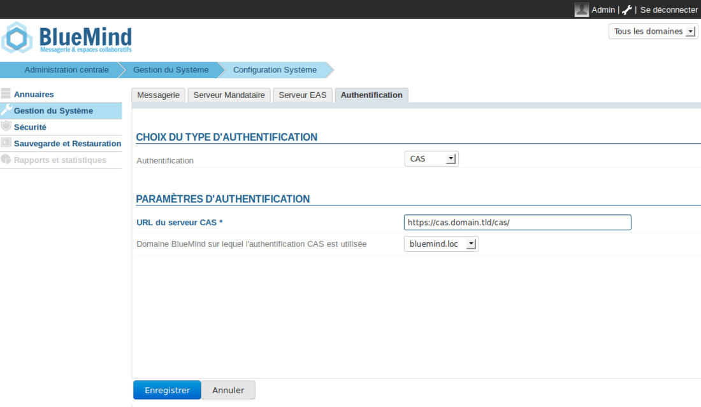
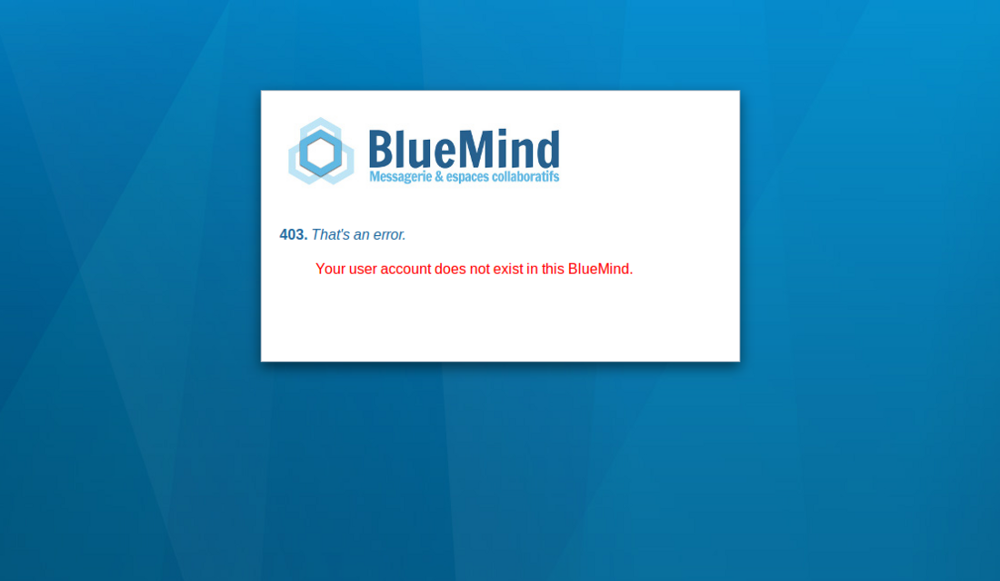

# Implementierung von SSO CAS

Dieses Dokument beschreibt die Implementierung von BlueMinds Erkennung der CAS-Authentifizierung.


:::info

Im weiteren Verlauf dieses Dokuments betrachten wir die URL des CAS-Servers *cas.domain.tld* und die BlueMind Domäne *domain.tld*, die sich auf dem Server *bm.domain.tld* befindet

:::


:::info

Die CAS-Authentifizierung ist für eine BlueMind-Installation mit einer Domäne geeignet.

:::


## So funktioniert die CAS-Authentifizierung

1. Der Client fordert den Zugriff auf eine geschützte Ressource (z. B. BlueMind) an. Er wird nicht auf CAS authentifiziert.
2. Der Server leitet ihn zur **Authentifizierung** an den CAS-Server weiter.
3. Nach der Authentifizierung wird **ein CAS-Cookie** im Browser des Clients platziert und er wird zur geschützten Ressource mit einem **Ticket zur Validierung** weitergeleitet.
4. Der BlueMind-Server sieht dieses Ticket, **fragt den CAS-Server, ob es gültig ist**, und bei Bestätigung lässt er den Client passieren und verbindet ihn als **login_cas**. Er legt ein **BlueMind Cookie** in seinem Browser ab.
5. Der Client bittet erneut um Zugriff auf den BlueMind-Server. Da er das BlueMind-Cookie besitzt, wird er automatisch authentifiziert, solange dieses Cookie gültig ist.

Für weitere Informationen
[http://aldian.developpez.com/tutoriels/javaee/authentification-centralisee-sso-cas/images/09_diagramme_full.png](http://aldian.developpez.com/tutoriels/javaee/authentification-centralisee-sso-cas/images/09_diagramme_full.png) 
 [http://www.jasig.org/cas/protocol](http://www.jasig.org/cas/protocol)

## Installation

Um die CAS-Authentifizierung zu implementieren, das erforderliche Paket installieren:
**Ubuntu/Debian**

```
aptitude install bm-plugin-hps-cas
```

**RedHat**

```
yum install bm-plugin-hps-cas
```

Dann BlueMind neustarten:

```
bmctl restart
```

## Konfiguration

1. Melden Sie sich als **admin0**an und gehen Sie zu Systemverwaltung > Systemkonfiguration > Registerkarte  **Authentifizierung.**
2. Wählen Sie den **CAS** Authentifizierungsmodus im Dropdown-Menü aus und füllen Sie die zugehörigen Felder aus: 
   
3. Speichern Sie die Änderungen.
4. Starten Sie den Dienst bm-hps neu.


:::info

Wurde die CAS-Authentifizierung aktiviert, werden Sie automatisch zum CAS-Server weitergeleitet, wenn Sie die Authentifizierungsseite aufrufen. Wenn Sie eine Verbindung in **admin0** oder in einer anderen Domäne herstellen möchten, gehen Sie zu: http://bm.domain.tld/**native**

Dieser Zugang bleibt bei Konfigurationsproblemen immer verfügbar, so dass Sie zur Korrektur auf die Konsole zugreifen können.

:::

## Bekannte Fehler

### Fehler 403: Ihr Benutzerkonto existiert nicht in diesem BlueMind.



Diese Fehlermeldung bedeutet, dass das Login, mit dem sich der Benutzer am CAS authentifiziert hat, nicht in der *domain.tld-Domäne* existiert. Es stehen Ihnen zwei Lösungen zur Verfügung:

- Erstellen Sie den Benutzer mit der CAS **Anmeldung,** die in der Domäne *domain.tld* nicht akzeptiert wird
- Ignorieren Sie den Fehler. Dieser Fall kann auftreten, wenn einige Benutzer Ihrer CAS-Datenbank keinen Zugriff auf Ihr BlueMind haben.


### Fehler 500: Internal Server Error

Diese Fehlermeldung kann von mehreren Quellen stammen. Am einfachsten ist es, wenn Sie sich auf Ihrem Server die **HPS Protokolle** ansehen, z.B. mit dem folgenden Befehl:

```
cat /var/log/bm-hps/hps.log | grep CAS
```

### Verwendung eines selbstsignierten Zertifikats oder einer unbekannten Zertifizierungsstelle

Wenn Sie ein selbstsigniertes Zertifikat für Ihren CAS-Server verwenden oder die Zertifizierungsstelle Ihres CAS-Servers nicht aufgeführt ist, kann beim Aufbau der https-Verbindung zum CAS-Server ein Fehler auftreten.

Um diesen Fehler zu beheben, ist es am einfachsten, das betreffende Zertifikat in den von BlueMind verwendeten jvm Keystore zu importieren.
**Importieren Sie die Root CA oder ein selbstsigniertes Zertifikat**

```
keytool -import -trustcacerts -alias cas -file cert\_racine.crt -keystore /usr/lib/jvm/bm-jdk/jre/lib/security/cacerts
Enter keystore password: changeit
```

Für weitere Informationen
[http://www.sslshopper.com/article-most-common-java-keytool-keystore-commands.html](http://www.sslshopper.com/article-most-common-java-keytool-keystore-commands.html)


