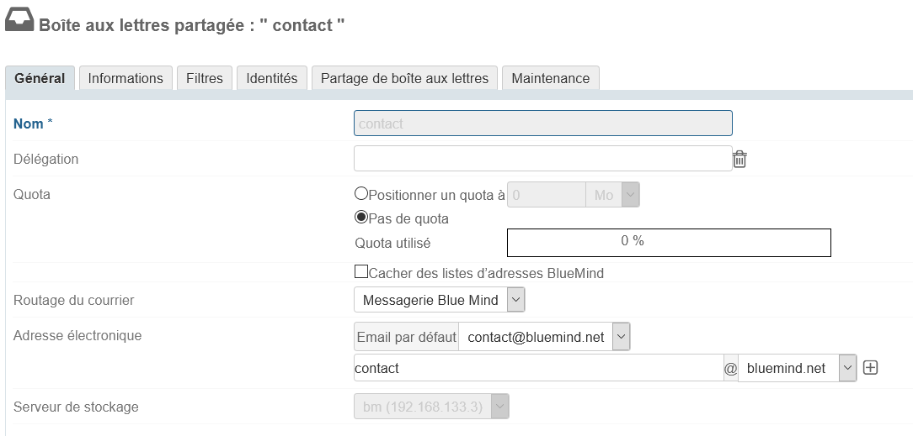
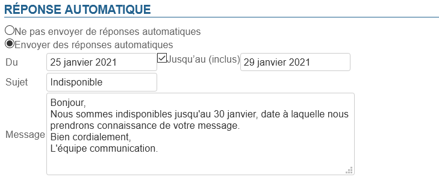
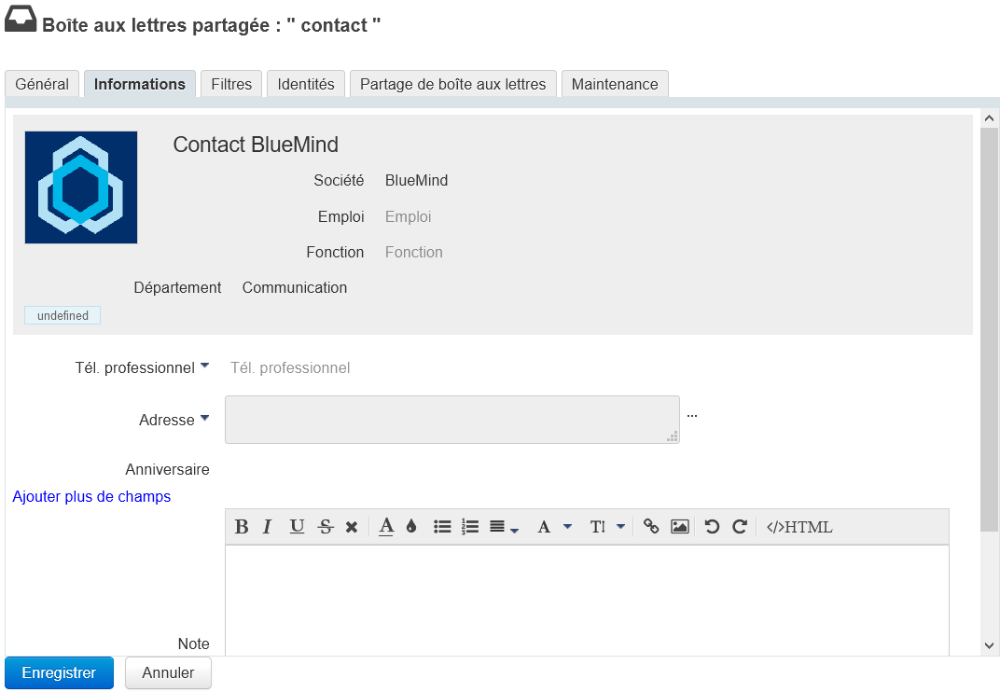
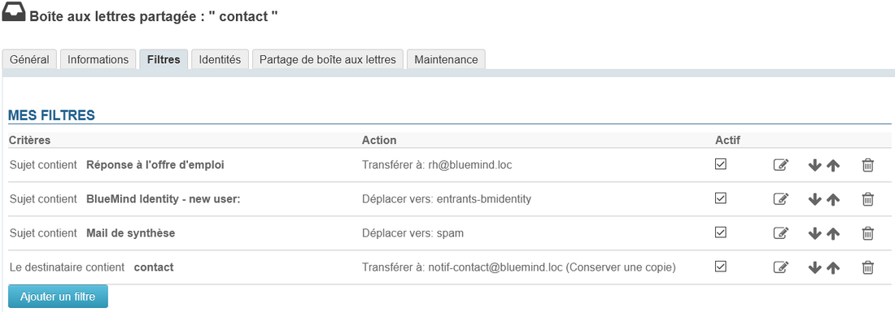
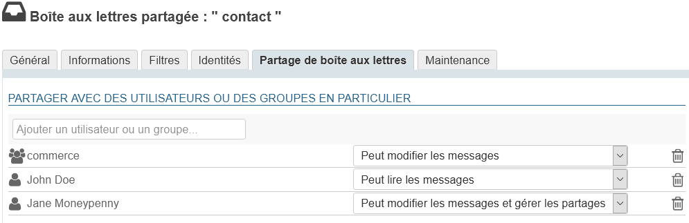
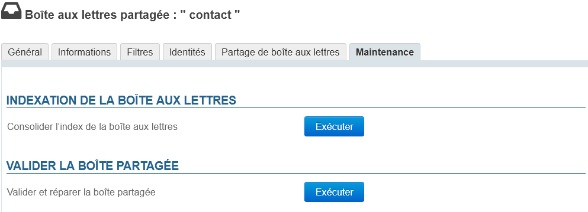

# Geteilte Posteingänge

## Präsentation

Geteilte Posteingänge, auch "Dienst-Posteingänge" oder "Funktions-Posteingänge" genannt, sind Posteingänge, die nicht namentlich sind: Benutzer sind ihnen zugeordnet und teilen sich die darin enthaltenen Nachrichten.
Benutzer greifen auf den Posteingang zu und nutzen ihn entsprechend der ihnen zugewiesenen Rechte:

- **Lesen**: Benutzer können E-Mails lesen;
- **Schreiben**: Benutzer können E-Mails ändern (hinzufügen, löschen, verschieben...) und im Namen des geteilten Posteingangs Mails verfassen;
- **Verwaltung**: Zusätzlich zum Schreibrecht können Benutzer mit Verwaltungsrechten die Rechte des freigegebenen Posteingangs verwalten.

Diese Posteingänge sind dann für jeden Benutzer unter einem Baumeintrag im Mail-Client verfügbar (standardmäßig: "Geteilte Ordner").

*Weitere Details zu den Funktionsprinzipien finden Sie auf der Seite **[Geteilte Posteingänge](/Guide_de_l_utilisateur/La_messagerie/Les_boites_aux_lettres_partagées/)* der Benutzerdokumentation.

## Erstellung

- Klicken Sie auf der Seite "Verzeichnisse" auf "Geteilten Posteingang erstellen“
- Geben Sie einen Posteingangnamen, eine Beschreibung (optional) und eine E-Mail-Adresse ein

:::info

ACHTUNG
Der Name des Posteingangs kann später nicht geändert werden
:::

:::info
Ein geteilter Posteingang kann ohne E-Mail-Adresse erstellt werden. In diesem Fall können die Benutzer ihn zwar verwenden (z. B. durch Verschieben oder Kopieren von Nachrichten), aber es kann nicht zum Empfangen oder Senden von E-Mails verwendet werden.
:::

- Wie bei jedem Benutzer oder jeder Gruppe können Sie festlegen, dass ein geteilter Posteingang nicht im Verzeichnis erscheint. Aktivieren Sie dazu das Kontrollkästchen "In BlueMind-Adressliste ausblenden".
- Mit der Schaltfläche "Erstellen" (oder der Taste &lt;Eingabe>) bestätigen, um mit einer schnellen Erstellung fortzufahren, oder gehen Sie über die Schaltfläche "Erstellen & Editieren" (&lt;Strg-Eingabe>) zur Erstellung des Posteingangs in die Verwaltungsoberfläche.

## Verwaltung

### Allgemein

#### Postfach

Dieses Tab enthält die wichtigsten Parameter und die automatische Beantwortung von Nachrichten.

- **Name**: Der Name des geteilten Postfachs wird beim Anlegen zugewiesen, er kann nicht geändert werden
- **Delegieren**: [Die Organisationseinheit](/Guide_de_l_administrateur/Gestion_des_entites/Utilisateurs/L_administration_déléguée/), zu der das Postfach gehört
- **Kontingent**: Die maximale Größe, die das Postfach erreichen kann
- **Mail-Routing**: Die Art (oder das Fehlen) des Postfachs
- **E-Mail-Adresse**: Das geteilte Postfach kann beliebig viele E-Mail-Aliase haben, auf einer oder allen verfügbaren Domains
- **Speicherserver**: [Server, von dem das Postfach verwaltet wird](/Guide_d_installation/Installation/Installation_avec_répartition_des_données_sur_plusieurs_serveurs/)

#### Automatische Antwort

Wie bei einem Benutzer-Postfach wird bei aktivierter automatischer Antwort für den festgelegten Zeitraum automatisch eine Mail an den Absender gesendet, wenn das Postfach eine Nachricht erhält.

- Start- und Enddatum sind nicht zwingend erforderlich:
    - Wenn kein Startdatum angegeben ist, wird die automatische Antwort aktiviert, sobald die neuen Einstellungen gespeichert sind.
    - Wenn kein Enddatum angegeben ist, bleibt die automatische Antwort so lange aktiv, bis die Einstellungen geändert und "Abwesenheitsnotiz AUS" gewählt wird.
- Wenn Sie auf das Eingabefeld für ein Datum klicken, wird ein Kalender angezeigt, der bei der Auswahl des Datums hilft
- Der Betreff ist optional: Wenn er nicht ausgefüllt wird, wird eine Nachricht mit leerem Betreff gesendet
- Der Inhalt der Nachricht ist obligatorisch, er wird im Textkörper der gesendeten Nachricht angezeigt.

:::info

Sendungshäufigkeit

Innerhalb eines Zeitraums von 3 Tagen wird eine einzige Abwesenheitsnotiz als Antwort an dieselbe Person (E-Mail-Adresse) gesendet.

Wenn der Benutzer die automatische Antwort während dieses Zeitraums deaktiviert und wieder aktiviert,** ohne den Betreff oder den Inhalt seiner Nachricht zu ändern**, erhalten Personen, die bereits eine automatische Antwort erhalten haben, keine neue Antwort. Der Countdown für den Zeitraum wird fortgesetzt.

:::

### Informationen

Dieses Tab enthält die Informationen, die in der Datei im Verzeichnis für das geteilte Postfach angezeigt werden.

Wie für die Benutzer kann der Administrator Informationen wie Telefonnummern und Postadressen eingeben oder ein Bild (Avatar) zuordnen, das in der gesamten Anwendung wiederverwendet wird (z.B. in den [Kontakten](https://forge.bluemind.net/confluence/display/DA/.Les+contacts+vBM-4.0) oder im [Dialer](https://forge.bluemind.net/confluence/display/DA/.La+telephonie+vBM-4.0)).

:::info

Die Kontaktdaten entsprechen **dem internen** BlueMind-Verzeichnis und sind für alle Benutzer der Lösung zugänglich. Aus diesem Grund **ist der Administrator der Einzige, der diese Informationen ändern kann**: Auch Benutzer mit umfassenden Freigabe-Rechten für das Postfach können sie nicht ändern.

:::

### Filter

Unter diesem Tab können Sie Regeln für eingehende E-Mails erstellen und organisieren.

Dies funktioniert genau wie bei den Benutzerfiltern. Weitere Einzelheiten über deren Verwaltung erfahren Sie auf der die entsprechenden Seite: [Nachrichtenfilter](/Guide_de_l_utilisateur/La_messagerie/Les_filtres_de_messages/).

### Identitäten

Der Administrator kann hier Identitäten festlegen, die von Benutzern abgerufen werden können, die Schreibrechte für das Postfach haben: Wenn der Benutzer eine dieser Identitäten auswählt, werden der Name, das Label und die Unterschrift abgerufen. Dadurch müssen die Benutzer die Informationen nicht erneut eingeben, wodurch das Risiko von Fehlern vermieden wird; sie können dieselbe Signatur für dasselbe Postfach verwenden, was einen besseren Kohäsion und mehr Transparenz gegenüber den Gesprächspartnern ermöglicht.

Einzelheiten finden Sie auf der entsprechenden Seite des Benutzerleitfadens: [Identitäten](/Guide_de_l_utilisateur/La_messagerie/Les_identités/)

### Freigaben

Dieses Tab ermöglicht die Verwaltung der Posteingang-Freigabeoptionen für Benutzer.

[Siehe [Benutzerhandbuch > Posteingang > Geteilte Posteingänge §3.Freigaben verwalten]](/Guide_de_l_utilisateur/La_messagerie/Les_boites_aux_lettres_partagées/)

### Wartung

 Mit Version 4.4 werden für die Verwaltung von freigegebenen Posteingängen die gleichen Wartungsfunktionen wie für Benutzer hinzugefügt.

- **Konsolidierung des Posteingang-Indexes**: Dieser Vorgang vervollständigt die aktuelle Indizierung des Posteingangs, indem nur die fehlenden Elemente indiziert werden
- **Validieren und Reparieren des freigegebenen Postfachs**: Dieser Vorgang fasst eine Reihe anderer Vorgänge zusammen, die die Integrität des Postfachs und seiner Daten im BlueMind-System überprüfen und ggf. korrigieren: Überprüfung des Postfachs in Cyrus, der IMAP-Ordnerhierarchie, der Mailfilter usw.

