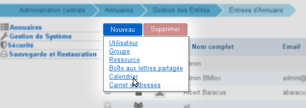
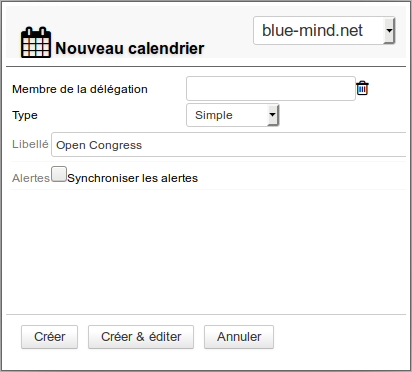
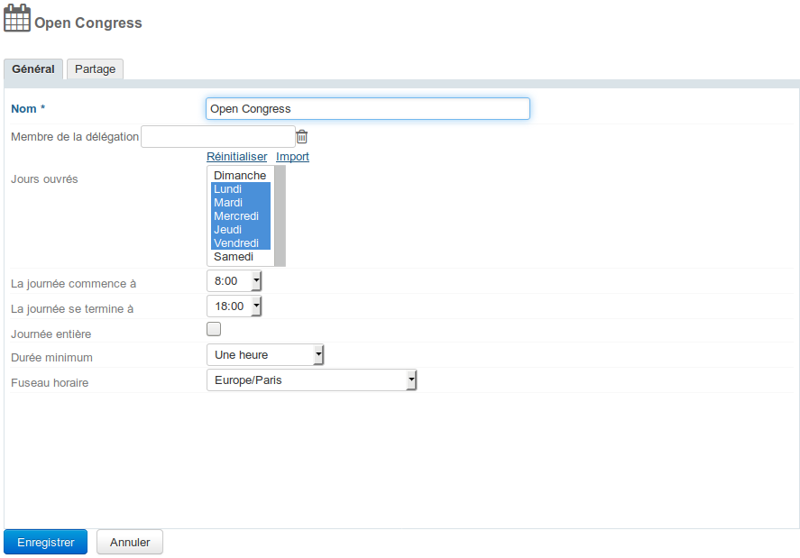
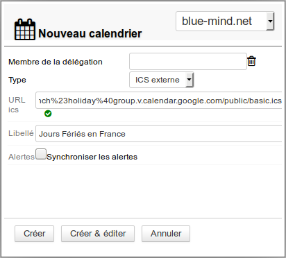

# Kalender der Domains

## Präsentation

Der Domainkalender ist ein gemeinsamer Kalender der Benutzer. Neben Abfragerechten kann der Administrator Benutzern oder Gruppen Rechte zur Änderung oder Verwaltung von Kalendern zuweisen.

Seit BlueMind 3.5 werden Domainkalender als vollwertige Entitäten verwaltet: Ihre Verwaltung erfolgt über die Verzeichniseintragsverwaltung, sie können als Organisator positioniert werden (wenn man über die entsprechenden Rechte verfügt), sie können per ICS-Import bestückt werden, ihr Inhalt kann im ICS-Format exportiert werden und eine private oder öffentliche Adresse für die externe Freigabe kann exportiert werden.

## Verwendung

Diese Kalender dienen der Information der Benutzer, z.B. zur Bekanntgabe von Feiertagen, Ruhetagen, kommerziellen Veranstaltungen (Messen, Präsentationen...) oder kommunalen Veranstaltungen (Ratssitzung, Ausstellung, Schulrat usw.), Schulungen, Teamaktionen usw.

 **Folglich können Domänen-Kalender nicht  ** als Organisatoren von Meetings positioniert oder zu Meetings eingeladen werden** . In Kalendern können nur Termine erstellt werden.

 ** 

##### Anwendungsfälle

Domänen-Terminplaner können in 2 Fällen verwendet werden:

- Für den **Informationsplaner**, über den die Benutzer Informationen abrufen können.    **Der Domänen-Terminplaner ist immer die richtige Wahl zur Verwaltung von Terminplanern dieser Art.** Er kann z. B. als Marketing-Kalender dienen und die Messen enthalten, an denen das Verkaufsteam teilnimmt, oder über öffentliche Versammlungen und Veranstaltungen informieren, die das Bürgermeisteramt organisiert.
- Für den **betrieblichen Terminplaner**, der zum Erstellen von Terminen für Benutzer verwendet wird.    ** Es wird empfohlen, einen [Ressourcenplaner](https://forge.bluemind.net/confluence/display/DA/.Les+ressources+vBM-4.0) zu verwenden, um diesen Vorgang zu ermöglichen.** Zum Beispiel bei einem Bereitschaftsplaner: Es wird ein wöchentlicher Termin "Bereitschaft Wochenende" erstellt und jede Woche wird der betroffene Benutzer eingeladen. Dies ermöglicht die Zentralisierung von Informationen und die Benutzern können  annehmen, ablehnen oder ihre (Nicht-)Verfügbarkeit angeben.

## Erstellung

So erstellen Sie einen neuen Kalender:

1. Klicken Sie auf der Startseite der Verzeichnisverwaltung auf "Kalender erstellen"
2. oder verwenden Sie aus der Liste der Telefonbucheinträge die Schaltfläche Neu > Kalender : 

- Geben Sie einen Namen ein und wählen Sie ggf. eine Domaine: 
- Klicken Sie auf "Erstellen" für eine einfache und direkte Erstellung des Kalenders
- klicken Sie auf "Erstellen & Editieren", um den Kalender zu erstellen und auf die Konfigurationsoptionen, einschließlich der Freigabeoptionen, zuzugreifen.

## Konfiguration

### Allgemeine Optionen

Auf dieser ersten Registerkarte in der Verwaltung eines Domänenkalenders können Sie die Eigenschaften des Kalenders festlegen: Arbeitstage, Start- und Endzeiten des Arbeitstages, Mindestdauer eines Termins, Zeitzone.

### Freigabe

Wenn ein Kalender erstellt wird, ist er standardmäßig für keinen Benutzer freigegeben, d. h., Benutzer können ihn nicht anzeigen oder ihm Termine hinzufügen.

Entsprechende Rechte können zugewiesen werden:

- an alle Benutzer der Domäne für einen geteilten und öffentlichen Terminplaner, z. B. für Firmentermin
- an bestimmte Benutzer, z. B. für einen Terminplaner der Geschäftsführung
- an eine Gruppe, z. B. für einen Projekt-Terminplaner

Die folgenden Rechte können zugewiesen werden:

- **Lesen**: kann Termine anzeigen
- **Schreiben**: kann Termine in den Kalender eintragen und bestehende Termine bearbeiten
- **Schreiben und Verwalten von Freigaben**: kann, zusätzlich zum Recht zu schreiben, die Kalenderanteile verwalten

#### Öffentliche Freigabe

Bei Aktivierung dieses Kontrollkästchen wird die konfigurierte Freigabe auf alle Benutzer der Domain angewendet.

#### Freigabe für bestimmte Personen oder Gruppen

In diesem Bereich können Sie Personen oder Gruppen auswählen, denen Sie Rechte zuweisen möchten.

Beginnen Sie mit der Eingabe des Namens des Benutzers oder der Gruppe in das Eingabefeld und bestätigen Sie mit der Eingabetaste oder durch Klicken auf den von der Autovervollständigung vorgeschlagenen Namen.

So wird z.B. ein Firmenterminplaner für alle Benutzer einsehbar und die Chefsekretärin kann Termine so platzieren, dass sie die Termine und Veranstaltungen, an denen die Firma teilnimmt, oder auch die Ruhetage und gesetzlichen Feiertage anzeigen kann.

## Externer Kalender

Ein Domänen-Kalender kann ein synchronisierter externer Kalender sein. Er wird auf die gleiche Weise wie ein Domänen-Kalender erstellt und verwaltet.

### Erstellung

Beim Erstellen des Kalenders (siehe oben):

- wählen Sie "Externes ICS" in der Dropdown-Liste und fügen Sie dann die externe Kalender-URL in das neue vorgeschlagene Feld ein:

- Durch Verlassen des Feldes (Tabulator-Taste oder Klick außerhalb) wird die Url von BlueMind validiert. **Solange die Url als ungültig angesehen wird, kann der Kalender nicht erstellt werden.**
- Geben Sie den Namen ein, wenn er nicht automatisch gefunden wird oder wenn Sie ihn anpassen möchten
- Klicken Sie auf "Erstellen" für eine einfache Erstellung mit den Standardoptionen (ohne Freigabe) oder auf "Erstellen & Editieren", um auf die Kalenderoptionen, einschließlich Freigabe, zuzugreifen.

### Freigabe

Die Freigaberegeln sind für einen externen Kalender dieselben wie für einen BlueMind Domänen-Kalender, mit einer Ausnahme: Wie [externe Benutzerkalender](/Guide_de_l_utilisateur/L_agenda/Les_calendriers_externes/) sind Domänen-Kalender nur für die Abfrage zugänglich: Änderungen werden nicht in den ursprünglichen Kalender übertragen und dort gespeichert.

