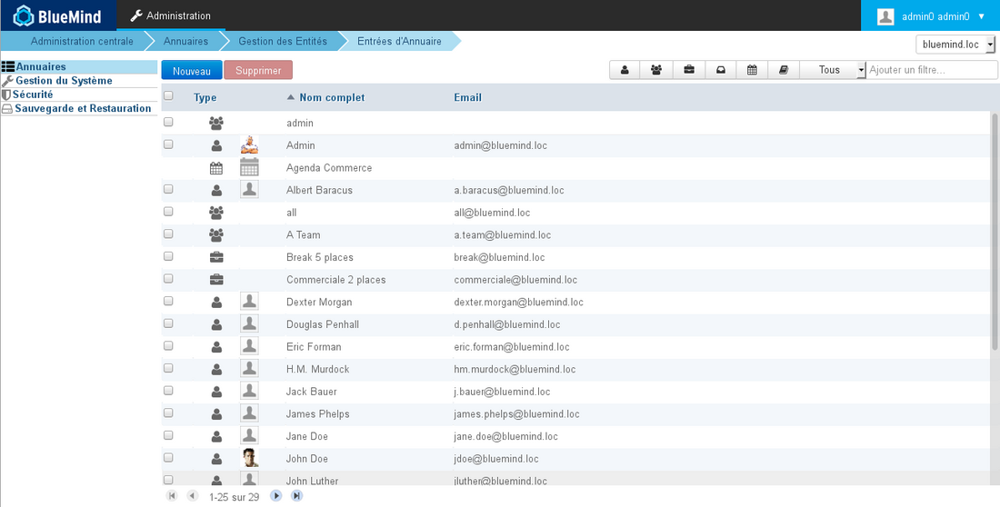
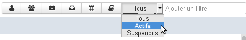
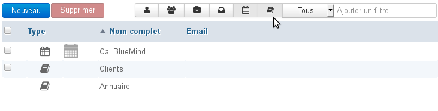
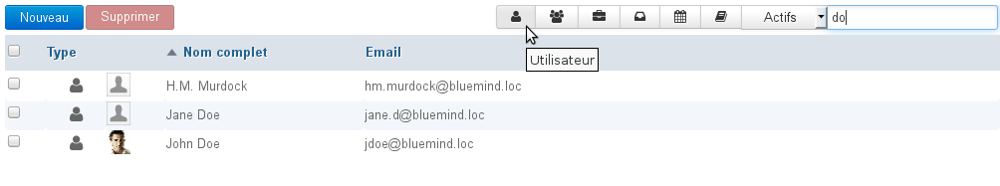

# Verzeichniseinträge

## Präsentation

Diese Seite listet die Einträge im Verzeichnis auf: Benutzer (intern und extern), Gruppen, geteilte Posteingänge, Ressourcen sowie Domain-Kalender und -Adressbücher.

## Einträge sortieren

Standardmäßig werden die Einträge in alphabetischer Reihenfolge nach dem Bezeichner sortiert dargestellt.

Ein Pfeil kennzeichnet die Spalte und die aktuelle Sortierreihenfolge. Um die Sortierreihenfolge zu ändern oder umzukehren, klicken Sie auf die gewünschte Spaltenüberschrift.

## Filterung der Einträge

Die angezeigten Einträge können über das Formular rechts oben in der Liste der Einträge gefiltert werden:

BlueMind bietet 3 Arten von Filtern an:

1. **Typ**
Mit den ersten 6 Schaltflächen können Sie einen Typ von Einträgen anzeigen oder ausblenden: Benutzer, Gruppen, Ressourcen, geteilte Posteingänge, Kalender, Adressbücher.
Wenn eine Schaltfläche aktiviert ist, erscheint sie ausgegraut und die entsprechenden Einträge werden angezeigt. So können durch Aktivieren einer oder mehrerer Schaltflächen eine oder mehrere Arten von Einträgen angezeigt werden, z.B. zur Ansicht von Kalendern und Domain-Adressbüchern

Um den Filter zurückzusetzen, setzen Sie jede Schaltfläche in ihren ursprünglichen, nicht ausgegrauten Zustand zurück.

2. **Status**
In der folgenden Dropdown-Liste können Sie Einträge nach ihrem Status, aktiv oder suspendiert, filtern.
Um den Filter zurückzusetzen, wählen Sie die Option "Alle"

3. **Text**
Mit dem Eingabefeld können Einträge nach einer Zeichenfolge gefiltert werden.
Geben Sie das Wort (teilweise oder vollständig) ein und bestätigen Sie mit der Taste &lt;Enter>: alle Einträge, die diese Zeichen in ihrem Namen oder Bezeichner enthalten, werden angezeigt.
Um den Filter zurückzusetzen, leeren Sie das Feld und bestätigen Sie mit der Taste &lt;Enter>.
Hinweis: Die Suche unterscheidet nicht zwischen Groß- und Kleinschreibung.

Die Filter sind kumulativ und es können z.B. aktive Benutzer mit "do" in ihrem Namen und/oder Login angezeigt werden:

