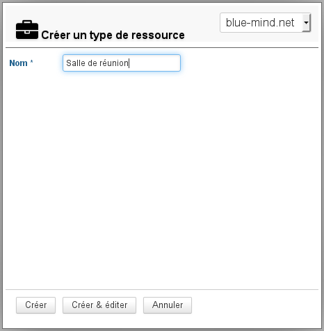
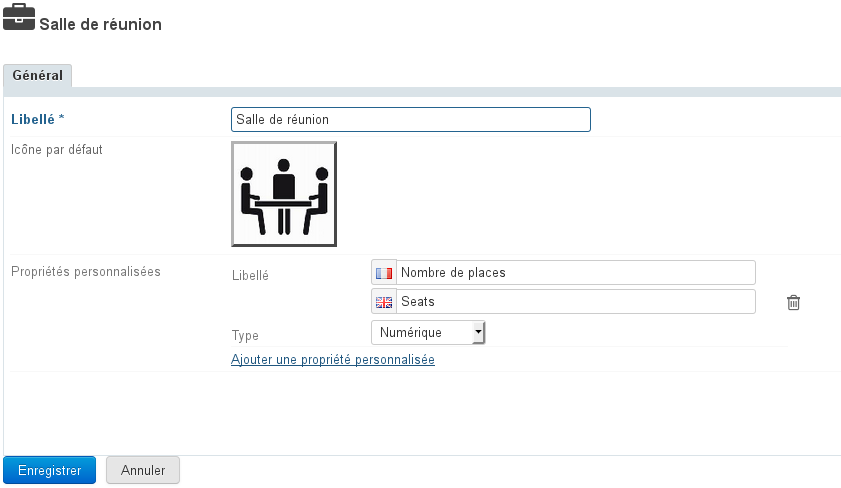
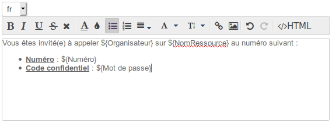
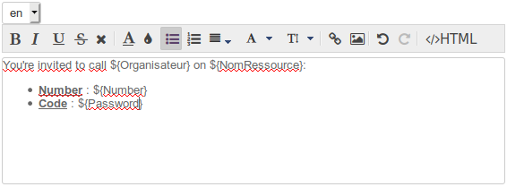
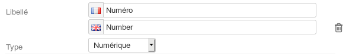
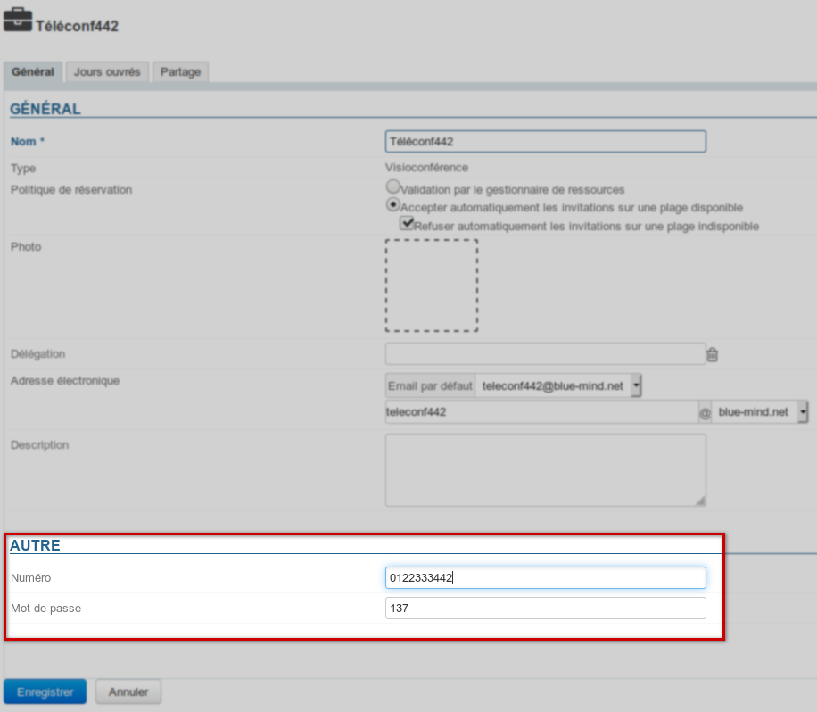
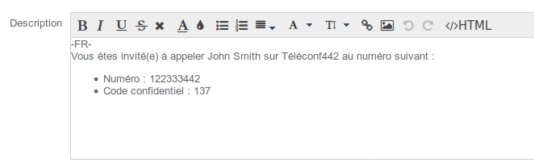
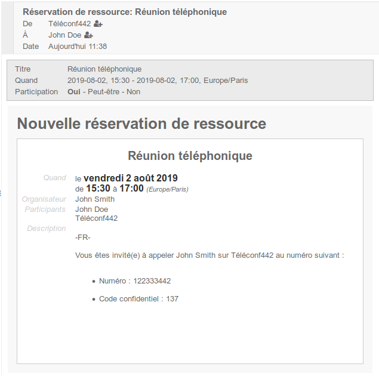
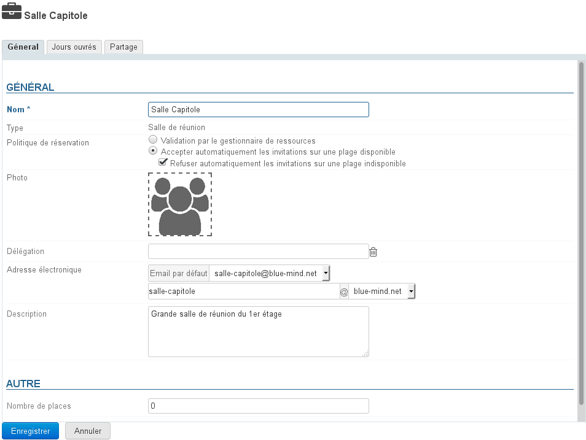
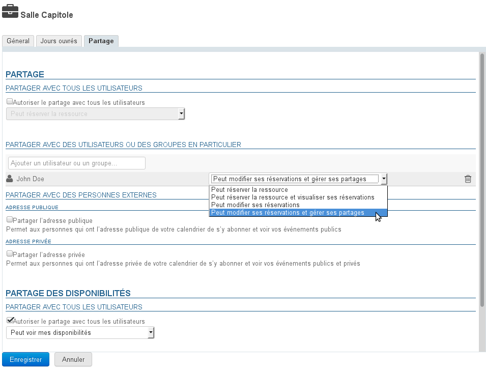

# Ressourcen


## Präsentation

BlueMind kann neben Einzel- oder Gruppen-Terminplanern auch Ressourcenplaner (Fahrzeuge, Räume, Videoprojektoren...) verwalten.

Der Administrator kann neue Ressourcentypen definieren und die Ressourcenverwaltung an Benutzer delegieren.

Wie bei den Terminplanern von einzelnen Personen können Sie mit der Funktion Verfügbar/Belegt nach der Verfügbarkeit von Ressourcen suchen.


## Ressourcentypen verwalten

In der Administrationskonsole können Sie auf der Seite Verzeichnisse > Verwaltung der Entitäten > Ressourcentypen die verfügbaren Ressourcentypen anzeigen und verwalten.

 Ab BlueMind 4.1 ist es möglich, Terminbeschreibungsvorlagen zu definieren. Wenn Sie eine Ressource dieses Typs zu einem Termin einladen, wird die Vorlage automatisch in die Terminbeschreibung eingefügt. Diese Vorlagen können Variablen enthalten und in mehreren Sprachen definiert werden, um sie an die Sprache des Meeting-Veranstalters anzupassen.

### Einen neuen Typ erstellen

Um einen Ressourcentyp hinzuzufügen, klicken Sie auf die Schaltfläche "Neu" und geben Sie die Informationen ein:



Klicken Sie dann auf "Erstellen", um mit einer schnellen Erstellung fortzufahren, oder auf "Erstellen und Editieren", um den Typ zu erstellen und auf weitere Anpassungsoptionen zuzugreifen (siehe "Bearbeiten eines Ressourcentyps").

### Bearbeiten eines Ressourcentyps

Klicken Sie zur Bearbeitung eines Ressourcentyps auf die entsprechende Zeile in der Liste der verfügbaren Typen.

Auf der Bearbeitungsseite ist es möglich, das Etikett zu ändern, ein Standardsymbol hinzuzufügen und benutzerdefinierte Eigenschaften zu ändern oder hinzuzufügen:



### Erstellen einer Inhaltsvorlage

Ab BlueMind 4.1 ist es möglich, eine Vorlage zu definieren: Dieser Text wird automatisch zur Beschreibung eines Meetings hinzugefügt, wenn die Ressource dazu eingeladen wird.

Erstellen einer Vorlage:

- die gewünschte Sprache wählen
- das Inhaltsfeld ausfüllen
-  **Klicken Sie auf **   **  um die Änderungen zu speichern.** 


#### Mehrsprachige Vorlage

##### Hinzufügen einer Sprache

Andere Sprachen erstellen:

- Die gewünschte Sprache aus der Dropdown-Liste auswählen
- Den Inhalt wie bei der Erstsprache ausfüllen:



:::tip

Der Inhalt der vorherigen Sprache(n) bleibt gespeichert, Sie können von einer zur anderen wechseln und so viele Vorlagen erstellen, wie Sprachen in der Benutzeroberfläche verfügbar sind.

:::

-  **Klicken Sie auf ** **  um die Änderungen zu speichern.** 


:::info

Beim Anlegen eines Termin wird der Inhalt entsprechend der Sprache des Organisators hinzugefügt.

:::

##### Löschen einer Sprache

Eine Sprachvorlage löschen:

- Die gewünschte Sprache aus der Dropdown-Liste auswählen
- Inhaltsfeld (den Text markieren und löschen)
-  **Klicken Sie auf ** **  um die Änderungen zu speichern.** 


#### Verwendung von Variablen

Die Vorlage kann Variablen enthalten, die in eine Ressource dieses Typs einzutragen sind und dann vom System beim Erzeugen des Termin automatisch in der Vorlage ersetzt werden.

Wie in der Online-Hilfe am oberen Rand des Formulars angegeben, gibt es 2 Variablen für alle Typen und alle Ressourcen:

- ${RessourceName}: der Name der im Verzeichniseintrag definierten Ressource (nicht zu verwechseln mit dem Ressourcentyp-Label)
- ${Organisator}: der Name der Person, die den Termin im Kalender erstellt


Weitere Variablen können mit den * **Benutzerdefinierten Eigenschaften** * erstellt werden.

Klicken Sie dazu auf den Link "Eine benutzerdefinierte Eigenschaft hinzufügen":


Füllen Sie den Wortlaut aus (in Französisch und Englisch) und wählen Sie den Variablentyp:



Es sind 3 Arten von Variablen möglich:

- Numerisch: enthält notwendigerweise eine Zahl
- Text: wird eine Zeichenkette enthalten
- Kontrollkästchen: In Kontext der Terminbeschreibungsvorlage ist dieser Typ nicht von Interesse, wir raten von seiner Verwendung ab


Das Einfügen einer Variable in die Vorlage beruht auf der Syntax `**${**libellé**}**`.

Nehmen wir den obigen Ressourcentyp als Beispiel: Videokonferenz. Jede Ressource entspricht einer *Konferenzbrücke* und hat daher 2 Variablen :

- Nummer: die Rufnummer
- PIN-Code: das Passwort für den Zugriff auf die Brücke


Die folgende Vorlage wird ausgefüllt:


```
-FR- <br/>
Vous êtes invité(e) à appeler ${Organisateur} sur ${NomRessource} au numéro suivant :
<ul>
<li>Numéro : ${Numéro}</li>
<li>Code confidentiel : ${Mot de passe}</li>
</ul>
```


In  Verwaltungsstammsatz der Ressource werden diese Felder im Abschnitt "Sonstige" ausgefüllt:



Wenn diese Ressource schließlich zu einem Meeting eingeladen wird, wird die Beschreibung des Meetings mit der Vorlage und den Variablenwerten ergänzt:

- im Terminplaner:
- in der Einladungs-E-Mail, in der die Beschreibung enthalten ist:


:::info

Mehrsprachige Vorlage

Wenn mehrere Vorlagen parametriert sind, die mehreren Sprachen entsprechen, wird die Vorlage der Sprache des Organisators zur Terminbeschreibung hinzugefügt.

:::

## Ressourcen-Management

### Eine Ressource erstellen

Klicken Sie auf der Seite mit den Verzeichniseinträgen auf die Schaltfläche "Neu" > "Ressource" und geben Sie die Informationen über die zu erstellende Ressource ein:


- Nur der Name und die Adresse sind obligatorischHinweis: Die Adresse wird bei der Eingabe des Namens automatisch vervollständigt, bitte stellen Sie vor der Validierung sicher, dass sie keine Sonderzeichen (Großbuchstaben, Akzente ...) enthält
- die hier benannten Administratoren erhalten ein Freigaberecht "Kann meine Termine ändern und meine Freigaben verwalten".Dies kann später geändert werden, und es können andere Administratoren benannt werden. Siehe nachstehendes Kapitel "[Gemeinsame Nutzung einer Ressource](#Administrationdesressources-partage-ressource)"


Klicken Sie abschließend auf "Erstellen", um mit einer schnellen Erstellung fortzufahren, oder auf "Erstellen & Editieren", um die Ressource zu erstellen und auf ihren Datensatz zuzugreifen (siehe Kapitel unten "[Bearbeiten einer Ressource](#Administrationdesressources-editer-ressource)").

### Bearbeiten einer Ressource

Um eine Ressource zu bearbeiten, klicken Sie auf die entsprechende Zeile in der Liste der verfügbaren Ressourcen.

#### Allgemein

##### Eigenschaften

Auf der Bearbeitungsseite können Sie die allgemeinen Informationen der Ressource ändern (Name, Foto, Delegation, E-Mail-Adresse, Beschreibung):




:::tip

Um das Foto (Avatar) der Ressource hinzuzufügen oder zu ändern, klicken Sie in das weiße Quadrat oder auf das bereits vorhandene Foto.

:::

##### Reservierungsrichtlinie

Ab BlueMind 3.5.5 können Administratoren wählen, ob sie Mehrfach-Reservierungen *(Über-Reservierungen*) für eine Ressource zulassen oder verhindern wollen. Daher sind zwei Betriebsarten möglich:

- **Validierung durch den Ressourcenmanager**: Der Teilnahmestatus der Ressource bleibt in der Schwebe, bis der Manager die Einladung annimmt oder ablehnt.Diese frühere Funktionsweise bleibt für alte Ressourcen und für Ressourcen, die zum Zeitpunkt des Versionswechsels von BlueMind 3.0 migriert wurden, aktiv.
- **Automatisch akzeptieren**: Der Ressourcenmanager erhält eine Anfrage, aber die Teilnahme wird automatisch bestätigt, wenn die Ressource im angeforderten Zeitfenster verfügbar ist (Arbeitszeitfenster und keine andere Reservierung akzeptiert)**Dies ist fortan der Standardvorgang beim Erstellen einer neuen Ressource**. 
    - **Automatisch ablehnen**: Der Ressourcenmanager erhält eine Anfrage, aber die Teilnahme wird automatisch abgelehnt, wenn die Ressource im angeforderten Zeitfenster nicht verfügbar ist.**Die Ablehnung ist untrennbar mit der Annahme verbunden**. Dadurch ist es möglich, Reservierungen in einem verfügbaren Zeitfenster automatisch anzunehmen und dem Manager die Entscheidung zu überlassen, wenn die Ressource nicht verfügbar ist (ein spätes Meeting organisieren, einer zweiten, wichtigeren Anfrage Vorrang geben, usw.)


:::info

Die automatische Reservierungsrichtlinie kann nur auf einmalige Termine angewendet werden: Wiederkehrende Termine unterliegen weiterhin der Validierung durch einen Manager.

:::


:::tip

Beachten Sie, dass nur Administratoren Zugriff auf diese Einstellung haben, Ressourcenmanager bleiben Benutzer, denen das Recht erteilt wurde, den Kalender der Ressource zu ändern (Termine annehmen/ablehnen/ändern).

:::

#### Verfügbare Uhrzeiten

Auf der neuen Registerkarte "Arbeitstage" können Sie die Tage und Uhrzeiten der Verfügbarkeit der Ressource sowie die Mindestdauer, für die sie reserviert werden kann (1 Stunde, 2 Stunden, halber Tag, Tag) und ihre Zeitzone festlegen:


:::info

Genau wie bei der Einladung eines Benutzers dienen diese Informationen der Person, die die Ressource reservieren möchte, als Anhaltspunkt, verhindern aber nicht, dass sie außerhalb der verfügbaren Zeiten oder für einen kürzeren Zeitraum reserviert wird.

:::

#### Freigabe einer Ressource

Standardmäßig hat eine Ressource die öffentliche Freigabe "Kann mich zu einem Meeting einladen": Alle Benutzer der Domäne können eine Reservierungsanfrage stellen.

Auf der Registerkarte "Freigabe" können Sie diese öffentliche Freigabe ändern und/oder zusätzliche Rechte an Benutzer oder Gruppen vergeben (z. B. einen Administrator entfernen oder neu bestimmen, bestimmten Benutzern das Recht zuweisen, den Kalender zu sehen, usw.):



Die möglichen Rechte lauten wie folgt:

- **Kann die Ressource reservieren**: Der Benutzer kann eine Reservierungsanfrage stellen, indem er die Ressource einlädt
- **Kann die Ressource reservieren und ihre Reservierungen sehen**: Zusätzlich zum vorherigen Recht kann der Benutzer den Kalender der Ressource und damit ihre Verfügbarkeit sehen
- **Kann ihre Reservierungen ändern**: Der Benutzer wird Verwalter der Ressource, er erhält die Reservierungsanfragen, er kann die Termine, zu denen die Ressource eingeladen ist, annehmen, ablehnen oder ändern. Er kann Termine auch direkt in den Kalender der Ressource eintragen.
- **Kann ihre Reservierungen ändern und Freigaben verwalten**: Zusätzlich zum vorherigen Recht greift der Benutzer auf die Verwaltung der Ressourcenfreigabe zu, um die Rechte zu ändern


Wie auch bei den Benutzern ermöglicht diese Registerkarte die externe Freigabe des Kalenders und die Verwaltung der Teilens von Verfügbarkeiten.

Weitere Informationen zur Freigabe finden Sie auf der entsprechenden Seite: [Verwaltung der Freigaben](/Guide_de_l_utilisateur/Gestion_des_partages/)

## Verwendung einer Ressource

Um eine Ressource mit einem Termin zu verknüpfen, laden Sie sie einfach beim Erstellen des Termin ein, indem Sie sie wie einen Benutzer in die Liste der Teilnehmer aufnehmen.

Sobald der Termin erstellt und die Einladungen verschickt wurden, können die Ressourcenmanager (Benutzer mit dem Recht, Termine zu ändern) die Anfrage über ihren Terminplaner annehmen oder ablehnen.

Weitere Infos über die Verwendung von Ressourcen sind der entsprechenden Seite im Benutzerhandbuch zu entnehmen: [Die Ressourcen](/Guide_de_l_utilisateur/Les_ressources/).


