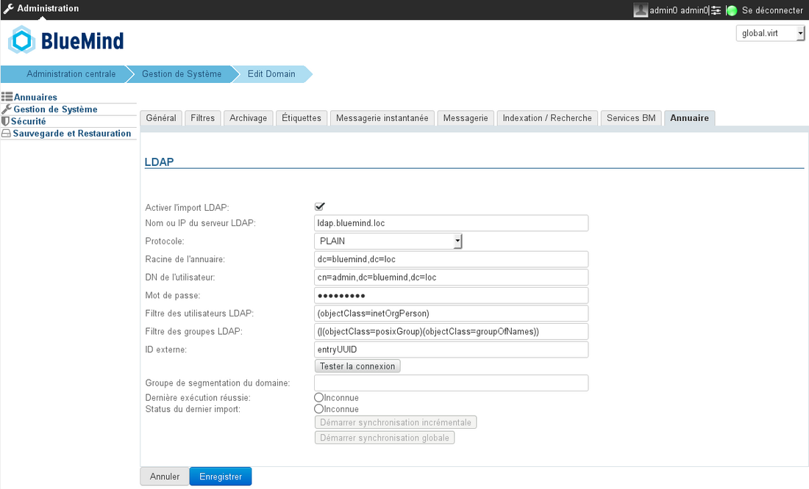

# LDAP-Synchronisation


## Präsentation

BlueMind ermöglicht den Import von Benutzern und Gruppen aus einem LDAP-Verzeichnis (zum Beispiel OpenLDAP). Der LDAP-Import erfolgt inkrementell (neue Einträge werden hinzugefügt, geänderte Daten werden berücksichtigt). Der LDAP-Import wird pro Domain konfiguriert und ausgeführt.

Die Passwörter der importierten Benutzer werden anschließend mit dem LDAP-Server abgeglichen.

Ein neuer Benutzer kann sich auch dann bei BlueMind anmelden, wenn er noch nicht importiert wurde. Sein BlueMind-Konto wird bei erfolgreicher Authentifizierung sofort erstellt.

Das Auffüllen von BlueMind-Benutzern und -Gruppen aus dem LDAP-Verzeichnis wird durchgeführt:

- während der Installation und Konfiguration, während des Erstimports,
- regelmäßig und automatisch über geplante Aufgaben
- und wenn sich ein nicht vorhandener Benutzer anmeldet.


:::info

Die LDAP-Synchronisation stützt sich auf ein Verzeichnisschema vom Typ InetOrgPerson.

:::


## Installation

Um auf die Synchronisationsfunktionen mit einem ldap-Verzeichnis zugreifen zu können, muss das ldap-import-Plugin installiert werden.

Verbinden Sie sich dazu mit dem Server und geben Sie den folgenden Befehl ein, um die Installation des Plugins zu starten:
**Debian/Ubuntu**

```
sudo aptitude update
sudo aptitude install bm-plugin-admin-console-ldap-import bm-plugin-core-ldap-import
```

**RedHat/CentOS**

```
yum update
yum install bm-plugin-admin-console-ldap-import bm-plugin-core-ldap-import
```


Starten Sie die Komponente *bm-core* nach Abschluss der Installation mit dem folgenden Befehl neu:


```
bmctl restart
```


## Konfiguration

Nur der globale Administrator kann die LDAP-Synchronisierung für eine Domain konfigurieren. Domain-Administratoren können die Einstellungen einsehen und die Importaufgabe starten.

- Anmeldung als globaler Administrator admin0@global.virt
- Gehen Sie in das Menü Systemadministration > Überwachte Domains und wählen Sie die zu konfigurierende Domain aus
- Gehen Sie auf die Registerkarte "Verzeichnisse"




| Feld | Hinweis |
| --- | --- |
| Name oder IP des LDAP-Servers | 
IP oder FQDN des LDAP-Servers
 |
| Protokoll | Wählen Sie das zu verwendende Protokoll: | 
- PLAIN
- SSL
- SSL/Alle Zertifikate akzeptieren
- TLS
- TLS/Alle Zertifikate akzeptieren

 | 
Je nach Auswahl ist der verwendete Port automatisch:
 | 
- PLAIN: 389
- SSL: 636
- TLS: 389

 |
| Verzeichnis-Root | Festlegen des LDAP-Stammverzeichnisses |
| Benutzer-DN | DN des Root-Benutzers, der zur Verbindung mit dem LDAP-Server verwendet wird |
| Passwort | Passwort des Benutzers, der für die Verbindung zum LDAP-Server verwendet wird |
| LDAP-Benutzerfilter | Nur durch diesen Filter validierte Benutzer werden in BlueMind importiert |
| LDAP-Gruppenfilter | Nur die durch diesen Filter validierten Gruppen werden in BlueMind importiert |
| Externe ID | Attribut, das einem unveränderlichen und eindeutigen LDAP-Eingangsbezeichner entspricht. Wird verwendet, um einen LDAP-Eintrag mit einem BlueMind-Eintrag zu verknüpfen |
| Domain-Segmentierungsgruppe | 
Dieses Feld darf leer sein.
 | 
Dieses Feld wird ignoriert, wenn die Domainsegmentierungsfunktion für BlueMind nicht konfiguriert ist.
 | 
Mails für Benutzer in dieser Gruppe werden an einen anderen Mailserver in derselben Domain umgeleitet (konfiguriert über Domainsegmentierung).
 |

## LDAP-Mapping - BlueMind

### Benutzer-Attribute

| BlueMind | LDAP-Attribut | Hinweis |
| --- | --- | --- |
| Login | uid | 
Beim Import wird aus Kompatibilitätsgründen ein *Mapping* (Zeichenersetzung) durchgeführt:
 | 
- Ersetzen von Buchstaben mit diakritischen Zeichen durch den entsprechenden Buchstaben ohne diakritisches Zeichen
- Umwandlung in Kleinbuchstaben-
- Ersetzen von Leerzeichen durch '_'

 |
| firstname | givenName | 


 |
| lastname | sn | 


 |
| Beschreibung | Beschreibung | 


 |
| mail | 
mail
mailLocalAddress
mailAlternateAddress
gosaMailAlternateAddress
 | 
Die Standard-E-Mail-Adresse von BlueMind ist die erste, die unter den LDAP *Mail*-Attributen definiert ist, entweder *mailLocalAddress* oder *mailAlternateAddress* oder *gosaMailAlternateAddress*.

Die anderen werden als E-Mail-Alias verwendet.

 Wenn keines dieser Felder ausgefüllt ist, hat der Benutzer keinen Posteingang in BlueMind
 |
| user mail quota | 
mailQuotaSize
mailQuota
gosaMailQuota
 | 
Muss in LDAP in Bytes ausgedrückt werden.
 | 
Das erste dieser gefundenen LDAP-Attribute wird verwendet: mailQuotaSize > mailQuota > gosaMailQuota
 |
| work phones | telephoneNumber | 


 |
| home phones | homePhone | 


 |
| mobile phones | mobile | 


 |
| fax | facsimileTelephoneNumber | 


 |
| pager | pager | 


 |
| memberOf | memberOf | Liste der Gruppen, in denen der Benutzer Mitglied ist. Der BlueMind-Benutzer kann nur zu LDAP-Gruppen hinzugefügt werden, die bereits importiert wurden |
| photoID | jpegFoto | Foto des Benutzers: Der Inhalt dieses Attributs wird als das Foto des entsprechenden Kontos importiert |
| 
user.value.contactInfos.organizational.title
 | title | 


 |
| user.value.contactInfos.organizational.org.company | o | 


 |
| user.value.contactInfos.organizational.org.division | oder | 


 |
| user.value.contactInfos.organizational.org.department | departmentNumber | 


 |
| address.locality | l | 


 |
| address.postalCode | postalCode | 


 |
| address.countryName | st | 


 |
| address.streetAddress | postalAddress | 


 |
| address.postOfficeBox | postOfficeBox | 


 |

### Gruppen-Attribute

| BlueMind | LDAP-Attribut | Hinweis |
| --- | --- | --- |
| name | cn | 


 |
| Beschreibung | Beschreibung | 


 |
| mail | mail | 


 |
| member | memberUid | Nur bereits in BlueMind importierte Benutzer und Gruppen werden zu den Gruppenmitgliedern hinzugefügt |

## Zuweisung von Rechten

Ab BlueMind 3.5 basiert der [Zugriff auf Anwendungen auf der Verwaltung der](/Guide_de_l_administrateur/Gestion_des_entites/Utilisateurs/) den Benutzern zugewiesenen [Rollen](/Guide_de_l_administrateur/Gestion_des_entites/Utilisateurs/) . Der LDAP-Import verwaltet keine Rollen, so dass Benutzer nach dem Import zunächst keine Rollen haben und nicht auf Anwendungen (Webmailer, Kontakte, Kalender) zugreifen können.

Der einfachste und effektivste Weg, dies zu bewerkstelligen, ist über Gruppen:

- Den Benutzern in idap eine gemeinsame Gruppe zuweisen (oder mehrere, falls gewünscht)
- einen 1. Import starten: die Gruppe(n) wird/werden in BlueMind mit den Benutzern importiert
- gehen Sie in die Administration und [weisen Sie der Gruppe die gewünschten Rollen zu](/Guide_de_l_administrateur/Gestion_des_entites/Groupes/#Administrationdesgroupes-Gestiondesgroupes-Roles)


:::info

Bei den folgenden Importen und Updates werden die Rollen beibehalten.

:::

Danach müssen neue Benutzern nur noch der/den Gruppe(n) zugeordnet werden, um ihnen die gewünschten Rollen zu geben.


:::tip

Modifizierung der Rollen

Neue Versionen von BlueMind führen regelmäßig neue Rollen mit Verbesserungen ein, insbesondere für Funktionen, die die Benutzer bereits verwenden.

In der BlueMind-Version 3.5.9 kann der Administrator beispielsweise die Möglichkeit für seine Benutzer aktivieren oder deaktivieren, Thunderbird über eine neue Rolle zu verbinden. Bis zu dieser Version hatten alle Benutzer diese Möglichkeit.

Um sicherzustellen, dass das neue Recht bei der Aktualisierung für die vorhandenen Benutzer aktiviert wird, sollte(n) die Gruppe(n), in der/denen die Benutzer aus dem LDAP platziert wurden, als Standardgruppe(n) festgelegt werden.

Rufen Sie dazu das Gruppenverwaltungsstammsatz auf, kreuzen Sie das entsprechende Kästchen an und speichern Sie den Stammsatz:


:::

## Erzwingen oder Korrigieren einer UID

Die UID eines Benutzers kann im Benutzer-Verwaltungsstammsatz in BlueMind ausgefüllt oder korrigiert werden.

Gehen Sie dazu in die Administrationskonsole > Verzeichnisse > Verzeichniseinträge > wählen Sie den Benutzerstammsatz > Registerkarte Wartung: Das Feld ExternalID mit der UID des Benutzers im LDAP ausfüllen und speichern.


:::info

Der ExternalID muss das Präfix "ldap:" vorangestellt werden
Zum Beispiel:


```
ldap://5d6b50-399a6-1e6f2-d01267d1f-0fbecb
```


:::


