# Benutzer


## Präsentation

Benutzer sind natürliche Personen, die sich mit Blue Mind verbinden. Diese Benutzer haben entsprechend ihrem Profil Zugriff auf die verschiedenen Funktionen von Blue Mind. 

In Blue Mind können zwei Arten von Benutzern angelegt werden, indem diesen Benutzern ein Profil zugewiesen wird:

- user: Zugriff auf die Module Posteingang, Terminplaner, Kontakt und Benutzereinstellungen
- admin: Zugriff auf das Benutzerprofil und die Administrationskonsole.


Administrator-Rollen:

- **der funktionale Administrator der Domain** (in der Regel **Domain-Administrator **genannt) ist ein Benutzer, dem das Admin-Profil zugewiesen wurde. Mehrere Benutzer können in der gleichen Domain die Rolle des Funktionsadministrators haben.  Der Funktionsadministrator verwaltet über die Blue Mind-Administrationskonsole Benutzer, Gruppen und Ressourcen sowie Domain-Einstellungen und gemeinsam genutzte Objekte (Posteingänge, Kalender, Adressbücher). Er kann seine Rechte delegieren, indem er andere Administratoren anlegt.
- **Der Plattform-Administrator ** (auch **globaler Administrator** genannt) ist eine in der Blue Mind-Installation einzigartige Funktion. Mit der Benutzeridentifizierung admin0@global.virt ist er für den technischen Aspekt der Plattform zuständig. Er verfügt nicht über ein Benutzerkonto. Wenn er sich mit Blue Mind verbindet, hat er nur Zugriff auf die Administrationskonsole. Er kümmert sich um die Installation und die technische Konfiguration der Domains: Serveradressen, Speicherplatz, spezielle geplante Aufgaben usw. Er hat außerdem Zugriff auf die gleichen Verwaltungsfunktionen wie der Funktionsadministrator.


## Einen Benutzer erstellen

Klicken Sie auf der Startseite oder der Seite "Verzeichnisse" auf "Benutzer erstellen" und geben Sie die Informationen des neuen Benutzers in dem sich öffnenden Popup ein:


:::info

Der vollständige Name wird bei der Eingabe des Vor- und Nachnamens automatisch ausgefüllt, er wird automatisch generiert und kann nicht geändert werden.

:::


:::info

Nur Felder, die mit einem Sternchen versehen sind (Name, Login und Passwort), sind erforderlich.

:::

Konten können mit oder ohne E-Mail-Adresse erstellt werden:

- Ohne E-Mail-Adresse ist der "Posteingang"-Teil deaktiviert und die Registerkarte "Posteingang" ist unzugänglich.
- Durch Aktivieren von "E-Mail-Adresse" wird das E-Mail-Konto aktiviert und automatisch eine nicht änderbare, Login-basierte Standardadresse angelegt.Um Aliase hinzuzufügen, klicken Sie auf  am Ende der Zeile.
- Wenn die Installation mehrere Domain-Aliase umfasst, kann jede zusätzliche E-Mail-Adresse auf einer bestimmten Domain oder auf allen Aliasen deklariert werden.Es ist in BlueMind möglich, beliebig viele Aliase auf beliebig vielen Domain-Aliasen anzulegen.


### Schnelle Erstellung

Die Schaltfläche "Erstellen" ermöglicht eine schnelle Erstellung mit den im Popup eingegebenen Informationen und den folgenden Standardoptionen:

- Standort (Zeitzone, Zeitformat, etc.) des Servers
- Standard-Speicherserver, ohne Speicherplatzkontingent
- Keine automatische Beantwortung und Weiterleitung von Nachrichten
- Leere Adressdaten
- Der Kalender wird mit der Option "kann mich zu einem Meeting einladen" freigegeben. Das bedeutet, dass andere Benutzer der Domain den Kalender dieses Benutzers nicht sehen können, ihn aber trotzdem zu einem Termin einladen können. 
- Der Posteingang ist nicht freigegeben
- Archivierung ist nicht aktiviert


Der Benutzer kann später über die Administrationsoberfläche geändert werden.

### Erstellung und Bearbeitung

Die Schaltfläche "Erstellen & Editieren" legt den Benutzer mit den im Popup eingegebenen Informationen und den Standardoptionen an und leitet anschließend automatisch zur Bearbeitungsoberfläche des Benutzers weiter.

## Bearbeiten und Verwalten eines Benutzers

Gehen Sie von der Startseite oder der Seite "Verzeichnisse" auf die Seite "Verzeichniseinträge" und wählen Sie den gewünschten Benutzer aus der Liste aus.

Die Benutzerinformationen sind in Registerkarten organisiert, die im Folgenden vorgestellt werden:

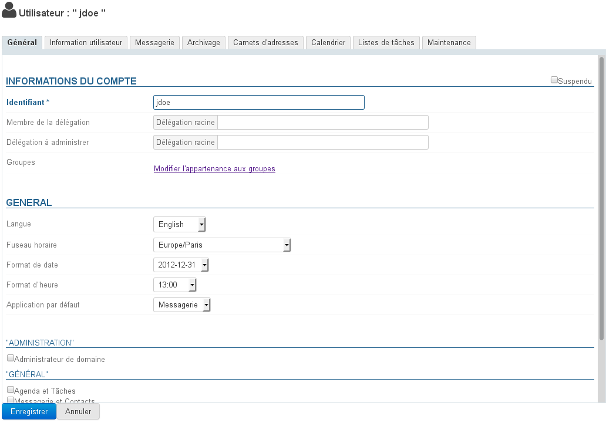

### Allgemein

#### Allgemeine Benutzerinformationen

Die Registerkarte "Allgemein" zeigt die wichtigsten Benutzerinformationen an: Kontoinformationen, Profil, Gruppe(n), Passwort, Zeiteinstellungen usw.

Außerdem kann der Benutzer als Mitglied oder Administrator einer [Delegierung](/Guide_de_l_administrateur/Gestion_des_entites/Utilisateurs/L_administration_déléguée/) definiert werden.


:::tip

Gruppenzugehörigkeit

Wenn Sie auf den Link "Gruppenzugehörigkeit ändern" klicken, können Sie in einem Popup die Gruppen, denen der Benutzer angehört, anzeigen und ändern.

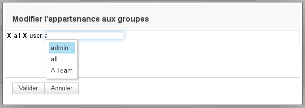

Um eine Gruppe zu löschen, klicken Sie auf das entsprechende Kreuz; um eine Gruppe hinzuzufügen, positionieren Sie sich einfach im Eingabefeld, beginnen Sie mit der Eingabe und bestätigen Sie eine von der Autovervollständigung vorgeschlagene Auswahl.

:::

#### Rollen: administrative Rechte und Zugriff auf Funktionalitäten

Es ist jetzt möglich, die Rechte zu verwalten, über die ein Benutzer oder Domain-Administrator verfügt. Die Verwaltung der folgenden Objekte kann ausdrücklich erlaubt werden:

- Benutzer
- Gruppen
- Domain-Adressbücher
- Domain-Kalender
- Geteilte Posteingänge
- Ressourcen
- der Domain (maximales Kontingent, Anzahl der Benutzer)
- ...


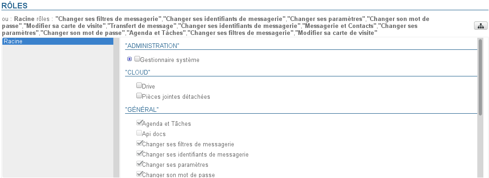


:::info

Delegierungsrechte

Ein Administrator kann nur die Rechte delegieren, die er selbst hat, mit Ausnahme des Zugriffs auf Anwendungen: Auch wenn er selbst keine Mail oder keinen Zugriff auf die Terminplaner-Anwendung hat, kann er z. B. "Mail und Kontakte" oder "Terminplaner und Aufgaben" für die von ihm verwalteten Benutzer aktivieren.

:::

Die Rechteverwaltung ist in mehrere Abschnitte unterteilt:

- **Verwaltung**: ermöglicht die Delegation von Verwaltungsrechten auf die verschiedenen Entitäten
- **Cloud**: ermöglicht den Zugriff auf die Abtrennung und Speicherung von Anhängen
- **Allgemein**: ermöglicht den Zugriff auf Anwendungen (Webmailer, Terminplaner usw.) und Hauptfunktionen (Verwaltung persönlicher E-Mail-Filter, Identitätsmanagement, Posteingang-Übertragung usw.)
- **Posteingang**: ermöglicht den Zugriff auf die Posteingang-Funktionalitäten des Messaging-Systems


:::info

Vererbung von Rechten

Die zugewiesenen Rechte können nur die von einer Gruppe geerbten Rechte **ergänzen**: Die einer Gruppe zugewiesenen Rechte, zu der der Benutzer gehört, können im Stammsatz des Benutzers nicht abgewählt werden.

So kann es vorkommen, dass Anwendungen nicht aktiviert, für den Benutzer aber dennoch zugänglich sind: Der Benutzer gehört zu einer Gruppe, in der die Anwendung aktiviert ist. In diesem Fall sollte daher die Gruppenzugehörigkeit des Benutzers überprüft werden (siehe oben)

Dies ist auch der Grund dafür, dass ein neu angelegter Benutzer Zugriff auf die Basisanwendungen hat: Beim Anlegen gehört ein Benutzer zur Gruppe "Benutzer", die bei einer klassischen leeren Installation standardmäßig Zugriffsrechte auf die Anwendungen "Terminplaner und Aufgaben" und "Mail und Kontakte" hat.

:::

Weitere Details zu Rollen finden Sie auf der Seite [Rollen: Zugriffs- und Administrationsrechte](/Guide_de_l_administrateur/Gestion_des_entites/Utilisateurs/Les_rôles_droits_d_accès_et_d_administration/) und auf der Seite [Delegierte Administration](/Guide_de_l_administrateur/Gestion_des_entites/Utilisateurs/L_administration_déléguée/).

### Benutzerinformationen

Die Registerkarte "Benutzerinformationen" ermöglicht es dem Administrator, die Kontaktdatei eines Benutzers zu vervollständigen.

Hier kann der Administrator Informationen wie Telefonnummern und Postadressen eingeben oder ein Foto zuordnen, das in der gesamten Anwendung wiederverwendet wird (z.B. in den [Kontakten](/Guide_de_l_utilisateur/Les_contacts/) oder im [Dialer](/Guide_de_l_utilisateur/La_téléphonie/)).

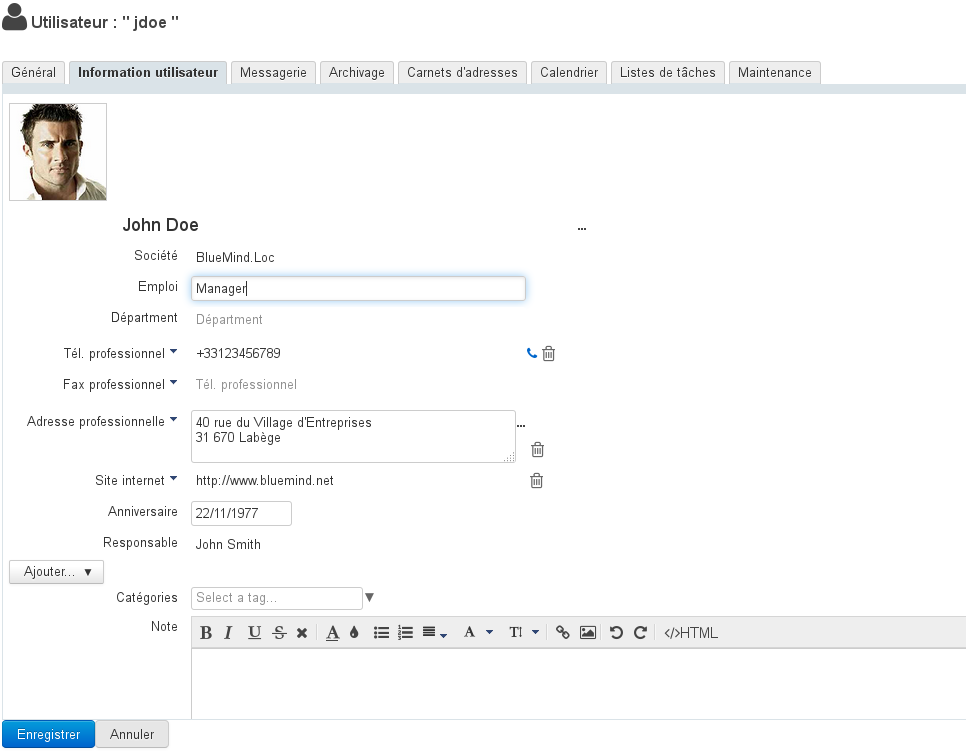

Die Kontaktdaten entsprechen dem internen BlueMind-Verzeichnis und sind für alle Benutzer der Lösung zugänglich. Aus diesem Grund **ist der Administrator der Einzige, der diese Informationen ändern kann**. Der Benutzer kann seine eigenen Informationen nicht selbst ändern.


:::info

Die Rolle "Eigene Informationen ändern" erlaubt es dem Benutzer nun, die Informationen in seinem Datensatz zu verwalten. Diese Änderungen können derzeit nur per Skript über den API-Schlüssel des Benutzers vorgenommen werden, eine Verwaltungsschnittstelle über die Parameter wird in Kürze verfügbar sein.

:::

### E-Mail-System

Die Registerkarte "Mail" zeigt die Einstellungen, die sich auf das Posteingang des Benutzers beziehen (Speicherplatz, Adressen, Identitäten, Freigabe usw.):

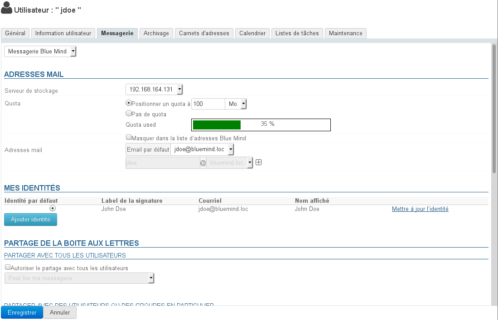

#### E-Mail-Adressen

- **Speicherserver**: Server, von dem dieser Benutzer verwaltet wird
- **Speicherplatz-Kontingent**: Maximale Speichergröße des Benutzer-Posteingangs.
Der vom Benutzer belegte Speicherplatz wird nun durch den oben sichtbaren Fortschrittsbalken "quota used" angezeigt.


:::info

** **Über Kontingente** **

Wenn das Kontingent aktiviert ist, wird sein prozentualer Anteil an der Nutzung permanent unten im linken Bereich des Webmailers angezeigt; wenn Sie mit der Maus darüberfahren, werden detaillierte Informationen angezeigt:
 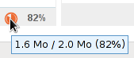

Zur Visualisierung des Kontingentniveaus werden Farbcodes verwendet: Die Belegungsrate wird in Orange angezeigt, wenn sie 75 % des Kontingents erreicht, in Dunkelrot, wenn sie 85 % erreicht und in Rot, wenn sie 100 % erreicht:


Wenn ein Kontingent erreicht ist, blockiert es den Empfang von Mails. Diese Mails werden vom Server für einige Tage aufbewahrt.
Auch Sende- und sogar Löschvorgänge können gestört werden, da das System Kopien in einem temporären Verzeichnis und/oder im Papierkorb erstellen muss.


:::info

Kontingentierung und Löschung

Um Nachrichten zu löschen, wenn das Kontingent erreicht ist, verwenden Sie die Funktion zum permanenten Löschen (ohne über den Papierkorb zu gehen), indem Sie auf &lt;SHIFT+Suppr> klicken.

:::

Ein erreichtes Kontingent kann vom Administrator manuell erhöht und jederzeit wieder auf das ursprüngliche Kontingent gesenkt werden.

:::

- **Haupt-E-Mail-Adresse** und Aliase: Der Benutzer kann beliebig viele E-Mail-Aliase haben, auf einem oder allen verfügbaren Domain-Aliasen.


#### Meine Identitäten

Identitäten ermöglichen es dem Benutzer, den Namen eines seiner Aliase oder geteilter Posteingänge einzugeben oder verschiedene Unterschriften zu definieren, die er je nach den von ihm geschriebenen Nachrichten wählt.

  


Weitere Informationen finden Sie auf der entsprechenden Seite in der Benutzerdokumentation :  [Identitäten](/Guide_de_l_utilisateur/La_messagerie/Les_identités/)

#### Gemeinsame Nutzung des Posteingangs

Im Bereich Freigabe können Sie eine öffentliche (für Mitglieder des Verzeichnisses) oder spezifische (nur für bestimmte Benutzer oder Gruppen) Freigabe der Posteingangs des Benutzers festlegen.

Standardmäßig ist beim Anlegen eines Benutzers keine Freigabe aktiviert.

Die Freigabeberechtigung eines Posteingangs kann folgendermaßen eingestellt werden:

- durch einen Administrator über die hier beschriebene Schnittstelle
- durch einen Benutzer über die Anwendung Einstellungen: Symbol Einstellungen > Bereich Posteingang > Registerkarte Freigabeverwaltung.


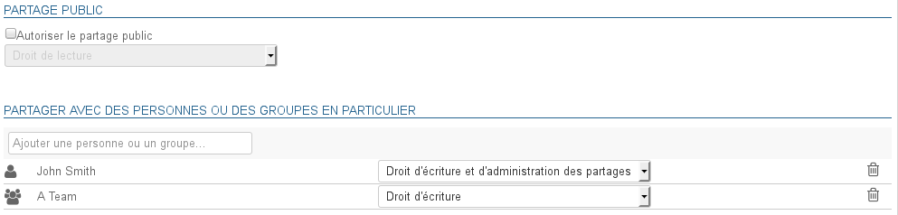

Weitere Informationen zur Freigabe und zu den Rechten finden Sie auf der entsprechenden Seite in der Benutzerdokumentation : [Einstellungen für das E-Mail-System | §5 - Freigaben verwalten](/Guide_de_l_utilisateur/La_messagerie/Preferences_de_messagerie/)

#### Automatische Nachrichtenweiterleitung

Seit Version 3.0.31 von BlueMind ist es möglich, mehrere Adressen anzugeben, an die Nachrichten weitergeleitet werden sollen.
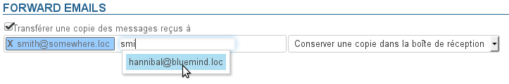


:::tip

Die Autovervollständigung durchsucht alle Verzeichnisse des Benutzers und schlägt Adressen vor (Telefonbuch, persönliche Verzeichnisse usw.)

:::

Externe Adressen, die bei Übertragungen nicht in das gesammelte Adressbuch der gesammelten Adressen aufgenommen werden, können manuell hinzugefügt werden.

#### Automatische Antwort

In diesem Bereich werden die automatischen Antworten des Benutzers aktiviert oder deaktiviert.

Um mehr über die Einstellungen und die Senderegeln zu erfahren, lesen Sie bitte die entsprechende Seite der Benutzerdokumentation: [Einstellungen für das E-Mail-System | §1 – Allgemeine Einstellungen](/Guide_de_l_utilisateur/La_messagerie/Preferences_de_messagerie/)

#### Nachrichten-Filter

Filter werden verwendet, um Sortierregeln und Aktionen automatisch auf neue eingehende Nachrichten des Benutzers anzuwenden.

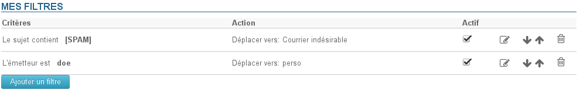

Um mehr über die Einstellungen und die Senderegeln zu erfahren, lesen Sie bitte die entsprechende Seite der Benutzerdokumentation:   [Nachrichtenfilter](/Guide_de_l_utilisateur/La_messagerie/Les_filtres_de_messages/)

### Archivierung

 Die Archivierung ist nun vollständig automatisiert und wird global verwaltet.

Siehe die entsprechende Seite [Archivierung](/Guide_de_l_administrateur/Configuration/Archivage/)

### Adressbücher

Unter dieser Registerkarte werden die Abonnements des Benutzers für die für ihn zugänglichen Adressbücher (seine persönlichen oder die mit ihm geteilten Adressbücher) sowie die Freigabe seiner Adressbücher für andere Benutzer oder Gruppen verwaltet.

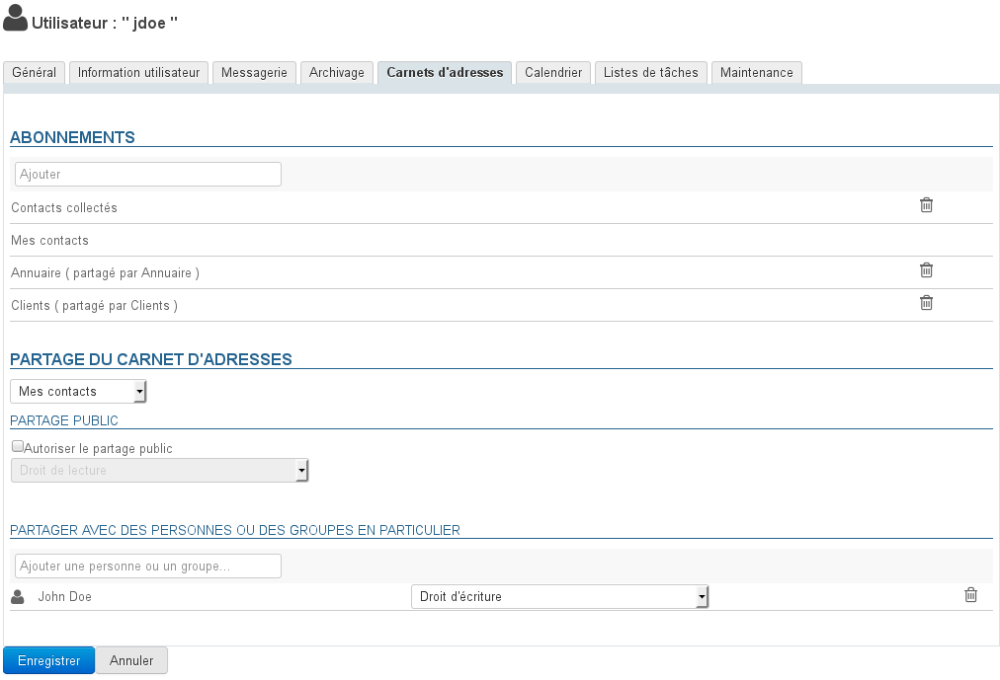

Für den Administrator ist es hingegen nicht möglich, Benutzerprotokolle zu erstellen.

Weitere Informationen finden Sie auf der entsprechenden Seite der Benutzerdokumentation [Kontakteinstellungen](/Guide_de_l_utilisateur/Les_contacts/Gestion_des_carnets_d_adresses/) und auf der Seite [Verwaltung der Freigaben](/Guide_de_l_utilisateur/Gestion_des_partages/)

### Kalender

Die Registerkarte "Kalender" bietet Zugriff auf alle Kalendereinstellungen des Benutzers (Uhrzeiten, Arbeitstage, angezeigte Elemente usw.) sowie auf die Optionen für die Freigabe des Benutzerkalenders und die Abonnements von Kalendern (Benutzer oder Domain), die für den Benutzer freigegeben sind:

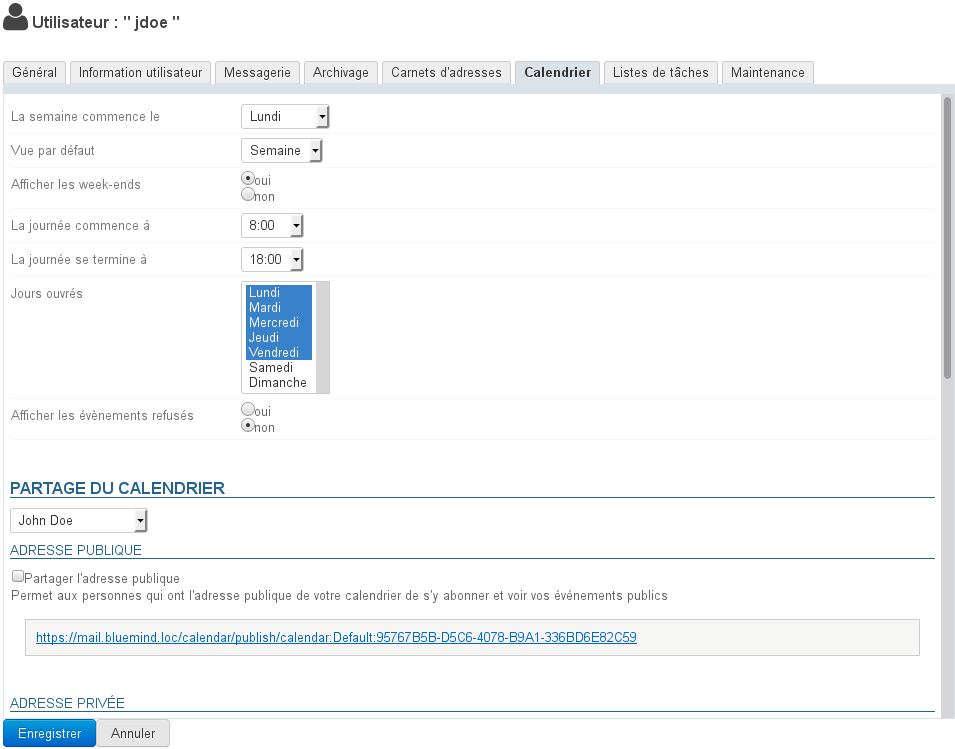


:::info

Wie bei den Adressbüchern kann der Administrator keine zusätzlichen Kalender für den Benutzer erstellen, aber er kann die gemeinsame Nutzung von Kalendern verwalten, sowohl mit Benutzern innerhalb der Domain als auch mit Personen außerhalb von BlueMind:


:::

### To-Do-Listen

Diese Registerkarte ermöglicht die Freigabe der To-Do-Listen des Benutzers und die Verwaltung der Abonnements von geteilten Listen:


Weitere Informationen finden Sie auf der Seite [Aufgaben](/Guide_de_l_utilisateur/Les_taches/) der Benutzerdokumentation sowie auf der Seite [Verwaltung der Freigaben](/Guide_de_l_utilisateur/Gestion_des_partages/)

### Wartung

Über diese Registerkarte hat der Administrator Zugriff auf die Wartungsfunktionen und Benutzereinstellungen:

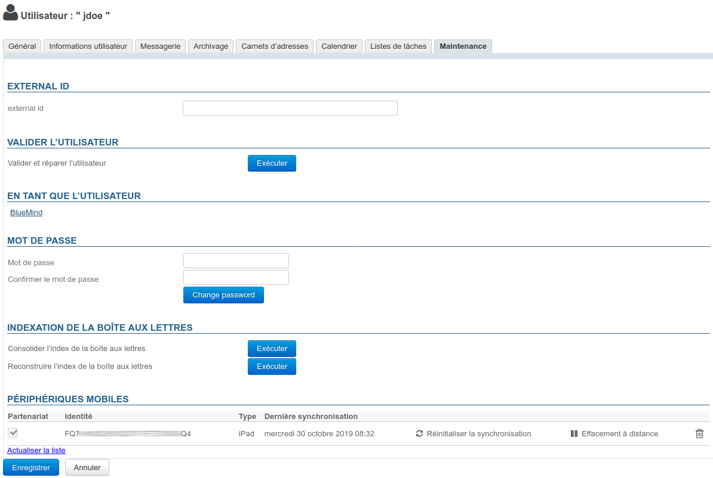

#### Externe ID

Das Feld in diesem Abschnitt wird ausgefüllt, wenn der Benutzer mit einem [AD-](/Guide_de_l_administrateur/Gestion_des_entites/Synchronisation_Active_Directory/) oder [LDAP-Konto](/Guide_de_l_administrateur/Gestion_des_entites/Synchronisation_LDAP/) synchronisiert ist. Dieses Feld kann ausgefüllt oder geändert werden, um die UID des entsprechenden Benutzers im AD- oder LDAP-Verzeichnis zu erzwingen oder zu korrigieren.

#### Benutzer validieren

Die Schaltfläche "Ausführen" dieses Abschnitts ermöglicht den Start des Vorgangs "Validieren und Reparieren" für das Benutzerkonto. Dies umfasst eine Reihe von Vorgängen, die die Integrität Daten im BlueMind-System überprüfen und ggf. korrigieren: Überprüfung des Posteingangs in Cyrus, der Terminplanercontainer und Adressbücher, der IMAP-Ordnerhierarchie, der Abonnements, der Mailfilter usw.

Dieser Vorgang entspricht dem Befehl [bm-cli](/Guide_de_l_administrateur/Administration_avancee/Client_CLI_pour_l_administration/):


```
bm-cli maintenance repair user@domain.net
```


#### Als Benutzer

Der Link in diesem Abschnitt ist für den Superadministrator admin0 oder einen anderen Administrator mit [der Rolle "Sudo (Privilegieneskalation)“](/Guide_de_l_administrateur/Gestion_des_entites/Utilisateurs/Les_rôles_droits_d_accès_et_d_administration/) zugänglich. Der Link ermöglicht es, auf das BlueMind des Benutzers zuzugreifen, d.h. sich anstelle des Benutzers mit BlueMind zu verbinden, ohne dass der Benutzer sein Passwort angeben muss.

#### Passwort

Der Administrator kann in diesem Bereich das BlueMind-Login-Passwort des Benutzers ändern/zurücksetzen, ohne das alte Passwort kennen zu müssen.

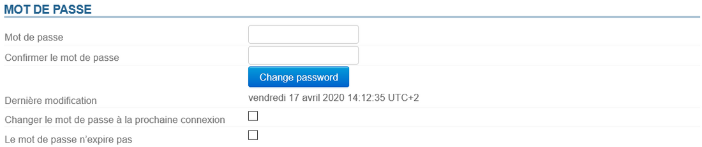

Ab Version 4.3 ist eine feinere Verwaltung und eine Richtlinie zum Ablauf von Passwörtern implementiert.

In diesem Abschnitt wird das Datum der letzten Änderung (durch den Benutzer oder einen Administrator) des Passworts angezeigt, falls zutreffend.


:::tip

Diese Informationen sind nicht rückwirkend: Daten, die vor dem Server-Update in 4.3 liegen, werden nicht angezeigt.

Für Benutzer, die nach dem Wechsel zu 4.3 angelegt wurden, kann das Änderungsdatum dem Erstellungsdatum des Benutzers entsprechen.

:::

Der Administrator hat außerdem 2 Möglichkeiten:

- **Passwort bei der nächsten Anmeldung ändern**: Der Benutzer wird gezwungen, sein Passwort bei der nächsten Anmeldung zu ändern
- **Passwort läuft nicht ab**: Mit dieser Option wird der Benutzer von der Passwort-Ablaufrichtlinie [der Domain](/Guide_de_l_administrateur/Configuration/Gestion_des_domaines/) ausgeschlossen, falls diese eingerichtet wurde.


Um eine dieser Optionen zu aktivieren, markieren Sie das entsprechende Kästchen und klicken Sie auf die Schaltfläche "Speichern" am unteren Rand der Seite.


:::info

Verbinden mit AD oder LDAP

Der Ablauf kann nicht auf Benutzer angewendet werden, die aus einem AD- oder LDAP-Verzeichnis importiert wurden.

:::

#### Posteingang-Indizierung

In diesem Abschnitt wird der Vorgang zur Konsolidierung des Posteingang-Indexes des Posteingangs des Benutzers gestartet: Dieser Vorgang vervollständigt die aktuelle Indizierung des Posteingangs, indem nur die fehlenden Elemente indiziert werden

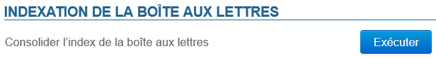

Um den Vorgang zu starten, klicken Sie auf die Schaltfläche "**Ausführen**" gegenüber von "**Posteingang-Index konsolidieren"**.

#### Mobile Endgeräte

In diesem Bereich können Sie die mobilen Endgeräte des Benutzers verwalten: Berechtigungen, synchronisierte Geräte, Zurücksetzen, Löschen von Mobilgeräten.

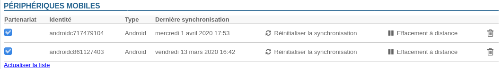

- **Partnerschaft**: Mit diesem Kontrollkästchen kann die Synchronisierung eines Geräts ausgesetzt und aktiviert werden, ohne es komplett entfernen zu müssen
- **Identität**: Gibt die Seriennummer an, mit der sich das Gerät vorstellt
- **Typ**: Marke/OS des Geräts
- **Letzte Synchronisation**: Datum und Uhrzeit der letzten Synchronisation des Geräts mit dem Server
- **Synchronisation zurücksetzen**: Setzt die Synchronisationsinformationen des Geräts zurück. Die nächste Synchronisation erfolgt auf die gleiche Weise wie eine Erstsynchronisation, das Gerät führt eine vollständige Synchronisation durch, als wäre es dem Server nie bekannt gewesen.
- **Remote-Löschung**: löscht alle auf dem Telefon vorhandenen Daten, unabhängig davon, ob sie mit dem BlueMind-Konto verknüpft oder privater Natur sind (Fotos, SMS, ....).  **Dieser Vorgang ist nicht umkehrbar.**  *Siehe Absatz 4 der Seite [EAS-Server-Konfiguration](/Guide_de_l_administrateur/BlueMind_et_mobilite/Configuration_du_serveur_EAS/) *
- **Mülleimer-Symbol**: Ermöglicht das Löschen der Synchronisation mit einem Gerät.Das Löschen eines Smartphones aus der Liste hat, wenn unbekannte Smartphones standardmäßig nicht zugelassen sind, den Wirkung, dass die Synchronisation dieses Smartphones mit BlueMind blockiert wird. Die Option "Unbekannte Geräte zulassen" ist ein Parameter, der mit einer Instanz von BlueMind verknüpft ist. Er ändert sich im Abschnitt Systemadministration > Systemkonfiguration > EAS-Server in admin0.*Siehe Seite [EAS-Server-Konfiguration](/Guide_de_l_administrateur/BlueMind_et_mobilite/Configuration_du_serveur_EAS/) *


## Löschen eines Benutzers

### Sperren

Ein Benutzer kann suspendiert werden. Damit ist es möglich, den Zugriff und den Benutzer zu suspendieren, ohne aber seine Daten zu löschen. Der Benutzer kann im Nachhinein wieder aktiviert werden und findet sein Konto im ursprünglichen Zustand wieder.

Einen Benutzer suspendieren:

- in die Verwaltung des betreffenden Benutzers gehen: Verzeichnisse > Verzeichniseinträge > Benutzer auswählen.
- Aktivieren Sie auf der ersten Registerkarte ("Allgemein") das Kontrollkästchen "Suspendiert" auf der rechten Seite und klicken Sie dann auf "Speichern", um die Änderung zu übernehmen


### Löschen

Um einen oder mehrere Benutzer vollständig und dauerhaft aus dem System zu löschen, gehen Sie auf die Seite Verzeichnisse > Verzeichniseinträge.

Aktivieren Sie in der Liste der Benutzer das Kontrollkästchen am Anfang der Zeile, die dem oder den zu löschenden Benutzer(n) entspricht, und klicken Sie auf die Schaltfläche "Löschen". Eine Bestätigung der Löschung wird angefordert, **sobald die Bestätigung erfolgt ist, werden die Benutzer und alle ihre Daten endgültig gelöscht**.


:::info

Wiederherstellen eines Benutzers

Die Wiederherstellung eines Benutzers ist in BlueMind möglich, indem man auf einen vorherigen Backup zurückgreift. Siehe die Funktion Backup-Wiederherstellung, mit der Sie alle oder einen Teil der Daten eines Benutzers wiederherstellen können. Daten, die sich seit dem letzten Backup geändert haben, können nicht wiederhergestellt werden.

:::

Siehe auch [User-Exit-Prozedur und Mailweiterleitung](/Guide_de_l_administrateur/Gestion_des_entites/Utilisateurs/Procédure_de_départ_utilisateur_et_redirection_de_ses_mails/)

## Passwortsicherheit

Zur Implementierung einer erhöhten Benutzerpasswort-Sicherheit kann das Plugin "Password SizeStrength" installiert werden, um strenge Regeln für die Gültigkeit eines Passworts zu definieren.

### Installation

Die Installation des Plugins erfolgt durch die Installation von 2 Paketen in der Kommandozeile, verbunden als root mit dem Server:


```
aptitude install bm-plugin-core-password-sizestrength bm-plugin-admin-console-password-sizestrength
```


Die Installation erfordert einen Neustart von BlueMind:


```
bmctl restart
```


### Konfiguration

Ab Version 4.3 erfolgt die Konfiguration in der Administrationskonsole > Systemkonfiguration > Registerkarte Passwort :

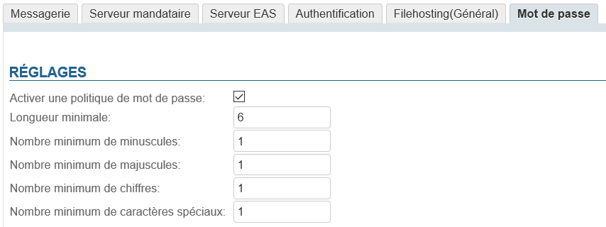

Änderungen werden sofort übernommen und erfordern keinen Neustart.


:::tip

Die Änderungen sind nicht rückwirkend wirksam und betreffen nur zukünftige Passwortänderungen: Benutzer, deren aktuelles Passwort nicht den Regeln entspricht, werden nicht aufgefordert, es zu ändern, es bleibt funktionsfähig.

:::

##### Versionen vor 4.3

In den Vorgängerversionen wird das Plugin über die Datei `/etc/bm/password.ini` parametriert, die bei der Installation die folgenden Standardwerte enthält:


```
length=10
capital=1
digit=1
lower=1
special=1
```


- `length`: Mindestanzahl von Zeichen, die das Passwort enthalten muss
- `capital`: Mindestanzahl von Großbuchstaben
- `digit`: Mindestanzahl von Ziffern
- `lower`: Mindestanzahl von Kleinbuchstaben
- `special`: Mindestanzahl von Sonderzeichen. Dies umfasst die folgenden Zeichen:


```
!"#$%&'()\*+,-./:;<=>?@[\]^\_`{|}~
```


:::info

Administratoren (globaler Administrator admin0 oder Domain-Administratoren) unterliegen diesen Regeln nicht, sie bleiben frei in der Wahl ihres Passworts.

:::

Werden die Regeln nicht befolgt, wenn ein Benutzer versucht, sein Passwort zu ändern, erscheint oben auf der Seite eine Warnung:

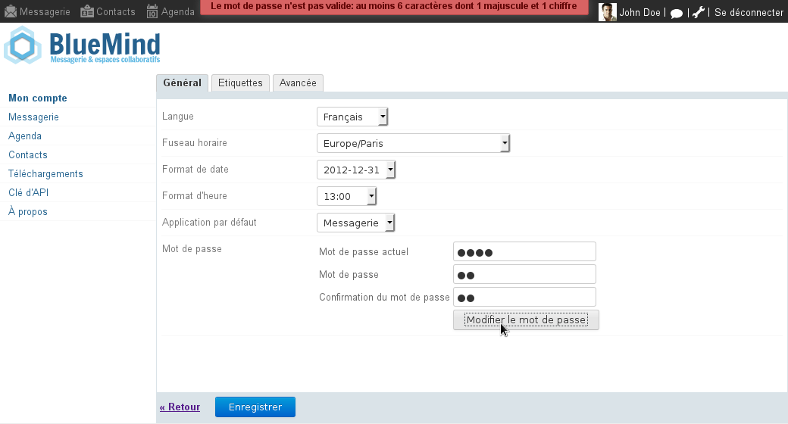


