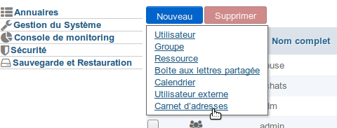
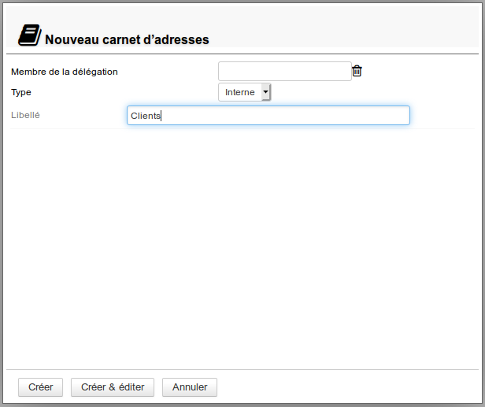
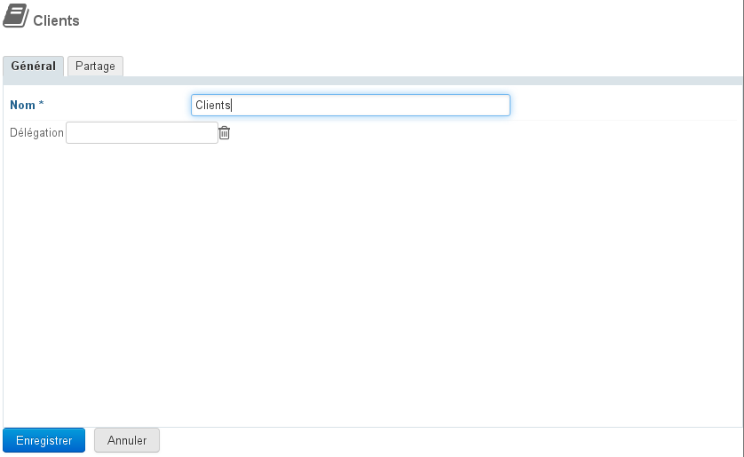
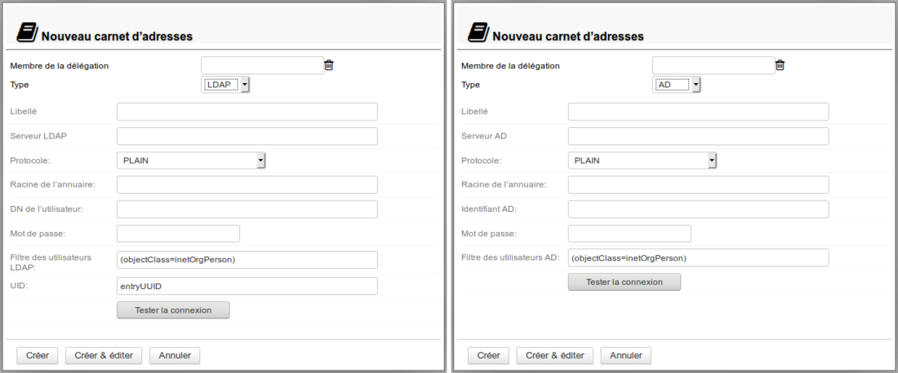
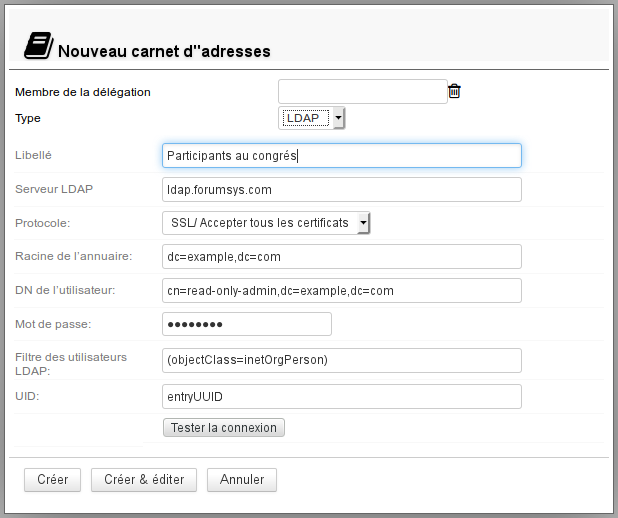
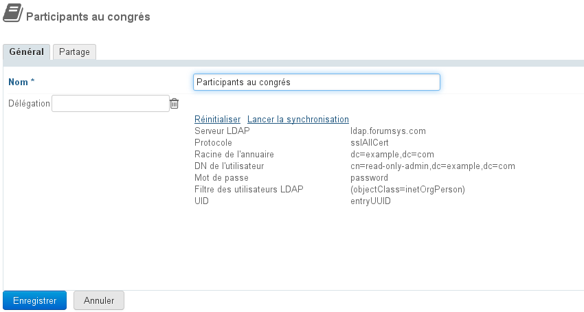
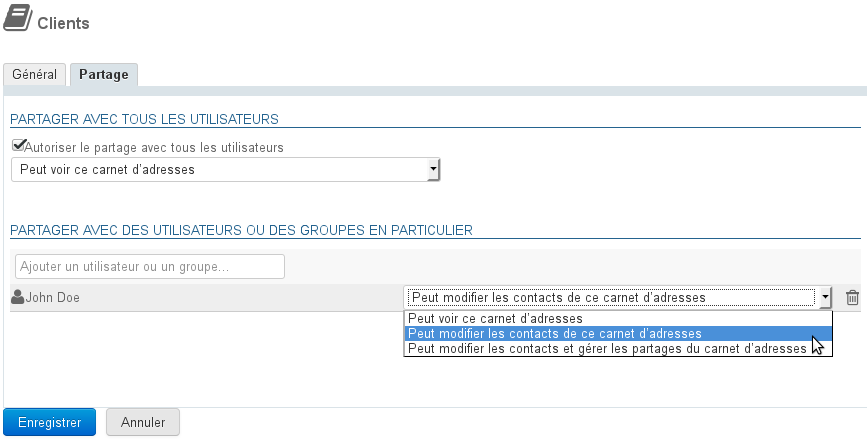
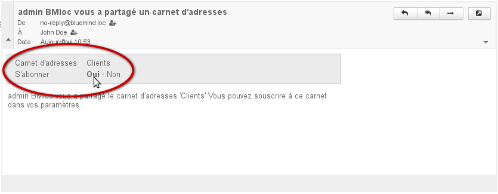
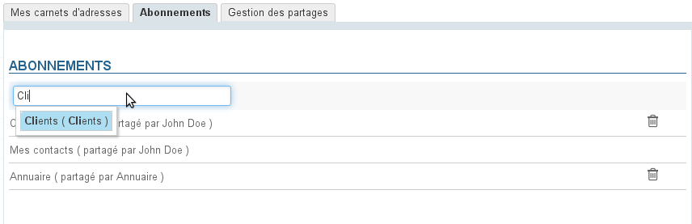
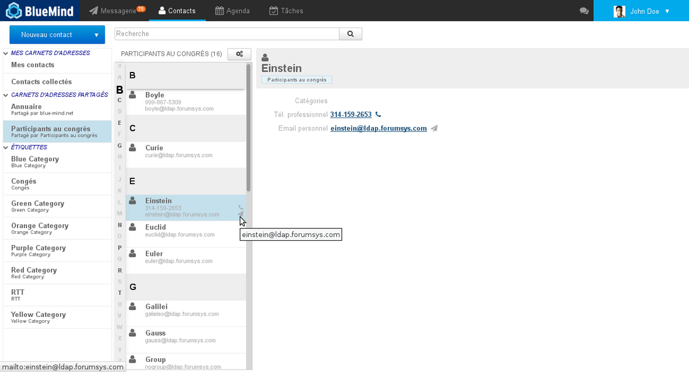

# Domain-Adressbücher

## Präsentation

Das Domain-Adressbuch ist ein gemeinsames Adressbuch für Benutzer. Neben der einfachen Abfrage kann der Administrator Benutzern oder Gruppen Rechte zur Änderung oder Verwaltung des Adressbuchs zuordnen.

Domain-Adressbücher werden als eigenständige Entitäten verwaltet, verhalten sich aber wie Benutzer-Adressbücher: Je nach den zugewiesenen Rechten ist es möglich, sie einzusehen, Einträge zu erstellen und zu ändern, Kontakte zu importieren oder das Adressbuch im vCard-Format zu exportieren.

## Internes Domain-Adressbuch

### Erstellung

So erstellen Sie ein neues Adressbuch:

1. Klicken Sie auf der Startseite der Verzeichnisverwaltung auf "Adressbuch erstellen“ oder verwenden Sie in der Liste der Verzeichniseinträge die Schaltfläche Neu > Adressbuch: 
2. Den Typ "internes" Adressbuch auswählen lassen und einen Namen und ggf. eine Delegation eintragen: 
3. Klicken Sie auf "Erstellen" für eine einfache und direkte Erstellung des Notizbuchsoder klicken Sie auf "Erstellen & Editieren", um das Adressbuch zu erstellen und auf die Konfigurationsoptionen zuzugreifen, einschließlich der Freigabeoptionen.

### Konfiguration

Über die Registerkarte "Allgemein" in der Konfiguration eines Domain-Adressbuchs können Sie dessen Namen oder die Organisationseinheit (Delegation), zu der es gehört, ändern:

Sobald der Name oder die Delegation eingegeben ist, klicken Sie auf "Speichern", um die Änderungen zu bestätigen.

:::tip
Das Sternchen zeigt an, dass das Feld obligatorisch ist, der Name kann nicht leer gelassen werden.
:::

## Adressbuch, das mit einem externen Verzeichnis verbunden ist

Es ist möglich, Domain-Adressbücher zu erstellen, die mit LDAP- und AD-Verzeichnissen synchronisiert sind. Diese Funktion ermöglicht insbesondere die Abfrage großer Verzeichnisse, wobei die im Adressbuch dargestellten Kontakte gefiltert werden können.

### Administrationsrecht

Die Verwaltung von LDAP/AD-Adressbüchern ist an eine bestimmte Rolle gebunden, die an die gewünschten Administratoren delegiert werden sollte:

Diese Rolle ist unabhängig, um einigen Administratoren zu erlauben, nur einfache Domain-Adressbücher zu erstellen.

:::info

Um Adressbücher erstellen zu können, muss der Benutzer auch die Rolle "Domain-Adressbücher verwalten" haben

:::

Wie die anderen Rolle kann auch diese entweder an eine Gruppe (z.B. um sie allen Administratoren zu erteilen) oder individuell nur an bestimmte Benutzer delegiert werden.
Weitere Informationen finden Sie auf der Seite [Delegierte Administration](/Guide_de_l_administrateur/Gestion_des_entités/Utilisateurs/L_administration_déléguée/)

### Erstellung

Die Erstellung erfolgt auf die gleiche Weise wie bei der Erstellung eines einfachen Adressbuchs:

1. Klicken Sie auf der Startseite der Verzeichnisverwaltung auf "**Domain-Adressbuch erstellen**“ oder verwenden Sie in der Liste der Verzeichniseinträge die Schaltfläche **Neu > Adressbuch**: 
2. **Wählen Sie die Art von Adressbuch aus**:
3. Daraufhin wird das entsprechende Formular angezeigt: 
4. **Geben Sie die Informationen des zu verbindenden Verzeichnisses ein**, z. B. für ein LDAP-Adressbuch:

:::tip

Informationen zum UID-Feld

Dieses Feld kann den Namen eines LDAP-Attributs enthalten, das die folgenden Bedingungen erfüllt:

- Textwert
- Einzelwert
- Wert, der sich während der gesamten Lebensdauer des entsprechenden LDAP-Eingangs nicht ändert – auch nicht beim Verschieben im Baum, Umbenennen oder anderweitigen Änderungen.

:::

5. **Klicken Sie auf "Erstellen"** für eine einfache und direkte Erstellung desAdressbuchs oder auf "Erstellen & Editieren", um das Adressbuch zu erstellen und auf die Konfigurationsoptionen zuzugreifen, einschließlich der Freigabeoptionen.

### Konfiguration

Die Registerkarte "Allgemein " der Konfigurationsoptionen eines Adressbuchs bietet die folgenden Möglichkeiten:

- Ändern des Namens
- Hinzufügen, Ändern oder Entfernen der Organisationseinheit (Delegation), zu der es gehört
- Verbindungsdaten zum LDAP/AD-Verzeichnis prüfen
- Synchronisation erzwingen oder Daten zurücksetzen

## Freigabe

Ein Domain-Adressbuch wird bei Erstellung standardmäßig nicht für andere Benutzer freigegeben.

Entsprechende Rechte können zugewiesen werden:

- an alle Benutzer der Domain für ein gemeinsames und öffentliches Adressbuch
- an bestimmte Benutzer, zum Beispiel für ein gemeinsames Adressbuchbuch des Direktors, seines Stellvertreters und seiner Sekretärin
- an eine Gruppe, z.B. ein Kunden- oder Interessenten-Adressbuch für das Verkaufsteam

Die folgenden Rechte können zugewiesen werden:

- Kann dieses Adressbuch sehen: kann Kontaktdateien einsehen und exportieren
- Kann die Kontakte in diesem Adressbuch bearbeiten: kann Kontakte erstellen, importieren und bearbeiten
- Kann Kontakte bearbeiten und Adressbuchfreigaben verwalten: kann zusätzlich zur Schreibberechtigung auch Adressbuchfreigaben verwalten

:::info

Gemeinsame Nutzung eines synchronisierten Verzeichnisses mit einem LDAP-Verzeichnis: bekanntes Problem

Trotz des Vorhandenseins einer "darf Änderungen vornehmen"-Option können Kontakte in Adressbüchern, die mit LDAP-Verzeichnissen synchronisiert werden, nicht von Benutzern geändert werden, da diese Synchronisation eine einfache Abfrage ist.

Die einzigen relevanten Rechte sind "kann Kontakte sehen" und "kann Freigaben verwalten".

:::

#### Öffentliche Freigabe

Bei Aktivierung dieses Kontrollkästchen wird die konfigurierte Freigabe auf alle Benutzer der Domain angewendet.

#### Freigabe für bestimmte Personen oder Gruppen

In diesem Bereich können Sie Personen oder Gruppen auswählen, denen Sie Rechte zuweisen möchten.

- Beginnen Sie die Eingabe des Namens des Benutzers oder der Gruppe im Eingabefeld
- Bestätigen Sie mit der Eingabetaste oder indem Sie auf den von der Autovervollständigung vorgeschlagenen Namen klicken
- Die Person oder Gruppe ist zur Liste hinzugefügt; wählen Sie das gewünschte Zugriffsrecht
- Wiederholen Sie den Vorgang, um mehrere Personen oder Gruppen hinzuzufügen
- Nach der Zuweisung der Rechte zur Bestätigung auf "Speichern“ klicken

Für ein Vertriebsadressbuch können beispielsweise die folgenden Rechte zugewiesen werden:

- ein Verantwortlicher erhält das Recht zum Schreiben und zur Verwaltung der Freigaben, so dass er die Dateien erstellen und ändern kann und eventuell dem einen oder anderen Mitarbeiter das Recht überträgt, auch die Kontakte zu aktualisieren.
- ein Mitarbeiter erhält das Recht, Kontakte zu ändern (sowie hinzuzufügen oder zu löschen)
- das gesamte Vertriebsteam (eine Gruppe) erhält die Möglichkeit, Kundendateien einzusehen

:::info

Damit das Adressbuch in seinem BlueMind erscheint, muss ein Benutzer, der es aufrufen darf, dieses Adressbuch abonniert haben.

Dies kann auf zwei Arten geschehen:

- über die Nachricht, die er erhält, wenn das Adressbuch mit ihm geteilt wird:

- über die Verwaltung seiner Abonnements in den [Einstellungen](/Guide_de_l_utilisateur/Les_contacts/Gestion_des_carnets_d_adresses/) :
 

:::

Das Adressbuch ist dann in der Anwendung "Kontakte" des/der gewünschten Benutzer(s) verfügbar:

