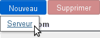
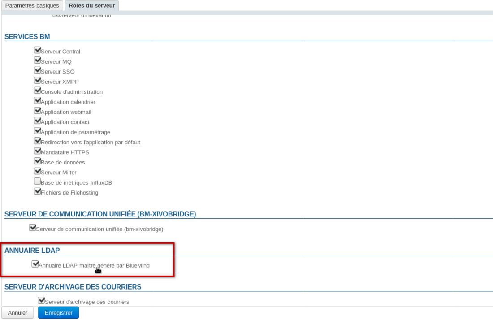
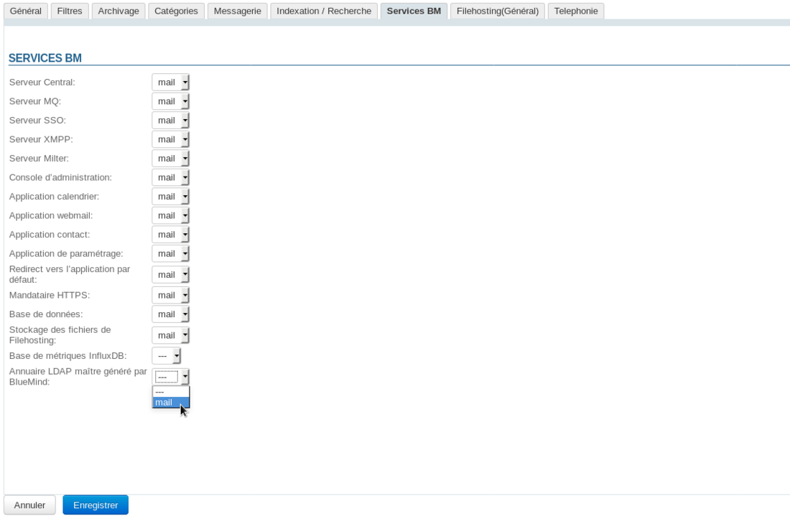

# LDAP-Export


## Präsentation

BlueMind ermöglicht den Export eines Verzeichnisses im LDAP-Format, damit es von anderen Anwendungen, z. B. einem LDAP-Verzeichnis, gesehen und aufgerufen werden kann.


## Verfahren

1. Installieren Sie die erforderlichen Pakete auf dem Server, der BlueMind hostet:


**
Ubuntu/Debian


**
RedHat/CentOS


**Ubuntu/Debian**

```
aptitude update
aptitude install bm-plugin-admin-console-ldap-export bm-plugin-core-ldap-export
```


**RedHat/CentOS**

```
yum update
yum install bm-plugin-admin-console-ldap-export bm-plugin-core-ldap-export
```


2. BlueMind neu starten:


```
bmctl restart
```


3. Auf dem Server, auf dem das LDAP-Verzeichnis laufen soll (dies kann der BlueMind-Server selbst oder ein separater Server sein) das Paket *bm-ldap-role* installieren:


**
Ubuntu/Debian


**
RedHat/CentOS


**Ubuntu/Debian**

```
aptitude update
aptitude install bm-ldap-role
```


**RedHat/CentOS**

```
yum update
yum install bm-ldap-role
```


4. Dem Server die Rolle zuweisen. Vorgehensweise:
    - Angemeldet als Superadministrator admin0 gehen Sie zur Administrationskonsole > Application Servers
    - wenn es sich um einen separaten Server handelt und dieser noch nicht existiert, fügen Sie ihn über die Schaltfläche Neu > Server hinzu 
    - Wählen Sie den Server aus und gehen Sie auf die Registerkarte "Server-Rollen"
    - im Abschnitt "Verzeichnisse" das Häkchen bei "Von BlueMind generiertes Master-LDAP-Verzeichnis":
5. Bestätigen Sie mit "Speichern"
6. Verknüpfen Sie diesen Server mit der/den gewünschten Domain(s).Gehen Sie dazu zu Domain Management > Überwachte Domains und:
    - wählen Sie die Domain, die im LDAP-Format exportiert werden soll
    - zur Registerkarte "BM-Dienste" gehen
    - dort den Server für den ebenfalls "Von BlueMind generiertes Master-LDAP-Verzeichnis" benannten Dienst auswählen:
    - Bestätigen Sie mit "Speichern"
Wiederholen Sie den Vorgang für jede gewünschte Domain.


 

Speichern

Speichern

Speichern

Speichern

