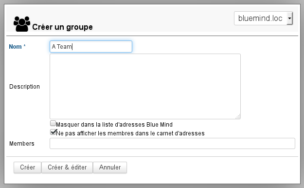
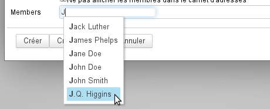
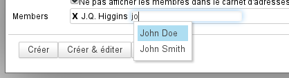
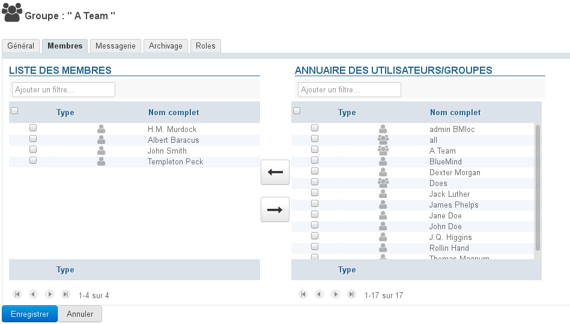
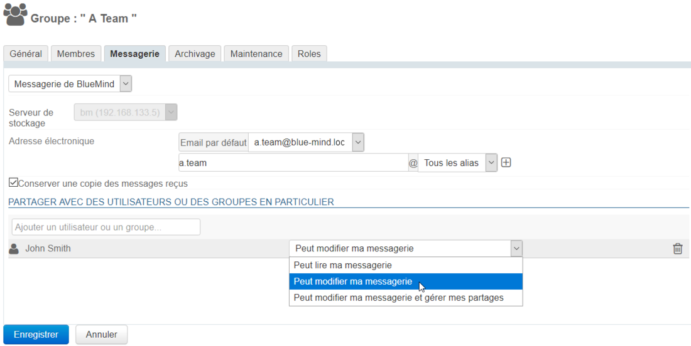
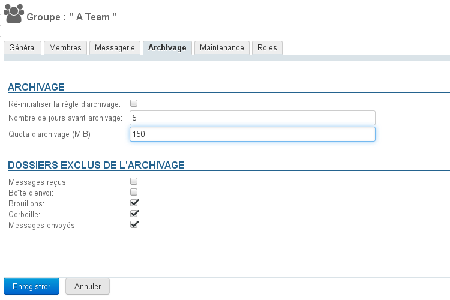
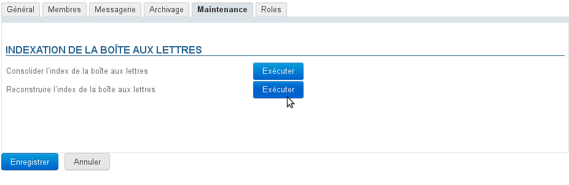
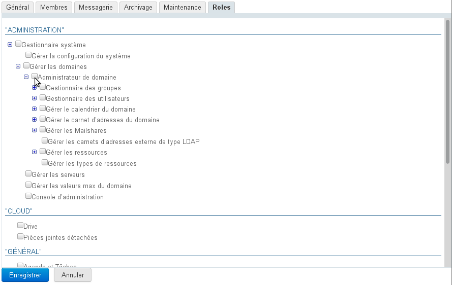

# Gruppen

## Präsentation

Administratoren können Benutzergruppen erstellen, die, wenn sie öffentlich sind, zu folgenden Zwecken genutzt werden können:

- Die Terminplaner einer Gruppe von Personen anzeigen;
- Einer Gruppe von Personen Rechte in Bezug auf Terminplaner, Ressourcen, geteilte Posteingänge, individuelle Posteingänge, Adressbücher usw. zuweisen.
- Andere Gruppen durch Integration von einer oder mehreren Gruppen definieren;
- Eine E-Mail an eine Gruppe von Personen senden (wenn die Gruppe eine E-Mail-Adresse hat): interne Mailingliste.

## Erstellung

Klicken Sie in der Administrationsoberfläche auf der Startseite oder auf der Seite "Verzeichnisse" auf "Gruppe erstellen":

Geben Sie den Namen der Gruppe, eine Beschreibung (optional) und die gewünschten Optionen ein:

- In der BlueMind-Adressliste ausblenden: Die Gruppe ist vorhanden, aber nicht sichtbar (weder in den Autovervollständigungen, noch in der Liste der Kontakte im Telefonbuch oder der Gruppen, zu denen sie gehört). Diese Gruppe kann von Administratoren oder von Personen, die die Adresse kennen, verwendet werden.
- Mitglieder nicht im Adressbuch anzeigen: Auch wenn die Gruppe vom Verzeichnis aus sichtbar ist, können Benutzer nicht sehen, welche Mitglieder sie enthält

Die Gruppe kann leer gelassen werden oder die Mitglieder können aus dem letzten Feld des Formulars hinzugefügt werden.
Die Autovervollständigung ermöglicht es Ihnen, die Mitglieder zu finden, sobald Sie mit der Eingabe beginnen:

Um mehrere Benutzer hinzuzufügen, schreiben Sie rechts neben dem zuvor ausgewählten Benutzer weiter:

### Schnelle Erstellung

Wie beim Erstellen eines Benutzers kann auch eine Gruppe in der Schnellerstellung durch Klicken auf die Schaltfläche "erstellen" erstellt werden.
Diese hat die im Popup eingegebenen Informationen und die folgenden Standardeigenschaften:

- keine E-Mail Adresse
- Archivierung ist nicht aktiviert

Die Gruppe kann dann über die Administrationsoberfläche ergänzt und verändert werden.

### Erstellung und Bearbeitung

Die Schaltfläche "Erstellen & Editieren“ (Tasten&lt;Strg-Enter>) erstellt die Gruppe mit den gleichen Eigenschaften wie bei der Schnellerstellung und leitet dann automatisch zur Gruppenadministrationsoberfläche weiter, um eine vollständigere Konfiguration der Gruppe vorzunehmen.

## Editieren und Administration von Gruppen

Auf der Seite Verzeichnisse >> Verzeichniseinträge die Gruppen filtern, indem Sie auf das Symbol "Gruppe" klicken und dann die zu bearbeitende Gruppe aus der Liste auswählen.

### Allgemein

Die Registerkarte "Allgemein" enthält die grundlegenden Informationen und Einstellungen der Gruppe: Name, Delegation (nur als Mitglied), Beschreibung und Sichtbarkeitsoptionen für die Gruppe selbst und für die Mitglieder.

### Mitglieder

Die Registerkarte "Mitglieder" stellt in 2 Spalten die Verwaltung der Gruppenmitglieder dar: in der linken Spalte die bereits in der Gruppe vorhandenen Mitglieder, in der rechten Spalte die anderen im Verzeichnis vorhandenen Benutzer und Gruppen.

- Wählen Sie den gewünschten Benutzer oder die gewünschte Gruppe in einer Spalte aus und klicken Sie auf einen der Pfeile in der Mitte, um den Benutzer/die Gruppe zur Gruppe hinzuzufügen oder aus ihr zu entfernen.

:::info

Gruppen in Gruppen

Gruppen können in Gruppen aufgenommen werden, allerdings werden nur Gruppen mit einer E-Mail-Adresse berücksichtigt: Wenn eine aufgenommene Gruppe keine E-Mail-Adresse hat, erhalten ihre Mitglieder keine Nachrichten, die an die übergeordnete Gruppe gesendet werden.

:::

:::tip

Externe Benutzer können zu Gruppen hinzugefügt werden. Besuchen Sie für weitere Informationen die entsprechende Seite,: [Benutzer](/Guide_de_l_administrateur/Gestion_des_entités/Utilisateurs/) > [Externe Benutzer](/Guide_de_l_administrateur/Gestion_des_entités/Utilisateurs/Utilisateurs_externes/)

:::

### E-Mail-System

Auf der Registerkarte "Nachrichten" können Sie die Adressen und Aliase der Gruppe sowie die Speicherung der Nachrichten einrichten: Die Gruppe verfügt dadurch über einen geteilten Posteingang, in dem sie die empfangenen Nachrichten abrufen kann.

Wenn das Feld „Kopie der empfangenen Nachrichten aufbewahren“ aktiviert ist, werden die Nachrichten in einer Mailbox gespeichert, um aufbewahrt und eingesehen werden zu können.

Ist dieses Kontrollkästchen nicht markiert, werden neue Nachrichten nicht gespeichert.

:::tip

Eine Deaktivierung dieser Option führt nicht zu einer Löschung des Postfach-Inhalts.

Wenn das Kontrollkästchen für eine bestimmte Zeit aktiviert war, bevor es deaktiviert wurde, bleibt das freigegebene Postfach bestehen und enthält die E-Mails, die für die Dauer der Aktivierung empfangen wurden.

:::

Das Gruppenpostfach kann unabhängig von der Gruppenzugehörigkeit mit dem folgenden [Freigabeformular](/Guide_de_l_utilisateur/Gestion_des_partages/) freigegeben werden. Es können die folgenden Rechte zugewiesen werden:

- **Postfach-Leserecht**: Benutzer können E-Mails lesen
- **Kann Änderungen in meinem Postfach vornehmen**: zusätzlich zum vorherigen Recht können Benutzer E-Mails ändern (hinzufügen, löschen, verschieben...)
- **Kann mein Postfach ändern und meine Freigaben verwalten**: Zusätzlich zu den obigen Rechten können die Benutzer die Freigaberechte verwalten

In der Mail-Baumstruktur wird das Postfach bei den freigegebenen Postfächern platziert und hat den Namen der Gruppe mit vorangestelltem Symbol „_“*(Underscore)*.
So wird z.B. für eine „Kontakt“-Gruppe das gemeinsame Postfach in der Struktur "_Kontakt" genannt.

:::info

Im Gegensatz zu geteilten Posteingängen kann im Gruppen-Posteingang keine Identität erstellt und keine Nachricht im Namen der Gruppe verfasst werden.

:::

### Archivierung

Wenn eine [globale Archivierungsrichtlinie](/Guide_de_l_administrateur/Configuration/Archivage/) für die Domain definiert ist, gelten ihre Standardregeln für alle Benutzer und Gruppen der Domain.

Es ist jedoch möglich, die Standardeinstellungen außer Kraft zu setzen, um eine Standardeinstellung für einen Benutzer oder eine Benutzergruppe festzulegen.

Standardmäßig werden die Domain-Archivierungsparameter im Formular angezeigt. Um sie anzupassen, geben Sie einfach die neuen gewünschten Werte ein:

- die gewünschte Anzahl von Tagen, alle vorherigen Nachrichten werden archiviert.
- das den Benutzern in der Gruppe zugewiesene Kontingent an Festplattenspeicher

:::info

das Kontingent kann das maximale Domain-Kontingent nicht überschreiten: wenn eine höhere Zahl eingegeben wird, wird es auf das maximale Kontingent zum Zeitpunkt der Speicherung reduziert

:::

- aktivieren oder deaktivieren Sie bei Bedarf die ** **auszuschließenden** ** Ordner
- klicken Sie auf "Speichern", um die Änderungen zu speichern.

Das Kontrollkästchen "Archivierungsregel neu initialisieren" ermöglicht die Rücksetzung der Standardwerte der Domain:

- bei aktiviertem Kästchen ist das Formular ausgegraut
- klicken Sie auf "Speichern"
- die Daten werden gespeichert: Der Stammsatz der Gruppe wird geschlossen, Sie können ihn wieder öffnen, um zu prüfen, ob die Daten zurückgesetzt wurden.

:::info

Die Einheit MiB (MebiByte) ist ein Vielfaches des Bytes (Oktett), die von MB (Megabyte, oder Mo-Megaoktett) zu unterscheiden ist: Sie entspricht 1024 Kebibytes, die wiederum 1024 Bytes (Oktetts) entsprechen.

9 MiB entsprechen somit 9,43718 MB

:::

### Wartung

Unter der Registerkarte "Wartung" werden Sie Wartungsvorgänge für den Gruppen-Posteingang durchgeführt: Konsolidierung und Neuaufbau des Posteingangs.

### Rollen

Unter der Registerkarte "Rollen" werden die Anwendungen zugewiesen, auf die Gruppenmitglieder Zugriff haben:

Damit ist es möglich, den Zugriff auf bestimmte Funktionalitäten nur bestimmten Benutzern zu gewähren, ohne dass eine mühsame individuelle Administration erforderlich ist. Sind die Rollen einmal den Gruppen zugewiesen, muss man sich nicht mehr um individuelle Rechte kümmern: ein Benutzer wird zu einer Gruppe hinzugefügt, damit er auf die von ihm benötigten Anwendungen zugreifen kann.

So ist es beispielsweise möglich, den Zugang zur Telefonie nur dem Vertriebsteam zu gewähren, um dessen Austausch mit der Außenwelt zu erleichtern, und Instant Messaging den technischen Teams vorzubehalten, um deren schriftlichen Austausch zu erleichtern.

## Löschung

Aktivieren Sie in der Liste der Verzeichniseinträge das Kästchen am Anfang der Zeile, die der zu löschenden Gruppe entspricht, klicken Sie dann auf "Löschen" und bestätigen Sie den Löschvorgang.

 **Die Löschung erfolgt sofort und ist endgültig.** 

