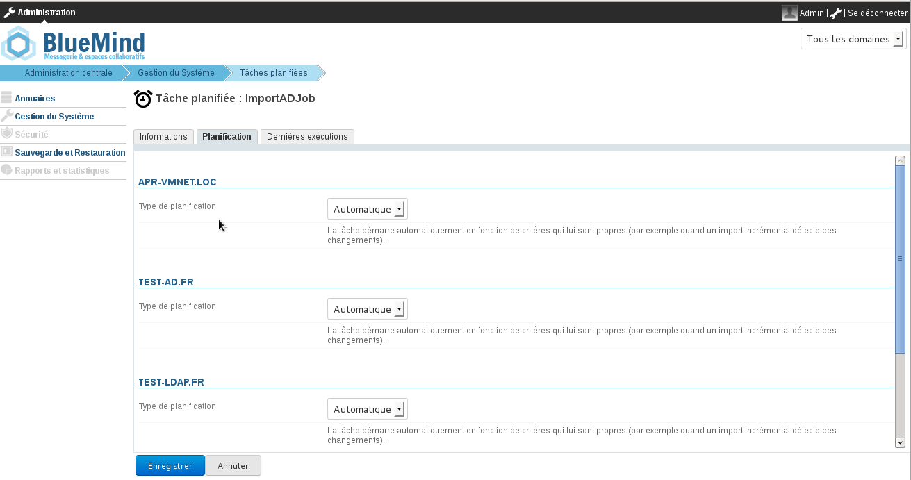
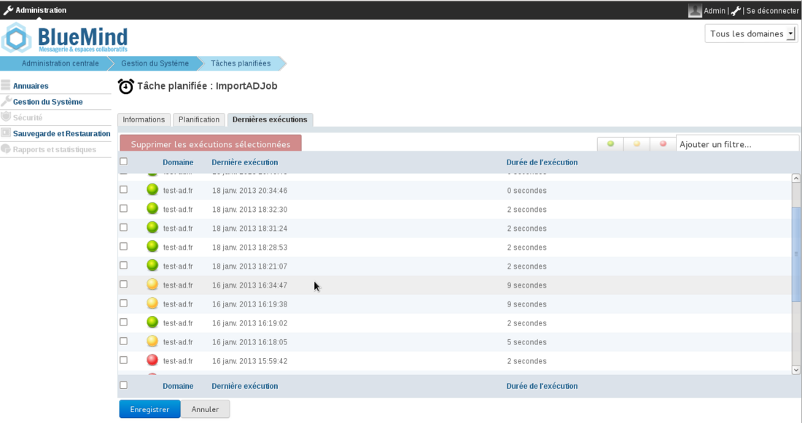

# Active Directory-Synchronisierung


## Präsentation

Das BlueMind-Abonnement für den professionellen Gebrauch bietet Zugang zu Tools, die die Integration von BlueMind in das Informationssystem erleichtern.

In diesem Abschnitt werden die Funktionen beschrieben, die das Modul für den Zugriff auf ein Active Directory-Verzeichnis bietet.

** **Umfang des Active Directory** **

Die BlueMind-Administrationskonsole ermöglicht das Anlegen und Verwalten von Benutzern, Gruppen und anderen Entitäten direkt in BlueMind.

In einem Informationssystem gibt es jedoch oft ein zentrales Verzeichnis, wie z. B. LDAP oder Active Directory, das für die zentrale Verwaltung von Benutzern und Gruppen vorzuziehen ist. In diesem Fall kann die Benutzerverwaltung an ein Active Directory delegiert und die Kontoerstellung durch regelmäßige Synchronisation automatisiert werden.

Durch die Active Directory-Synchronisation ist Blue Mind in der Lage:

- seine Benutzerbasis und Gruppen in regelmäßigen Abständen auf transparente Weise aus dem Verzeichnis zu importieren
- BlueMind-Benutzer direkt für das Active Directory zu authentifizieren.


Dieses Tool vermeidet die Verwaltung einer Benutzerbasis in Blue Mind und die Probleme der Passwortvervielfältigung. Das Passwort ist im AD-Verzeichnis zentralisiert und ist BlueMind weder bekannt noch wird es importiert.

** **Authentifizierung im Active Directory** **

Für die aus dem Verzeichnis importierten Benutzer erfolgt die Authentifizierung bei diesem Verzeichnis, die Blue Mind-Datenbank verfügt nicht über die Active Directory-Passwörter.


## Funktionsprinzip

BlueMind ermöglicht den Import und die Verwendung von Benutzern und Gruppen aus einem Active Directory-System.

Der Active Directory-Import wird BlueMind-seitig für jede Domain schrittweise durchgeführt.

Die Passwörter der importierten Benutzer werden direkt mit dem Active Directory abgeglichen. BlueMind speichert keine Passwörter.

Ein neuer Benutzer kann eine Verbindung zu einem BlueMind-Server herstellen, auch wenn dieser noch nicht importiert wurde. Sein BlueMind-Konto wird automatisch erstellt, wenn der Authentifizierungsprozess erfolgreich ist.

Das Provisioning (Anlegen oder Ändern) eines Benutzers oder einer Gruppe aus dem Active Directory in BlueMind erfolgt:

- bei Serverkonfiguration, während des ersten Imports
- regelmäßig im Laufe eines Tages, über geplante Aufgaben
- oder automatisch, wenn sich ein Benutzer anmeldet.


## Installation

Um auf die Synchronisationsfunktionen mit einem AD-Verzeichnis zugreifen zu können, muss das ad-import-Plugin installiert werden.

Verbinden Sie sich dazu mit dem Server und geben Sie den folgenden Befehl ein, um die Installation des Plugins zu starten:
**Debian/Ubuntu**

```
sudo aptitude update
sudo aptitude install bm-plugin-admin-console-ad-import bm-plugin-core-ad-import
```

**RedHat/CentOS**

```
yum update
yum install bm-plugin-admin-console-ad-import bm-plugin-core-ad-import
```


Starten Sie die Komponente *bm-core* nach Abschluss der Installation mit dem folgenden Befehl neu:


```
bmctl restart
```


## Konfiguration

- Verbinden Sie sich mit dem BlueMind-Zielserver als globaler Administrator admin0


- Gehen Sie zu Systemadministration > Überwachte Domains > Domain wählen > Registerkarte AD-Import:


- Aktivieren Sie das Kontrollkästchen "AD-Import aktivieren" (ab BlueMind Version 4.3.0)
- Füllen Sie die angeforderten Informationen mit den Active Directory-Einstellungen aus:

| Angeforderte Parameter | Active Directory-Wert |
| --- | --- |
| Benutzername AD | Login, das für Abfragen auf dem Active Directory-Server verwendet wird
Jedes Benutzerkonto mit Rechten zum Durchsuchen der Active Directory-Baumstruktur kann im schreibgeschützten Modus verwendet werden.
 | Beim Import wird aus Kompatibilitätsgründen ein *Mapping* (Zeichenersetzung) durchgeführt:
 | 
    - Ersetzen von Buchstaben mit diakritischen Zeichen durch den entsprechenden Buchstaben ohne diakritisches Zeichen
    - Umwandlung in Kleinbuchstaben-
    - Ersetzen von Leerzeichen durch '_'
 |
| AD-Benutzer-Passwort | Passwort, das mit dem im Feld  | *AD user login* |  ausgefüllten Konto verknüpft ist |
| Name oder IP des AD-Servers | IP-Adresse oder FQDN des Active Directory-Servers. Dieses Feld kann leer sein, wenn der Serverstandort über die DNS-Speicherung vom Typ SRV ermittelt werden kann


```
\_ldap.\_tcp.dc.msdcs.domain
```

(siehe [diesen Technet-Artikel](http://technet.microsoft.com/en-us/library/cc759550%28v=ws.10%29.aspx))
 |
| Root des AD-Verzeichnisses | Root der Active Directory-Suche. Wenn leer, wird die Suche mit dem Root-DN durchgeführt. |  | Wird verwendet, um die Suche auf einen Teilbereich der Active Directory-Baumstruktur zu beschränken  |
| AD-Benutzerfilter | Filter für die Suche nach Benutzereinträgen im AD.
Es kann die [Syntax von](http://www.ietf.org/rfc/rfc2254.txt) LDAP-Filtern verwendet werden.
Zum Beispiel, um alle Personen anzuzeigen, deren Telefonnummer in der Datenbank eingetragen ist:
 | 

```
(&(objectclass=person)(telephoneNumber=\*))
```

 | *siehe [http://ldapbook.labs.libre-entreprise.org/book/html/ch03s02.html](http://ldapbook.labs.libre-entreprise.org/book/html/ch03s02.html) *
 | Oder alle Konten, die den accountStatus "MAIL" haben und sich nicht im MAILSHARE-Zweig des Verzeichnisses befinden:
 | 

```
(&(!(ou:dn:=MAILSHARE))(&(objectClass=posixAccount)(accountStatus=MAIL)))
```

 |
| AD-Gruppenfilter | Filter für die Suche nach Gruppeneinträgen im AD.
Es kann die [Syntax von](http://www.ietf.org/rfc/rfc2254.txt) LDAP-Filtern verwendet werden.
Zum Beispiel, um nur die Gruppen von Zweigen anzuzeigen, deren DN cn=system oder cn=users enthält:
 | 

```
(&(objectClass=group)(|(cn:dn:=System)(cn:dn:=Users)))
```

 | Oder Gruppen mit der Beschreibung:
 | 

```
(&(objectCategory=group)(description=\*))
```

 | *siehe [https://social.technet.microsoft.com/wiki/contents/articles/5392.active-directory-ldap-syntax-filters.aspx#Examples](https://social.technet.microsoft.com/wiki/contents/articles/5392.active-directory-ldap-syntax-filters.aspx#Examples) *
 |
| Domain-Segmentierungsgruppe | Dieses Feld darf leer sein.
 | Dieses Feld wird ignoriert, wenn die Domainsegmentierungsfunktion für BlueMind nicht konfiguriert ist.
 | Mails für Benutzer in dieser Gruppe werden an einen anderen Mailserver in derselben Domain umgeleitet (konfiguriert über Domainsegmentierung).
 |


## Verbindungsmethode

Das BlueMind-Plugin für Active Directory legt keine bestimmte Einschränkung oder ein bestimmtes Schema fest. Die folgenden Informationen sind ausreichend:

- Hostname (oder die IP-Adresse) des Active Directory-Servers
- ein "Benutzername"/"Passwort"-Paar auf dem AD-Verzeichnis, das die Herstellung von Verbindungen ermöglicht.


Standardmäßig werden alle Benutzer und Gruppen aus dem Active Directory abgerufen. Filter für die Abfrage eines Teils des Verzeichnisses können durch Einstellung der folgenden Informationen konfiguriert werden:

- Root des Verzeichnisses
- die für die Benutzer- und Gruppensynchronisation zu verwendenden Filter, mit denen die importierten Daten eingeschränkt werden können.


Ein letzter Parameter wird verwendet, um die Domain-Segmentierungsgruppe anzugeben.

Mit dem Tool können Sie direkt prüfen, ob das Verzeichnis erreichbar und der Zugriff richtig konfiguriert ist.

## So funktioniert das Synchronisationswerkzeug

### Benutzerkonten

Das Plugin für Active Directory arbeitet auf 3 sich ergänzende Arten:

- Globaler Import aller Benutzer
- Inkrementeller Import
- Import in Echtzeit bei Authentifizierung


Der globale Import durchsucht alle Benutzer und Gruppen im Active Directory (unter Berücksichtigung der AD-Root und Filter) und importiert sie in BlueMind. Diejenigen, die nicht vorhanden sind, werden erstellt, die bereits vorhandenen werden ggf. geändert.

Der inkrementelle Import funktioniert auf die gleiche Weise, wobei aber nur nach Benutzern gesucht wird, die seit dem letzten Import geändert wurden.

Der Import sucht bei der Authentifizierung den Benutzer im Active Directory, wenn er in BlueMind nicht bekannt ist; wenn er ihn findet, importiert er ihn und authentifiziert ihn im Active Directory, um ihm sofortigen Zugriff auf BlueMind zu ermöglichen.

### Konto-Status

Aus einem Active Directory importierte Konten, die den konfigurierten LDAP-Filter berücksichtigen, werden automatisch aktiviert.

Umgekehrt können sie im Active Directory suspendiert oder gelöscht werden, um sie am Zugriff auf E-Mails zu hindern. Ein im Active Directory gelöschter Benutzer wird in BlueMind einfach suspendiert.

### Geplante Active Directory-Synchronisierung

#### Inkrementeller Import

Wenn das Active Directory-Plugin installiert ist, erstellt BlueMind eine geplante Aufgabe, um in regelmäßigen Abständen die Benutzer- und Gruppendatenbanken mit dem Active Directory zu synchronisieren.

Der inkrementelle Import verarbeitet nur Daten, die seit dem letzten Import angelegt, gelöscht oder geändert wurden.

Wie im folgenden Bildschirmfoto gezeigt, kann die geplante Aufgabe:

- automatisch sein: aktiviert nach spezifischen Kriterien für die bereits getätigten Importe, mit einer maximalen Häufigkeit von 4 Stunden;
- geplant sein: in einem Cron-Format, das eine beliebige Häufigkeit der Aktivierung erlaubt
- deaktiviert sein: in diesem Fall wird die geplante Aufgabe nicht ausgeführt.





Tâche planifiée de l'import Active Directory


#### Verfolgung der geplanten Aufgaben

Auf dem Bildschirm zur Verfolgung von [geplanten Aufgaben](https://forge.bluemind.net/confluence/display/LATEST/Les+taches+planifiees) können Sie überprüfen, ob diese korrekt ausgeführt wurden. Der folgende Screenshot zeigt die durchgeführten Synchronisationsaufgaben, ihr Ausführungsdatum und das Ergebnis des Vorgangs:



## Active Directory-Mapping - BlueMind

### Benutzer-Attribute


:::info

Der BlueMind AD-Import basiert zur Ermittlung von Zugehörigkeiten auf *member* und *memberOf* und unterstützt daher keine primäre Gruppenverwaltung.

Darüber hinaus ist es [nicht ratsam,](https://social.technet.microsoft.com/Forums/windows/en-US/c52d6e70-decd-46d4-9431-c4667256edad/what-is-a-primary-group-what-are-its-functoins) die primäre Benutzergruppe außer in besonderen Fällen zu ändern.

:::

| BlueMind | Active Directory-Attribut | Hinweis |
| --- | --- | --- |
| Login | sAMAccountName | 


 |
| title* | personalTitle | Anrede Herr, Frau… |
| firstname | givenName | 


 |
| 
lastname
 | sn | 


 |
| jobtitel* | title | Positionsbezeichnung: Abteilungsleiter, CIO, etc. |
| Beschreibung | Beschreibung | 


 |
| mail | 
mail
 | 
otherMailbox
 | 
proxyAddresses
 | 
Das Active Directory *Mail-Attribut* wird als Standard-E-Mail-Adresse in BlueMind definiert.
Wenn dieses Feld nicht vorhanden oder nicht ausgefüllt ist, wird die Standard-BlueMind-Adresse durch den ersten der in den folgenden Feldern gefundenen Werte definiert (in dieser Reihenfolge) :

1. den ersten Wert des Feldes *otherMailbox *
2. den Wert des Feldes proxyAddresses:
    1. den ersten mit dem Präfix "SMTP:"
    2. die erste Rückgabe mit Präfix "smtp:", wenn keine E-Mail mit Präfix "SMTP:" vorliegt
Hinweis: Es werden nur Adressen mit Präfix "SMTP:" oder "smtp:" berücksichtigt (Syntax von [Microsoft](https://support.microsoft.com/en-us/help/3190357/how-the-proxyaddresses-attribute-is-populated-in-azure-ad) definiert)

 Wenn keines dieser Felder ausgefüllt ist, hat der Benutzer keinen Posteingang in BlueMind
 |
| street | streetAddress | 


 |
| zip | postalCode | 


 |
| town | l | 


 |
| country | co | 


 |
| state | st | 


 |
| Work phones | 
telephoneNumber
 | 
otherTelephone
 | 


 |
| Home phones | 
homePhone
 | 
otherHomePhone
 | 


 |
| Mobile phones | 
mobile
 | 
otherMobile
 | 


 |
| Fax | 
facsimileTelephoneNumber
 | 
otherFacsimileTelephoneNumber
 | 


 |
| Pager | 
pager
 | 
otherPager
 | 


 |
| memberOf | memberOf | Liste der Gruppen, in denen der Benutzer Mitglied ist. Der BlueMind-Benutzer wird nur zu Gruppen hinzugefügt, die bereits importiert wurden |
| service | department | Ab BlueMind v3.0 |
| photoID | thumbnailPhoto | Foto des Benutzers: Der Inhalt dieses Attributs wird als das Foto des entsprechenden Kontos importiert |
| user.value.contactInfos.organizational.org.company | company | 


 |
| user.value.contactInfos.organizational.org.department | department | 


 |

### Gruppen-Attribute

| BlueMind | Active Directory-Attribut | Hinweis |
| --- | --- | --- |
| name | sAMAccountName | 


 |
| Beschreibung | Beschreibung | 


 |
| mail | mail | 


 |
| member | member | Nur synchronisierte Gruppen und Benutzer werden zu BlueMind-Gruppenmitgliedern hinzugefügt |

## Zuweisung von Rechten

Ab BlueMind 3.5 basiert der [Zugriff auf Anwendungen auf der Verwaltung der](/Guide_de_l_administrateur/Gestion_des_entités/Utilisateurs/) den Benutzern zugewiesenen [Rollen](/Guide_de_l_administrateur/Gestion_des_entités/Utilisateurs/) .

Der AD-Import verwaltet keine Rollen, so dass Benutzer nach dem Import zunächst keine Rollen haben und nicht auf Anwendungen (Webmailer, Kontakte, Kalender) zugreifen können.

Der einfachste und effektivste Weg, dies zu bewerkstelligen, ist über Gruppen:

- in der DA weisen Sie den Benutzern eine gemeinsame Gruppe zu (oder mehrere, falls gewünscht)
- einen 1. Import starten: die Gruppe(n) wird/werden in BlueMind mit den Benutzern importiert
- gehen Sie in die Administration und [weisen Sie der Gruppe die gewünschten Rollen zu](/Guide_de_l_administrateur/Gestion_des_entités/Groupes/#Administrationdesgroupes-Gestiondesgroupes-Roles)


:::tip

Bei den folgenden Importen und Updates werden die Rollen beibehalten.

:::

Danach müssen neue Benutzern nur noch der/den Gruppe(n) zugeordnet werden, um ihnen die gewünschten Rollen zu geben.

## Erzwingen oder Korrigieren einer UID

Die UID eines Benutzers kann im Benutzer-Verwaltungsstammsatz in BlueMind ausgefüllt oder korrigiert werden.

Gehen Sie dazu in die Administrationskonsole > Verzeichnisse > Verzeichniseinträge > wählen Sie den Benutzerdatensatz > Registerkarte Wartung: Das Feld ExternalID mit der UID des Benutzers im AD ausfüllen und speichern.


:::info

Der ExternalID muss "ad://" vorangestellt werden.

Zum Beispiel:


```
ad://5d6b50-399a6-1e6f2-d01267d1f-0fbecb
```


:::


