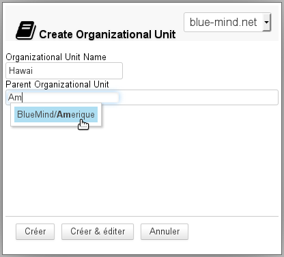
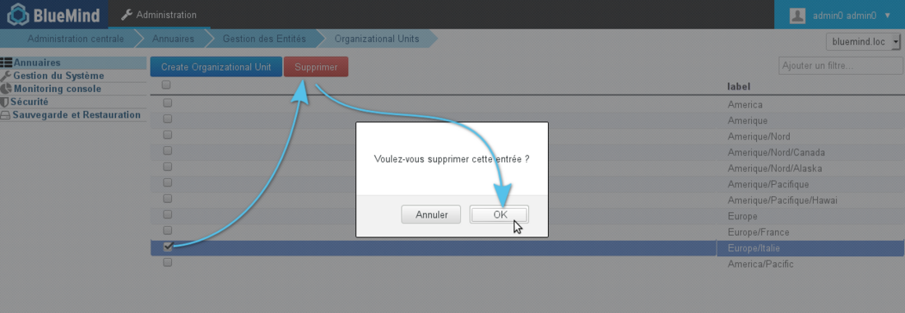
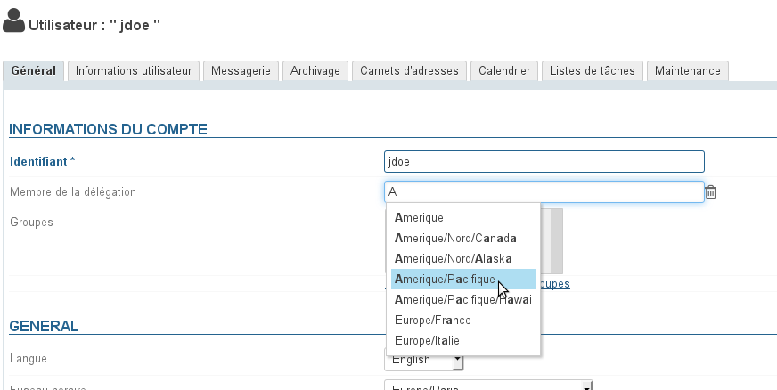
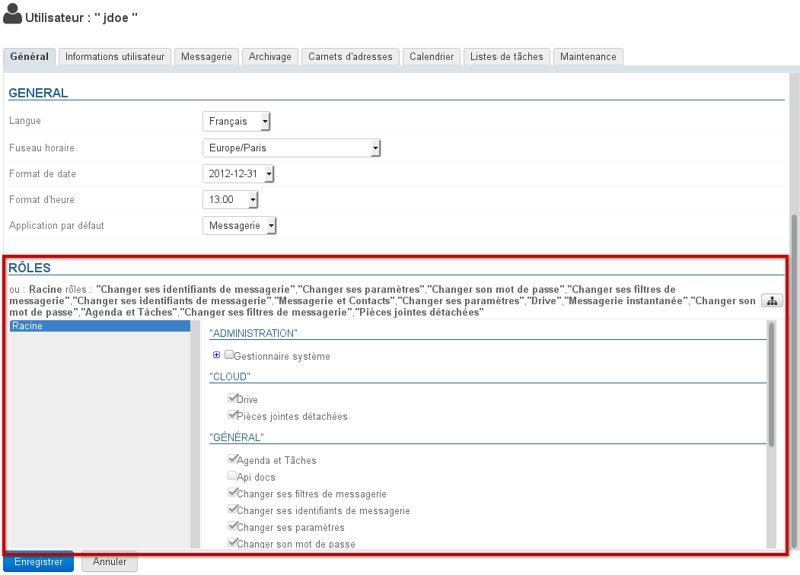
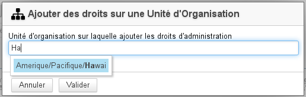
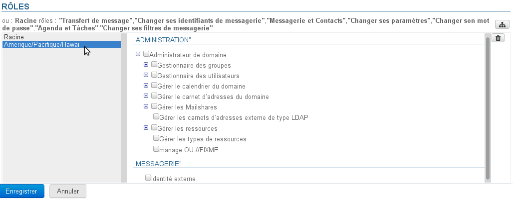
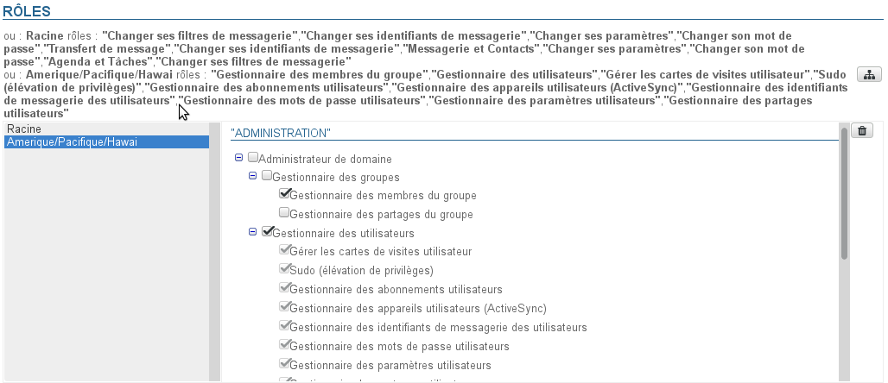
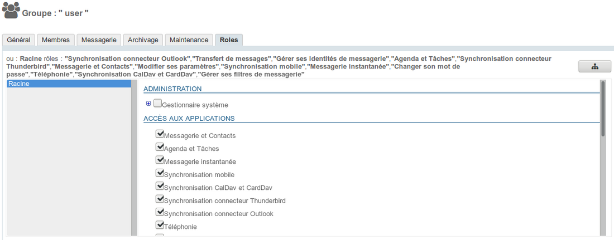

# Delegierte Verwaltung

## Präsentation

Im Falle eines BlueMind, das eine große Anzahl von Benutzern verwaltet, die über mehrere Standorte verteilt sind, kann es interessant sein, Administratoren zu definieren, die Delegationsrechte für eine Teilmenge dieser Population haben.

Zur Lösung dieser Problematik hat BlueMind die Funktionalität der delegierten Administration integriert. Sie besteht darin, Benutzern (die dann zu delegierten Administratoren werden) teilweise Administrationsrechte zu geben. Dieses delegierte Administrationsrecht kann für eine nach dem Delegationskriterium (Art der Tätigkeit, Branche, geografisches Gebiet...) definierte Zielgruppe von Benutzern vergeben werden.

Dieses Recht kann z.B. für die Verwaltung der Mitglieder regionaler Niederlassungen genutzt werden: der Hauptadministrator der Domain bestimmt in jeder Niederlassung einen Administrator für die Benutzer seiner Niederlassung. Dieser kann Zugriffsrechte auf Anwendungen und Funktionalitäten (wie z.B. das Abhängen von Anhängen) verwalten, das E-Mail-Kontingent anpassen, Informationen im Formular für das Verzeichnis ausfüllen, Wartungsarbeiten durchführen usw.

## Organisatorische Einheiten

### Organisatorische Einheiten verwalten

Es ist möglich, eine Delegationsbaumstruktur zu definieren und so verschiedene Ebenen der delegierten Verwaltung zu ermöglichen.

So ist es möglich, Delegationen nach verschiedenen Kriterien zu definieren:

Nach geografischen Gebieten:

- Root
    - Amerika
        - Amerika/Nordamerika
            - Nordamerika/Kanada
            - Nordamerika/Alaska
        - Amerika/Pazifik
            - Amerika/Pazifik/Hawaii

    - Europa
        - Europa/Frankreich
        - Europa/Italien
        - Europa/Vereinigtes Königreich
            - Europa/Vereinigtes Königreich/England
            - Europa/Vereinigtes Königreich/Schottland

Oder entsprechend der Unternehmenshierarchie:

- Root
    - Informatik
        - Informatik/Technik
        - Informatik/Support
    - Verwaltung
        - Verwaltung/Verantwortliche
        - Verwaltung/Assistenten
        - Verwaltung/Handel
            - Verwaltung/Handel/Verkauf
            - Verwaltung/Handel/Marketing
    - Produktion
        - Produktion/Management
        - Produktion/Technik

In diesen beiden Beispielen können Administratoren und Zielpopulationen für jede Delegationsstufe definiert werden.

:::tip

Root

Die "Root"-Einheit ist die Mutter aller anderen Einheiten, sie ist die BlueMind-Domain, sie kann nicht gelöscht werden und erlaubt es, Rechte auf die gesamte Domain zu vergeben. Benutzer sind standardmäßig alle Mitglieder dieser Organisationseinheit.

Tatsächlich verfügt die Root Unit im Vergleich zu den anderen Delegationen über zusätzliche Rechte, die Daten entsprechen, die nicht aufgeteilt werden können und die Domain als Ganzes betreffen: Systemkonfiguration, Serververwaltung, benutzerdefinierte Anwendungen usw. Die Root Unit verfügt im Vergleich zu den anderen Delegationen über die folgenden zusätzlichen Rechte.

:::info

Zugriff auf die Administrationskonsole

Insbesondere umfasst die Root das Recht "**Administrationskonsole**", das für einen Benutzer aktiviert werden muss, wenn Sie ihm Rechte an einer Organisationseinheit geben wollen. **Diese Aktivierung erfolgt nicht automatisch.**

:::

:::

#### Erstellung

- Klicken Sie auf die Schaltfläche "Create Organizational Unit", um das Fenster "Organisationseinheit erstellen" aufzurufen:
- Geben Sie den Namen der zukünftigen Einheit und ggf. einer übergeordneten Einheit ein, um einen neuen Zweig der Baumstruktur zu erstellen.
- Bestätigen Sie, indem Sie auf die Schaltfläche "Erstellen" klicken

#### Löschung

Von der Seite Verwaltung der Organisationseinheit aus:

- wählen Sie die gewünschte(n) Einheit(en) durch Aktivieren des entsprechenden Kästchens aus
- klicken Sie auf die Schaltfläche "Löschen" am oberen Rand der Liste
- bestätigen Sie die Löschung

### Einem Mitglied eine Delegierung zuweisen

Standardmäßig ist ein Benutzer immer ein Mitglied der Organisationseinheit Root. Um ihn zum Mitglied einer Tochterorganisationseinheit zu machen, gehen Sie in den Verwaltungssatz des gewünschten Benutzers:

- Füllen Sie auf der Registerkarte "Allgemein" per Autovervollständigung, die die vorhandenen Einheiten vorschlägt, das Feld "Delegationsmitglied" aus.

- Speichern, um die Änderungen zu übernehmen

:::info

Ein Benutzer kann nur Mitglied in einer Delegation sein.

:::

## Delegieren von Verwaltungsrechten

:::info

Ein Administrator kann nur Rollen zuweisen oder entfernen, deren Eigentümer er selbst ist.

:::

:::tip

Mitgliedschaft und Verwaltung

Ein Administrator muss nicht Mitglied einer Organisationseinheit sein, um diese zu verwalten.

:::

### Für einen Benutzer

Um einem Benutzer Administrationsrechte zuzuweisen, wechseln Sie auf die Registerkarte Allgemein der Verwaltung dieses Benutzers. Die Verwaltung erfolgt im Bereich "Rollen" der Registerkarte:

Die Schnittstelle ist wie folgt verteilt:

- Oberer Teil: für jede Organisationseinheit werden die dem Benutzer zugewiesenen Rechte in Textform aufgelistet
- Linke Seite (grau hinterlegt): die Liste der betroffenen Organisationseinheiten.
- Rechter Teil: Rechte, die dem aktuell in der Liste ausgewählten Gerät entsprechen.Ausgegraute Rechte sind die von einem übergeordneten Gerät oder einer Gruppe geerbten Rechte, sie können nur für dieses Gerät nicht gelöscht werden.

:::info

Was sind die Rollen und was entsprechen sie?

 Weitere Informationen zu den Details der verfügbaren Rollen finden Sie auf der entsprechenden Seite: [Rollen: Zugriffs- und Administrationsrechte](/Guide_de_l_administrateur/Gestion_des_entités/Utilisateurs/Les_rôles_droits_d_accès_et_d_administration/)

:::

Administrationsrechte für eine noch nicht vorhandene Organisationseinheit hinzufügen:

1. Klicken Sie auf die Schaltfläche  rechts oben im Bereich und suchen Sie mit der Autovervollständigung nach der gewünschten Einheit:
2. die Einheit auswählen und bestätigen
3. Die Organisationseinheit wird dann in die Liste der Delegationen aufgenommen:
4. Aktivieren Sie die gewünschten Rechte (sie werden nach und nach im oberen Teil hinzugefügt):
5. **Speichern, um die Änderungen zu übernehmen**

### Für eine Gruppe

Um einer Benutzergruppe Rechte zuzuweisen, wechseln Sie zur Registerkarte Gruppenverwaltung > Rollen:

Die Rollenverwaltung erfolgt dann auf die gleiche Weise wie bei den Benutzern – siehe das vorherige Kapitel.

Sobald die Rollen für die angegebene(n) Delegation(en) definiert sind, gilt sie für alle Benutzer in der Gruppe.

:::info

In den Benutzerstammsätzen sind die über eine Gruppe zugewiesenen Rollen mit einem Häkchen versehen und ausgegraut: Es ist nicht möglich, das Häkchen einzeln zu entfernen. Solange ein Benutzer zu einer Gruppe gehört, muss er **alle** Rollen haben, die dieser Gruppe zugewiesen sind.

:::

:::info

Was sind die Rollen und was entsprechen sie?

 Weitere Informationen zu den Details der verfügbaren Rollen finden Sie auf der entsprechenden Seite: [Rollen: Zugriffs- und Administrationsrechte](/Guide_de_l_administrateur/Gestion_des_entités/Utilisateurs/Les_rôles_droits_d_accès_et_d_administration/)

:::

